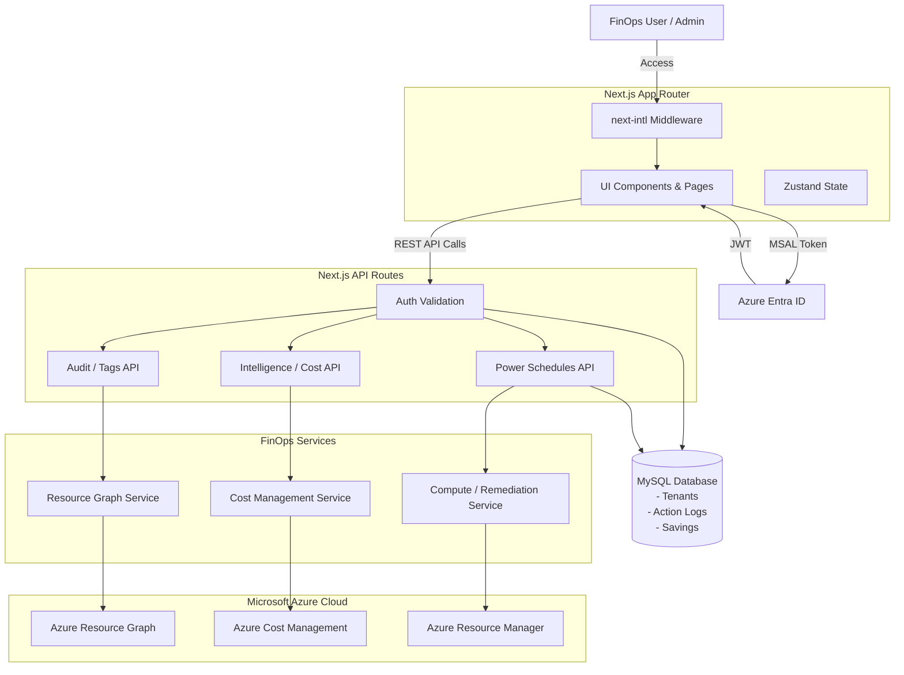

# CSCloudSolutions FinOps Platform 🚀

La Plataforma FinOps de CSCloudSolutions es una solución SaaS B2B automatizada construida sobre Next.js App Router (React) orientada a la gobernanza cloud, auditoría (Omni-Scan), y optimización financiera para entornos empresariales en Microsoft Azure.

---

## 🏗️ Architecture

El sistema opera bajo una arquitectura de 3 capas fuertemente tipada y asegurada con autenticación basada en identidades de Azure:

1. **Frontend (App Router)**: Interfaz de usuario dinámica construida con React, Tailwind CSS, y Zustand (manejo de estado). Adaptada con internacionalización (`next-intl`) y soporte de temas (Dark Mode).
2. **API Layer (Next.js Edge/Node)**: Rutas backend que orquestan de manera segura la validación de acceso (`@azure/msal-react` / `@azure/msal-node`) y exponen lógica de negocio estructurada.
3. **Services & Azure SDK**: Capa de servicios inyectados (`src/services/`) que interactúan directamente con Microsoft Azure (Resource Graph, Cost Management, Compute) y una base de datos MySQL para persistencia de datos multitenant (Logs, Historial de Ahorro, Tenants).

### Infrastructure Diagram (Mermaid)



---

## 📂 Project Directory Structure

```text
src/
├── app/
│   ├── [locale]/                 # Rutas de UI Internacionalizadas (App Router)
│       ├── admin/                # Configuración, Onboarding, Workbooks
│       ├── advisor/              # Integración de Azure Advisor
│       ├── cleanup/              # TTL Enforcement & Zombies
│       ├── governance/           # Power Schedules (VMs) y Gestión de Etiquetas
│       ├── intelligence/         # Facturación (Billing), Redes, Rightsizing, Licencias, Upload
│       ├── overview/             # Maturity Scoring, Progreso Histórico
│       ├── superadmin/           # Configuración de AI, Salud, Gestión de Tenants, Gestión de Staff (God Mode)
│       ├── layout.tsx            # Root Layout (Inyecta Providers y next-intl)
│       └── page.tsx              # Dashboard Principal
│   └── api/                      # Backend API Routes
│       ├── admin/
│       ├── advisor/
│       ├── audit/
│       ├── budgets/
│       ├── cleanup/
│       ├── consumption/
│       ├── intelligence/
│       ├── onboard/
│       ├── power/
│       ├── recommendations/
│       ├── remediation/
│       ├── subscriptions/
│       ├── superadmin/
│       ├── tags/
│       └── tenants/
├── components/                   # Componentes React Reusables
│   ├── dashboard/                # Widgets de métricas, PowerSchedules
│   ├── layout/                   # Sidebar, Navbar, etc.
│   └── remediation/              # Modales de confirmación de acciones
├── context/                      # React Context Providers (ViewMode, etc.)
├── db/                           # Conexiones y utilidades de Base de Datos
├── lib/                          # Utilidades Generales (Ej. Script Generator)
├── modules/                      # Lógica modular Core, Storage, y Collectors (Azure/Graph)
├── services/                     # Lógica de Negocio y Consumo de Azure SDKs
└── store/                        # Estado global de Zustand (ActionLogs, etc.)
```

---

## 🔒 Authentication & Least Privilege

El sistema opera un modelo de seguridad multi-nivel estricto:

1. **User Identity**: El acceso de usuarios es manejado vía MSAL (`@azure/msal-react`). Los tokens JWT emitidos validan la identidad de la sesión en todos los llamados a la API en `src/app/api`.
2. **Service Principal (Platform Agent)**: Los Tenants hacen Onboarding ejecutando un script de PowerShell que crea un **Service Principal Least-Privilege**.
3. **Role-Based Access Control (RBAC)** — Roles asignados por tier:

   **Todos los tiers (Essential):**
   - `Reader` — Resource Graph, Advisor, listado de recursos.
   - `Cost Management Reader` — API de Consumo Real (`/api/intelligence/billing`).
   - `Monitoring Reader` — Métricas para rightsizing.
   - `Billing Reader` — Visibilidad de facturación a nivel suscripción.

   **Professional (Essential +):**
   - `Tag Contributor` — Auto-tagging.

   **Business (Pro +):**
   - **Custom Remediation Role** con permisos **mínimos** de power management:
     - `Microsoft.Compute/virtualMachines/start/action`
     - `Microsoft.Compute/virtualMachines/deallocate/action`
     - `Microsoft.Compute/virtualMachines/restart/action`
     - `Microsoft.Resources/tags/write`

   **Enterprise (Business +):**
   - **Custom Remediation Role** **expandido** para limpieza de huérfanos:
     - Todas las de Business +
     - `Microsoft.Compute/disks/delete`
     - `Microsoft.Compute/snapshots/delete`
     - `Microsoft.Network/networkInterfaces/delete`
     - `Microsoft.Network/publicIPAddresses/delete`
     - `Microsoft.Network/networkSecurityGroups/delete`

   > ⚠️ **NOTA importante**: El script de onboarding **NO** asigna `Virtual Machine Contributor` ni `Desktop Virtualization Power On Off Contributor` porque otorgan permisos excesivos (incluyendo borrar VMs). Se usa exclusivamente el Custom Role con acciones explícitas.

   > ⚠️ **Suscripciones EA/MCA**: Para suscripciones bajo Enterprise Agreement o Microsoft Customer Agreement, el `Billing Admin` debe asignar adicionalmente `Enrollment Reader` o `Billing Account Reader` al SP en el scope de billing account (no es posible desde el script).

   > 🔖 **Reservas (RIs / Savings Plans)**: El detalle del blade *Reservations* (`/intelligence/commitments`) usa `Microsoft.Capacity/reservations`. Lectura requiere el rol **Reservations Reader** sobre el/los *reservation order(s)*; la acción de **renovación** (activar/deshabilitar auto-renew) requiere **Reservations Contributor** u **Owner** del order (menor privilegio suficiente). En la app, la mutación de renovación está protegida por `requireTenantRole(['Admin','Owner'])`.

   **Diagnóstico:** El endpoint `GET /api/admin/check-sp-roles` verifica automáticamente que el SP tenga todos los roles requeridos en cada suscripción y reporta los faltantes con instrucciones de remediación.

### 🔍 Diagnostic Endpoints

| Endpoint | Método | Para qué |
|---|---|---|
| `/api/admin/check-sp-roles?tenantId=...` | GET | Verifica que el Service Principal del tenant tenga **todos los roles requeridos** según su tier, en **cada suscripción** que ve. Devuelve estado por sub (`OK`/`PARTIAL`/`NO_ROLES`/`ERROR`), lista de roles asignados, lista de roles faltantes, y un `globalHint` accionable. Acepta opcionalmente `&subscriptionIds=id1,id2` para filtrar. |

**Ejemplo de respuesta exitosa:**
```json
{
  "success": true,
  "summary": {
    "tenantId": "8b41364f-...",
    "tier": "Essential",
    "spObjectId": "abc-...",
    "requiredRoles": ["Reader", "Cost Management Reader", "Monitoring Reader", "Billing Reader"],
    "totalSubscriptions": 3,
    "okCount": 1,
    "partialCount": 2,
    "noRolesCount": 0,
    "errorCount": 0
  },
  "subscriptions": [
    {
      "subscriptionId": "...",
      "assignedRoles": ["Reader", "Cost Management Reader", "Monitoring Reader", "Billing Reader"],
      "missingRoles": [],
      "status": "OK"
    },
    {
      "subscriptionId": "...",
      "assignedRoles": ["Reader"],
      "missingRoles": ["Cost Management Reader", "Monitoring Reader", "Billing Reader"],
      "status": "PARTIAL"
    }
  ],
  "globalHint": "⚠️ 2 suscripción(es) con roles incompletos. Roles faltantes: Cost Management Reader, Monitoring Reader, Billing Reader. ..."
}
```

---

## 📈 Recent Major Updates

### 2026-07-04 — Fix Storage Efficiency: tabla dedicada `CostMeterSnapshots` para filas a nivel de meter

**Bug:** el cron `sync` escribía dos desgloses del mismo costo en `CostSnapshots`: (A) por
ResourceGroup y (B) por `MeterSubCategory` con `resource_group='*'`. La
`UNIQUE KEY (tenant, sub, date, resource_group, service_name)` hacía colisionar entre sí a todas
las filas B de un mismo servicio: cada `ON DUPLICATE KEY UPDATE` pisaba la subcategoría anterior y
**solo sobrevivía la última** (Storage Efficiency nunca veía los tiers Hot/Cool/Archive reales).
Además, A+B en la misma tabla duplicaba el costo en cualquier consumidor que sume.

**Fix:** las filas B viven en `CostMeterSnapshots` (migración `20260704-001-cost-meter-snapshots.sql`),
con `UNIQUE KEY (tenant, sub, date, service_name, MeterSubCategory)` — la subcategoría integra la
clave y se normaliza a `''` (nunca `NULL`; MySQL trata los NULL como distintos en unique keys).
La migración además elimina las filas B corruptas históricas de `CostSnapshots`.

**Consumidores actualizados** (fuente primaria `CostMeterSnapshots`, fallback legacy a `CostSnapshots`):
`/api/intelligence/storage-efficiency` (expone `diagnostics.source: 'meters' | 'legacy'`) y
`/api/intelligence/compute-cost-per-core`. `insertCostSnapshotRow` ya no ejecuta `ALTER TABLE`
ad-hoc por fila (las columnas las garantizan el `CREATE TABLE` y la migración).

**Tests:** `__tests__/unit/storageEfficiency.test.ts` (tiers por subcategoría sin colapso, fallback
legacy, estado vacío, normalización de la clave en el insert).

**Follow-up (misma fecha) — región real en compute-cost-per-core:** el desglose "por región"
mostraba todo como `unknown` porque se derivaba de `resource_group` (vacío en filas de meter, y
un RG no es una región). La query B del sync ahora agrega la dimensión `ResourceLocation` de Cost
Management (3 groupings: `ServiceName + Meter + ResourceLocation`), persistida en la nueva columna
`CostMeterSnapshots.resource_location` (migración `20260704-002`, integrada a la unique key para no
colapsar un mismo meter facturado en varias regiones). Verificado end-to-end: el panel pasa de
`unknown` a regiones reales (`us east`, `us west 2`, ...).

### 2026-07-02 — Historial diario genérico (retención ≥ 1 año, consultable por página)
Framework **write-through** que persiste una foto (snapshot) diaria de las métricas clave de
cada página y permite consultarlas históricamente. Retención **400 días** (~13 meses), con poda
automática por escritura (sin cron adicional).

**Modelo de datos:** tabla `DailySnapshots` (migración `20260702-001-daily-snapshots.sql`)
con `UNIQUE(tenant_id, subscription_scope, domain, snapshot_date)` → un registro por
tenant/scope/dominio/día (`ON DUPLICATE KEY UPDATE` idempotente). Payload en `LONGTEXT` (JSON serializado).
Sin FK a `Tenants` (resiliencia: el write-through nunca debe romper el request principal).

**Dominios capturados:** `dashboard_summary`, `commitments`, `rightsizing`, `anomalies`,
`budgets`, `governance` (extensible vía `SNAPSHOT_DOMAINS`).

**Servicio:** `src/services/snapshotService.ts` → `recordDailySnapshot` / `recordDailySnapshotAsync`
(fire-and-forget, best-effort), `getSnapshotHistory`, `getSnapshotRange`, `getSnapshotDomains`,
`SNAPSHOT_RETENTION_DAYS = 400`.

**Endpoint:**

| Endpoint | Método | RBAC app | Notas |
|---|---|---|---|
| `/api/history` | GET | `requireTenantAccess` | Params: `tenantId`, `domain`, `from?`, `to?`, `scope?`, `tier?`. Default: último año. Tenants demo → serie simulada por tier. |

**UI:** componente reutilizable `<HistoryButton domain="..." title="..." />`
(`src/components/history/HistoryButton.tsx`, self-contained con MSAL + `useTenant`) montado en el
header de Dashboard, Descuentos por Compromiso, Rightsizing, Anomalías, Presupuestos y Alta
Disponibilidad. Abre un panel con selector de rango (hasta 1 año), gráfico de líneas (recharts) y
tabla; grafica automáticamente las métricas numéricas del payload.

**i18n:** namespace `History` (es/en/pt-BR, 9 keys c/u). **Mocks:** `getMockSnapshotHistory(domain, tier, from, to)`
en `src/lib/mockData.ts` (serie determinista escalada por tier).

**Adopción en una página nueva:** (1) en el route handler, llamar
`recordDailySnapshotAsync(tenantId, '<domain>', { ...métricas numéricas }, scope)` sobre datos
frescos (no degradados/mock); (2) añadir `'<domain>'` a `SNAPSHOT_DOMAINS`; (3) montar
`<HistoryButton domain="<domain>" title={...} />` en el header; (4) opcional: añadir un `case`
en `getMockSnapshotHistory` para la demo.

### 2026-07-01 — Reservas Activas: detalle del blade Azure Reservations
La sección **Reservas Activas** de *Descuentos por Compromiso (RIs & Savings Plans)*
(`/intelligence/commitments`) ahora replica el blade **Reservations** del portal de Azure,
consumiendo `Microsoft.Capacity/reservations` (best-effort, degradación silenciosa sin permisos).

**Columnas nuevas:** Nombre, Estado, Expiración, Alcance (Scope), Tipo, Nombre del producto,
Región, **Renovación**, Cantidad, **Utilización último día** y **últimos 7 días**.

**Interacción:**
- **Renovación** → botón que abre un modal para **activar/deshabilitar la auto-renovación**
  (mutación real vía `PATCH Microsoft.Capacity/reservationOrders/{orderId}/reservations/{id}`),
  invalidando la caché `commitments:v3:{tenantId}` al aplicar.
- **% de utilización** (clic sobre el porcentaje) → modal con **aggregates 1/7/30 días** +
  **tendencia diaria (30 días)** desde Consumption `reservationsSummaries` (best-effort EA/MCA).

**Endpoints:**

| Endpoint | Método | RBAC app | Rol Azure mínimo |
|---|---|---|---|
| `/api/intelligence/commitments` | GET | `requireTenantAccess` | Reservations Reader |
| `/api/intelligence/commitments/reservations/utilization` | GET | `requireTenantAccess` | Reservations Reader |
| `/api/intelligence/commitments/reservations/renew` | PATCH | `requireTenantRole(['Admin','Owner'])` | Reservations Contributor / Owner |

**Cambios asociados:** `src/services/reservationService.ts` (+`getActiveReservations`,
`getReservationUtilizationTrend`, `setReservationRenew`, `parseReservationResourceId`);
componentes `ReservationRenewalModal` y `ReservationUtilizationModal`; namespace i18n
`Commitments` (es/en/pt-BR, 41 keys c/u); mocks por tier (`reservationDetails` +
`reservation_utilization`). Sin cambios de esquema en DB.


### 2026-06-28 — FinOps Toolkit Gap Closure (P2/P3/P4)
Implementación de 15 features inspirados en `microsoft/finops-toolkit`, con datos mock para Tenants demo, i18n completo (es/en/pt-BR), `FeatureGuard` por tier y `RouteTierGate` automático. Mapa completo:

| ID | Feature | Tier | URL | Endpoint |
|----|---------|------|-----|----------|
| IT-10 | Storage Efficiency (Hot/Cool/Archive savings) | Business | `/intelligence/storage-efficiency` | `/api/intelligence/storage-efficiency` |
| IT-11 | Compute Cost per Core | Professional | `/intelligence/compute-efficiency` | `/api/intelligence/compute-cost-per-core` |
| IT-14 | Alertas self-service (presupuesto/anomalía) | Professional | `/intelligence/alerts` | `/api/budgets/alerts` |
| IT-15 | Networking Zombies (LBs/NSGs/PIPs huérfanos) | Professional | `/cleanup/zombies/networking` | `/api/cleanup/zombies/networking` |
| IT-01 | AI Analytics (consumo OpenAI / tokens / $/1k) | Enterprise | `/intelligence/ai-analytics` | `/api/intelligence/ai-analytics` |
| IT-04 | MACC Tracker (consumo de compromiso) | Enterprise | `/intelligence/macc` | `/api/intelligence/macc` |
| IT-02 | Invoicing Report (export PBI/CSV) | Enterprise | `/admin/report` | `/api/admin/report/invoicing` |
| IT-07 | Rightsizing VMSS | Professional | `/intelligence/rightsizing/vmss` | `/api/rightsizing/vmss` |
| IT-03a | Rightsizing App Service | Professional | `/intelligence/rightsizing/appservice` | `/api/rightsizing/appservice` |
| IT-03b | Rightsizing SQL DB | Professional | `/intelligence/rightsizing/sqldb` | `/api/rightsizing/sqldb` |
| IT-03c | Rightsizing Storage tier | Professional | `/intelligence/rightsizing/storage` | `/api/rightsizing/storage` |
| IT-12 | VM HA Recommendations (Zone/Set) | Business | `/governance/ha` | `/api/governance/ha` |
| IT-16 | Credenciales AAD por expirar | Business | `/governance/credentials` | `/api/governance/expiring-credentials` |
| IT-18 | Azure Lighthouse onboarding (ARM stub) | Enterprise | `/admin/onboarding/lighthouse` | `/api/onboard/lighthouse` |
| IT-17 | M365 Copilot integration & RAG | Enterprise | `/admin/copilot-m365` | `/api/copilot-m365/{config,ask}` |

**Cambios estructurales asociados:**
- `db.ts`: +11 tablas (`AICostSnapshots`, `MACCCommitments`, `AppServiceRecommendations`, `SqlDbRecommendations`, `StorageRecommendations`, `VmssRecommendations`, `HARecommendations`, `AlertRules`, `ExpiringCredentials`, `TenantDelegations`, `M365CopilotConfig`) + 3 columnas en `CostSnapshots` (`billing_profile_id`, `invoice_section_id`, `customer_id`) para soporte EA/MCA.
- `Sidebar.tsx`: 8 entries nuevos en Inteligencia / Gobernanza / Admin con iconos lucide dedicados.
- `routeTiers.ts`: 9 rutas registradas, todas auto-protegidas por `RouteTierGate`.
- `messages/{es,en,pt-BR}.json`: 10 namespaces nuevos (`StorageEfficiency`, `ComputeEfficiency`, `AlertsSelfService`, `AIAnalytics`, `MACC`, `HA`, `Credentials`, `CopilotM365`, `Lighthouse`, `Mock`) + features por tier extendidos en `pricing.{essential,pro,business,enterprise}`.
- Patrón **mock-first**: cada endpoint detecta `isMockTenant()` y devuelve datos sintéticos; los componentes muestran banner ámbar (`Mock` namespace) cuando `data.mock === true`.

- **Predictive Anomaly Engine (Tier Professional)**: Sistema inteligente impulsado por Machine Learning básico (Z-Score & SMA de 60 días) que detecta picos de costos anormales. Alerta de forma asíncrona mediante un webhook a Slack/Teams con deep-links para una investigación inmediata de causa raíz.
- **Action Center & Quick Fixes (Tier Professional)**: Capacidad de auto-remediación con un solo clic desde Azure Advisor. Permite eliminar recursos huérfanos (como Discos no adjuntos o IPs públicas) directamente desde el dashboard sin navegar al portal de Azure.
- **Apagado Programado de VMs Real (Power Schedules)**: `PowerSchedules.tsx` (botón "Establecer") era un stub de UI: mostraba un `alert()` simulando éxito pero no persistía ni ejecutaba nada. Se agregó la tabla `PowerSchedules` (MySQL), el API `/api/power/schedule` (GET/POST/DELETE, RBAC Owner/Admin/Operator) y el cron `/api/cron/power-schedules` (cada 10 min) que apaga realmente las VMs cuyo horario local se cumplió, respetando Smart Shutdown (umbral de CPU) cuando está habilitado. La UI ahora lista los horarios configurados con su última ejecución y permite eliminarlos.
- **Smart Shutdown (Tier Professional)**: Integración con Azure Monitor para evaluar el uso de CPU y Memoria (Performance-Aware) antes de apagar máquinas virtuales mediante Power Schedules, evadiendo el apagado si la VM sigue en uso activo.
- **FOCUS 1.0 Schema Compliance**: Homologación del esquema de base de datos (`CostSnapshots`) para soportar los estándares universales de la Fundación FinOps, permitiendo la portabilidad de los datos facturados.
- **Power BI / Fabric Export (Tier Enterprise)**: Conector seguro (`/api/intelligence/export/powerbi`) para ingerir datos financieros crudos en formato FOCUS directamente desde Microsoft Fabric, Power BI, o herramientas de BI empresariales externas.
- **FinOps Academy (Tier Essential)**: Módulo de *Customer Success* que empodera a los nuevos usuarios. Funciona como un LMS interno que imparte alfabetización en la nube (Conceptos de Egress, AHB, Burn Rate) y guía sutilmente a los locatarios a ejecutar sus scripts de Onboarding seguros tras completar su primera certificación.
- **Azure Hybrid Benefit Scanner (Tier Professional)**: Nuevo motor que escanea VMs y bases de datos SQL para detectar instancias con precio de lista (PAYG) y simula el ahorro mensual al reutilizar licencias on-premise mediante el licenciamiento híbrido.
- **Shared Cost Allocation Engine (Tier Enterprise)**: Herramienta interactiva para definir reglas de distribución porcentual en recursos compartidos (ej: ExpressRoute, Clústeres AKS). Asegura una suma matemática estricta del 100% para realizar Showback corporativo real.
- **FinOps Policies as Code (Tier Enterprise)**: Panel de gobernanza preventiva que permite a los SuperAdmins activar/desactivar políticas restrictivas (requerir tags, bloquear SKUs de máquinas costosas) inyectando directivas ARM directamente vía *Azure Policy* bajo un esquema *Shift-Left*.
- **Partner Markup / CSP Billing (Tier Enterprise)**: Configuración B2B2B global para Proveedores de Servicios (MSPs) que permite inflar matemáticamente de forma transparente (Markup %) el costo real de Azure en todos los reportes y dashboards orientados al cliente final.
- **Self-Service Plan Change con Preview de Prorrateo (Paddle)**: El rol `Owner` puede cambiar de plan (Essential/Professional/Business, mensual/anual) desde `/admin/billing`. Antes de aplicar, `POST /api/billing/subscription/preview` invoca `PATCH /subscriptions/{id}/preview` de Paddle Billing y devuelve el prorrateo exacto (`update_summary.result` → cargo por upgrade / crédito por downgrade, total recurrente y próxima facturación). El cambio se confirma con `PATCH /api/billing/subscription`; la persistencia del `tier` la resuelve el webhook `subscription.updated`.
- **Defense in Depth God Mode**: Se implementó una lógica estricta de doble factor para SuperAdmins, requiriendo dominio corporativo (`@cscloudsolutions.com.ar`) y el rol explícito `SUPERADMIN` en Base de Datos. Incluye una interfaz UI dedicada en `/superadmin/users` para promover Staff.
- **Mandatory Onboarding Flow**: Redirección forzada implementada en `TenantProvider` para asegurar que todo nuevo locatário ejecute obligatoriamente el script de RBAC, validándose de forma automática en la consulta de `/api/subscriptions`.
- **Enterprise Provisioning via SuperAdmin**: Nuevo módulo para provisionar Tenants B2B Enterprise manualmente mediante la UI de God Mode sin intervención de base de datos directa.
- **Módulo de License Optimization**: Se implementó una solución nativa mediante Microsoft Graph API para extraer suscripciones (`subscribedSkus`) e inactividad (`getOffice365ActiveUserDetail`). Incluye gestión avanzada de errores, mapeo de permisos de forma automática en el Onboarding, y recomendaciones visuales de revocación de licencias para usuarios inactivos.
- **Ingesta FOCUS (CSV Upload)**: Creación de interfaz dedicada e endpoint `/api/intelligence/upload` para ingestar y homologar CSVs crudos de nubes externas o cargos directos hacia la especificación FOCUS.
- **Estado Global de Suscripciones Basado en URL**: Migración del `SubscriptionContext` para usar variables de ruta y búsqueda profunda (deep-linking), garantizando consistencia universal de los selectores de suscripción en todos los componentes y reduciendo dependencias redundantes.
- **Backoff Exponencial en AI**: Incorporación de lógica de reintentos inteligente con backoff exponencial para evitar interrupciones en la plataforma al superar los "Rate Limits" de la API de Google Gemini (429 errors).
- **Tenant Teardown Seguro**: Adición de API y componente UI en la sección Admin (`/api/admin/tenants/delete`) que permite borrar completamente y con seguridad a Tenants, desvinculándolos de bases de datos y purgas locales.
- **Modularización del Proyecto**: Movilización estratégica del código hacia un nuevo directorio `src/modules/` para agrupar dominios de negocio específicos (`core`, `collectors`, `storage`) mejorando la mantenibilidad futura frente a los `services/` genéricos.
- **Power Schedules**: Se incorporó el comando `restartVirtualMachine` en el API de `/api/power`. Ahora la interfaz refleja fielmente si una ejecución a Azure falla por permisos, devolviendo códigos `403` a la UI.
- **Onboarding Automator**: Se ajustó el mecanismo de inserción en Base de Datos de Nuevos Tenants (UPSERT). Ahora utiliza `INSERT IGNORE` para proteger renombramientos manuales de los usuarios (company_name no se reinicia en cada inicio de sesión). Además, el script PowerShell inyecta vía `Invoke-AzRestMethod` los roles para lectura de Microsoft Graph automáticamente.
- **Soporte multi-suscripción para Budget Burn Chart**: Se adaptó el gráfico de presupuesto para soportar la suma y visualización concurrente de múltiples presupuestos cuando el Tenant tiene varias suscripciones o se selecciona la opción "Global".
- **Refactor de Cálculos en Consumo y Facturación**: Se ajustó la fórmula de "Proyección Anual" para basarse en los días transcurridos del mes en curso, proporcionando un estimado realista en USD en lugar de un promedio engañoso basado en la longitud del arreglo.
- **Sincronización de Contexto de Tenant**: Se implementó una corrección en `TenantProvider` para asegurar que el nombre local del Tenant en el contexto global de Next.js se mantenga sincronizado automáticamente si ocurre una actualización del nombre a nivel de base de datos desde el panel de Configuración.
- **Internacionalización Completa (i18n)**: Se extendieron y estandarizaron las traducciones en todas las pantallas principales (Dashboard, Billing, Network, Rates, Rightsizing) mediante `next-intl`, soportando de forma robusta los idiomas Inglés, Español y Portugués.
- **Control Real de VMs (Power Schedules / Control)**: Se refactorizó la lógica en `remediationService.ts` utilizando las promesas LRO nativas (`beginDeallocateAndWait`, `beginStartAndWait`) para asegurar que la solicitud llegue a la API de Microsoft Compute y la acción física se inicie verdaderamente.
- **Modo Demo y Generación de Datos Mocks**: Se implementó una interceptación completa de la API `fetch` en el `TenantProvider` para inquilinos de demostración (como el Tenant Master de Enterprise). Dependiendo del tier, inyecta datos locales de `mockData.ts` con multiplicadores configurables para visualizar métricas (como ahorros, recursos zombis, y puntajes de gobernanza) sin requerir llamadas reales a Azure, ideal para demostraciones comerciales offline.
- **Control Visual de Tiers (FeatureGuard)**: El componente `FeatureGuard` se ajustó para bloquear y desenfocar interactivamente los widgets/menús a los que el Tenant no tenga acceso según su nivel de suscripción (Essential, Professional, Business, Enterprise), devolviendo un diseño nítido y manipulable en la grilla para tiers superiores y un elegante cristal esmerilado con candados para tiers no autorizados.
- **FinOps Copilot Sensible al Contexto**: El Chatbot AI Global ahora se muestra sólo tras haber iniciado sesión. Además, lee la ruta actual de navegación del usuario para proporcionar una bienvenida y respuestas altamente contextualizadas sobre la página en la que se encuentra (ej. "Veo que estás revisando el Budget Burn, ¿quieres ayuda configurando las alertas?").
- **Dashboard Data Fixes**: Se homologaron estructuras de datos ficticias faltantes (como `budgets_burn`, `tags` y `anomalies`) y se resolvieron inconsistencias que provocaban que componentes de `react-grid-layout` colapsaran al no mantener sus clases `h-full` `w-full` en los tiers sin bloqueos.
- **Creación Temprana de Tenants (SuperAdmin)**: Añadimos la capacidad a la API `/api/admin/tenants` para que los administradores globales (SuperAdmins) puedan provisionar tenants de forma manual, bypasseando los flujos de pago directos e insertando tiers personalizados a nivel de base de datos.
- **Azure PowerShell v16 Support**: El script de onboarding fue refactorizado para adaptarse a los inminentes cambios rompedores de `Get-AzRoleDefinition`, verificando la existencia y el contador de `.Permissions` antes de iterar, soportando la versión v16 sin lanzar excepciones silenciadas.
- **UI Consistency**: Alineación visual y márgenes ajustados bajo un formato estandarizado para los paneles interactivos del Dashboard, aplicando clases (`card-h`).
- **Traefik Networking & Certs Fix**: Se corrigió el archivo `docker-compose.yml` para conectarse explícitamente a una red de Traefik preexistente en producción (`finops.cscloudsolutions.com.ar`) y se eliminó el servicio de Redis integrado localmente para reutilizar la instancia de Redis global del VPS, previniendo errores 404 por duplicación de contenedores en la capa de balanceo de carga.
- **Entra ID UPN Identity Claim Support**: Se aplicó una refactorización global en los más de 30 endpoints de la API (`src/app/api`) para soportar la lectura de correos electrónicos bajo la directiva `decoded.upn` (User Principal Name) provenientes de tokens de Microsoft Entra ID. Esto previene que usuarios legítimos pierdan su estatus de SuperAdmin si su token oculta su email nativo.
- **Advisor por Idioma Activo del Usuario**: El módulo de Azure Advisor ahora consume recomendaciones en el idioma seleccionado en la UI (ES/EN/PT-BR), propagando locale explícito al backend y normalizándolo para Azure APIs.

---

## 🌐 Internacionalización (i18n)

Soportado por `next-intl`. Todo el contenido visible se gestiona dinámicamente mediante diccionarios en la carpeta `/messages`:
- `es.json` (Default)
- `en.json` (English)
- `pt-BR.json` (Português do Brasil)

Cualquier cambio de estructura de UI o adición de páginas debe registrarse en los diccionarios respectivos antes del despliegue.

---

## ⏰ Cron Jobs

Endpoints internos protegidos por `Authorization: Bearer ${CRON_SECRET}`. Se invocan desde el crontab del VPS (o cualquier scheduler externo). Todos son idempotentes.

| Endpoint                              | Frecuencia recomendada | Propósito                                                                                       |
| ------------------------------------- | ---------------------- | ----------------------------------------------------------------------------------------------- |
| `GET /api/cron/sync`                  | Diaria 06:00 UTC       | Snapshot diario de costos por tenant (CostManagement / CUR).                                    |
| `GET /api/cron/prewarm-dashboard`     | Cada 10 min            | Pre-calienta el cache SWR del Dashboard General (`/api/dashboard/summary`) por tenant activo.  |
| `GET /api/cron/power-schedules`      | Cada 10 min            | Ejecuta los horarios de apagado programado de VMs (tabla `PowerSchedules`) cuyo horario local ya se cumplió. |

**Ejemplo crontab VPS:**
```cron
# Snapshot diario de costos
0 6 * * * curl -fsS -H "Authorization: Bearer $CRON_SECRET" https://app.cscloudsolutions.com.ar/api/cron/sync >> /var/log/finops-cron.log 2>&1

# Pre-warm dashboard cada 10 min (cache hard-TTL = 15 min)
*/10 * * * * curl -fsS -H "Authorization: Bearer $CRON_SECRET" https://app.cscloudsolutions.com.ar/api/cron/prewarm-dashboard >> /var/log/finops-cron.log 2>&1

# Power Schedules (apagado programado de VMs) cada 10 min (ventana de ejecución = 15 min)
*/10 * * * * curl -fsS -H "Authorization: Bearer $CRON_SECRET" https://app.cscloudsolutions.com.ar/api/cron/power-schedules >> /var/log/finops-cron.log 2>&1

# Backup diario de MySQL (script local del VPS, no endpoint HTTP) — ver docs/runbook-restore-mysql.md
0 3 * * * /home/manny/cscloud/finops/scripts/backup-db.sh >> /var/log/finops-backup.log 2>&1
```

**Backups de MySQL** (`scripts/backup-db.sh`, Fase 1 del [plan de infra](docs/vps-infra-improvement-plan.md)): dump diario comprimido con retención local 7 diarios + 4 semanales, y copia off-site a Azure Blob Storage vía SAS solo-escritura (`BACKUP_AZURE_SAS_URL` en el `.env` del VPS). Runbook completo de provisioning y restore en `docs/runbook-restore-mysql.md`.

**Auth interna**: `prewarm-dashboard` propaga `X-Cron-Auth` a las llamadas internas (`summary` → `audit/full` / `intelligence/forecast`) gracias al bypass en `requireTenantAccess`. Comparación timing-safe; nunca concede superadmin global, solo acceso al `tenantId` de la query.

---

## 📜 Development Protocol

**CRITICAL RULE: From this point forward, every time a new feature is added, an API route is modified, or a component is created, this README.md file MUST be updated to reflect the change. The Project Structure tree and the Mermaid Infrastructure diagram must be regenerated if the architecture changes.**

### The Core Loop
1. **Directivas (`/directivas/`)**: Antes de cualquier cambio, se consulta y se expande el archivo SOP (Standard Operating Procedure) correspondiente a la tarea.
2. **Ejecución**: El código debe ser generado y validado contra las reglas establecidas de Arquitectura y TypeScript (`npm run dev`, `npx tsc --noEmit`).
3. **Registro de Fallos**: Si un llamado a la API de Azure falla, la restricción debe plasmarse en el SOP para que el "Observer" de la plataforma mantenga una memoria viva del error.
4. **Documentación Automática**: Actualizar SIEMPRE el `README.md` (este documento) como fuente central y unificada de la verdad del ecosistema.
5. **Registro de Cambios Obligatorio**: Toda modificación aplicada (y las futuras) debe registrarse en `CAMBIOS_IMPLEMENTADOS.md` con fecha, alcance y archivos afectados.

---

## 🧾 Registro de cambios operativo

Desde ahora, el historial técnico incremental del proyecto se mantiene en:

- `CAMBIOS_IMPLEMENTADOS.md`

Regla activa: ante cualquier cambio de código, también se debe actualizar:

1. `README.md`
2. `MANUAL_DE_USUARIO.md`
3. `CAMBIOS_IMPLEMENTADOS.md`
