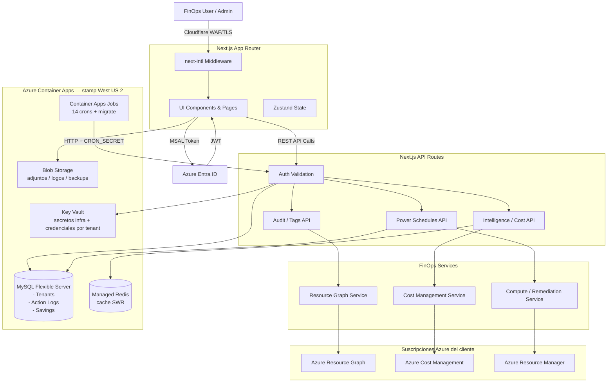

# CSCloudSolutions FinOps Platform 🚀

La Plataforma FinOps de CSCloudSolutions es una solución SaaS B2B automatizada construida sobre Next.js App Router (React) orientada a la gobernanza cloud, auditoría (Omni-Scan), y optimización financiera para entornos empresariales en Microsoft Azure.

La plataforma es **Azure-only**, de punta a punta: la nube que audita es Azure, y la
infraestructura sobre la que corre también (Azure Container Apps, gestionada con
Terraform — ver [Infraestructura y despliegue](#-infraestructura-y-despliegue)).

- **Producción:** `https://finops.cscloudsolutions.com.ar` (detrás de Cloudflare, TLS Full strict)
- **Región principal:** West US 2

## 🏗️ Architecture

El sistema opera bajo una arquitectura de 3 capas fuertemente tipada y asegurada con autenticación basada en identidades de Azure:

1. **Frontend (App Router)**: Interfaz de usuario dinámica construida con React, Tailwind CSS, y Zustand (manejo de estado). Adaptada con internacionalización (`next-intl`) y soporte de temas (Dark Mode).
2. **API Layer (Next.js Edge/Node)**: Rutas backend que orquestan de manera segura la validación de acceso (`@azure/msal-react` / `@azure/msal-node`) y exponen lógica de negocio estructurada.
3. **Services & Azure SDK**: Capa de servicios inyectados (`src/services/`) que interactúan directamente con Microsoft Azure (Resource Graph, Cost Management, Compute) y una base de datos MySQL para persistencia de datos multitenant (Logs, Historial de Ahorro, Tenants).

### Infrastructure Diagram (Mermaid)



---

## 📂 Project Directory Structure

```text
src/
├── app/
│   ├── [locale]/                 # Rutas de UI Internacionalizadas (App Router)
│   │   ├── academy/              # FinOps Academy (LMS interno)
│   │   ├── admin/                # Configuración, Onboarding, Billing, Workbooks, Reportes
│   │   ├── advisor/              # Integración de Azure Advisor
│   │   ├── cleanup/              # TTL Enforcement & Zombies
│   │   ├── demo/                 # Demo comercial (tenants mock por tier)
│   │   ├── governance/           # Power Schedules (VMs), Etiquetas, Políticas, HA, Reporting
│   │   ├── intelligence/         # Billing, Redes, Cómputo, BDs, Seguridad, Azure AI, iPaaS, Commitments
│   │   ├── legal/                # Páginas legales públicas (términos, subprocesadores)
│   │   ├── login/  signup/       # Autenticación (MSAL / Entra ID) y alta comercial
│   │   ├── marketplace/azure/    # Landing de Azure Marketplace SaaS
│   │   ├── mobile/               # Experiencia mobile-first (PWA)
│   │   ├── onboarding/           # Wizard de alta técnica (Service Principal)
│   │   ├── overview/             # Maturity Scoring, Progreso Histórico, WhiteBoard
│   │   ├── remediation/          # Aprobaciones de remediación
│   │   ├── status/               # Página pública de estado
│   │   ├── superadmin/           # AI, Salud, Tenants, Staff, Soporte global (God Mode)
│   │   ├── support/              # Tickets de soporte in-app
│   │   ├── upgrade/              # Upsell / cambio de plan
│   │   ├── layout.tsx            # Root Layout (Inyecta Providers y next-intl)
│   │   └── page.tsx              # Dashboard Principal
│   └── api/                      # Backend API Routes (frontera de seguridad multi-tenant)
│       ├── admin/  advisor/  audit/  auth/  automation/
│       ├── billing/  budgets/  checkout/  cleanup/  consumption/
│       ├── copilot-m365/  cost-groups/  cron/  dashboard/  exports/
│       ├── fx/  governance/  health/  history/  integrations/
│       ├── intelligence/  m365/  mcp/  mfa/  notifications/
│       ├── onboard/  onboarding/  open-data/  power/  profile/
│       ├── recommendations/  remediation/  resources/  rightsizing/
│       ├── status/  subscriptions/  superadmin/  support/  system/
│       ├── tags/  tenants/  webhooks/
│       └── v1/                   # API pública versionada
├── components/                   # Componentes React Reusables
│   ├── dashboard/                # Widgets de métricas, PowerSchedules
│   ├── history/                  # HistoryButton + panel de histórico diario
│   ├── layout/                   # Sidebar, Navbar, etc.
│   └── remediation/              # Modales de confirmación de acciones
├── context/                      # React Context Providers (ViewMode, Tenant, etc.)
├── db/                           # Conexiones y utilidades de Base de Datos
├── hooks/                        # Hooks reutilizables (useMfaChallenge, etc.)
├── i18n/                         # Routing y configuración de next-intl
├── lib/                          # Utilidades: requestAuth, tierLogic, money/fx, mockData, secrets
├── modules/                      # Core (FOCUS, KQL, AI), Storage (MySQL), Collectors (Azure)
├── services/                     # Lógica de Negocio y Consumo de Azure SDKs
├── store/                        # Estado global de Zustand (ActionLogs, etc.)
├── instrumentation.ts            # OpenTelemetry / Application Insights
└── proxy.ts                      # Middleware (next-intl + CSP con nonce)

infra/                            # Infraestructura como código (Terraform)
├── terraform/
│   ├── bootstrap/                # Storage account del estado remoto
│   ├── environments/{dev,prod}/  # Plano de control + N stamps regionales
│   └── modules/                  # stamp, containerapp, cronjobs, mysql, redis,
│                                 # keyvault, network, private_dns, storage, acr,
│                                 # monitoring, diagnostics, security_policy,
│                                 # budget, defender, frontdoor, custom_domain
└── docs/                         # Guía de despliegue, residencia de datos, costos

migrations/                       # SQL idempotente YYYYMMDD-NNN-descripcion.sql
docs/                             # Guías técnicas profundas + auditorías de seguridad
```

---

## 🔒 Authentication & Least Privilege

El sistema opera un modelo de seguridad multi-nivel estricto:

1. **User Identity**: Azure (Entra ID) vía MSAL (`@azure/msal-react`). Los tokens JWT (RS256) se validan contra el JWKS de `login.microsoftonline.com/{tid}` en todos los llamados a la API en `src/app/api`. Es el **único** camino de autenticación: el login por email+contraseña (identidad propia para tenants sin Entra) se retiró el 2026-07-29 junto con su código y esquema — ver el changelog más abajo.
2. **Service Principal (Platform Agent)**: Los Tenants hacen Onboarding ejecutando un script de PowerShell que crea un **Service Principal Least-Privilege**.
3. **Role-Based Access Control (RBAC)** — Roles asignados por tier:

   **Todos los tiers (piso: Professional):**
   - `Reader` — Resource Graph, Advisor, listado de recursos.
   - `Cost Management Reader` — API de Consumo Real (`/api/intelligence/billing`).
   - `Monitoring Reader` — Métricas para rightsizing y AI Cost Analytics (tokens de Microsoft Foundry/Azure OpenAI).
   - `Billing Reader` — Visibilidad de facturación a nivel suscripción.
   - `Security Reader` — Lectura de postura/configuración de seguridad (Defender for Cloud, WAF, DDoS).

   > Para **AI Cost Analytics (Microsoft Foundry / Azure OpenAI)** no se agregó
   > ningún rol nuevo: se mantiene el principio de menor privilegio con estos 5
   > roles base.

   > Para **Entra ID (licencias/subscriptions)** el Service Principal también requiere permisos de aplicación Microsoft Graph: `Directory.Read.All`, `Reports.Read.All`, `User.Read.All` y `Organization.Read.All` (con **Admin Consent**).

   > **Rotación de secretos de App Registrations** (`POST /api/governance/credentials/rotate`, tier
   > **Business**) es la única capacidad de la plataforma que **escribe** en Entra ID, y necesita un permiso
   > que los cuatro de arriba no cubren: **`Application.ReadWrite.OwnedBy`** con Admin Consent, **más** el
   > Service Principal agregado como *owner* de cada App Registration que se quiera rotar. `Directory.Read.All`
   > alcanza para **listar** credenciales por vencer, así que el módulo de Credenciales se ve completo aunque
   > la rotación falle: sin este permiso Graph devuelve `403` y la UI lo informa explícitamente.
   >
   > Se pide `OwnedBy` y no `Application.ReadWrite.All` a propósito: `All` habilitaría reescribir cualquier
   > app del directorio, incluidas las que no son de la plataforma. `OwnedBy` limita el alcance a las que se
   > le asignaron explícitamente, que es el mínimo suficiente para la feature.

   > **Rotación de secretos — ya en el script.** El script de onboarding de los tiers **Business** y
   > **Enterprise** asigna `Application.ReadWrite.OwnedBy` automáticamente. Lo que el script **no** puede
   > hacer es volver al Service Principal *owner* de cada App Registration a rotar: eso se agrega a mano
   > en **Entra ID → App registrations → (la app) → Owners → Add owners**, y el propio script lo imprime
   > como nota final. Sin ese paso el permiso está otorgado y Graph sigue devolviendo `403`.

   > **Usuarios y Permisos** (`/admin/access?tab=users`) usa tres capacidades de Graph, todas de lectura:
   > el autocompletado de usuarios necesita `User.Read.All` (cubierto por `Directory.Read.All`), la
   > sincronización por grupo de seguridad necesita **`Group.Read.All`** — el único que no está en la
   > lista de arriba — y el estado de 2FA lee
   > `reports/authenticationMethods/userRegistrationDetails`, que requiere `Reports.Read.All` o
   > `AuditLog.Read.All`. Sin `Group.Read.All` el resto del módulo funciona y sólo falla la búsqueda de
   > grupos; sin el permiso de reportes la columna de 2FA queda en "Sin dato", que la UI distingue
   > explícitamente de "no tiene 2FA".

   **Business (Pro +):**
   - **Custom Remediation Role** con permisos **mínimos** de power management:
     - `Microsoft.Compute/virtualMachines/start/action`
     - `Microsoft.Compute/virtualMachines/deallocate/action`
     - `Microsoft.Compute/virtualMachines/restart/action`
     - `Microsoft.Resources/tags/write`

   **Enterprise (Business +):**
   - **Custom Remediation Role** **expandido** para limpieza de huérfanos:
     - Todas las de Business +
     - `Microsoft.Compute/disks/delete`
     - `Microsoft.Compute/snapshots/delete`
     - `Microsoft.Network/networkInterfaces/delete`
     - `Microsoft.Network/publicIPAddresses/delete`
     - `Microsoft.Network/networkSecurityGroups/delete`

   > ⚠️ **NOTA importante**: El script de onboarding **NO** asigna `Virtual Machine Contributor` ni `Desktop Virtualization Power On Off Contributor` porque otorgan permisos excesivos (incluyendo borrar VMs). Se usa exclusivamente el Custom Role con acciones explícitas.

   > ⚠️ **Suscripciones EA/MCA**: Para suscripciones bajo Enterprise Agreement o Microsoft Customer Agreement, el `Billing Admin` debe asignar adicionalmente `Enrollment Reader` o `Billing Account Reader` al SP en el scope de billing account (no es posible desde el script).

   > 🔖 **Reservas (RIs / Savings Plans)**: El detalle del blade *Reservations* (`/intelligence/commitments`) usa `Microsoft.Capacity/reservations`. Lectura requiere el rol **Reservations Reader** sobre el/los *reservation order(s)*; la acción de **renovación** (activar/deshabilitar auto-renew) requiere **Reservations Contributor** u **Owner** del order (menor privilegio suficiente). En la app, la mutación de renovación está protegida por `requireTenantRole(['Admin','Owner'])`.

   **Diagnóstico:** El endpoint `GET /api/admin/check-sp-roles` verifica automáticamente que el SP tenga todos los roles requeridos en cada suscripción y reporta los faltantes con instrucciones de remediación.

### 🔍 Diagnostic Endpoints

| Endpoint | Método | Para qué |
|---|---|---|
| `/api/admin/check-sp-roles?tenantId=...` | GET | Verifica que el Service Principal del tenant tenga **todos los roles requeridos** según su tier, en **cada suscripción** que ve. Devuelve estado por sub (`OK`/`PARTIAL`/`NO_ROLES`/`ERROR`), lista de roles asignados, lista de roles faltantes, y un `globalHint` accionable. Acepta opcionalmente `&subscriptionIds=id1,id2` para filtrar. |

**Ejemplo de respuesta exitosa:**
```json
{
  "success": true,
  "summary": {
    "tenantId": "8b41364f-...",
    "tier": "Professional",
    "spObjectId": "abc-...",
    "requiredRoles": ["Reader", "Cost Management Reader", "Monitoring Reader", "Billing Reader", "Security Reader"],
    "totalSubscriptions": 3,
    "okCount": 1,
    "partialCount": 2,
    "noRolesCount": 0,
    "errorCount": 0
  },
  "subscriptions": [
    {
      "subscriptionId": "...",
      "assignedRoles": ["Reader", "Cost Management Reader", "Monitoring Reader", "Billing Reader", "Security Reader"],
      "missingRoles": [],
      "status": "OK"
    },
    {
      "subscriptionId": "...",
      "assignedRoles": ["Reader"],
      "missingRoles": ["Cost Management Reader", "Monitoring Reader", "Billing Reader", "Security Reader"],
      "status": "PARTIAL"
    }
  ],
  "globalHint": "⚠️ 2 suscripción(es) con roles incompletos. Roles faltantes: Cost Management Reader, Monitoring Reader, Billing Reader, Security Reader. ..."
}
```

---

## ☁️ Proveedor de nube

La plataforma es **Azure-only**. No hay abstracción multi-cloud ni proveedor
configurable por tenant: todo colector, motor y pantalla asume Azure. La ingesta
de CSV hacia el esquema **FOCUS 1.0/1.1** (`/api/intelligence/upload`) sigue
aceptando exports de facturación de terceros — es un estándar abierto de la
FinOps Foundation, no una integración con otra nube.

---

## 🚀 Infraestructura y despliegue

La plataforma corre en **Azure Container Apps**, con toda la infraestructura
declarada en Terraform bajo `infra/terraform/` (ver [`infra/README.md`](infra/README.md)).
Reemplazó al VPS Hostinger + Docker Compose + crontab manual el 2026-07-28.

### Topología

Dos planos, para que agregar una región sea agregar una clave de un mapa y no
rediseñar nada:

- **Plano de control** (global, sin datos de clientes): Azure Container Registry,
  Defender for Cloud (alcance suscripción) y — sólo con 2+ stamps — Front Door
  para geo-routing.
- **Stamp** (celda regional, todo lo que toca datos de clientes): hoy uno, en
  **West US 2**, cuya clave en el mapa `stamps` es el valor de
  `Tenants.data_residency` que atiende.

Dentro de un stamp:

| Recurso | Notas |
|---|---|
| Container App `web` | Next.js standalone, autoescalado por requests concurrentes (1–5 réplicas), entorno zone-redundant |
| Container Apps Jobs | 14 schedules (el reemplazo del crontab) + un job `migrate` de disparo manual |
| MySQL Flexible Server | VNet injection, sin acceso público, backups con PITR |
| Azure Managed Redis | Private endpoint, cache SWR compartido entre réplicas |
| Key Vault | Secretos de infra (`infra-*`) y credenciales por tenant; private endpoint; leído con **Managed Identity** |
| Blob Storage | Adjuntos de soporte, logos de tenant y backups (el filesystem del contenedor es efímero) |
| Log Analytics + Application Insights | Con diagnostic settings de Key Vault, MySQL, Redis y Blob |
| Budget + alertas | Presupuesto mensual por resource group con aviso por email |

La identidad de la app es una **user-assigned managed identity**: se usa para el
`AcrPull` de la imagen y para leer Key Vault. Ver la advertencia de nombres en
`infra/terraform/modules/stamp/main.tf` — la variable es
`AZURE_KEYVAULT_MI_CLIENT_ID`, **nunca** `AZURE_CLIENT_ID` (esa ya tiene dueño:
es el app registration con el que se piden tokens contra el tenant del cliente).

### Workflows de GitHub Actions

Autenticación por **OIDC federado** (`azure/login`), sin secretos de cliente ni
llaves SSH.

| Workflow | Disparo | Qué hace |
|---|---|---|
| `ci.yml` | PRs a `main`/`staging`, push a `staging` | `lint` → `typecheck` → `test:coverage` → `build`. **Es el único gate de calidad.** |
| `deploy-azure.yml` | Push a `main` (ignora `infra/**`, `docs/**`, `**.md`) | Build en ACR → job de migraciones → nueva revisión de la Container App → health check. Rollback = activar la revisión anterior, sin rebuild. |
| `terraform.yml` | PR sobre `infra/terraform/**`, `workflow_dispatch`, lunes 07:00 UTC | Checkov (`--framework terraform`) + Infracost + `plan` en el PR; el **apply es siempre manual**; el cron semanal detecta drift. |
| `deploy-staging.yml` | Push a `staging` | Despliegue al entorno de staging. |

El build de la imagen produce **dos tags**: el runtime (standalone de Next
podado) y uno `-builder`, porque el runtime no puede correr `npm run migrate`
(no lleva `scripts/`, `migrations/` ni `tsx`). El job de migraciones usa el
segundo.

### Detalles aprendidos que conviene no re-descubrir

- **Probar migraciones en local con la collation de Azure.** Terraform crea la
  base con `utf8mb4_unicode_ci`; `mysql:8` por defecto usa `utf8mb4_0900_ai_ci`.
  Una FK que pasa en local revienta en Azure con `ER_FK_INCOMPATIBLE_COLUMNS`.
  Levantar el contenedor con `--collation-server=utf8mb4_unicode_ci`.
- **Nunca `terraform apply -lock=false` ni dos applies concurrentes.** Contra
  backend remoto produce *lost update*; los "state lock stuck" son el síntoma,
  no la causa.
- **El Redis de prod no se puede crear con `high_availability = true`**: el
  path de *create* de Azure falla siempre. Se crea en `false` y se actualiza a
  `true` después (el `UPDATE` sí funciona).
- **Managed Certificate + Custom Domain**: dos bugs del provider `azurerm`
  documentados in-situ en `infra/terraform/modules/custom_domain/main.tf`
  (IDs desalineados entre recursos, y `container_app_environment_certificate_id`
  de sólo-escritura, que sin `ignore_changes` quiere recrear un binding vivo).

---

## 📈 Recent Major Updates

### 2026-09-01 — Comunicaciones globales, ciclo de vida de tenants, capacidad cobrable y tres bugs de facturación

Seis mejoras del backlog y tres bugs encontrados en el camino. El detalle técnico
está en `docs/lld/00-lld-completo.md` §34 y el arquitectónico en
`docs/hld/00-hld-completo.md` §13.

**Bugs (los tres estaban en silencio):**

- **Las cancelaciones no se aplicaban.** `Tenants.subscription_status` era
  `ENUM('TRIAL','ACTIVE','EXPIRED')` en toda base anterior al bootstrap de junio:
  ese bootstrap declara el enum completo pero es `CREATE TABLE IF NOT EXISTS`, así
  que sobre una tabla existente corrió, se registró como aplicado y no cambió
  nada. Con `STRICT_TRANS_TABLES` el `UPDATE ... 'CANCELED'` aborta y el tenant
  **queda ACTIVE** — quien cancelaba conservaba el acceso. Arreglado con
  `MODIFY COLUMN` (`20260901-004`), que sí actúa sobre tablas ya creadas.
- **El medidor de suscripciones informaba 0 a todos.** Contaba
  `TenantSubscriptions`, que es el registro de facturación y no tiene columna
  `subscription_id`: la consulta tiraba "Unknown column", los `catch` se la
  tragaban y el contador quedaba en cero — mientras el truncado en `azure.ts` sí
  recortaba la lista de verdad. El cliente veía 2 de sus 10 suscripciones con un
  medidor que decía que no había usado ninguna.
- **El Whiteboard alimentaba dos KPI distintos con el mismo campo**
  (`zombieMonthlyWasteUSD` y `potentialSavingsUSD`, ambos de `totalSavings`), y
  el de zombies incluía hallazgos de gobernanza que no son dinero quemado.

**Funcionalidad:**

- **Comunicaciones globales (MEJ-11)** — banner y popup a los tenants, con
  vigencia, severidad, alcance por tenant y traducciones opcionales.
  `/superadmin/announcements`.
- **Ciclo de vida de tenants (MEJ-12)** — fechas de alta, suspensión y baja con
  motivo, historial append-only, filtros por rango y exportación contable con
  permanencia en meses. Un único punto de transición reemplaza 17 `UPDATE`
  sueltos.
- **Capacidad cobrable (MEJ-15 fase 2)** — add-ons de suscripción y tenant
  contratables en autoservicio desde Facturación. La capacidad la acredita el
  webhook, nunca la ruta de compra.
- **Etiquetas en el pipeline de costos (MEJ-30)** — `CostTagSnapshots` para
  tenants sin export FOCUS, y las consultas por etiqueta prefieren el dato exacto
  y sólo caen a la aproximación por Resource Group cuando hace falta.
- **Desperdicio como métrica propia (MEJ-04)** y **animaciones de Recharts
  reactivas (MEJ-02)**.

**Precios:** Business pasa a **$999/mes**. Add-ons: suscripción extra $50 (Pro) /
$40 (Business); tenant extra $90 / $240. Catálogo en `src/lib/pricing.ts` — es lo
que la plataforma **muestra**; el cobro lo define Paddle.

**Auditoría documental:** se revisaron las 10 entradas marcadas "Hecha" en
`docs/MEJORAS-FUTURAS.md` contra el código. Ocho verificadas; **MEJ-15 estaba
marcada Hecha con sólo la fase 1** y **MEJ-10 declaraba un borrado que nunca
ocurrió** (tres catálogos de precios duplicados y ya divergidos: un disco vale
$19.71 en una pantalla y $15.00 en otra). Reabierta como MEJ-32.

**Baja del VPS:** se eliminaron los restos operativos que aún apuntaban al
servidor retirado el 2026-07-27 (`deploy.yml`, `restore-test.yml`,
`docker-compose.yml`, `scripts/backup-db.sh`, el runbook de restore y dos planes
de infraestructura superados). Se conservan el aviso legal de cambio de
subencargado y `infra/docs/migracion-desde-vps.md`: son la obligación contractual
y el porqué de la arquitectura actual.


### 2026-08-23 — Madurez FinOps, Copilot y Progreso Histórico: 9 bugs con la misma familia de causas

Tres módulos, y en dos de ellos la causa raíz fue **la misma que en Advisor**: un `fetch` de mutación
sin cabecera `Authorization` contra una ruta que exige RBAC, con el error tragado por un
`if (res.ok)` sin rama `else`.

**Madurez FinOps — el paso 6 no dejaba finalizar.** El wizard sí enviaba al elegir opción en el último
paso, pero el POST a `/api/intelligence/maturity` iba sin token → 401 → nada, sin mensaje. Ahora manda
el id token, surface el error en el modal, y el último paso tiene botón explícito *"Finalizar Evaluación
y Ver Diagnóstico"* (habilitado con los 6 dominios respondidos) más un *Siguiente* en los pasos 1-5.
Al finalizar cierra el wizard y revalida radar, badge de nivel y roadmap. La gráfica radar tenía
colores fijos de tema claro — etiquetas en `#1B2A41`, invisibles sobre fondo oscuro: nuevo hook
`useChartTheme` (`src/lib/chartTheme.ts`) centraliza los tokens de Recharts por tema, porque los
colores de ejes y series van como props SVG donde las clases `dark:` no aplican.

**Copilot — la llave de cifrado y el "esperando datos".** `getAIConfig` llamaba `decryptSecret`, que
lanza si no hay material de clave; con un valor `enc:v1:` en base y sin `MFA_ENCRYPTION_KEY`, la
excepción tumbaba el chat entero. Se amplió la cadena (`MFA_ENCRYPTION_KEY` → `AZURE_KEYVAULT_CACHE_KEY`
→ `ENCRYPTION_SECRET` → `NEXTAUTH_SECRET`) y se agregó `tryDecryptSecret`, que en rutas de **lectura**
devuelve null con warning y deja al llamador caer a la IA global de la plataforma. **No se agregó la
clave por defecto hardcodeada** que pedía el pedido: una clave maestra en el repo vuelve descifrable
cualquier secreto de la base y haría que producción cifre en silencio con una clave pública si faltara
la variable; el objetivo real (que el chat no se caiga) queda cubierto por el camino tolerante.
El chat, además, nunca estuvo bloqueado — el input jamás se deshabilitaba — pero el estado vacío decía
*"Esperando datos de la página…"* permanentemente. Ahora abre en *"Listo para ayudarte"* con 3 pills de
preguntas sugeridas, y la hidratación del contexto tiene tope duro de 2000 ms antes de degradar al
contexto básico del tenant.

**Progreso Histórico — el Bastion que ahorraba $15.** El ahorro de cada hito salía de una tabla de
valores fijos con fallback de **15 USD/mes** para todo lo no catalogado; Azure Bastion y AKS no estaban
en la tabla. Nuevo `src/lib/realizedSavings.ts` con el orden correcto de fuentes: delta real de
`CostSnapshots` alrededor del evento (run-rate de 30 días antes vs. después) → precio de catálogo del
SKU × 730 h → línea base por tipo, marcada como estimación. Sin ninguna fuente el ahorro es 0 y la
tabla muestra "—". `safeSavingsPercentage` cubre las tres ramas del contrato y nunca devuelve NaN, que
era lo que dejaba en blanco la columna del clúster AKS "Oaks" de CSCS. El `resourceGroup` se extraía
con `split('/')` a mano y caía en el literal `"general-rg"`: ahora se parsea del ARM ID y la columna
muestra nombre en negrita + icono por tipo real + grupo real, con el ARM ID en el tooltip. Ejes de las
gráficas y iconos de KPI pasados a tokens de alto contraste en oscuro.

**Patrón común encontrado de paso:** `TenantProvider` interceptaba `/api/advisor`,
`/api/intelligence/maturity` y `/api/intelligence/history` en demo devolviendo shapes distintos a los
que consumen los paneles (sin `pillars`, sin `summary.dimensions`, sin porcentaje). Las tres rutas ya
hacen short-circuit con sus propios generadores mock, así que se quitaron las intercepciones: el demo
ahora ejercita exactamente el mismo contrato que producción — que es lo que permitió verificar estos
arreglos en el navegador.

23 tests nuevos entre los tres módulos.

### 2026-08-23 — Azure Advisor: seis bugs de producción, del GUID en el título al snooze que no persistía

**El encabezado mostraba el GUID del tenant como nombre de la empresa** porque el servicio devolvía
literalmente `tenantName: tenantId`. Ahora resuelve el nombre comercial
(`TenantGlobalSettings.organization_display_name` → `Tenants.company_name`) y el GUID queda en un
micro-badge con copiado; la UI además descarta cualquier valor con forma de GUID por si acaso.

**Mezcla de idiomas:** `category` e `impact` llegan de Azure siempre en inglés — el `Accept-Language` no
los localiza — y se pintaban crudos o con ternarios locales. Se centralizan en `advisorI18n.ts`
(`translateAdvisorCategory` / `translateAdvisorImpact`, nombres formales: Costos, Alta Disponibilidad,
Seguridad, Rendimiento, Excelencia Operativa) y viajan resueltos como `categoryDisplayName` /
`impactDisplayName`. El glosario de fallback suma las fugas reportadas (backup, availability zones,
managed disks, app service plans…). No se creó un diccionario paralelo: el existente ya tiene ~650 entradas.

**"Recurso Afectado" mostraba el URI ARM completo y el resource group era falso.** Se parseaba
`impactedValue` (que trae el nombre corto) antes que el ARM Resource ID real, así que el grupo no se extraía
y se rellenaba con un `'rg-default'` inexistente. Ahora `resourceMetadata.resourceId` tiene precedencia, el
parser devuelve también el tipo ARM completo y el subscriptionId (resolviendo el tipo hoja en recursos
anidados `servers/databases`), la tabla muestra nombre en negrita + icono por tipo real + grupo real, y el
ARM ID completo vive sólo en el tooltip con botón de copia. Sin fallbacks inventados.

**Recomendaciones duplicadas en listado y KPIs:** las no-reserva se agrupaban por el id crudo de Advisor,
que cambia por suscripción y por consulta. La clave pasa a ser `categoría + recommendationTypeId + recurso`;
en duplicados exactos gana el `lastUpdated` más reciente, y las reservas siguen separadas por suscripción
(dos suscripciones son dos compras, no un duplicado).

**Optimizaciones genéricas que hablaban de etiquetas en recursos de cómputo o red:** nuevo
`generateAdvisorRemediationAction`, que deriva la acción del tipo ARM real y de `extendedProperties`
(RIGHTSIZE con SKU destino y CPU observada, DELETE_ZOMBIE con snapshot previo, consolidación de App Service
Plan, ENABLE_HA para backup/zonas, PURGE_STORAGE, PURCHASE_RESERVATION, APPLY_AHUB) y **sólo** emite
`UPDATE_TAGS` si la regla es de etiquetado. Es determinista a propósito: corre sobre cientos de
recomendaciones por carga y el payload ya trae todo lo necesario, así que una inferencia LLM por ítem
costaría segundos y dinero para devolver lo mismo (documentado en el JSDoc cómo envolverlo con `aiProvider`
si se quisiera prosa generada).

**Posponer 30 / 90 días no persistía:** el POST a `/api/advisor/suppress` iba **sin cabecera
Authorization** y el endpoint exige rol Admin/Owner → 401 y fallo silencioso (`if (res.ok)` sin rama else).
Se manda el id token, se usa la `dedupKey` estable como `recommendationId` (el id crudo cambiaba y el filtro
no matcheaba), la SWR de 30 min se invalida con `bust=1`, y la UI aplica actualización optimista: cierra el
modal, quita la fila, descuenta conteo/ahorro/impacto del pilar y muestra un toast con la fecha exacta de
reaparición; si el backend falla, avisa y revierte. No se creó `TenantAdvisorSnoozedRecommendations`:
`RecommendationActions` ya cubre el caso y es la que leen Advisor, el whiteboard y el COIN index — una tabla
paralela sería una segunda fuente de verdad.

**Bonus encontrado al verificar:** en demo el panel mostraba todos los KPIs en 0 porque `TenantProvider`
interceptaba `/api/advisor` y devolvía `getAdvisorMock` (shape `AdvisorModel`, sin `pillars`) mientras el
panel espera `AdvisorApiResponse`. Se quitó la intercepción: la ruta ya hace short-circuit con
`generateMockAdvisorData`.

Accesibilidad: blanco puro sobre azul corporativo, acentos `dark:text-[#38BDF8]` en fondos oscuros
(verificado por color computado en ambos temas) y fuera los emojis 🏆/🎉 en favor de Tabler. Cero cambios en
la estructura visual: mismas tarjetas, mismo grid de KPIs, misma tabla, mismo modal. 13 tests nuevos.

### 2026-08-23 — El header perdía la campana, la ayuda y el avatar en pantallas intermedias

Reportado como "en celular estos iconos no se muestran". No era un problema de teléfono en vertical
(a 375px todo entra): se reprodujo a **844×390 — un celular en horizontal**, y aplica igual a tablets
angostas y ventanas de escritorio de ~700 a 1000px. El header usaba `justify-between` con contenido
no encogible (bloque de marca + selector de alcance + idioma): el contenido medía **1026px dentro de
780**, la campana caía en `x=894` y el `overflow-hidden` del shell la recortaba **sin scroll posible**.
Solo quedaba visible la hamburguesa.

- El cluster de campana / manual / avatar es `shrink-0`: es la única vía a notificaciones y perfil.
- Marca y selector de alcance ahora ceden espacio (`min-w-0` + `truncate`); la marca se muestra desde
  `lg` en vez de `sm`, porque entre 640 y 1024px competía con el selector y el idioma.
- `ScopeSelector`: el `<select>` tenía `w-[180px] md:w-[280px]` sin `min-w-0`, así que no encogía y su
  pill empujaba todo; los 280px quedan reservados para `lg`.
- El botón "Salir de la Demo" arrastraba un `w-full` de otro contexto que se comía el ancho del
  header; ahora es `shrink-0` con la etiqueta desde `lg`.
- **Barra de impersonación:** era `fixed top-0 z-[90]` sin reservar espacio, así que tapaba medio
  header en escritorio y, al apilarse en dos filas en móvil, lo tapaba entero. Pasa al flujo y el
  shell toma el alto restante.

Verificado sin overflow horizontal y con los tres iconos dentro del viewport a 375, 640, 768, 844 y
1280px.

### 2026-08-23 — White Board Ejecutivo: los cuatro KPIs que mentían

**Recursos Zombies e Impacto Ambiental mostraban 0 permanentemente.** El agregador
`/api/intelligence/whiteboard` enriquecía su `summary` con un self-fetch a
`/api/dashboard/summary` enviando sólo `x-forwarded-request`, pero ese endpoint exige Bearer de
usuario o `X-Cron-Auth`: devolvía 401 y el `catch` publicaba ceros. Ahora forwardea las credenciales
de la request entrante, igual que hace `/api/overview/whiteboard`. En el cliente, la cadena `??`
dejaba ganar ese `0` sobre el valor real que `ExecutiveSummaryBoard` ya tenía de
`/api/dashboard/summary` (`??` sólo cubre `null`/`undefined`): se pasó a `||`. Se eliminó además el
fallback fabricado de carbono (`costMtd * 0.003`) — ahora es dato real de Resource Graph o 0.

**Los conteos de Advisor no coincidían con Azure Advisor.** El whiteboard leía
`collectAdvisorData` crudo, que cuenta cada variante de término (1y/3y) de una misma reserva como
una recomendación distinta e incluye las suprimidas (`postponed`/`dismissed`). Pasa a consumir
`getAdvisorExecutiveData`, la misma fuente deduplicada de `/governance/advisor`, filtrando las no
activas. La tarjeta "Seguridad y Advisor Score" ahora además **muestra** el Advisor Score oficial
(media ponderada por consumo de la Advisor Score API), que hasta ahora sólo prometía en el título.

**Top Quick Wins repetía la misma recomendación con comandos inejecutables.** El `actionType` se
derivaba de la categoría (todo lo de `Cost` era `rightsizing`) y el script se armaba en el cliente
asumiendo VM: una recomendación de Redis mostraba
`Update-AzVM -ResourceGroupName "rg-prod" -Name "<GUID>"`, con un resource group inexistente. Ahora
el servidor resuelve el comando con `buildAdvisorRemediationCommand` sobre el recurso real y envía
`resourceGroup`/`resourceType`/`subscriptionName`; el generador del widget queda sólo como fallback.
En el propio `buildAdvisorRemediationCommand` se corrigió la raíz: comparaba `serviceName` contra
`"virtual machine"` con espacio, pero ese campo viene del segmento de tipo del ARM id
(`virtualMachines`, `Redis`, `servers`), así que **ningún** recurso matcheaba y todo rightsizing caía
en la rama de VM. Se agregó rama para Azure Cache for Redis, se exige que el recurso sea VM-like
antes de emitir `az vm resize`, y el fallback genérico dejó de usar el `--resource-type
"Microsoft.Resources/resources"` inventado (Azure CLI lo rechaza) a favor de `--ids` con el
`resourceId` real. Dos tests de regresión cubren ambos casos.

**"Ver todos los servicios" daba 404:** apuntaba a `/intelligence/cost-analysis`, que no existe.
Ahora va a `/intelligence/consumo-y-presupuesto`, la página que lista consumo real por servicio.

Cache keys de Redis bumpeadas (`whiteboard:v5:azure:*`, `whiteboard:v4:*`) por cambio de shape del
payload. Mocks por tier con `resourceGroup`, `resourceType`, comandos y `advisorScore`; nueva key
i18n `WhiteBoard.advisor_score` en es/en/pt-BR.

### 2026-08-22 — Configuración Global (General): ITSM real, token de Power BI y la auditoría que sobrevive a la purga

**ITSM dejó de ser una maqueta.** Los inputs eran no controlados y "Guardar Credenciales" sólo mostraba
un toast: nada se persistía. Ahora `PUT /api/admin/config/general` guarda la configuración (token cifrado
con AES-256-GCM, el mismo mecanismo que `ai_api_key`) y `POST /api/admin/config/integrations/test-itsm`
la prueba contra el endpoint de identidad de Jira / Azure DevOps / ServiceNow, devolviendo **quién** quedó
autenticado. El secreto nunca vuelve al navegador — la API expone sólo `isItsmConfigured` — y mandar el
campo vacío conserva el token guardado en lugar de borrarlo.

**El token de Power BI era `btoa(tenantId)`**, es decir base64 del tenant id: la URL que el admin copiaba
devolvía 403, porque el endpoint valida el token contra el *client_secret* del Service Principal. Hacerla
"funcionar" habría implicado mostrar ese client_secret en un campo copiable. Ahora se emite un API key
dedicado (`MCPApiKeys`: sha256, revocable, visible una sola vez) que viaja en el header `Authorization`
y no en la query string.

**La purga de tenant borraba su propia bitácora.** `ActionLogs` y `AuthAuditLogs` tenían FK a `Tenants`
con `ON DELETE CASCADE`, así que dar de baja un entorno eliminaba toda la evidencia de lo que se hizo en
él — justo el evento que hay que poder auditar. La migración `20260822-006` quita ambas FK (y repone el
índice por `tenant_id`), y el teardown sella un `TENANT_PURGE` con el email del superadmin. El resto de
las tablas mantiene `CASCADE`: los datos operativos sí deben irse.

**Guard SSRF para hosts del cliente.** La URL base de ITSM la elige un admin pero el request lo hace el
servidor con credenciales: sin guard, apuntarla a `169.254.169.254` convertía "probar conexión" en una
lectura del metadata endpoint de Azure. Se extrajo `assertPublicHttpsUrl` de `webhookSecurity.ts` (HTTPS,
sin IP literal, resolución DNS con rechazo de rangos privados) y `assertSafeWebhookUrl` ahora lo reutiliza.

**Nota de esquema:** no se crearon `TenantGlobalSettings` ni `TenantIntegrations`. `webhook_url` y
`logo_stored_name` ya viven en `Tenants`, y la config de IA ya sienta el precedente de "proveedor + URL +
credencial cifrada" como columnas; una tabla 1:1 aparte sólo habría agregado un JOIN y una segunda fuente
de verdad para el webhook.

### 2026-08-22 — Las cuatro pestañas restantes de Usuarios y Accesos, y el permiso que faltaba para rotar

**El permiso que faltaba.** La rotación de secretos de App Registrations es la única capacidad de la
plataforma que **escribe** en Entra ID, y el script de onboarding no pedía ningún permiso de escritura:
la feature no podía funcionar en ningún tenant. Graph devolvía `403` y el módulo de Credenciales se veía
completo porque *listar* alcanza con `Directory.Read.All`. El script ahora asigna
`Application.ReadWrite.OwnedBy` en los tiers Business+, buscando el app role por `Value` y nunca por un
GUID hardcodeado. Se pide `OwnedBy` y no `Application.ReadWrite.All` a propósito, y como `OwnedBy` sólo
alcanza a las apps de las que el SP es *owner*, el script imprime la ruta del portal para agregarlo — sin
ese paso el permiso queda otorgado y la rotación sigue dando 403.

**Seguridad (2FA):** bitácora de autenticación (`AuthAuditLogs`), llaves FIDO2/passkeys con
`@simplewebauthn/server`, y regeneración de códigos de recuperación con TOTP obligatorio y rate limit.
El `rpID` y el `origin` de WebAuthn salen de env y **no de los headers del request**: derivarlos de
`Host`/`Origin` anularía la protección anti-phishing que es la razón de existir de FIDO2. El challenge
se consume siempre, haya verificado o no. `recordAuthEvent` nunca lanza: perder una línea de bitácora es
malo, dejar a alguien afuera de su cuenta porque falló el INSERT de auditoría es peor.

**SSO SAML:** la prueba de conexión **consulta el estado real** en WorkOS (`active` / `draft`) en lugar
de simular un login — un test que devolviera atributos SAML inventados sería un mock disfrazado de
diagnóstico. JIT viene apagado por default y su rol falla cerrado a Reader: si el default fuera Admin,
habilitar JIT le daría administración del tenant a todo el directorio del cliente.

**Onboarding de Clientes:** refactor en el lugar (el panel tiene features de superadmin que una
reescritura habría perdido), reusando los tres endpoints que ya existían. Un secreto vencido gana sobre
"faltan permisos" en el estado del entorno: con la credencial muerta no se pueden ni consultar los roles.

**Onboarding Lighthouse:** el panel era un stub. Ahora lee las delegaciones en vivo de Resource Graph y
las combina con el registro propio **marcando el origen**: `arg` existe en Azure, `db` es una plantilla
emitida que el cliente no desplegó. Mezclarlas haría que un template descargado y nunca aplicado se lea
como acceso vigente. Si ARG no responde, se avisa en vez de mostrar un inventario vacío.

**Corrección de una colisión de columna:** la migración de Usuarios declaraba `mfa_enabled`, que ya
existía para el TOTP de la plataforma. Como el runner tolera `ER_DUP_FIELDNAME` y esa columna tiene
`DEFAULT 0`, el panel habría mostrado "Pendiente" para todos en vez de "Sin dato". La columna del
directorio pasa a `entra_mfa_registered`.

**Endurecimiento de `/api/admin/config/users`:** los cuatro handlers evalúan `isMockTenant` antes que
el RBAC y la base de datos — seguro porque la rama mock es un array literal sin I/O real. La consulta
a `Users` ahora tiene fallback de esquema: si las columnas de `20260822-002` todavía no llegaron a esa
réplica (migración corriendo, staging desactualizado), reintenta sin ellas en vez de devolver 500 a
todos los usuarios del tenant.

**Tabla de Usuarios:** se corrigió el `table-fixed` que dejaba texto largo (emails, OIDs) desbordar
sobre la columna siguiente. Ahora cada columna tiene un ancho mínimo propio y recorta su contenido; el
resize manual y su persistencia en `localStorage` no cambiaron.

### 2026-08-22 — Mesa de ayuda con SLA y control de acceso con autocompletado de Entra ID

**Soporte** (`/support` y `/superadmin/support`) pasa de un listado de tickets a una mesa de ayuda
operable: SLA de primera respuesta con cuenta regresiva en vivo, asignación de agente, notas internas
privadas y adjuntos múltiples con vista previa. Migración `20260822-001` sobre las tablas existentes —
**no se renombraron los ENUM de MySQL** (`question`/`urgent`/`waiting_customer`): la traducción al
contrato del dominio vive en `src/services/supportTickets.service.ts`, porque reescribir datos de
producción y romper el cron de notificaciones no aportaba nada funcional.

Detalles que definen el comportamiento:

- El **riesgo de SLA** sólo aplica a tickets sin primera respuesta y en estado abierto o en curso. Un
  ticket esperando al cliente no está en riesgo aunque el reloj corra: el pendiente no es del equipo.
- Las **notas internas** se filtran en el servidor (`stripInternalNotes`), no en el componente. Un
  usuario de tenant que mande `isInternalNote: true` crea un mensaje público. Una nota interna tampoco
  mueve el estado del ticket ni sella la primera respuesta: el cliente no vio nada.
- El **MTTR** promedia sólo tickets resueltos. Incluir los abiertos daría un número que baja cuando
  entra trabajo nuevo.
- Un solo **drawer de conversación** (`mode="user" | "agent"`) sirve a las dos vistas.

**Usuarios y Permisos** (`/admin/access?tab=users`): se **extendió la tabla `Users`** en lugar de crear
la `TenantUsers` paralela, porque `Users` es la que consultan `requireTenantAccess`,
`requireTenantRole` y `hasSystemRole` — un segundo padrón de identidades sería un agujero de RBAC en
cuanto los dos derivaran. Migración `20260822-002`. La columna de 2FA se llama `entra_mfa_registered` a propósito: `mfa_enabled`
ya existía y mide el TOTP enrolado **en la plataforma**, que es un hecho distinto del registro de MFA
en el directorio del cliente.

- **Autocompletado real contra Microsoft Graph** (`/api/admin/users/search-entra`, `$search` con
  `ConsistencyLevel: eventual`): se eliminó la entrada manual de GUIDs. El OID se completa al elegir
  una sugerencia y el campo queda de sólo lectura con tilde de validación.
- **Sincronización por grupo de seguridad** (`/api/admin/users/sync-group`). El rol Owner está
  prohibido por esa vía (la transferencia de propiedad es individual), el límite de usuarios del tier
  se respeta igual que en el alta manual, y el `system_role` nunca se toca: nadie se promueve a
  SUPERADMIN por pertenecer a un grupo.
- **Drawer de permisos granulares** por módulo. Al guardar, los módulos se traducen a los `RoleTag` de
  `pageRoleTags.ts`, que son los que efectivamente filtran el Sidebar y `RouteTierGate`: guardar sólo
  la columna nueva habría dejado cada casilla como una promesa de acceso que ningún gate cumple.
  `ADMINISTRATION` no otorga tag a propósito — si lo hiciera, un Reader se autoconcedería la
  administración del SaaS marcando una casilla.
- **2FA** desde `reports/authenticationMethods/userRegistrationDetails`, cacheado en
  `entra_mfa_registered` y refrescado bajo pedido. `NULL` significa "Entra ID no contestó", no "sin 2FA": el KPI se calcula sólo sobre los
  usuarios con dato conocido y declara cuántos quedaron sin dato, para no leer una falta de permisos de
  Graph como un incumplimiento.

Ambos módulos: full-width, iconos Tabler exclusivamente (se eliminó `lucide-react` de las tres
pantallas), tablas con columnas redimensionables y visibilidad persistida en `localStorage`, paginado
15/30/45/60 y scrollbar horizontal forzado para macOS. `useColumnConfig`/`ColumnMenu`, que estaban
duplicados en 11 paneles, se extrajeron a `src/components/TableColumns.tsx`.

### 2026-08-22 — Saneo de documentación de infraestructura y postura de red del Key Vault

Inventario de la suscripción contrastado contra lo que decían los documentos. Sin cambios de código de
aplicación: lo que se corrige es documentación que mandaba a recursos inexistentes.

- **Suscripción `CSCloudSolution-Production` dada de baja.** Su service principal ya no autentica
  (`AADSTS7000215`) y no aloja ningún recurso del SaaS, que vive entero en `CSCS-LandingZone`. Se eliminan sus
  referencias. **No se toca el tenant `8b41364f`**: es el master tenant de la app (`superAdminBootstrap.ts`,
  `UsersPanel.tsx`, naming de secretos del vault, `AZURE_TENANT_ID`), independiente de esa suscripción.
- **Nombres de recursos que no existían.** El bloque de rollback de `deployment-guide.md` usaba
  `rg-cscs-finops-prod-us-core` / `ca-cscs-finops-prod-us-web`; los reales son `cscs-finops-prod-westus2-rg` /
  `-web`. Seguir esa guía en un incidente fallaba con `ResourceGroupNotFound`. Los jobs se llaman
  `cron-<endpoint>`, no `job-cscs-finops-prod-us-*`.
- **Plantillas de pipeline borradas.** `infra/pipelines/github-actions/{deploy,terraform}.yml` eran las copias
  "copiar a `.github/workflows/`" del plan de migración; los workflows vivos ya divergieron 137 y 200 líneas y
  las plantillas quedaron con `REPLACE_WITH_ACR_NAME` y el naming viejo. Nada las referenciaba.
- **Postura de red del Key Vault documentada** en `infra/docs/keyvault-network-hardening.md`. Los dos vaults
  tienen acceso público habilitado. El módulo de Terraform ya sabe cerrarlos con
  `keyvault_private_endpoint_enabled`, pero activarlo **rompe el drift semanal y el apply**: Terraform gestiona
  dos secretos en el plano de datos del vault y los runners de GitHub no tienen ruta a la VNet. Quedan
  registradas las opciones con sus costos.
- **El repositorio es público**, y `terraform.yml` dispara en `pull_request` sobre `infra/terraform/**`. Eso
  descarta la opción de runner self-hosted dentro de la VNet y es, por sí solo, el hallazgo de mayor peso.

### 2026-08-22 — Refactor del módulo de Gobernanza: seis páginas y tres datos fabricados menos

Se reconstruyen las seis páginas de **Gobernanza** sobre la infraestructura existente (`powerScheduleService`,
`haService`, `credentialExpiryService`, `governanceReportingService`, `RemediationRequests`), sin duplicar
ningún motor de recolección.

- **Aprobaciones (`/governance/approvals`) ejecutaban nada.** Aprobar sólo cambiaba el estado en MySQL: el
  historial decía "Aprobado" y el recurso seguía facturando. Ahora la aprobación llama a ARM y, si Azure la
  rechaza, la fila queda en `Failed` con la respuesta literal. El KPI de ahorro liberado suma **sólo lo que ARM
  confirmó**. Se agrega cuatro ojos (el solicitante no aprueba su propio pedido), snapshot previo opcional
  —que si falla aborta el borrado— y `AND status = 'Pending'` en el UPDATE contra la doble resolución.
- **Políticas fabricaba el cumplimiento.** `compliance-overview` calculaba los no conformes con
  `Math.floor(total * 0.25)` sobre el inventario y devolvía eso como dato real: un tenant sin una sola política
  asignada veía "75% de cumplimiento". Además caía al dataset demo en tres puntos del camino live. Reemplazada
  por `/api/governance/auto-block`, que lee `policyresources`; sin evaluaciones muestra 0/0.
- **Control de VMs**: motor de ahorro off-hours derivado de la ventana real de cada VM. El enunciado fijaba
  118 h/semana para "L-V 19:00→07:00 + fin de semana"; **son 108** — las 118 duplican el viernes por la noche y
  la madrugada del lunes. 168 − 108 = 60 h encendida = 5 días × 12 h, que cierra.
- **Alta Disponibilidad**: SLA traducido a minutos de caída mensual. La SKU Basic se modela con SLA 0, no 99,9
  (Microsoft no publica SLA para esa SKU), y un backup deja el SLA igual porque mejora el RPO, no la
  disponibilidad.
- **Credenciales**: rotación vía Graph que **no revoca el secreto anterior** — revocar en el mismo paso cortaría
  el servicio a todo lo que aún lo usa. El `secretText` viaja una vez y no se persiste ni se loguea.
- **Reporting**: Score de Seguridad Financiera ponderado con redistribución del peso de los pilares no
  medibles: en 0 castigaría al tenant por falta de permisos, en 100 subiría por no tener información.
- **Transversal**: los seis endpoints evaluaban el guard antes de `isMockTenant` (401 en demo) y usaban
  `requireTenantAccess` pese a estar registrados en `routeTiers.ts`. Migrados a `requireTenantTier`.
- Migración `20260822-001` validada dos veces contra MySQL 8 real. 1322 tests, 0 errores de lint, build verde.

### 2026-08-22 — Auditoría de cumplimiento del módulo de Limpieza de Nube

Auditoría integral y corrección de estándares en el módulo de Limpieza de Nube:

- **Crítico:** tres paneles no integraban MSAL. Ni el GET del fetcher SWR ni ninguna de sus 12 mutaciones
  enviaban `Authorization: Bearer`, y `requestAuth` sólo lee ese header — no hay cookie de sesión de respaldo.
  Devolvían **401 en todo tenant real** y funcionaban únicamente en demo.
- La acción `REMEDIATE` devolvía `success: true` sin borrar nada ni registrar el pedido.
- `NetworkingZombiesPanel` omitía `domain` en su POST a `/api/remediation` (obligatorio y fail-closed → 400
  seguro), y ambos paneles omitían los campos que `deleteResource` necesita para las ramas con SDK tipado.
- Cuatro mutaciones ignoraban `res.ok` tras un `mutate(..., false)` optimista.
- Dos rutas registradas en `routeTiers.ts` usaban sólo `requireTenantAccess`.
- Faltaban los órdenes Z-A; el `onChange={(e: any) => ...}` ocultaba el desajuste de tipos.

También se corrigió una ruptura de paridad i18n: `resourcesPieTitle` colgaba de `ComputeFamilies` en `en.json`
cuando los componentes la piden bajo `StorageFamilies`, así que en inglés no resolvía.


### 2026-08-21 — Unit Economics multidimensional (y un bug de factor 100)

Se reescribe la sub-pestaña **Analítica Avanzada → Unit Economics**, que solo soportaba DAU.

- **Bug corregido:** el eje derecho del gráfico formateaba sus ticks con `¢` mientras graficaba un valor en dólares. Un costo unitario de $0.23 se dibujaba como **"0.23¢"** cuando son 23¢ — un error de factor 100 en la métrica principal del panel. Ambos ejes van ahora en USD.
- **Seis métricas de negocio** (DAU, MAU, Transacciones, Llamadas API, Tokens IA, Almacenamiento TB). La migración `20260821-001` pasa la métrica de columna a fila en `TenantUnitMetrics`, **sin borrar** `BusinessMetrics`: copia su historial de DAU con `INSERT IGNORE`. Validada contra MySQL 8 real en base descartable.
- **Ingesta automatizada**: `POST /api/unit-metrics/ingest` autenticado **por API key, no por JWT** — un script de CI/CD no puede completar OAuth interactivo. Nuevo scope `write:metrics`, el único de escritura del sistema. El tenant sale de la clave y **nunca del body**: tomarlo del body sería un IDOR sobre las métricas de otro tenant.
- **La asimetría que define el módulo:** el costo unitario es la única métrica FinOps que no se calcula con datos de Azure solos. Por eso `calcUnitCost` devuelve `null` sin denominador —nunca cero— y el gráfico deja un hueco en la línea: un cero se leería como eficiencia perfecta justo donde falta el dato.
- **Corrección conceptual detectada por un test:** la elasticidad se clasificaba por correlación de Pearson, que es invariante a la escala — un servicio cuyo gasto varía 1% pero sincronizado con el volumen daba correlación 1.0 y quedaba como "elástico" siendo un costo fijo con ruido. Ahora se usa la razón de coeficientes de variación, que es la definición económica de elasticidad.
- **i18n preservado**: este módulo sí usaba `useTranslations`, a diferencia de los 12 paneles con cadenas embebidas. 77 claves nuevas en los tres diccionarios, en paridad con 7768 cada uno.
- 37 tests; 0 warnings de lint.

### 2026-08-21 — Entra ID y WAF: el módulo Seguridad queda completo

Se cierran las dos sub-pestañas restantes de **Seguridad**. Con esto las seis (Defender for Cloud, Sentinel, Key Vault, Entra ID, WAF y DDoS Protection) quedan sobre paneles propios con servicio, contratos de tipos, mocks por tier y tests.

- **Microsoft Entra ID** (`/intelligence/seguridad/entra-id`): Entra ID mezcla dos modelos de facturación que Azure nunca muestra juntos. Los recursos ARM medidos (Domain Services, External ID) aparecen en Cost Management; las licencias por usuario (P1/P2/Governance/Workload ID) **no**, porque salen del acuerdo de licenciamiento. El desperdicio de licencias suele ser el número más grande y el más invisible. Cruza `/subscribedSkus`, `/users` y `/servicePrincipals` de Graph con `Microsoft.AAD/domainServices`.
  - **Salvaguarda central:** sin `signInActivity` el estado es **Unknown**, no Active ni Inactive, y la auditoría de licencias huérfanas queda deshabilitada con aviso visible. Asumir "activo" ocultaría la fuga; asumir "inactivo" haría revocar licencias a gente que trabaja.
- **Azure WAF** (`/intelligence/seguridad/waf`): se eliminan las barras rojas y naranjas de Top Países y Top Amenazas — en un panel de seguridad el rojo se lee como alarma activa, cuando esas barras muestran tráfico **ya mitigado**. Todo pasa a la escala azul institucional.
  - **Economía unitaria por plataforma**, que es lo que cambia las recomendaciones: Application Gateway cobra instancia fija + Capacity Units, así que filtrar antes **sí** ahorra; Front Door Premium cobra base plana + cargo por millón de solicitudes que se paga igual se bloquee o se permita, así que **no**. La recomendación de geo-filtro devuelve $0.00 en Front Door y lo dice, en vez de prometer un ahorro inexistente.
  - **Sin telemetría no se inventan amenazas:** si los logs de diagnóstico no están accesibles, los contadores quedan en cero con aviso. El top de IPs excluye RFC1918, loopback y CGNAT.
- **Correcciones de modelo detectadas por los tests:** el gasto de licencias de Entra se calculaba sobre unidades asignadas cuando Microsoft factura las compradas (permitía que el desperdicio superara al gasto); y en WAF, `looksProduction` no detectaba `prod` en nombres camelCase como `wafPolicyWebProd`, mientras que el disparador del geo-filtro dejaba fuera a las políticas en Detection, donde la matriz CRS se ejecuta igual y consume las mismas Capacity Units.
- **Reutilización sobre duplicación:** se exportaron `graphToken`/`graphGetAll` de `m365UsersService` y se extendió `m365SkuCatalog` en vez de escribir un segundo fetcher de Graph y un segundo catálogo de precios.
- Se eliminaron los tres boards genéricos que quedaron sin uso. 60 tests nuevos; ambos módulos con 0 warnings de lint.

### 2026-08-21 — Consola de gobernanza de Azure Key Vault

Se cierra la sub-pestaña **Seguridad → Key Vault**, que apuntaba al board genérico de costos por familia.

- **Las dos caras del servicio**, que la vista nativa no muestra juntas: el **dinero** está concentrado en Managed HSM (~$2.336/mes por pool dedicado — se factura por existir, con tráfico o sin él) y en las claves HSM de Premium; las transacciones son calderilla ($0.03 cada 10.000). El **riesgo** está en el throttling: un bucle de lectura no produce una factura alarmante, produce 429 contra los límites duros del servicio y tumba la aplicación. En el dataset demo eso se ve claro: de $2.354 totales, $2.336 son un único pool HSM en una suscripción de desarrollo, y el fix de polling ahorra $6,19.
- **Telemetría real**: `ServiceApiHit`, `ServiceApiLatency` y `ServiceApiResult` de Azure Monitor, este último leído por su dimensión `StatusCode` para separar 429 de 5xx. Gráfica de llamadas API con eje dual para la latencia, que sube antes que aparezcan los 429.
- **Cruce de consumidores**: App Services, AKS, Disk Encryption Sets, Data Factory y Logic Apps que referencian cada bóveda, con su método de acceso y la identidad administrada.
- **RBAC mínimo real**: el servicio pide solo `Reader` y **nunca lee el valor de un secreto**. Consecuencia asumida: en tenants vivos el conteo de objetos alojados queda en 0 y la UI lo declara como *requiere plano de datos*, en vez de estimarlo o pedir permisos de más sobre una bóveda.
- **Comandos con el orden correcto**, verificado por tests: la baja de un Managed HSM exige exportar el **security domain antes** del delete (sin él las claves son irrecuperables y no hay soporte que las restaure), y la migración a Azure RBAC **asigna los roles antes** de activar la bandera, porque activarla invalida las access policies de golpe.
- 34 tests; 0 warnings de lint.

### 2026-08-21 — Workbooks, Network Watcher y refactor de Defender for Cloud

Se cierran las dos sub-pestañas de **Monitoreo** que seguían apuntando al board genérico de costos por familia y se reescribe **Seguridad → Defender for Cloud**. El hilo común es el mismo problema FinOps: el recurso que Azure factura no es el que genera el gasto, así que la vista nativa muestra `$0.00` o un conteo sin contexto.

- **Azure Monitor Workbooks** (`/intelligence/monitoreo/workbooks`): inventario de workbooks compartidos y privados con **parser de `serializedData`** que extrae las consultas KQL embebidas, las tablas que tocan y el intervalo de auto-refresh. Detecta huérfanos (workspaces inexistentes), auto-refresh agresivo sobre tablas de alto volumen y dashboards zombie.
  - **Corrección al modelo de costo:** la especificación asumía escaneo de consultas a $2.30/GB. En Log Analytics tier *Analytics* las consultas **no se facturan** (esos $2.30/GB son de ingesta); el escaneo solo se cobra sobre Basic Logs, archivo y search jobs, a ~$0.005/GB. Con la tarifa incorrecta el dataset demo daba $259.197/mes para 8 dashboards; con la real, ~$150/mes.
- **Azure Network Watcher** (`/intelligence/monitoreo/network-watcher`): el recurso es gratuito y por eso Azure lo lista en `$0.00`. El módulo consolida las cuatro capacidades que sí facturan —Traffic Analytics, Connection Monitor, almacenamiento de Flow Logs y packet captures— y las atribuye al watcher regional que las origina. Reglas: Traffic Analytics a 10 min en no-prod, flow logs con retención infinita (`retentionPolicy.days == 0`) y monitores huérfanos o con sondeo ≤30 s en desarrollo.
- **Microsoft Defender for Cloud** (`/intelligence/seguridad/defender-for-cloud`): cruza `Microsoft.Security/pricings` contra Resource Graph para mostrar **cobertura por recurso**, no un conteo suelto. Los 14 nombres técnicos se traducen a su denominación comercial (se elimina el `Other` genérico). Nueva tabla con **scrollbar horizontal visible en macOS** y drawer con la lista exacta de recursos y su estado individual.
- **Honestidad en las recomendaciones**, aplicada a los tres módulos: los hallazgos de riesgo (bases productivas sin proteger) se reportan con ahorro `$0.00` y no suman al ahorro potencial, porque activarlos aumenta el gasto; bajar la frecuencia de un Connection Monitor también figura en `$0.00` porque esa tarifa es por prueba/mes, no por sondeo; y en tenants conectados sin telemetría se muestra `$0.00` real en vez de estimarlo.
- **`shellQuote`** en `src/lib/aiRemediations.ts` escapa los nombres de recurso en los comandos de remediación, cerrando el riesgo residual de la auditoría del 2026-08-21.
- 66 tests nuevos; los tres módulos quedan con 0 warnings de lint.

### 2026-08-21 — Auditoría de seguridad, remediación de exposición de secretos y saneo de linting

- **Auditoría de seguridad** (`docs/security/audit-2026-08-21.md`) sobre los módulos nuevos de Azure Alerts y Action Groups. Tres findings remediados:
  - **SEC-01 (HIGH):** el mapeo de Action Groups exponía al cliente `logicAppReceivers[].callbackUrl` —la URL del trigger con **firma SAS**, suficiente para invocar el workflow sin autenticarse contra Azure— y el `serviceUri` completo de los webhooks, que lleva el token en el query string (Teams, Slack, PagerDuty, `?code=` de Functions). Cualquier usuario con el rol más bajo del tenant podía obtenerlos por API. Se elimina `callbackUrl` del contrato y `serviceUri` pasa por `redactReceiverUri()`, que conserva origen + path y descarta query, fragmento y userinfo.
  - **SEC-02 (MEDIUM):** `/intelligence/monitoreo` está declarado como feature **Business** en `routeTiers.ts`, pero sólo lo aplicaba `RouteTierGate` en el cliente. Ambas rutas API pasan a `requireTenantTier(…, "Business")`.
  - **OPS-01:** los POST de toggle de alertas salían sin `Authorization`, y el rollback del estado optimista vivía en un `catch` alrededor de `fetch` —que no lanza ante 401/403/500—, así que la UI mostraba alertas silenciadas que seguían activas.
- **Nuevos helpers de errores** en `src/lib/apiErrors.ts`: `errorMessage`, `errorStatus` y `errorCode`. Reemplazan 489 anotaciones `catch (e: any)`, que apagaban el chequeo de tipos justo en el manejo de errores. `errorStatus` está acotado al rango HTTP 100-599 para no propagar errnos de driver (un 1045 de MySQL haría que `NextResponse` lance `RangeError`).
- **Bugs de React corregidos:** 8 hooks llamados condicionalmente (early return antes de `useMemo`/`useEffect` en `intelligence/network`, `M365UsersBoard` y `MockBanner`) que producen "Rendered fewer hooks than expected", y 3 llamadas a `Date.now()` durante el render que causaban hydration mismatch.
- **Linting: 4157 → 2792 warnings** (0 errores). Deuda restante caracterizada y priorizada por riesgo en `docs/lint-debt.md`.
- **Estandarización de autenticación:** se unificó la política de RBAC para evaluar `requireTenantAccess`/`requireTenantTier` de forma consistente, documentando `requireTenantTier` en todas las rutas protegidas y configurando el workflow de staging en Azure Container Apps.

### 2026-08-21 — Optimización de memoria RAM en compilación y servidor Next.js / Node.js

- **Control de Heap V8 (`--max-old-space-size=4096`):**
  - Se configuró `NODE_OPTIONS='--max-old-space-size=4096'` en los scripts `dev`, `dev:clean`, `dev:3003` y `build` en `package.json` para evitar que el motor V8 en macOS (especialmente con memoria unificada) escale a 20+ GB de RAM sin liberar memoria de forma proactiva.
- **Tree-Shaking y optimización de AST en compilación (`optimizePackageImports`):**
  - Se añadieron `@tabler/icons-react`, `lucide-react`, `recharts` y la suite `@azure/arm-*` a `experimental.optimizePackageImports` en `next.config.ts`, reduciendo el tiempo de HMR y el consumo de AST en memoria.
- **Liberación de páginas inactivas (`onDemandEntries`):**
  - Se configuró `maxInactiveAge: 60000` y `pagesBufferLength: 5` en `next.config.ts` para desechar buffers de rutas inactivas en memoria en el servidor de desarrollo.

### 2026-08-16 — Cockpit FinOps de Azure Red Hat OpenShift (ARO): arquitectura Master/Worker y licencia Red Hat

- **Corrección de bug de mapeo de SKU:** el mock de demo/E2E (override de `fetch` en `TenantProvider.tsx`)
  mostraba SKUs de App Service (`P2v3`) para clústeres ARO. Ahora `family === 'aro'` delega al fixture
  dedicado `getMockDataForRoute('aro-clusters', ...)`.
  - Además, para tenants reales, `/api/intelligence/compute/workloads?family=aro` no tenía una rama
    específica (caía al fallback genérico con `sku: "Unknown"`); se agregó una rama dedicada que lee
    `properties.masterProfile`, `properties.workerProfiles`, `properties.clusterProfile.version` y
    `properties.apiserverProfile.visibility` directo de Resource Graph.
- **Arquitectura del clúster:** Control Plane (3 masters fijos por diseño de OpenShift) vs. Worker
  MachineSets (SKU, cantidad, disco), versión de OpenShift y visibilidad Pública/Privada del API server.
- **Desglose dual de facturación:** Costo Cómputo Azure (VMs) vs. Licencia Red Hat (ARO service fee
  estimado por vCore-hora) vs. Almacenamiento persistente (Managed Disks del Managed Resource Group
  `aro-*`), con detección best-effort de PVCs huérfanos (discos sin `managedBy`) vía Resource Graph.
- **5 playbooks de remediación:** consolidación de clústeres dev/test (overhead de Control Plane),
  rightsizing de Worker MachineSets, activación de MachineAutoscaler, cobertura con Compute Savings
  Plans y purga de PVCs huérfanos.
- **Nuevo componente `AroClusterBoard.tsx`** (reemplaza el board genérico para `/intelligence/computo/arhos`)
  con el mismo estándar CMP (filtros, orden, paginación 15/30/45/60) y grid de 3 columnas de detalle por
  recurso (Identidad & Red / Arquitectura & MachineSets / Métricas, FinOps & Licencia), igual al patrón
  de Virtual Machines.

### 2026-08-16 — Unit Economics y Rate Optimization Engine en Eficiencia de Cómputo

- **`/intelligence/compute-efficiency`** deja de mostrar solo `$/vCore` agregado y pasa a un panel de
  **Economía Unitaria dual** ($/vCore + $/GiB RAM) y **Rate Optimization**:
  - Nuevo helper `vmSizeToMemoryGB`, `detectVmArchitecture` (Intel/AMD/ARM por convención de sufijo de
    SKU) y `extractVmGeneration` en `aksCostService.ts`.
  - `GET /api/intelligence/compute-cost-per-core` se enriquece con inventario real de VMs vía Resource
    Graph (best-effort, Reader) para Mix de Compra (PAYG/Spot/AHUB), Mix de Arquitectura y Generación,
    y detalle por SKU (`$/Core`, `$/GiB`, acción sugerida). CPU real promedio (Azure Monitor,
    Monitoring Reader) ponderado por cores sobre una muestra de las VMs de mayor costo, para el
    "Costo por vCore Efectivo Usado". Todo el enriquecimiento degrada con gracia (`null`/vacío) si
    faltan permisos o Resource Graph no responde — el panel legado (`byRegion`/`bySku`/`trend`) sigue
    funcionando igual.
  - Motor de recomendaciones (`rateOptimizationActions`): cobertura de Compute Savings Plan, migración
    ARM/AMD (Dps_v5/Das_v5), activación de Azure Hybrid Benefit y arbitraje de región por `$/vCore`,
    cada una con ahorro estimado y CTA hacia `/intelligence/commitment-simulator` o
    `/intelligence/computo/avm`.
  - Se extrajo `getAzureResourceMetricsSummary` a `src/lib/computeMetricsShared.ts` (compartido con el
    cockpit de Workloads) para no duplicar la llamada REST a Azure Monitor.
  - Mocks de las 3 tiers (`compute-efficiency` en `mockData.ts`) actualizados con el shape completo
    para que la demo muestre el panel resolutivo sin credenciales reales.

### 2026-08-16 — Cockpits FinOps y Eficiencia de Cómputo (Virtual Machines, Function Apps, App Services y VMSS)
- **Azure Virtual Machines FinOps Cockpit (`/intelligence/computo/avm`)**:
  - Desglose y separación precisa de **Costo de Cómputo vs. Almacenamiento Persistente** (Discos OS y Data Disks), detectando fugas en VMs apagadas (`PowerState/deallocated`) que continúan facturando discos Premium.
  - Auditoría de licenciamiento **Azure Hybrid Benefit (AHUB)** (`licenseType: 'Windows_Server'`) para ahorro del 40% en VMs Windows Server.
  - Métricas operativas reales de Azure Monitor: CPU % (Promedio y Percentil 95) y Memoria RAM en uso real calculada sobre memoria disponible.
  - 5 playbooks resolutivos de remediación: Rightsizing inteligente a Serie B Burstable (`Standard_B2s`), Degradación de almacenamiento en VMs desasignadas a Standard HDD, Programación de apagado automático (Dev/Test Schedule 8x5 con 65% de ahorro), Activación de AHUB y Descarte / Snapshot de VMs abandonadas.
  - Grid de 3 columnas de detalle por recurso (Identidad & Estado, Hardware & Almacenamiento, Métricas FinOps & Licencias) y tabla estándar CMP con filtros superiores, ordenación, paginación 15/30/45/60 y ancho completo.
- **Function Apps FinOps Cockpit (`/intelligence/computo/fapps`)**:
  - Detección precisa y clasificación determinista del modelo de alojamiento (Consumption Y1, Elastic Premium EP1/EP2/EP3, Dedicated ASP y Flex Consumption), eliminando estados "Unknown".
  - Integración de métricas de Azure Monitor: Invocaciones acumuladas (`FunctionExecutionCount`) y Unidades de Ejecución en GB-Segundos (`FunctionExecutionUnits`).
  - Auditoría de costos ocultos y dependencias vinculadas: Transacciones de Storage Account (`AzureWebJobsStorage`) y facturación de telemetría en Application Insights.
  - 5 playbooks resolutivos de remediación: Migración a Consumption Y1 (ahorro de hasta $145/mes), Adaptive Sampling al 20% en `host.json` (ahorro del 80% en logs), Detención de Apps Zombies, Ajuste de Memory Cap y Optimización de Trigger Polling.
- **Web Apps & App Services FinOps Cockpit (`/intelligence/computo/waas`)**:
  - Análisis de densidad de aplicaciones (App Density), recuento de Web Apps y Deployment Slots activos sobre el App Service Plan.
  - Remediaciones de consolidación (App Packing), detección de planes huérfanos/zombies y modernización de SKU a Premium v3.
- **Virtual Machine Scale Sets (`/intelligence/computo/vmss`)**:
  - Optimización de autoscale, conversión a instancias Spot con desalojo seguro y degradación de discos OS a Standard SSD.
- **Estándar UX & Responsive Popovers**:
  - Popovers informativos (`InfoTooltip`) azul empresarial `#1B2A41` 100% responsivos y adaptados a cualquier resolución de pantalla, junto a tablas estándar CMP (filtros base, ordenación, paginación 15/30/45/60 y columnas redimensionables).

### 2026-08-13 — Azure Integration Services (iPaaS) + staging migration hardening

- **Nuevo hub de Inteligencia iPaaS (`/intelligence/integration-services`)** con 6 tabs operativas:
  Logic Apps, APIM, Service Bus, Event Grid, Event Hubs y ADF.
- **Sección dedicada de Conectores Enterprise en Logic Apps** para lectura operativa y de driver de costo.
- **API unificada por servicio:** `GET /api/intelligence/integration-services/[service]` con
  RBAC tenant-scoped, métricas/KPIs y tabla estándar FinOps/CMP.
- **Hardening de costos y mocks:** fallback por `ResourceType` + fallback `CostSnapshots`,
  mock data por tier para demo, y resolución de health de Logic Apps sin `unknown`.
- **Hardening del deploy de staging:** se agregaron diagnósticos del job de migraciones en
  `.github/workflows/deploy-staging.yml` (execution + replica logs), se corrigió el índice
  largo de `AzureFoundrySnapshots` (`ER_TOO_LONG_KEY`) y se hizo compatible el seed de
  `TaggingPolicies` con esquemas legacy para pasar migraciones en entornos heterogéneos.

### 2026-08-13 — Whiteboard + Compliance Overview + Invoicing Period Selector

- **Whiteboard Redis caching (2h TTL):** implementado estrategia de caching para la vista Whiteboard:
  - Nuevo endpoint `/api/overview/whiteboard` que checkea Redis antes de consultar Azure

### 2026-08-22 — Gobernanza de Etiquetas, Hardening de Infraestructura y Limpieza de Nube

- **Gobernanza de Etiquetas (`/governance/tags`):** Azure Tag Governance Engine con auditoría dual (Recursos individuales y Grupos de Recursos), cumplimiento de 4 políticas estructurales (`Environment`, `Role`, `CostCenter`, `Department`), inferencia inteligente de etiquetas con IA (1-clic), herencia desde Resource Group con política de Merge Seguro y persistencia en caché local.
- **Key Vault Hardening y Aislamiento de Red:** Key Vault de producción (`cscs-finops-prod-wus2-kv`) aislado de internet mediante Private Endpoint (`cscs-finops-prod-wus2-kv-pe`) en la subnet `snet-pe` con zona DNS `privatelink.vaultcore.azure.net` y firewall en `default_action = "Deny"`. CI/CD de GitHub Actions configurado con apertura y cierre efímero automático de la IP del runner.
- **Backups Huérfanos (`/cleanup/backup-orphans` & `/cleanup/orphan-backups`):** Detección profunda de protected items en Recovery Services Vaults sin recurso de origen activo en ARM. Cálculo de costo mensual exacto (tarifa base + storage $0.0224/GB), modal de purga con aviso de retención Soft Delete de 14 días, drawer de exenciones por compliance/auditoría legal y transferencias a Archive Tier.
- **Time-To-Live (TTL) Governance (`/cleanup/ttl`):** Control del ciclo de vida de recursos efímeros y sandboxes con tagging optimista `ExpireOn`, alertas pre-expiración, extensiones interactivas y registro inmutable en `TtlDeletions`.
- **Networking Zombies (`/cleanup/networking-zombies`):** Auditoría de VPN / ExpressRoute Gateways ociosos, IPs públicas huérfanas, Private Endpoints desconectados, NAT Gateways vacíos y firewalls sin backends.
- **Zombie Omni-Scan 25 Tipos (`/cleanup/zombies`):** Escaneo de 25 tipos de recursos en Azure Resource Graph, clasificación Hard vs Soft Waste, nombres de recursos limpios sin duplicidad y resolución dual de suscripciones a nombres legibles.
- **Estándar de Tablas CMP y Personalización:** Soporte de columnas redimensionables (`ResizableTh`), selector dropdown `Personalizar Columnas` (`IconColumns` en `z-[100]`), y persistencia por tenant en `localStorage`.

### 2026-08-18 — Whiteboard ejecutivo reconciliado

- **Fuente financiera única:** Costo MTD, Top Servicios y gasto por Centro de Costos se derivan de la misma colección mensual de Azure Cost Management, con fallback persistido en `CostSnapshots` para tenants reales.
- **Dashboard ejecutivo:** cinco KPI superiores y 16 tarjetas operativas para costos, presupuestos, forecast, servicios, seguridad, gobernanza, Advisor e infraestructura.
- **Personalización restaurada:** `react-grid-layout` permite reubicar y redimensionar tarjetas; el panel lateral permite ocultar/restaurar y el layout se persiste por navegador. Los widgets compatibles también pueden pinearse en `Mi Dashboard`.
- **Gráficas:** formatter adaptativo evita `$0k` en datasets menores a USD 1.000; Top Servicios no incluye la categoría artificial `Total`.

### 2026-08-19 — Azure AI Document Intelligence FinOps cockpit

- **Inventario vivo:** nueva API `/api/intelligence/azure-ai/document-intelligence` consulta cuentas `FormRecognizer`, `DocumentIntelligence` y `AIServices` vía Resource Graph, incluyendo SKU, red pública y Private Endpoints.
- **Telemetría:** Azure Monitor aporta páginas, llamadas, training y errores para MTD/30D/90D; Azure Cost Management conserva el costo MTD real por `ResourceId`.
- **Optimización:** arbitraje Custom→Prebuilt, Commitment Tier sobre 50K páginas, downgrade dev S0→F0 y detección de cuentas huérfanas, con ahorro no superpuesto.
- **UI:** cuatro KPI, donut de modelos, evolución diaria, tabla CMP con filtros/sort/paginación/columnas redimensionables y modal `z-[100]`. Demo escala por tier y se resuelve antes de RBAC.
  - Primera solicitud (o después de 2h TTL): fetch de Azure + almacenamiento en Redis
  - Solicitudes subsecuentes dentro de 2h: servidas directamente desde cache
  - Metadata en respuesta: `cache_source` ("azure" | "redis"), `cached_at` (ISO timestamp), `cache_ttl_seconds` (7200)
  - UI en ExecutiveSummaryBoard: banner azul mostrando fuente de datos y timestamp de cache
  - Integración con `ioredis` existente (compatible con Azure Cache for Redis)
  - Fallback automático en case de error en Redis (continue con datos frescos)

- **Policy Compliance Overview Dashboard (`governance/policies`):**
  - Gráfico pastel SVG: conformes vs no conformes con % de cumplimiento central
  - Compatibilidad por categoría de recursos: 6 categorías con barras de progreso y breakdown
  - Estado de iniciativas: 6 iniciativas (Benchmark, Governance, Data Protection, etc.) con status cards y % compliance
  - Endpoint `/api/governance/policies/compliance-overview`: retorna compliance metrics + resource categories + initiatives
  - Mock data representativo: 1,847 conformes / 523 no conformes = 77.9% cumplimiento
  - Responsive grid layout, dark mode completo

- **Admin Invoicing: Período "Últimos 30 días"**
  - Agregado a selector de período en `admin/reports?tab=invoicing`
  - Opción aparece como primera en la lista (default visual)
  - Backend `resolvePeriodRange()` ahora soporta `"last30d"` → calcula hoy -30 días a hoy (inclusive, UTC)
  - Mantiene formato ISO `YYYY-MM-DD` consistente con `last3m` y meses puntuales

### 2026-08-18 — Módulo de Redes FinOps CMP: 7 tabs, DDoS Protection, Internet Access Refactor

- **Network Hub completo con 7 pestañas:** Análisis de Red, Redes Básicas, Conectividad Híbrida,
  Balanceo y Publicación, Acceso a Internet, **Protección DDoS** (nuevo), y **Costo de Servicio** (nuevo).
- **Layout unificado:** tabs redirigidos a slugs canónicos en español (`analisis-de-red`,
  `redes-basicas`, `conectividad-hibrida`, `balanceo-y-publicacion`, `acceso-a-internet`,
  `ddos-protection`, `service-cost`) con redirects 301 desde slugs legacy (`network`, `netwokbasic`,
  `hibridcon`, `loadbalancer`, `internet`).
- **DDoS Protection Dashboard:** KPIs (costo mensual, VNets protegidas, ataques mitigados, último
  ataque), gráfica de distribución por tipo de ataque (UDP Flood, TCP SYN Flood, Reflection
  Amplification, Volumetric), tabla de planes activos con búsqueda/paginación/sort, y
  recomendaciones de optimización. Endpoint `GET /api/intelligence/ddos-protection` con soporte
  mock/live y RBAC Business.
- **NetworkServiceCostBoard:** vista consolidada de costos por familia de servicios de red con
  gráfica de torta, filtros estándar CMP, y paginación 15/30/45/60.
- **Internet Access & Perimeter Security:** refactorizado con 4 KPI cards (costo mensual, recursos
  perimetrales, IPs huérfanas, gasto en seguridad), donut chart con paleta estricta de azules
  corporativos (`#0078D4`, `#2563EB`, `#0284C7`, `#38BDF8`), tabla CMP con filtros/sort/paginación,
  y motor de remediaciones (ORPHAN_IP, DDOS_ARBITRAGE, NAT_RIGHTSIZING, FIREWALL_RIGHTSIZING) con
  scripts CLI/PowerShell ejecutables.
- **i18n completo:** 238+ nuevas keys en `en.json`, `es.json`, `pt-BR.json` para todos los labels,
  tooltips, y mensajes de los 7 tabs del hub de redes.
- **Tipos estrictos:** `internetAccess.types.ts` con `InternetAccessResource`,
  `InternetAccessSummary`, `InternetAccessRemediationAction`, y paleta `INTERNET_ACCESS_COLORS`.
- **Servicios backend:** `azureInternetAccess.service.ts` (Resource Graph + Cost Management +
  Azure Monitor), `azureBasicNetworking.service.ts`, `azureHybridConnectivity.service.ts`,
  `azureInternetAccess.service.ts`, `azureLoadBalancing.service.ts`, `azureNetworkAnalytics.service.ts`.
- **APIs:** 7 endpoints bajo `/api/intelligence/network/` (analytics, basic, hybrid,
  internet-access, load-balancing, service-cost, service-cost-v2) + `/api/intelligence/ddos-protection`.
- **Route tiers:** sub-rutas `/intelligence/redes/ddos-protection` y `/intelligence/redes/service-cost`
  en tier Business.
- **Redirects 301:** Next.js config con redirects permanentes de slugs legacy a canónicos.

### 2026-08-10 — Estandarización FinOps/CMP en Monitoreo + Seguridad, AI Analytics y cron Azure

- **Directiva transversal de tablas aplicada en SaaS:** se consolidó el patrón
  obligatorio de tablas FinOps/CMP con filtros base (**Recurso, Región, Tipo,
  Grupo de recursos**), ordenación (A-Z/Z-A/costo), paginado **15/30/45/60**,
  layout responsive full-width y columnas redimensionables.
- **Monitoreo homologado:** se eliminó el filtro superior global de tabs y se
  dejó el estándar por tabla en `MonitoringServiceCostBoard`, `app-insights` y
  `log-analytics`, con prioridad en usabilidad operativa y lectura financiera.
- **Seguridad homologada:** `SecurityServiceCostBoard` y `Defender` quedaron con
  el mismo estilo operativo de Bases de Datos/Cómputo, incluyendo paginado,
  filtros estándar y orden por costo para priorización de acciones.
- **AI Cost Analytics hardening:** corrección de hooks order en dashboard,
  normalización robusta de fechas, tendencia MTD desde día 1 y protección de
  fuente/costo real cuando Cost Meter supera snapshots incompletos.
- **Nuevo cron operativo de Seguridad:** `GET /api/cron/prewarm-security-finops`
  agregado para precalentar `defender` y `security/service-cost`; incorporado en
  `infra/terraform/environments/{staging,prod}` para ejecución en Azure.
- **FinOps Copilot (directiva ejecutiva):** cuando el usuario solicita
  **reporte ejecutivo**, el Copilot entra en modo profundo y obliga revisión
  transversal de métricas del tenant (KPIs financieros, unit economics,
  allocation, optimización/waste, forecast/anomalías, gobernanza) con salida
  estructurada para CFO/CTO/CEO y plan de acción priorizado.
- **Reporte ejecutivo asíncrono + alerta clickable:** la generación ahora corre
  como job en segundo plano (`ExecutiveReportJobs`) para que el usuario pueda
  salir de la página; al finalizar se crea notificación in-app/navegador con
  link directo a `admin/reports?tab=executive&reportJob=...`, y se habilitó
  opción para enviar el reporte al email de sesión cuando el usuario lo activa.
- **Persistencia de reportes en Azure Blob + historial (90 días):** cada
  reporte ejecutivo completado se guarda en Blob Storage (`executive-reports`)
  y puede consultarse desde la nueva pestaña **Historial Reportes** en
  `/admin/reports`. La API limita consulta/lectura a una retención de 90 días.
- **Limpieza de nube estandarizada:** `Networking Zombies` y `Backups Huérfanos`
  alineados a directiva de tabla FinOps/CMP (filtros base, columnas base con
  suscripción por nombre, orden A-Z/Z-A/costo, paginado 15/30/45/60, full-width
  responsive, scroll horizontal y columnas redimensionables).

### 2026-08-05 — SQL GROUP BY fix + Pagination en diagnostics

- **Fix crítico SQL (MySQL `only_full_group_by`):** el endpoint
  `/api/intelligence/ai-analytics` fallaba silenciosamente cuando consultaba el
  fallback `CostSnapshots` — query tenía columnas `resource_group` y `team` en el
  SELECT pero fuera del GROUP BY, violando `sql_mode=only_full_group_by` de
  Azure MySQL. Se agregaron todas las columnas/expresiones no agregadas al
  GROUP BY. Esto impedía que **ningún dato** se retornara incluso cuando
  existían filas válidas en la BD.
- **Paginación en diagnostics:** endpoint `/api/intelligence/ai-analytics/diagnostics`
  ahora pagina los reportes `cognitiveAccounts` y `collectorRows` con soporte
  15/30/45/60 items por página (parámetro `pageSize`), alineado a la directiva
  de pagination para todas las tablas.

### 2026-08-05 — AI Cost Analytics: fix de ingesta por métrica + endpoint de diagnóstico

- **Fix crítico de ingesta (Microsoft Foundry / Azure OpenAI):** el colector
  `aiUsageCollector.ts` pedía las métricas de token en un solo batch
  (`ProcessedPromptTokens,GeneratedTokens,ProcessedInferenceTokens`). Azure
  Monitor **rechaza todo el batch con 400 (BadRequest)** si cualquiera de esos
  nombres no existe para el recurso (p.ej. `ProcessedInferenceTokens` no existe
  en cuentas Azure OpenAI clásicas), por lo que **ninguna** serie se ingería y
  el panel quedaba en cero. Ahora cada métrica se pide **por separado** con
  reintento sin filtro `ModelDeploymentName`, de modo que una métrica
  inexistente sólo falla su propia llamada. Se agregó logging (`[aiUsageCollector]`)
  con nº de cuentas, `kind`, días por deployment y filas insertadas.
- **Nuevo endpoint de diagnóstico:** `GET /api/intelligence/ai-analytics/diagnostics?tenantId=…`
  (guard `requireTenantAccess`, sin roles Azure nuevos). Reporta: estado de la
  tabla `AICostSnapshots`, suscripciones visibles (con truncado por tier),
  cuentas `Microsoft.CognitiveServices/accounts` con su `kind`, las
  **definiciones de métricas disponibles** por cuenta, una **prueba real** de
  cada métrica de token (series + suma) y las filas que produciría el colector,
  con una **conclusión heurística** de por qué el panel está en cero (recurso no
  descubierto, métricas ausentes, latencia de Azure Monitor, o tier). Elimina la
  necesidad de acceso a la DB de prod o a los logs del cron para diagnosticar.

### 2026-08-04 — Alertas PAL/CPOR, automatización de reintentos e IA Enterprise por endpoint

- **SuperAdmin Partner Alerts:** nueva página `/superadmin/partner-alerts` con
  resumen de estados PAL/CPOR por tenant (`APPROVED`, `LINKED`, `FAILED`,
  `DECLINED`) para detección temprana de desvíos de vinculación.
- **Reintento automático PAL:** nuevo cron
  `/api/cron/partner-link-retry` incorporado al panel de Ops para reintentar
  vínculos cuando aplica, actualizar estado en tenant y dejar trazabilidad de
  ejecución.
- **Endpoint PAL/CPOR más resiliente:** `POST /api/tenants/partner-link` evita
  500 genérico en fallos de enlace, registra detalle del error en estado
  controlado y devuelve `409` cuando hay incompatibilidad de esquema.
- **Azure IA (Enterprise):** la configuración global de IA ahora soporta
  **endpoint URL completo** + deployment (con fallback por nombre de recurso),
  alineado al formato real de Azure AI Foundry/OpenAI Responses API.
- **AI Cost Analytics (Enterprise):** el colector ahora soporta métricas de
  Foundry/OpenAI con fallback por `ModelName` y el endpoint
  `/api/intelligence/ai-analytics` amplió la detección de costo para Microsoft
  Foundry / Azure AI Services en `CostSnapshots`, evitando paneles en blanco
  cuando hay consumo real.
- **Costo actual Azure AI (MTD):** todas las subpestañas de Azure AI muestran
  el costo facturado acumulado del mes desde Cost Management mediante
  `currentCostMtdUSD`. Los snapshots se deduplican por recurso/deployment y un
  `$0.00` real no se sustituye por estimaciones de SKU o capacidad.

### 2026-08-03 — Operaciones SuperAdmin + comercial por tenant + PAL/CPOR resiliente

- **Centro de Operaciones SaaS (SuperAdmin):** nueva vista `/superadmin/ops` + API
  `/api/superadmin/ops` para monitorear estado global de componentes, salud de
  crons y distribución de notificaciones a canales configurados por tenant.
- **Trazabilidad de crons:** nueva tabla `SystemCronRuns` (migración
  `20260803-001-system-cron-runs.sql`) y helper `src/lib/cronRunTracker.ts`.
  Los crons críticos ya registran inicio/fin, duración y estado (`ok/warning/error`).
- **Gestión comercial en tenants:** en `/admin/tenants` se agregó edición por
  fila de **vendedor/referido** + **comisión (%)** (con validación 0–100 y 2
  decimales). Persistencia en `sales_referrer` + `sales_commission_pct` con
  auditoría de quién/cuándo actualizó.
- **Asociación PAL/CPOR visible hasta quedar vinculada:** el bloque interactivo
  de asociación de partner vuelve a mostrarse en onboarding mientras el estado
  no sea `LINKED`, permitiendo reintentos controlados en estados `FAILED` o
  `DECLINED`.

### 2026-07-30 — Recursos: orden por costo real (no por nombre)

`GET /api/resources/search` ordenaba siempre por nombre alfabético — Resource
Graph no conoce el costo, que vive en Cost Management, un servicio aparte.
Ahora, cuando el conjunto filtrado tiene 500 recursos o menos
(`SORT_BY_COST_MAX_RESOURCES`), se costea todo el conjunto antes de paginar y se
ordena de mayor a menor costo real. Por encima de ese techo se degrada al orden
alfabético de siempre (con el costo calculado sólo para la página, como antes)
para no disparar una consulta de Cost Management proporcional al tenant entero
— la respuesta incluye `sortedByCost: false` y la UI lo avisa en vez de mostrar
un orden distinto al esperado en silencio.

### 2026-07-29 — Consolidación en un único proveedor de nube: Azure

Cierra la evaluación multi-cloud que corrió entre el 2026-07-25 y el 2026-07-28.
El producto vuelve a ser **exclusivamente Azure**, y el código, el esquema, la
documentación y el copy comercial dejan de mencionar cualquier otra nube:

- **Colectores, ingesta, onboarding, webhook de marketplace y mocks de demo del
  segundo proveedor removidos**, junto con la parametrización del panel por
  proveedor: cada pantalla vuelve a asumir Azure sin ramificar.
- **Identidad propia (email+contraseña) retirada** — existía sólo porque el otro
  proveedor no tiene un IdP equivalente a Entra. `validateRequestToken` vuelve a
  exigir RS256 de Entra y desaparecen los 7 endpoints `/api/auth/local/*` junto
  con la tabla `AuthTokens` y las columnas asociadas (migración
  `20260729-001-drop-local-auth.sql`). De paso desaparece el riesgo conocido de
  `parseFloat` sobre montos de dinero en ese parser de costos, que violaba la
  Regla Cero.
- **Modelo de proveedor por tenant eliminado**, y con él el ciclo de vida de
  `provider = 'both'` y su cron `provider-archive-purge`.
- **Documentación y copy**: README, SOPs, guías de `docs/` y los diccionarios
  `es`/`en`/`pt-BR` quedan alineados a Azure (se eliminaron 20 claves i18n
  huérfanas que ya no tenían ningún consumidor en el código).

### 2026-07-28 — Migración del VPS a Azure Container Apps (Terraform)

La producción deja el VPS Hostinger y pasa a Azure Container Apps. El detalle de
la topología está arriba en [Infraestructura y despliegue](#-infraestructura-y-despliegue);
lo que motivó la migración:

- **El crontab no estaba en git.** Los 14 procesos de `/api/cron/*` vivían en el
  crontab manual del servidor, y el README documenta **dos incidentes** en los
  que un job estuvo ausente del crontab real mientras la documentación afirmaba
  que corría — dejando tres tablas de costo vacías durante semanas sin ningún
  error visible. Ahora el schedule es código (`cron_jobs` en tfvars) y se revisa
  en PR.
- **Punto único de falla**: app, Redis y MySQL en la misma máquina, sin
  redundancia, con downtime durante el build de cada deploy. Ahora el build
  ocurre en ACR y el corte es un cambio de revisión.
- **Residencia de datos**: `Tenants.data_residency` ya era un ENUM con auditoría
  y locking; faltaba un segundo despliegue físico para que dejara de ser una
  declaración. La estructura de stamps lo habilita sin rediseño.
- **Esquema sincronizado**: se detectaron 37 tablas y 37 columnas que el VPS tenía
  y las migraciones no creaban. Se extrajeron con `mysqldump --no-data` del
  servidor real, DDL literal, sin inferir nada
  (`20260728-003-sincronizar-esquema-vps.sql`). Total: 56 migraciones, 80 tablas.
- **Gate de infra**: Checkov corre sobre `infra/terraform` en cada PR (122 checks
  en verde). De los 27 hallazgos de la primera corrida real, 7 se arreglaron
  (expiración de secretos, política SAS, diagnostic setting de blob en el
  sub-recurso correcto) y 20 quedaron silenciados **con motivo escrito** en el
  propio workflow.
- **Dominio propio** `finops.cscloudsolutions.com.ar` con managed certificate y
  binding gestionados por Terraform (importados desde el portal).

### 2026-07-23 — Look & feel: unificación al azul de marca CSCloudSolutions (design system)

- Todo el proyecto usa ahora el **azul principal de marca `#0054A6`** (`--brand-deep`) de forma consistente. Se remapearon las escalas genéricas de Tailwind `blue-*` e `indigo-*` al ramp "deep" (anclado en `#0054A6`) y `sky-*` al ramp "bright" (anclado en `#00AEEF`, `--brand-bright`) directamente en `src/app/globals.css` vía `@theme`, evitando editar ~124 archivos y garantizando cohesión visual futura sin re-trabajo.
- `purple`/`violet` se mantienen como color semántico secundario distinto (token `--purple`).
- Los acentos primarios hardcodeados en gráficos (`#0ea5e9` → `#00AEEF`, `#3b82f6` → `#0054A6`) se alinearon al azul de marca; las paletas categóricas multiserie (arrays `COLORS`/`LINE_COLORS`) se conservan para diferenciar series.

### 2026-07-23 — Log Analytics: control de costos + tarjeta White Board + página (nueva feature, tier Business)

- Nueva capability de **control de costos de Azure Monitor Log Analytics Workspaces** (`Microsoft.OperationalInsights/workspaces`) que ataca las 3 palancas clásicas de gasto: **ingesta masiva innecesaria** (workspaces sin tope diario → recomendar filtrar en origen + `dailyQuotaGb`), **retención excesiva** (recortar `retentionInDays` sobre el umbral) y **Commitment Tiers** (migrar de Pay-As-You-Go al tier comprometido más conveniente según la ingesta diaria).
- **Endpoint**: `GET /api/intelligence/log-analytics?tenantId=...[&subscriptionId=...]` — feature **tier Business+** (`requireTenantTier(..., 'Business')`); tenants demo pasan por `requireTenantAccess` con datos sintéticos escalados por tier.
- **Servicio**: `src/modules/collectors/azure/logAnalyticsCostService.ts`. Roles Azure (Service Principal, **solo lectura**): **Reader** (Resource Graph) + **Cost Management Reader**. La ingesta se **estima** desde el costo y precios de referencia de Azure Monitor (marcada `estimated`); sirve para priorizar, no para facturar.
- **UI**: página dedicada `/intelligence/log-analytics` (KPIs + tabla con recomendación por workspace) y tarjeta `LogAnalyticsCard` en el White Board (`FeatureGuard` Business). Entrada en Sidebar, `routeTiers` Business, `pageRegistry`, `pageRoleTags` (FinOps), widget pineable. i18n `LogAnalytics` en en/es/pt-BR. Mocks por tier en el servicio.
- **Regla Cero**: montos agregados en centavos enteros (`src/lib/money.ts`).

### 2026-07-23 — Container Apps: control de costos + tarjeta White Board + página (nueva feature, tier Business)

- Nueva capability de **control de costos de Azure Container Apps** (`Microsoft.App/containerApps`): inventario, costo `MonthToDate` por app y detección de oportunidades de **scale-to-zero** (apps con `minReplicas >= 1` mantienen réplicas encendidas 24/7 aunque no reciban tráfico).
- **Endpoint**: `GET /api/intelligence/container-apps?tenantId=...[&subscriptionId=...]` — feature **tier Business+** (`requireTenantTier(..., 'Business')`); tenants demo pasan por `requireTenantAccess` con datos sintéticos escalados por tier.
- **Servicio**: `src/modules/collectors/azure/containerAppsCostService.ts`. Roles Azure requeridos (Service Principal, **solo lectura**): **Reader** (Resource Graph, inventario) + **Cost Management Reader** (costo por recurso). No requiere ningún rol de escritura.
- **UI**: tarjeta `ContainerAppsCard` en el White Board (`ExecutiveSummaryBoard`), envuelta en `FeatureGuard requiredTier="Business"`. Muestra costo mensual total, ahorro potencial por scale-to-zero y top-6 apps por costo (barras ámbar = candidatas a scale-to-zero). i18n `ContainerApps` en en/es/pt-BR. Mocks por tier dentro del servicio.
- **Regla Cero**: todos los montos se agregan en centavos enteros (`src/lib/money.ts`) para evitar drift de floats.

### 2026-07-18 — MFA: enforcement cableado a operaciones sensibles (opt-in por usuario)

- El enrollment 2FA (TOTP + QR + recovery codes) ya existía y funcionaba, pero la **exigencia del challenge en operaciones sensibles nunca estuvo cableada** (`requireMfaChallenge` y `MfaPromptModal` estaban definidos pero no se usaban en ningún lado). Ahora sí.
- Nuevo helper `enforceMfaIfEnabled(request, email, tenantId, operation, payload)` (`src/lib/requireMfaChallenge.ts`): respeta que **el 2FA es opcional por usuario** — si el usuario no lo tiene activado, la operación procede normal; si lo tiene activado, exige un challenge verificado (< 60s, con hash de payload) o devuelve 403.
- **Operaciones cableadas** (server): `delete_tenant` (`/api/admin/tenants/delete`), `change_plan` + `cancel_subscription` (`/api/billing/subscription` PATCH/DELETE), `change_billing_config` (`/api/admin/billing-markup`). Cada ruta captura la identidad de su guard existente (`requireSuperAdmin` / `requireTenantRole` / `requireTenantAccess`) y usa el email/tenant del **llamador** (creador del challenge), no el tenant objetivo.
- **Cliente**: nuevo hook reutilizable `useMfaChallenge()` (`src/hooks/useMfaChallenge.tsx`) que chequea `/api/mfa/status`, y si el 2FA está activo abre `MfaPromptModal` y adjunta el header `X-MFA-Challenge-Id` a la request. Cableado en `DeleteTenantModal`, `admin/billing` (upgrade + cancelar) y `PartnerMarkup`.
- Fix: `MfaPromptModal` enviaba `fetch` sin header `Authorization` (habría dado 401 contra `/api/mfa/challenge`); ahora usa MSAL (`getFreshIdToken`). Strings del modal i18n en `Mfa` (en/es/pt-BR). Ver `docs/mfa.md` → "Enforcement wiring".

### 2026-07-15 — Power Schedules: recurrencia semanal, timezone del navegador, fix crítico de ejecución y reducción de latencia

- **Fix crítico "apagado/reinicio no ejecuta"**: `executeDueSchedules()` usaba `setHours` (reloj local del proceso) en vez de `setUTCHours` sobre el epoch ya desplazado por `gmt_offset` — si el proceso no corría en GMT-3 el matching de fecha/hora fallaba silenciosamente para cualquier acción que no fuera la primera evaluada. También se corrigió `String(date)` de una columna `Date` de mysql2 (no da formato ISO, rompía la comparación "ya ejecutado hoy"). Verificado end-to-end contra Azure real (start/restart/shutdown, los 3 `SUCCESS` en `ActionLogs`) tanto en local como con el crontab real de producción.
- **Recurrencia semanal + rango horario:** nuevo modo "range" en `PowerSchedules.tsx` — se define un rango **"Desde–Hasta"** y los **días de la semana**; crea automáticamente un horario de encendido y uno de apagado con los mismos días (columna `days_of_week`, migración `20260716-001`).
- **Timezone por defecto = navegador:** el selector de GMT ahora detecta automáticamente el offset del navegador del usuario (`getTimezoneOffset()`) en vez de forzar GMT-3.
- **Reducción de latencia de ejecución:** `POST /api/power/schedule` dispara `executeDueSchedules()` de inmediato en background al crear/editar un horario (no espera al próximo tick); el cron externo pasó de cada 10 min a cada **2 min** (ventana 15→8 min). Latencia máxima esperable: ~2 min (o instantánea si el horario ya venció al guardarlo), más ~20-40s por acción de VM (tiempo real de la API de Azure).

### 2026-07-09 — Dashboard: histórico extendido, proyección de gastos, descarga What-If, tags de venta

Seis pedidos consecutivos sobre el dashboard, la Simulación (What-If) y el panel superadmin. Ver `docs/dashboard-improvements-2026-07-09.md` para el detalle técnico completo.

- **Histograma de costos + Estado de Gobernanza en modo demo:** el mock de `dashboard_summary` devolvía el histograma en formato `{name, value}` (categorías) en vez de `{date, cost}` (serie diaria) que espera el chart — quedaba vacío. Se agrega `complianceScore` precalculado por tier al mock para que el score de gobernanza no dependa del cálculo por-recurso (que da ~0% sobre zombies sin tags).
- **Lookback histórico hasta 13 meses (límite de Azure Cost Management Query API):** nueva `getHistoricalDailyCosts()` en `billingService.ts` que completa el histograma desde Azure cuando el snapshot local (`CostSnapshots`) no cubre toda la ventana pedida. El selector del dashboard ahora permite hasta 13 meses (antes 12, hardcodeado a 365 días).
- **Tarjeta de Proyección de Gastos** (tier Professional+): proyecta N meses (3/6/12/24) a partir del promedio mensual real de los últimos 12 meses, aplicando el % de crecimiento anual que el usuario ingresa (compuesto mes a mes, calculado con `Decimal.js` — Regla Cero). `src/lib/costProjection.ts` + `CostProjectionCard.tsx`.
- **Descarga de simulaciones What-If:** `ScenarioManager.tsx` permite exportar a CSV un escenario individual, todos los escenarios guardados, o la comparación lado-a-lado con delta vs. línea base.
- **Tarjetas bloqueadas por tier sin borde:** `FeatureGuard.tsx` no tenía borde/fondo propio y se fundía con el fondo oscuro; se agrega contenedor con borde y radio visibles.
- **404 al finalizar onboarding:** el dashboard vive en `/${locale}` (raíz), no en `/${locale}/overview` (ruta inexistente). Corregido en el wizard de onboarding, el callback SSO y el link del email de bienvenida.
- **Etiquetado de tenants por origen comercial (solo SUPERADMIN):** nuevo campo `sales_referrer` en `Tenants` (migración `20260709-001`), editable desde el Directorio de Entornos (`admin/onboarding`), para identificar clientes vendidos/referidos por un comercial. Expuesto únicamente en el branch de lectura SUPERADMIN de `GET /api/tenants` (least privilege).
- **Post-QA (misma tarde):** cache Redis + página dedicada `/intelligence/cost-projection` para la Proyección de Gastos (`GET /api/intelligence/cost-projection`, `getWithCache` TTL 6h); fix del loop del wizard de onboarding cuando un SUPERADMIN entra a un tenant demo (el guard de auto-redirect no excluía `isMockTenant()`); selector CSV/PDF para las descargas de What-If (`jsPDF` + `jspdf-autotable`).
- **Auditoría de moneda (CostUSD vs PreTaxCost):** `PreTaxCost` de Azure Cost Management viene en la moneda de facturación de la suscripción (no necesariamente USD) — la plataforma lo agregaba como si fuera USD en TODAS las queries (MTD del dashboard, forecast, chargeback, commitments, AKS, unit-economics, network, budgets, histórico). Nuevo `src/lib/azureCostColumn.ts` resuelve `CostUSD` por tenant con degradación automática a `PreTaxCost` (cacheada en Redis 7 días) si la oferta no lo soporta. Script `scripts/recalculate-cost-snapshots-usd.ts` (+ `docs/runbook-recalculate-cost-snapshots-usd.md`) para limpiar y recalcular el histórico ya persistido en `CostSnapshots`/`CostMeterSnapshots`/`CostCategorySnapshots`/`cost_snapshots`.

### 2026-07-05 — Seguridad (tercera tanda): rate limit IA, prompt injection, Redis, CSP report-only

Remediación de 8 hallazgos más del assessment, todo sin downtime. Ver `docs/security/audit-2026-07-05.md`.

- **IA-3 (ALTO) — prompt injection:** en el copilot, los datos no confiables (payload de tenant, `pageContext`, pregunta) se movieron del `system` prompt al mensaje de usuario, envueltos en delimitadores `<context_data>`/`<user_question>` con instrucción explícita de tratarlos como datos, no instrucciones.
- **IA-4 (ALTO) — denial-of-wallet:** rate limiting por (tenant, usuario) en todos los endpoints de IA (copilot 15/min; ai-report/assessment/upload 5 cada 5 min).
- **A-4 (MEDIO) — rate limiter distribuido:** nuevo `checkByKeyDistributed` con backend Redis (INCR+PTTL atómico) y **fallback transparente a memoria** si Redis no responde. Aplicado a IA, `checkout` y `sso/start` (throttle pre-login por IP).
- **A-6 — fuga de internals:** helper `src/lib/apiErrors.ts` (`serverError`) que loguea server-side y omite `details` en producción; aplicado a 18 handlers que devolvían `error.message` al cliente.
- **IA-6 (MEDIO) — inyección KQL:** validación de formato UUID de `subscriptionId` antes de interpolarlo en el query de Resource Graph (`sustainability`).
- **A-3 (MEDIO) — CSP:** CSP nonce + `strict-dynamic` desplegada en modo **Report-Only** (`src/proxy.ts`, compuesta con next-intl). No bloquea nada; recoge violaciones para validar antes de promover a enforcing y quitar `unsafe-inline`. Enfoque de bajo riesgo elegido para no romper checkout/login.
- **IA-5 (MEDIO):** marcador DLP documentado en `aiProvider.ts` (redacción de PII pendiente de decisión de producto).
- **A-2 (ALTO):** riesgo aceptado — `thrift`/`@dsnp/parquetjs` sin fix upstream; el path parquet sólo era alcanzable desde endpoints de una feature entonces oculta y con RBAC ADMIN/OWNER, sobre input semi-confiable. Esos endpoints ya no existen (ver la entrada del 2026-07-29).

### 2026-07-05 — Seguridad IA-2: API keys de IA cifradas en reposo (AES-256-GCM)

Remediación del hallazgo **IA-2 (CRÍTICO)** del assessment: las API keys de IA por tenant (`Tenants.ai_api_key`) y global (`GlobalSettings`) se guardaban en **texto plano**; un dump/backup/acceso DBA exponía las keys de OpenAI/Anthropic/Azure/Gemini de todos los clientes (denial-of-wallet).

- Nuevo helper `src/lib/secretCrypto.ts` (AES-256-GCM, formato self-contained `enc:v1:<iv>:<authTag>:<ciphertext>`, clave maestra `MFA_ENCRYPTION_KEY` — la misma que MFA y el cache de Key Vault, ya en KV).
- Cifrado al escribir (`admin/config/ai` PATCH), descifrado al leer (`getAIConfig`) con **fallback transparente a plaintext legacy** (`decryptSecret` devuelve el valor tal cual si no lleva el prefijo). Migración de datos sin downtime.
- Columna `Tenants.ai_api_key` ampliada a `VARCHAR(1024)` (migración `20260705-003`, idempotente).
- Script `scripts/encrypt-existing-ai-keys.ts` (`--dry-run` disponible) para cifrar las keys ya existentes en prod; idempotente (salta las ya cifradas).
- De paso se remedió **IA-7**: el PATCH ahora invalida el cache in-memory de config IA (`invalidateAIConfigCache`), sin ventana de ~5 min con la key vieja tras rotar.
- 8 tests nuevos para `secretCrypto` (round-trip, IV aleatorio, idempotencia, retrocompat, detección de tampering).

### 2026-07-05 — Assessment de seguridad: remediados 2 hallazgos de código + hardening VPS

Assessment exhaustivo (VPS + app Next.js + IA). Postura general sólida; ver informe completo en [`docs/security/audit-2026-07-05.md`](docs/security/audit-2026-07-05.md). Remediaciones aplicadas en este ciclo:

- **IA-1 (CRÍTICO) — fuga cross-tenant en cache de IA:** `getAssessment` cacheaba en `AiCache` indexando solo por `sha256(metricsData)` sin `tenant_id`, y resolvía la key de IA global en vez de la del tenant. Ahora el hash incluye `tenantId`, se requiere `tenantId` explícito y se usa `getGeminiModel(tenantId)`. Sin migración de esquema (`hash_prompt` sigue VARCHAR(64)); las entradas viejas quedan huérfanas y se recalculan en el primer miss.
- **A-1 (ALTO) — stored XSS en FinOps Academy:** se eliminó `parseMarkdown` + `dangerouslySetInnerHTML` (sin sanitización) y se reemplazó por `<ReactMarkdown remarkPlugins={[remarkGfm]}>` sin `rehype-raw`, consistente con el resto de la app.
- **Hardening VPS (V-1/V-2/V-4/V-6):** SSH endurecido vía drop-in `99-hardening.conf` (`PasswordAuthentication no`, `PermitRootLogin prohibit-password`, `X11Forwarding no`) + neutralización de `50-cloud-init.conf`; `.env` de producción a `chmod 600`. Verificado con conexión nueva por key.

Pendientes priorizados para el próximo ciclo: IA-2 (keys de IA en texto plano), V-3 (reboot para kernel parcheado), IA-3/IA-4 (prompt injection + rate limit de IA), A-2 (dependencia `thrift`/`@dsnp/parquetjs`).

### 2026-07-05 — Auditoría de honestidad en pricing: corregidas 6 features sobre-vendidas

Auditoría completa de las ~50 features anunciadas en la pantalla de precios contra la implementación real (40+ confirmadas reales y funcionales). Se corrigieron/removieron las que prometían algo que el código no cumple:

- **Azure Key Vault BYOK (Secretos Gestionados por el Cliente)** → "Azure Key Vault (cifrado gestionado por la plataforma)". No existe ningún mecanismo para que el cliente aporte su propio Key Vault; es el KV interno de la plataforma.
- **M365 Copilot Connector + Studio Agent** → "Configuración de Costos de M365 Copilot". El propio código lo admite: `// NOTE: This is a mock-first implementation. No real Microsoft Graph API calls are made.`
- **SSO Federado (SAML / OIDC)** → "SSO Federado (SAML)". Solo SAML vía WorkOS está implementado; cero OIDC en el código de auth.
- **Residencia de Datos Multi-Región (UE / US / BR)** → removida del pricing Enterprise. Mismo hallazgo que la entrada de Sidebar ya oculta: sólo hay un datacenter real (Brasil).
- **Tarifas Custom (EA)** y **Azure OpenAI Cost Analytics** → removidas en ese momento (sin evidencia de implementación real en ese corte; AI Cost Analytics fue reintroducida y corregida el 2026-08-04 para Microsoft Foundry / Azure OpenAI).
- **Gamificación y Scorecard** → "Scorecard y Ranking de Equipos". Existe un ranking real por equipo con score y penalizaciones, pero no hay mecánica de gamificación (badges, puntos, niveles).
- **Monitoreo de Frescura de Datos (Pipeline Health)** → removida de Essential. Es una herramienta interna de super-admin (`requireSuperAdmin`), sin panel visible para el cliente.
- **Detección de Anomalías** (duplicado en Business) → removida; el motor real (Z-Score) ya se lista en Professional y los tiers son acumulativos ("Todo lo de X").

Aplicado en paridad en los 3 idiomas (es/en/pt-BR), conteos verificados. Ninguna corrección requirió cambios de código — sólo redacción del pricing.

### 2026-07-05 — Fix Signup Funnel (401) + canal de email de Alertas migrado a Graph + MFA activado en prod

- **Signup Funnel (SuperAdmin) 401**: la página hacía `fetch('/api/superadmin/funnel')` sin el Bearer token MSAL (mismo patrón de bug ya visto en `TagInheritancePanel`). Corregido.
- **Alertas Self-Service, canal `email`**: usaba SMTP genérico (`nodemailer`) vía `SMTP_HOST/USER/PASSWORD`, nunca configurado en prod → fallaba en silencio (`console.warn`, sin error visible). Migrado a **Microsoft Graph** (`emailHelper.ts`), el mismo mecanismo ya usado para leads/invoicing — un solo sistema de email en toda la plataforma. Se remueve la dependencia `nodemailer`/`@types/nodemailer` (sin más usos).
- **MFA local (TOTP) activado en prod**: es una segunda verificación para operaciones sensibles dentro de la app ya logueada (aprobar gastos, borrar tenants, cambiar billing) — no reemplaza el login con Microsoft/MSAL, lo complementa (ver `docs/mfa.md`). `MFA_ENCRYPTION_KEY` no existía en el `.env` de prod; se generó y agregó (queda en el `.env` plano a propósito — es un secreto de bootstrapping, no migrable a Key Vault). Efecto colateral positivo: también habilita el caché encriptado en disco de Key Vault (`~/.finops-data/kv-cache.enc`), antes deshabilitado por falta de clave.

### 2026-07-05 — Fase 2: consolidación de secretos en Key Vault (Paddle, Azure SP, backup SAS, Gemini)

Extiende el patrón de `infraSecrets.ts` (ya usado para `DB_PASSWORD`/`REDIS_PASSWORD`/`CRON_SECRET`, Fase 0.1) a 6 secretos más: `PADDLE_API_KEY`, `PADDLE_WEBHOOK_SECRET` (ahora Live), `AZURE_CLIENT_SECRET`, `AZURE_MARKETPLACE_AAD_APP_SECRET`, `BACKUP_AZURE_SAS_URL` y `GEMINI_API_KEY`. Mismo mecanismo fallback-seguro (KV primero, `.env` si KV no responde); `scripts/migrate-infra-secrets-to-kv.ts` extendido con la misma lista para poblar KV desde el VPS. **No migrables a propósito**: las credenciales de acceso al propio Key Vault y `MFA_ENCRYPTION_KEY` (bootstrapping — no se puede guardar la llave de la caja fuerte dentro de la caja fuerte). **Fuera de alcance**: `SMTP_*`/`MFA_ENCRYPTION_KEY` no están configurados en prod (sin email/2FA activos hoy), es un tema aparte. Detalle completo en `docs/key-vault-integration.md`.

### 2026-07-05 — Gestión de tenants: activar suscripción TRIAL→ACTIVE + Data Residency deshabilitada (feature engañosa)

- **`/admin/tenants` (SuperAdmin):** la columna "Suscripción" era texto plano; ahora es un `<select>` editable (TRIAL/ACTIVE/PAST_DUE/CANCELED/EXPIRED) igual que el Tier. `PATCH /api/admin/tenants` acepta `subscriptionStatus` opcional (además de `tier`, cada uno independiente o juntos). Permite al superadmin activar manualmente un tenant que quedó en TRIAL sin depender de un webhook de Paddle.
- **Data Residency oculta del Sidebar**: la feature ofrecía elegir entre 5 regiones (EU/US/LATAM/APAC/GLOBAL) con listas de subprocesadores, pero hoy sólo existe **un datacenter real (Azure Brazil South)** — la UI sugería una capacidad que no existe. Se sacó la entrada de `Sidebar.tsx` (página y API quedan implementadas, sin romper, para cuando haya multi-región real). Se corrigió además `/legal/subprocessors` (página legal pública) que afirmaba tener subprocesadores en 4 regiones y prometía "routing por región en Q2 2026" — ahora refleja el estado real (Brasil, único deployment) con nota de "futura mejora sin fecha". `docs/data-residency.md` y `docs/qa-checklist.md` actualizados con el mismo criterio.

### 2026-07-05 — Paddle Live habilitado en prod + aviso de correo corporativo en checkout

- **Paddle Live activado en producción** (solo VPS; local/dev sigue en sandbox): se descomentó el bloque `#PRODUCCION` del `.env` del VPS (API key, webhook secret y 6 price IDs live) y se comentó el bloque `#SANDBOX`. Requirió `docker compose up -d --build` (no alcanza con restart) porque `NEXT_PUBLIC_PADDLE_*` se usa en `PricingPage.tsx` (`"use client"`) y esas variables se inlinean en build-time en el bundle del navegador. Verificado: `PADDLE_API_KEY` runtime = `pdl_live...`, health check 200, webhook `/api/webhooks/paddle` responde 401 (vivo) y la *Notification Destination* ya está configurada en el dashboard de Paddle Live.
- **Aviso de correo corporativo antes del checkout**: como el correo usado en Paddle queda como cuenta admin del tenant, `PricingPage.tsx` ahora muestra un modal de confirmación antes de abrir el checkout embebido, prellenando el email con el que el usuario ya inició sesión (MSAL `accounts[0].username`) vía el campo `customer.email` de `Paddle.Checkout.open()`. Nuevas keys i18n `pricing.corporateEmailNotice.*` (es/en/pt-BR).

### 2026-07-05 — Fix: página de Facturación (plan en N/A, pago inactivo, 502 al cambiar plan)

- **Tier/Estado en "N/A"**: la UI pedía `GET /api/billing` esperando `{tier, status, trialEndsAt, paddleSubscriptionId, marketplace*}`, pero ese endpoint devuelve la URL de actualización de pago de Paddle (y 404 si el tenant no tiene `paddle_subscription_id`). Los datos siempre existieron en `Tenants`; nunca se exponían en ese shape. **Nuevo endpoint `GET /api/billing/plan`** (RBAC OWNER) que lee el plan directo de la DB sin llamar a Paddle.
- **Botón "Método de pago" inactivo**: colateral del anterior (`billingInfo` quedaba `null`). Resuelto al poblar el plan; el botón se habilita cuando hay `paddle_subscription_id`.
- **Cambiar plan → 502**: el tenant era Enterprise; `tierToPriceId('Enterprise')` es `null` y no hay flujo self-service de Paddle para pricing negociado. Ahora Enterprise muestra un aviso de **contactar al equipo comercial** en lugar del modal. Además, `preview`/`PATCH` de suscripción **propagan el `error.detail` de Paddle** (sin secretos) para diagnosticar fallos reales (ej. suscripción de otro entorno sandbox/prod) en vez de un 502 mudo.

### 2026-07-05 — Fix operativo: `/api/cron/sync` faltaba en el crontab del VPS

Cost by Category, Storage Efficiency y Compute Efficiency mostraban "sin datos" / "verificá que la sincronización haya corrido" en prod. Causa: el README siempre documentó `/api/cron/sync` (snapshot diario de costos → `CostSnapshots`/`CostMeterSnapshots`/`CostCategorySnapshots`) como cron diario 06:00 UTC, pero esa entrada **nunca se instaló** en el crontab real del VPS — sólo estaban `prewarm-dashboard`, `power-schedules` y `open-data`. No era un bug de código: las 3 tablas de costo estuvieron vacías desde siempre en prod por falta del disparador, sin ningún error visible (el dashboard general no dependía de ellas, sólo estas 3 features nuevas).

- Se agregó la entrada faltante al crontab del VPS (backup del crontab previo tomado antes de editar).
- Se disparó un sync manual para backfillear de inmediato: 320 filas insertadas, 3 de 5 tenants sincronizados con éxito en el primer run.
- Los 2 tenants restantes no sincronizaron por falta de Service Principal configurado (onboarding técnico incompleto de esos clientes) — no requiere acción de código.
- Se agregó una nota de verificación periódica en la sección [Cron Jobs](#-cron-jobs) para detectar este tipo de drift crontab-vs-documentación en futuras auditorías/migraciones de VPS.

### 2026-07-05 — Hotfix de incidentes en producción

Diagnóstico y corrección de un conjunto de fallos reportados en prod:

- **Partner Markup (500 "Fallo al obtener margen")**: la columna `Tenants.markup_percentage` sólo existía en el `CREATE TABLE` de `db.ts` (no-op sobre la tabla preexistente) y nunca tuvo una migración `ALTER`. Nueva migración idempotente `20260705-001`.
- **Alertas Self-Service (500 al crear reglas)**: el código consulta una tabla `Budgets` (GET/POST budgets, `LEFT JOIN` en alerts, `/api/mcp`, powerbi-feed) que **nunca se creaba** en el esquema (`ER_NO_SUCH_TABLE`). Nueva migración `20260705-002` que la crea con el esquema derivado de todas las queries.
- **Dashboard / Reporte Ejecutivo (`fetch failed`)**: los self-fetch server-side usaban `request.nextUrl.origin` (dominio público) → NAT hairpin desde el contenedor. Nuevo helper `getInternalBaseUrl()` (loopback `127.0.0.1:$PORT`, override con `INTERNAL_BASE_URL`) aplicado en `dashboard/summary` y `cron/prewarm-dashboard`.
- **Herencia de Tags (401)**: `TagInheritancePanel` hacía fetch sin el Bearer token MSAL a endpoints protegidos por `requireTenantAccess/requireTenantRole`. Se agrega el id token.
- **Cumplimiento de Etiquetas**: paginación + autorefresh (60s, sólo con la pestaña visible) en `TagManager`.
- **Nota operativa**: las páginas de costo (Categoría / Storage / Cómputo) muestran cero porque las tablas `Cost*Snapshots` están vacías: el sync de Azure viene fallando por throttling (429) y `AADSTS700016` (SP sin consentir en directorios cliente). Es un tema de pipeline/consentimiento, no de código.

### 2026-07-05 — Ola 2: Reporting de Gobernanza (nueva feature, tier Enterprise)

Nueva página `/governance/reporting` con tres vistas read-only de gobernanza, todas con roles ya
presentes en el tier Professional (piso de la plataforma, Reader):

- **Cumplimiento de Azure Policy** (PolicyInsights `policyStates/latest/summarize` REST): recursos y
  políticas no conformes, y nº de asignaciones. Distinto de `/governance/policies` (que despliega
  Azure Policy; esto lo *reporta*).
- **Inventario de recursos** (Resource Graph): total y desglose por tipo y por región.
- **Identidades/roles (RBAC)** (Resource Graph `authorizationresources`): asignaciones de rol por tipo
  de principal (User/ServicePrincipal/Group).

`governanceReportingService` + `GET /api/governance/reporting` (RBAC `requireTenantAccess`, tier
Enterprise) + UI de 3 secciones + i18n es/en/pt-BR + mocks por tier. **Verificado contra Azure real**:
122 recursos no conformes / 32 asignaciones de política, 376 recursos inventariados, 219 asignaciones
de rol (110 User / 106 ServicePrincipal).

### 2026-07-05 — Ola 2: colectores SQL Elastic Pool + VMSS ociosos en el motor de zombies

Dos colectores nuevos en `kqlCatalog` / motor de limpieza (`/cleanup/zombies`), cerrando gaps del
Optimization Engine del FinOps Toolkit:

- **`emptySqlElasticPools`**: Elastic Pools de SQL sin bases de datos (facturan capacidad reservada
  sin alojar nada) — join en KQL a `sql/servers/databases` por `elasticPoolId`. Gasto puro; costo
  estimado por tier (Standard $150 / Premium $400).
- **`idleVmss`**: VM Scale Sets escalados a 0 instancias — flag de gobernanza (sin costo de cómputo;
  el rightsizing por métricas de utilización queda para otra feature).

Ambos heredan el tier del motor de zombies (sin nueva superficie). Labels en la tabla de la UI.

### 2026-07-05 — Ola 2: Simulación Savings Plan vs Reservation (nueva feature, tier Enterprise)

Nueva página `/intelligence/commitment-simulator` que compara, por término (1 y 3 años), el ahorro
mensual estimado de una **Reserva (RI)** vs un **Savings Plan (SP)**, con un veredicto de cuál conviene.

- **Números nativos de Azure** (no heurística propia): `commitmentSimulatorService` cruza la
  **Reservation Recommendations API** (`@azure/arm-consumption`) y la **Benefit Recommendations API**
  (`@azure/arm-costmanagement`). Ambas operan por suscripción (no MG) y usan `Cost Management Reader`
  — **ya incluido en el tier Professional** (piso de la plataforma), sin rol nuevo. Montos con `decimal.js` (Regla Cero).
- **Endpoint**: `GET /api/intelligence/commitment-simulator` (RBAC `requireTenantAccess`, tier Enterprise).
- **UI** `CommitmentSimulatorDashboard` (comparación lado a lado por término + guía de decisión),
  i18n es/en/pt-BR (namespace `CommitmentSimulator`), mocks por tier, registrada en Sidebar/registry.
- **Verificado contra Azure real** (tenant productivo, 4 suscripciones): SP a 3 años ahorraría
  **$861/mes (23% de ahorro, 85% de cobertura)**, sin recomendación de RI ni de SP a 1 año.
- **Fix colateral**: el sync de `OpenDataCommitmentEligibility` estaba roto (el toolkit migró a columnas
  FOCUS `x_CommitmentDiscount*Eligibility`) → todos los meters figuraban como no elegibles. Corregido:
  75.943 RI-elegibles / 99.840 SP-elegibles (antes 0). Reactiva `commitments/recommendations`.

### 2026-07-04 — Ola 2: Costo por Categoría FinOps (nueva feature, tier Business)

Nueva página `/intelligence/cost-by-category` que desglosa el gasto por **categoría FinOps**
(Compute/Storage/Networking/Databases/...), uniendo el costo por `ResourceType` a la categoría
canónica del FinOps Toolkit.

- **Clave de join correcta**: se captura `ResourceType` en el sync (query C de Cost Management,
  dimensión `ResourceType`) → tabla dedicada `CostCategorySnapshots` (migración `20260704-003`).
  El join `resource_type → OpenDataServices.service_category` tiene cobertura **~100%** (2 de 330
  tipos son ambiguos), vs. ~75% si se usara el `ServiceName` de billing (dejaba ~25% en "Other").
- **Endpoint**: `GET /api/intelligence/cost-by-category` (RBAC `requireTenantAccess`, tier Business).
  No lee Azure en el request; los datos los puebla `/api/cron/sync` (rol `Cost Management Reader`).
- **UI**: `CostByCategoryDashboard` (barra apilada 100% + detalle por categoría), i18n es/en/pt-BR
  (namespace `CostByCategory`), mocks por tier, registrada en Sidebar/pageRegistry/routeTiers.
- **Verificado end-to-end** con tenant real: 0% "Other" (Compute 67% / Networking 9% / Storage 7%
  / Management&Governance 7% / Web 5% / Databases 4% / Analytics 2%).

### 2026-07-04 — Ola 1 de adopción del FinOps Toolkit (enriquecimiento con Open Data)

Tres mejoras que aprovechan reference-data del Microsoft FinOps Toolkit que **ya ingeríamos pero no aplicábamos**:

1. **Fix del sync de regiones**: `syncRegions` (`src/lib/openData.ts`) buscaba la columna `ResourceLocation`, pero el toolkit la renombró a `OriginalValue` → el sync tiraba error y `OpenDataRegions` quedaba **vacía**. Ahora acepta `OriginalValue`/`ResourceLocation`/`Location`.
2. **Nombre canónico de región en compute-cost-per-core**: el desglose por región mostraba el valor crudo de billing (`us east`); ahora aplica `getRegionFriendlyName()` → `East US`. Fallback al valor crudo si el dataset no está sincronizado.
3. **Cron semanal de Open Data** (`GET /api/cron/open-data`): sincroniza los 5 datasets a `OpenData*`. Sin esto los lookups quedaban en null. Estos datasets cambian con baja frecuencia → semanal (lunes 04:00).
4. **Colector de Application Gateways sin uso** en el motor de zombies (`kqlCatalog.unusedAppGateways`): detecta App GWs sin backend pools o sin reglas de ruteo (gasto puro), con costo estimado por tier (Standard/WAF/v2). Cierra un gap de recomendación del Optimization Engine del toolkit.

Estas mejoras **enriquecen features existentes** (compute-efficiency = Professional, zombies/cleanup) y heredan su tier; el cron es interno (protegido por `CRON_SECRET`, sin tier).

### 2026-07-04 — Fix Storage Efficiency: tabla dedicada `CostMeterSnapshots` para filas a nivel de meter

**Bug:** el cron `sync` escribía dos desgloses del mismo costo en `CostSnapshots`: (A) por
ResourceGroup y (B) por `MeterSubCategory` con `resource_group='*'`. La
`UNIQUE KEY (tenant, sub, date, resource_group, service_name)` hacía colisionar entre sí a todas
las filas B de un mismo servicio: cada `ON DUPLICATE KEY UPDATE` pisaba la subcategoría anterior y
**solo sobrevivía la última** (Storage Efficiency nunca veía los tiers Hot/Cool/Archive reales).
Además, A+B en la misma tabla duplicaba el costo en cualquier consumidor que sume.

**Fix:** las filas B viven en `CostMeterSnapshots` (migración `20260704-001-cost-meter-snapshots.sql`),
con `UNIQUE KEY (tenant, sub, date, service_name, MeterSubCategory)` — la subcategoría integra la
clave y se normaliza a `''` (nunca `NULL`; MySQL trata los NULL como distintos en unique keys).
La migración además elimina las filas B corruptas históricas de `CostSnapshots`.

**Consumidores actualizados** (fuente primaria `CostMeterSnapshots`, fallback legacy a `CostSnapshots`):
`/api/intelligence/storage-efficiency` (expone `diagnostics.source: 'meters' | 'legacy'`) y
`/api/intelligence/compute-cost-per-core`. `insertCostSnapshotRow` ya no ejecuta `ALTER TABLE`
ad-hoc por fila (las columnas las garantizan el `CREATE TABLE` y la migración).

**Tests:** `__tests__/unit/storageEfficiency.test.ts` (tiers por subcategoría sin colapso, fallback
legacy, estado vacío, normalización de la clave en el insert).

**Follow-up (misma fecha) — región real en compute-cost-per-core:** el desglose "por región"
mostraba todo como `unknown` porque se derivaba de `resource_group` (vacío en filas de meter, y
un RG no es una región). La query B del sync ahora agrega la dimensión `ResourceLocation` de Cost
Management (3 groupings: `ServiceName + Meter + ResourceLocation`), persistida en la nueva columna
`CostMeterSnapshots.resource_location` (migración `20260704-002`, integrada a la unique key para no
colapsar un mismo meter facturado en varias regiones). Verificado end-to-end: el panel pasa de
`unknown` a regiones reales (`us east`, `us west 2`, ...).

### 2026-07-02 — Historial diario genérico (retención ≥ 1 año, consultable por página)
Framework **write-through** que persiste una foto (snapshot) diaria de las métricas clave de
cada página y permite consultarlas históricamente. Retención **400 días** (~13 meses), con poda
automática por escritura (sin cron adicional).

**Modelo de datos:** tabla `DailySnapshots` (migración `20260702-001-daily-snapshots.sql`)
con `UNIQUE(tenant_id, subscription_scope, domain, snapshot_date)` → un registro por
tenant/scope/dominio/día (`ON DUPLICATE KEY UPDATE` idempotente). Payload en `LONGTEXT` (JSON serializado).
Sin FK a `Tenants` (resiliencia: el write-through nunca debe romper el request principal).

**Dominios capturados:** `dashboard_summary`, `commitments`, `rightsizing`, `anomalies`,
`budgets`, `governance` (extensible vía `SNAPSHOT_DOMAINS`).

**Servicio:** `src/services/snapshotService.ts` → `recordDailySnapshot` / `recordDailySnapshotAsync`
(fire-and-forget, best-effort), `getSnapshotHistory`, `getSnapshotRange`, `getSnapshotDomains`,
`SNAPSHOT_RETENTION_DAYS = 400`.

**Endpoint:**

| Endpoint | Método | RBAC app | Notas |
|---|---|---|---|
| `/api/history` | GET | `requireTenantAccess` | Params: `tenantId`, `domain`, `from?`, `to?`, `scope?`, `tier?`. Default: último año. Tenants demo → serie simulada por tier. |

**UI:** componente reutilizable `<HistoryButton domain="..." title="..." />`
(`src/components/history/HistoryButton.tsx`, self-contained con MSAL + `useTenant`) montado en el
header de Dashboard, Descuentos por Compromiso, Rightsizing, Anomalías, Presupuestos y Alta
Disponibilidad. Abre un panel con selector de rango (hasta 1 año), gráfico de líneas (recharts) y
tabla; grafica automáticamente las métricas numéricas del payload.

**i18n:** namespace `History` (es/en/pt-BR, 9 keys c/u). **Mocks:** `getMockSnapshotHistory(domain, tier, from, to)`
en `src/lib/mockData.ts` (serie determinista escalada por tier).

**Adopción en una página nueva:** (1) en el route handler, llamar
`recordDailySnapshotAsync(tenantId, '<domain>', { ...métricas numéricas }, scope)` sobre datos
frescos (no degradados/mock); (2) añadir `'<domain>'` a `SNAPSHOT_DOMAINS`; (3) montar
`<HistoryButton domain="<domain>" title={...} />` en el header; (4) opcional: añadir un `case`
en `getMockSnapshotHistory` para la demo.

### 2026-07-01 — Reservas Activas: detalle del blade Azure Reservations
La sección **Reservas Activas** de *Descuentos por Compromiso (RIs & Savings Plans)*
(`/intelligence/commitments`) ahora replica el blade **Reservations** del portal de Azure,
consumiendo `Microsoft.Capacity/reservations` (best-effort, degradación silenciosa sin permisos).

**Columnas nuevas:** Nombre, Estado, Expiración, Alcance (Scope), Tipo, Nombre del producto,
Región, **Renovación**, Cantidad, **Utilización último día** y **últimos 7 días**.

**Interacción:**
- **Renovación** → botón que abre un modal para **activar/deshabilitar la auto-renovación**
  (mutación real vía `PATCH Microsoft.Capacity/reservationOrders/{orderId}/reservations/{id}`),
  invalidando la caché `commitments:v3:{tenantId}` al aplicar.
- **% de utilización** (clic sobre el porcentaje) → modal con **aggregates 1/7/30 días** +
  **tendencia diaria (30 días)** desde Consumption `reservationsSummaries` (best-effort EA/MCA).

**Endpoints:**

| Endpoint | Método | RBAC app | Rol Azure mínimo |
|---|---|---|---|
| `/api/intelligence/commitments` | GET | `requireTenantAccess` | Reservations Reader |
| `/api/intelligence/commitments/reservations/utilization` | GET | `requireTenantAccess` | Reservations Reader |
| `/api/intelligence/commitments/reservations/renew` | PATCH | `requireTenantRole(['Admin','Owner'])` | Reservations Contributor / Owner |

**Cambios asociados:** `src/services/reservationService.ts` (+`getActiveReservations`,
`getReservationUtilizationTrend`, `setReservationRenew`, `parseReservationResourceId`);
componentes `ReservationRenewalModal` y `ReservationUtilizationModal`; namespace i18n
`Commitments` (es/en/pt-BR, 41 keys c/u); mocks por tier (`reservationDetails` +
`reservation_utilization`). Sin cambios de esquema en DB.


### 2026-06-28 — FinOps Toolkit Gap Closure (P2/P3/P4)
Implementación de 15 features inspirados en `microsoft/finops-toolkit`, con datos mock para Tenants demo, i18n completo (es/en/pt-BR), `FeatureGuard` por tier y `RouteTierGate` automático. Mapa completo:

| ID | Feature | Tier | URL | Endpoint |
|----|---------|------|-----|----------|
| IT-10 | Storage Efficiency (Hot/Cool/Archive savings) | Business | `/intelligence/storage-efficiency` | `/api/intelligence/storage-efficiency` |
| IT-11 | Compute Cost per Core | Professional | `/intelligence/compute-efficiency` | `/api/intelligence/compute-cost-per-core` |
| IT-14 | Alertas self-service (presupuesto/anomalía) | Professional | `/intelligence/alerts` | `/api/budgets/alerts` |
| IT-15 | Networking Zombies (LBs/NSGs/PIPs huérfanos) | Professional | `/cleanup/zombies/networking` | `/api/cleanup/zombies/networking` |
| IT-01 | AI Analytics (consumo OpenAI / tokens / $/1k) | Enterprise | `/intelligence/ai-analytics` | `/api/intelligence/ai-analytics` |
| IT-04 | MACC Tracker (consumo de compromiso) | Enterprise | `/intelligence/macc` | `/api/intelligence/macc` |
| IT-02 | Invoicing Report (export PBI/CSV) | Enterprise | `/admin/report` | `/api/admin/report/invoicing` |
| IT-07 | Rightsizing VMSS | Professional | `/intelligence/rightsizing/vmss` | `/api/rightsizing/vmss` |
| IT-03a | Rightsizing App Service | Professional | `/intelligence/rightsizing/appservice` | `/api/rightsizing/appservice` |
| IT-03b | Rightsizing SQL DB | Professional | `/intelligence/rightsizing/sqldb` | `/api/rightsizing/sqldb` |
| IT-03c | Rightsizing Storage tier | Professional | `/intelligence/rightsizing/storage` | `/api/rightsizing/storage` |
| IT-12 | VM HA Recommendations (Zone/Set) | Business | `/governance/ha` | `/api/governance/ha` |
| IT-16 | Credenciales AAD por expirar | Business | `/governance/credentials` | `/api/governance/expiring-credentials` |
| IT-18 | Azure Lighthouse onboarding (ARM stub) | Enterprise | `/admin/onboarding/lighthouse` | `/api/onboard/lighthouse` |
| IT-17 | M365 Copilot integration & RAG | Enterprise | `/admin/copilot-m365` | `/api/copilot-m365/{config,ask}` |

**Cambios estructurales asociados:**
- `db.ts`: +11 tablas (`AICostSnapshots`, `MACCCommitments`, `AppServiceRecommendations`, `SqlDbRecommendations`, `StorageRecommendations`, `VmssRecommendations`, `HARecommendations`, `AlertRules`, `ExpiringCredentials`, `TenantDelegations`, `M365CopilotConfig`) + 3 columnas en `CostSnapshots` (`billing_profile_id`, `invoice_section_id`, `customer_id`) para soporte EA/MCA.
- `Sidebar.tsx`: 8 entries nuevos en Inteligencia / Gobernanza / Admin con iconos lucide dedicados.
- `routeTiers.ts`: 9 rutas registradas, todas auto-protegidas por `RouteTierGate`.
- `messages/{es,en,pt-BR}.json`: 10 namespaces nuevos (`StorageEfficiency`, `ComputeEfficiency`, `AlertsSelfService`, `AIAnalytics`, `MACC`, `HA`, `Credentials`, `CopilotM365`, `Lighthouse`, `Mock`) + features por tier extendidos en `pricing.{pro,business,enterprise}`.
- Patrón **mock-first**: cada endpoint detecta `isMockTenant()` y devuelve datos sintéticos; los componentes muestran banner ámbar (`Mock` namespace) cuando `data.mock === true`.

- **App móvil (PWA, Fase 1)**: la plataforma es instalable desde el navegador del teléfono ("Agregar a pantalla de inicio") y abre a pantalla completa (`src/app/manifest.ts` + metas de iOS; sin service worker a propósito para no servir versiones cacheadas tras cada deploy). En móvil (<768px) la home redirige a la experiencia móvil: pantallas mobile-first **Resumen** (`/mobile` — costo del mes, proyección, ahorro, zombies), **Alertas** (`/mobile/alerts`), **Aprobaciones** (`/mobile/approvals` — aprobar/rechazar remediaciones con un toque) y **Perfil** (`/mobile/profile` — incluye toggle a versión de escritorio), navegadas con una barra de pestañas inferior estilo app (Resumen · Alertas · Aprobar · Soporte · Perfil). Reutiliza el 100% de las APIs existentes; el resto de las páginas sigue accesible vía el menú hamburguesa.
- **Alertas de Vencimiento de Credenciales (Tier Business)**: Desde Gobernanza → Credenciales por Expirar (o Alertas Self-Service, tipo `credential_expiry`) el usuario crea reglas que notifican cuando alguna credencial de App Registration vence dentro de N días (incluye vencidas). Evaluación diaria vía `/api/cron/credential-expiry-alerts` (Bearer CRON_SECRET) reusando el `credentialExpiryService` (Graph read-only) y los canales existentes: email (ACS) o webhook Slack/Teams (SSRF-safe). Anti-spam: máx. 1 notificación por regla por día (`last_triggered_at`).
- **Responsive móvil**: bloque global ≤640px en `globals.css` (grids del design system a 1-2 columnas, fuentes mínimas legibles, `font-size:16px` en inputs para evitar el auto-zoom de iOS, overflow-x confinado a contenedores internos) + header compactado.
- **Adjuntos y Notificaciones de Soporte**: Los tickets aceptan adjuntos `jpg/jpeg/png` (validados por magic bytes) y `txt/json` (UTF-8) de hasta 5 MB (máx. 10 por ticket), almacenados localmente como `<uuid>.<ext>` en el volumen `support_uploads` (`SUPPORT_UPLOAD_DIR`) y eliminados a los **60 días** (cron `/api/cron/support-attachments-cleanup` + limpieza oportunista). Descarga con anti-IDOR por tenant y `Content-Disposition: attachment` + `nosniff`. Acceso rápido a Soporte desde el header (y "Soporte Global" 🎧 solo para superadmins de CSCloudSolutions); un poller (60 s) inyecta notificaciones en la campanita + toast cuando llega una respuesta de soporte (usuarios) o un mensaje nuevo de cliente (equipo, `scope=global`).
- **Sistema de Soporte Interno (Tier Professional, piso de la plataforma)**: Panel de tickets in-app (`/support`) donde cualquier usuario del tenant abre solicitudes al equipo de CSCloudSolutions y sigue el hilo de conversación dentro de la plataforma. Cuota mensual y SLA de primera respuesta por tier (Professional 20/mes·24h, Business ∞·8h, Enterprise ∞·4h — `src/lib/supportConfig.ts`). El equipo atiende la cola global multi-tenant desde `/superadmin/support` (RBAC `requireSuperAdmin`), respondiendo como rol `support` y gestionando estado/prioridad. API: `/api/support/tickets` (+`/[id]`) con `requireTenantAccess` anti-IDOR (ticket siempre filtrado por `tenant_id`), rate limit distribuido (10 creaciones/h, 30 respuestas/h por usuario) y validación de inputs; tablas `SupportTickets`/`SupportTicketMessages` (migración `20260706-001`).
- **Predictive Anomaly Engine (Tier Professional)**: Sistema inteligente impulsado por Machine Learning básico (Z-Score & SMA de 60 días) que detecta picos de costos anormales. Alerta de forma asíncrona mediante un webhook a Slack/Teams con deep-links para una investigación inmediata de causa raíz.
- **Action Center & Quick Fixes (Tier Professional)**: Capacidad de auto-remediación con un solo clic desde Azure Advisor. Permite eliminar recursos huérfanos (como Discos no adjuntos o IPs públicas) directamente desde el dashboard sin navegar al portal de Azure.
- **Apagado Programado de VMs Real (Power Schedules)**: `PowerSchedules.tsx` (botón "Establecer") era un stub de UI: mostraba un `alert()` simulando éxito pero no persistía ni ejecutaba nada. Se agregó la tabla `PowerSchedules` (MySQL), el API `/api/power/schedule` (GET/POST/DELETE, RBAC Owner/Admin/Operator) y el cron `/api/cron/power-schedules` (cada 10 min) que apaga realmente las VMs cuyo horario local se cumplió, respetando Smart Shutdown (umbral de CPU) cuando está habilitado. La UI ahora lista los horarios configurados con su última ejecución y permite eliminarlos.
- **Smart Shutdown (Tier Professional)**: Integración con Azure Monitor para evaluar el uso de CPU y Memoria (Performance-Aware) antes de apagar máquinas virtuales mediante Power Schedules, evadiendo el apagado si la VM sigue en uso activo.
- **FOCUS 1.0 Schema Compliance**: Homologación del esquema de base de datos (`CostSnapshots`) para soportar los estándares universales de la Fundación FinOps, permitiendo la portabilidad de los datos facturados.
- **Power BI / Fabric Export (Tier Enterprise)**: Conector seguro (`/api/intelligence/export/powerbi`) para ingerir datos financieros crudos en formato FOCUS directamente desde Microsoft Fabric, Power BI, o herramientas de BI empresariales externas.
- **FinOps Academy (Tier Professional, piso de la plataforma)**: Módulo de *Customer Success* que empodera a los nuevos usuarios. Funciona como un LMS interno que imparte alfabetización en la nube (Conceptos de Egress, AHB, Burn Rate) y guía sutilmente a los locatarios a ejecutar sus scripts de Onboarding seguros tras completar su primera certificación.
- **Azure Hybrid Benefit Scanner (Tier Professional)**: Nuevo motor que escanea VMs y bases de datos SQL para detectar instancias con precio de lista (PAYG) y simula el ahorro mensual al reutilizar licencias on-premise mediante el licenciamiento híbrido.
- **Shared Cost Allocation Engine (Tier Enterprise)**: Herramienta interactiva para definir reglas de distribución porcentual en recursos compartidos (ej: ExpressRoute, Clústeres AKS). Asegura una suma matemática estricta del 100% para realizar Showback corporativo real.
- **FinOps Policies as Code (Tier Enterprise)**: Panel de gobernanza preventiva que permite a los SuperAdmins activar/desactivar políticas restrictivas (requerir tags, bloquear SKUs de máquinas costosas) inyectando directivas ARM directamente vía *Azure Policy* bajo un esquema *Shift-Left*.
- **Partner Markup / CSP Billing (Tier Enterprise)**: Configuración B2B2B global para Proveedores de Servicios (MSPs) que permite inflar matemáticamente de forma transparente (Markup %) el costo real de Azure en todos los reportes y dashboards orientados al cliente final.
- **Self-Service Plan Change con Preview de Prorrateo (Paddle)**: El rol `Owner` puede cambiar de plan (Professional/Business, mensual/anual) desde `/admin/billing`. Antes de aplicar, `POST /api/billing/subscription/preview` invoca `PATCH /subscriptions/{id}/preview` de Paddle Billing y devuelve el prorrateo exacto (`update_summary.result` → cargo por upgrade / crédito por downgrade, total recurrente y próxima facturación). El cambio se confirma con `PATCH /api/billing/subscription`; la persistencia del `tier` la resuelve el webhook `subscription.updated`.
- **Defense in Depth God Mode**: Se implementó una lógica estricta de doble factor para SuperAdmins, requiriendo dominio corporativo (`@cscloudsolutions.com.ar`) y el rol explícito `SUPERADMIN` en Base de Datos. Incluye una interfaz UI dedicada en `/superadmin/users` para promover Staff.
- **Mandatory Onboarding Flow**: Redirección forzada implementada en `TenantProvider` para asegurar que todo nuevo locatário ejecute obligatoriamente el script de RBAC, validándose de forma automática en la consulta de `/api/subscriptions`.
- **Enterprise Provisioning via SuperAdmin**: Nuevo módulo para provisionar Tenants B2B Enterprise manualmente mediante la UI de God Mode sin intervención de base de datos directa.
- **Módulo de License Optimization**: Se implementó una solución nativa mediante Microsoft Graph API para extraer suscripciones (`subscribedSkus`) e inactividad (`getOffice365ActiveUserDetail`). Incluye gestión avanzada de errores, mapeo de permisos de forma automática en el Onboarding, y recomendaciones visuales de revocación de licencias para usuarios inactivos.
- **Ingesta FOCUS (CSV Upload)**: Creación de interfaz dedicada e endpoint `/api/intelligence/upload` para ingestar y homologar CSVs crudos de nubes externas o cargos directos hacia la especificación FOCUS.
- **Estado Global de Suscripciones Basado en URL**: Migración del `SubscriptionContext` para usar variables de ruta y búsqueda profunda (deep-linking), garantizando consistencia universal de los selectores de suscripción en todos los componentes y reduciendo dependencias redundantes.
- **Backoff Exponencial en AI**: Incorporación de lógica de reintentos inteligente con backoff exponencial para evitar interrupciones en la plataforma al superar los "Rate Limits" de la API de Google Gemini (429 errors).
- **Tenant Teardown Seguro**: Adición de API y componente UI en la sección Admin (`/api/admin/tenants/delete`) que permite borrar completamente y con seguridad a Tenants, desvinculándolos de bases de datos y purgas locales.
- **Modularización del Proyecto**: Movilización estratégica del código hacia un nuevo directorio `src/modules/` para agrupar dominios de negocio específicos (`core`, `collectors`, `storage`) mejorando la mantenibilidad futura frente a los `services/` genéricos.
- **Power Schedules**: Se incorporó el comando `restartVirtualMachine` en el API de `/api/power`. Ahora la interfaz refleja fielmente si una ejecución a Azure falla por permisos, devolviendo códigos `403` a la UI.
- **Onboarding Automator**: Se ajustó el mecanismo de inserción en Base de Datos de Nuevos Tenants (UPSERT). Ahora utiliza `INSERT IGNORE` para proteger renombramientos manuales de los usuarios (company_name no se reinicia en cada inicio de sesión). Además, el script PowerShell inyecta vía `Invoke-AzRestMethod` los roles para lectura de Microsoft Graph automáticamente.
- **Soporte multi-suscripción para Budget Burn Chart**: Se adaptó el gráfico de presupuesto para soportar la suma y visualización concurrente de múltiples presupuestos cuando el Tenant tiene varias suscripciones o se selecciona la opción "Global".
- **Refactor de Cálculos en Consumo y Facturación**: Se ajustó la fórmula de "Proyección Anual" para basarse en los días transcurridos del mes en curso, proporcionando un estimado realista en USD en lugar de un promedio engañoso basado en la longitud del arreglo.
- **Sincronización de Contexto de Tenant**: Se implementó una corrección en `TenantProvider` para asegurar que el nombre local del Tenant en el contexto global de Next.js se mantenga sincronizado automáticamente si ocurre una actualización del nombre a nivel de base de datos desde el panel de Configuración.
- **Internacionalización Completa (i18n)**: Se extendieron y estandarizaron las traducciones en todas las pantallas principales (Dashboard, Billing, Network, Rates, Rightsizing) mediante `next-intl`, soportando de forma robusta los idiomas Inglés, Español y Portugués.
- **Control Real de VMs (Power Schedules / Control)**: Se refactorizó la lógica en `remediationService.ts` utilizando las promesas LRO nativas (`beginDeallocateAndWait`, `beginStartAndWait`) para asegurar que la solicitud llegue a la API de Microsoft Compute y la acción física se inicie verdaderamente.
- **Modo Demo y Generación de Datos Mocks**: Se implementó una interceptación completa de la API `fetch` en el `TenantProvider` para inquilinos de demostración (como el Tenant Master de Enterprise). Dependiendo del tier, inyecta datos locales de `mockData.ts` con multiplicadores configurables para visualizar métricas (como ahorros, recursos zombis, y puntajes de gobernanza) sin requerir llamadas reales a Azure, ideal para demostraciones comerciales offline.
- **Control Visual de Tiers (FeatureGuard)**: El componente `FeatureGuard` se ajustó para bloquear y desenfocar interactivamente los widgets/menús a los que el Tenant no tenga acceso según su nivel de suscripción (Professional, Business, Enterprise), devolviendo un diseño nítido y manipulable en la grilla para tiers superiores y un elegante cristal esmerilado con candados para tiers no autorizados.
- **FinOps Copilot Sensible al Contexto**: El Chatbot AI Global ahora se muestra sólo tras haber iniciado sesión. Además, lee la ruta actual de navegación del usuario para proporcionar una bienvenida y respuestas altamente contextualizadas sobre la página en la que se encuentra (ej. "Veo que estás revisando el Budget Burn, ¿quieres ayuda configurando las alertas?").
- **Dashboard Data Fixes**: Se homologaron estructuras de datos ficticias faltantes (como `budgets_burn`, `tags` y `anomalies`) y se resolvieron inconsistencias que provocaban que componentes de `react-grid-layout` colapsaran al no mantener sus clases `h-full` `w-full` en los tiers sin bloqueos.
- **Creación Temprana de Tenants (SuperAdmin)**: Añadimos la capacidad a la API `/api/admin/tenants` para que los administradores globales (SuperAdmins) puedan provisionar tenants de forma manual, bypasseando los flujos de pago directos e insertando tiers personalizados a nivel de base de datos.
- **Azure PowerShell v16 Support**: El script de onboarding fue refactorizado para adaptarse a los inminentes cambios rompedores de `Get-AzRoleDefinition`, verificando la existencia y el contador de `.Permissions` antes de iterar, soportando la versión v16 sin lanzar excepciones silenciadas.
- **UI Consistency**: Alineación visual y márgenes ajustados bajo un formato estandarizado para los paneles interactivos del Dashboard, aplicando clases (`card-h`).
- **Traefik Networking & Certs Fix**: Se corrigió el archivo `docker-compose.yml` para conectarse explícitamente a una red de Traefik preexistente en producción (`finops.cscloudsolutions.com.ar`) y se eliminó el servicio de Redis integrado localmente para reutilizar la instancia de Redis global del VPS, previniendo errores 404 por duplicación de contenedores en la capa de balanceo de carga.
- **Entra ID UPN Identity Claim Support**: Se aplicó una refactorización global en los más de 30 endpoints de la API (`src/app/api`) para soportar la lectura de correos electrónicos bajo la directiva `decoded.upn` (User Principal Name) provenientes de tokens de Microsoft Entra ID. Esto previene que usuarios legítimos pierdan su estatus de SuperAdmin si su token oculta su email nativo.
- **Advisor por Idioma Activo del Usuario**: El módulo de Azure Advisor ahora consume recomendaciones en el idioma seleccionado en la UI (ES/EN/PT-BR), propagando locale explícito al backend y normalizándolo para Azure APIs.

---

## 🌐 Internacionalización (i18n)

Soportado por `next-intl`. Todo el contenido visible se gestiona dinámicamente mediante diccionarios en la carpeta `/messages`:
- `es.json` (Default)
- `en.json` (English)
- `pt-BR.json` (Português do Brasil)

Cualquier cambio de estructura de UI o adición de páginas debe registrarse en los diccionarios respectivos antes del despliegue.

---

## ⏰ Cron Jobs

Endpoints internos protegidos por `Authorization: Bearer ${CRON_SECRET}`. Los invoca un **Container Apps Job** por endpoint, cuyo schedule está declarado en Terraform (`cron_jobs`, ver la tabla al final de esta sección). Todos son idempotentes, así que un reintento o una ejecución duplicada no hace daño.

| Endpoint                              | Frecuencia recomendada | Propósito                                                                                       |
| ------------------------------------- | ---------------------- | ----------------------------------------------------------------------------------------------- |
| `GET /api/cron/sync`                  | Diaria 06:00 UTC       | Snapshot diario de costos por tenant (Azure Cost Management). Contrato disparar-y-consultar (`async_poll`). |
| `GET /api/cron/historical-gap-backfill` | Diaria 03:00 UTC     | Re-consulta los últimos 2 meses de `getHistoricalDetailedCosts`/`getHistoricalDailyCosts` para todos los tenants activos y upsertea (`ON DUPLICATE KEY UPDATE`, nunca `DELETE`) — cierra huecos que el backfill liviano de `/api/cron/sync` (ventana de 7 días) no alcanza a ver. Contrato `async_poll`. |
| `GET /api/cron/prewarm-daily`         | Diaria 07:00 UTC (04:00 GMT-3) | Pre-cálculo y calentamiento exhaustivo de caché Redis (TTL 26h): Dashboard General, Auditorías KQL (30+ reglas), Detección de Zombies, Whiteboard Ejecutivo, Facturación Histórica 13m, Inventario de Recursos, Costos por Tag, Madurez FinOps, Scorecard y Progreso Histórico. Contrato `async_poll`. |
| `GET /api/cron/prewarm-dashboard`     | Cada 10 min            | Pre-calienta el cache SWR del Dashboard General (`/api/dashboard/summary`) por tenant activo.  |
| `GET /api/cron/prewarm-databases`     | Cada 15 min            | Pre-calienta los cachés de diagnósticos y métricas de los 12 motores de BD (Cosmos DB, Azure SQL / MI, PostgreSQL, MySQL, MongoDB, Redis). Contrato `async_poll`. |
| `GET /api/cron/prewarm-cosmos-finops` | Cada 20 min            | Pre-calienta el cockpit FinOps/CMP de Cosmos DB (`/api/intelligence/databases/cosmos-metrics`) para todos los tenants activos. |
| `GET /api/cron/prewarm-mongo-finops`  | Cada 20 min            | Pre-calienta el cockpit FinOps/CMP de MongoDB (`/api/intelligence/databases/mongo-metrics`) para todos los tenants activos. |
| `GET /api/cron/prewarm-sql-finops`    | Cada 20 min            | Pre-calienta el cockpit FinOps/CMP de Azure SQL / Managed Instance (`/api/intelligence/databases/sql-metrics`) para todos los tenants activos. |
| `GET /api/cron/prewarm-mysql-finops`  | Cada 20 min            | Pre-calienta el cockpit FinOps/CMP de MySQL (`/api/intelligence/databases/mysql-metrics`) para todos los tenants activos. |
| `GET /api/cron/prewarm-postgres-finops` | Cada 20 min          | Pre-calienta el cockpit FinOps/CMP de PostgreSQL (`/api/intelligence/databases/postgres-metrics`) para todos los tenants activos. |
| `GET /api/cron/prewarm-compute`       | Cada 15 min            | Pre-calienta los cachés de workloads de cómputo (VMs, WebApps, Functions, VMSS, ARO). Contrato `async_poll`. |
| `GET /api/cron/prewarm-storage-finops` | Cada 20 min          | Pre-calienta los cockpits FinOps/CMP de Almacenamiento (`/api/intelligence/storage-efficiency` + `/api/intelligence/storage/service-cost`) para todos los tenants activos. |
| `GET /api/cron/prewarm-security-finops` | Cada 20 min         | Pre-calienta el módulo de Seguridad (`/api/intelligence/defender` + `/api/intelligence/security/service-cost`) para todos los tenants activos. |
| `GET /api/cron/power-schedules`      | Cada 2 min              | Ejecuta los horarios de apagado programado de VMs (tabla `PowerSchedules`) cuyo horario local ya se cumplió (ventana de 8 min). También se dispara al instante desde `/api/power/schedule` (POST) al crear/editar un horario, sin esperar al próximo tick, para minimizar la latencia percibida. |
| `GET /api/cron/open-data`            | Semanal (lunes 04:00)  | Sincroniza los Open Data Sets del Microsoft FinOps Toolkit (Regions/Services/ResourceTypes/PricingUnits/CommitmentEligibility) a las tablas `OpenData*`. Sin él, los lookups (nombre canónico de región, categoría de servicio, iconos) devuelven null. |
| `GET /api/cron/anomaly-detection`    | Cada 5 min (mínimo)     | Corre Z-Score sobre `CostSnapshots` para todos los tenants Professional+, persiste en `Anomalies` y notifica (Slack/Teams/email + alerta de navegador) — antes la detección era 100% on-demand (solo calculaba si alguien abría `/intelligence/anomalies`), sin ningún monitoreo proactivo. |
| `GET /api/cron/cost-sync-staleness-check` | Diaria 08:00 UTC   | Verifica que `/api/cron/sync` haya escrito datos nuevos en `CostSnapshots` en las últimas 36h para cada tenant real con Azure conectado — Cost Groups y el resto de features basadas en `CostSnapshots` requieren refresco diario. Si el sync no corrió (0 tenants frescos) crea una alerta `critical` en `SystemAlerts` + email a soporte; si es parcial, `warning` sin email. Existe justamente para detectar automáticamente el escenario del incidente del 2026-07-05 (ver nota abajo) la próxima vez que pase, en vez de depender de que alguien lo note manualmente. |
| `GET /api/cron/ttl-expiry-alerts`     | Diaria (o más seguido)  | Evalúa reglas `AlertRules` tipo `ttl_expiry` (Alertas Self-Service) contra los entornos con tag `ExpireOn`/`TTL` de cada tenant y notifica los que vencen dentro de N días (o ya vencidos) — paso 3 del flujo TTL Enforcement ("El sistema te alerta antes de la eliminación automática"), antes inexistente. Mismo patrón anti-spam que `credential-expiry-alerts` (`last_triggered_at`). |
| `GET /api/cron/focus-export-daily`   | Diaria                  | Genera el export FOCUS 1.1 (CSV/JSON) del día anterior para cada tenant con `FocusExportSchedules.enabled = TRUE` (Administración → FOCUS 1.1 Export → "Programación diaria automática") y lo manda como adjunto por email — antes el export solo era manual, por rango de fechas. |
| `GET /api/cron/credential-expiry-alerts` | Diaria             | Evalúa reglas `AlertRules` tipo `credential_expiry`: consulta Microsoft Graph por tenant y notifica (email/Slack/Teams/webhook) las App Registrations que vencen dentro del umbral configurado o ya vencieron. Anti-spam por `last_triggered_at`. |
| `GET /api/cron/subscription-expiry`  | Diaria                  | Pasa a `EXPIRED` los tenants `CANCELED` cuyo período ya pagado (`access_until`, seteado por el webhook de Paddle) venció — corta el acceso sin cortarlo antes de tiempo. |
| `GET /api/cron/trial-expiry`         | Diaria                  | Pasa a `EXPIRED` los tenants en `TRIAL` cuyo `trial_ends_at` ya venció y notifica por email. |
| `GET /api/cron/support-attachments-cleanup` | Diaria           | Borra archivo + fila de los adjuntos de soporte con más de `SUPPORT_ATTACHMENT_RETENTION_DAYS` (60) días. |
| `GET /api/cron/status-snapshot`      | Cada 5 min              | Chequea DB/Azure Sync/AI Provider/Paddle y persiste una fila en `PlatformStatusSnapshots`, de donde `/api/status` calcula `uptime_30d_pct` — sin él la página pública de estado no tiene datos de uptime. Auth vía `?secret=` (query param), no header `Authorization`, a diferencia del resto de los crons de esta tabla — mismo `CRON_SECRET`. |

**Schedule real (Container Apps Jobs).** Cada entrada del mapa `cron_jobs` en
`infra/terraform/environments/prod/terraform.tfvars` crea un Container Apps Job que
hace un GET al endpoint correspondiente con el `CRON_SECRET` leído de Key Vault.
Comentar una entrada apaga ese job; agregarla es una línea y un PR. Los `cron` de
tfvars están expresados en la **timezone del negocio** (`cron_timezone_offset_hours = -3`),
por eso no coinciden literalmente con la columna UTC de la tabla de arriba:

| Job | `cron` (tfvars, GMT-3) | Equivalente UTC | Timeout |
|---|---|---|---|
| `sync` | `0 3 * * *` | 06:00 | 3600s (`async_poll = true`) |
| `prewarm-daily` | `0 4 * * *` | 07:00 | 1800s (`async_poll = true`) |
| `historical-gap-backfill` | `0 0 * * *` | 03:00 | 3600s (`async_poll = true`) |
| `prewarm-dashboard` | `*/10 * * * *` | cada 10 min | 300s |
| `prewarm-databases` | `*/15 * * * *` | cada 15 min | 1800s (`async_poll = true`) |
| `prewarm-compute`   | `*/15 * * * *` | cada 15 min | 1800s (`async_poll = true`) |
| `prewarm-cosmos-finops` | `*/20 * * * *` | cada 20 min | 300s |
| `prewarm-mongo-finops` | `*/20 * * * *` | cada 20 min | 300s |
| `prewarm-sql-finops` | `*/20 * * * *` | cada 20 min | 300s |
| `prewarm-mysql-finops` | `*/20 * * * *` | cada 20 min | 300s |
| `prewarm-postgres-finops` | `*/20 * * * *` | cada 20 min | 300s |
| `prewarm-storage-finops` | `*/20 * * * *` | cada 20 min | 300s |
| `prewarm-security-finops` | `*/20 * * * *` | cada 20 min | 300s |
| `power-schedules` | `*/2 * * * *` | cada 2 min | 120s |
| `anomaly-detection` | `*/5 * * * *` | cada 5 min | 300s |
| `status-snapshot` | `*/5 * * * *` | cada 5 min | 120s (`auth_mode = "query"`) |
| `open-data` | `0 1 * * 1` | lunes 04:00 | 1800s |
| `support-attachments-cleanup` | `0 2 * * *` | 05:00 | default |
| `cost-sync-staleness-check` | `0 5 * * *` | 08:00 | default |
| `credential-expiry-alerts` | `0 4 * * *` | 07:00 | default |
| `focus-export-daily` | `0 4 * * *` | 07:00 | 1800s |
| `ttl-expiry-alerts` | `0 6 * * *` | 09:00 | default |
| `subscription-expiry` | `30 3 * * *` | 06:30 | default |
| `trial-expiry` | `0 22 * * *` | 01:00 del día siguiente | default |

**Local (dev) — prueba manual/cron del cockpit MySQL.**
Con `npm run dev` activo y `CRON_SECRET` cargado en `.env.development`:

```bash
npm run cron:prewarm:cosmos-finops
npm run cron:prewarm:mongo-finops
npm run cron:prewarm:sql-finops
npm run cron:prewarm:mysql-finops
npm run cron:prewarm:postgres-finops
```

**Reparto del barrido de `sync`** (desde 2026-07-30). El barrido es secuencial por
tenant, pero antes no tenía ninguna pausa: cada tenant disparaba "ayer" + los 3
desgloses de detalle + los días de hueco + el uso de IA pegados, y el siguiente
arrancaba de inmediato. Cost Management contesta esa ráfaga con 429 y, si un tenant
agota los reintentos, **ese día no se escribe en `CostSnapshots`** — la causa de
fondo de que las tarjetas de costo aparezcan ralas. Ahora hay pausa entre tenants y
antes de cada día de backfill, y el orden de los tenants **rota un puesto por día**
para que ir último (con el rate-limit ya gastado) no le toque siempre al mismo. Se
ajusta por env, sin redeploy de infra:

| Env var | Default | Qué hace |
|---|---|---|
| `CRON_SYNC_TENANT_PACE_MS` | `45000` | Pausa entre tenants |
| `CRON_SYNC_GAP_PACE_MS` | `10000` | Pausa antes de cada día de backfill |
| `CRON_SYNC_PACE_BUDGET_MS` | `2400000` | Pasado este punto deja de pausar, para terminar el barrido dentro del timeout de 3600 s |
| `CRON_SYNC_TENANT_TIMEOUT_MS` | `360000` | Techo de tiempo por tenant (`0` lo desactiva) |

**Techo por tenant** (desde 2026-07-30). Cada tenant corre con un deadline propio:
uno colgado se abandona y el barrido sigue. Hacía falta porque el sync **nunca
llegaba al final** — en 30 h de logs de prod no existía ni una línea de cierre, y la
corrida del 30/07 murió 20 s después de arrancar (no fue el timeout del job, son
3600 s) esperando una llamada a Azure sin timeout propio, dejando `CostSnapshots`
con un solo día cargado. Ahora el barrido loguea una línea de cierre con
`ok=N/total` y `colgados=N`: su ausencia es la señal de que se cortó.

Limitación conocida: el deadline corta la **espera**, no la llamada — la request
colgada sigue viva en background hasta que el runtime la libere. Cancelarla de
verdad requiere propagar un `AbortSignal` a los SDK de Azure, que hoy no lo reciben.

**Auth interna**: `prewarm-dashboard` propaga `X-Cron-Auth` a las llamadas internas
(`summary` → `audit/full` / `intelligence/forecast`) gracias al bypass en
`requireTenantAccess`. Comparación timing-safe; nunca concede superadmin global, sólo
acceso al `tenantId` de la query.

**Monitoreo**: una alerta de Azure Monitor sobre ejecuciones fallidas de los jobs
notifica a `alert_email` (`infra/terraform/modules/cronjobs`). Reemplaza al dead-man
switch de healthchecks.io que hacía falta cuando el scheduler era un crontab: ahora el
scheduler es Azure y reporta sus propios fallos. Conviene sumar igual un monitor externo
de disponibilidad (UptimeRobot/Better Uptime, gratis) contra
`https://finops.cscloudsolutions.com.ar/api/health` (liveness, sin tocar DB/Redis) y
contra la landing pública — eso detecta que el sitio entero cayó, algo que ninguna
alerta de job detecta.

**Backups de MySQL**: los provee el servicio (MySQL Flexible Server con PITR y retención
de 14 días), más el módulo `mysql_backup` de Terraform (VM + Azure Automation) para los
dumps lógicos. El runbook y el workflow de prueba anteriores se eliminaron el 2026-09-01:
describían el esquema dockerizado del VPS y habrían llevado a restaurar en el lugar
equivocado.

> 📌 **Por qué esta sección cambió de forma.** Hasta el 2026-07-28 estos 14 procesos
> vivían en el crontab manual del VPS, que **no viajaba con el deploy ni existía en el
> repo** — era estado del servidor. Eso produjo dos incidentes del mismo tipo: el
> 2026-07-05 se descubrió que `/api/cron/sync` nunca se había instalado, dejando
> `CostSnapshots`/`CostMeterSnapshots`/`CostCategorySnapshots` vacías indefinidamente
> (y con ellas Cost by Category, Storage Efficiency y Compute Efficiency sin datos) sin
> ningún error visible; el 2026-07-18 se repitió con `backup-db.sh`, documentado desde
> el 07-04 y jamás instalado. Ahora el schedule es código, se revisa en PR y se aplica
> con `terraform apply` — la clase entera de bug desapareció, no hace falta auditar
> "documentación vs. crontab real".

---

## 📜 Development & Quality Protocol

El ciclo de desarrollo y entrega continua del SaaS sigue estándares rigurosos de calidad de software y seguridad:

1. **Principios de Arquitectura y Seguridad (RBAC):** Toda nueva funcionalidad o endpoint debe adherir al principio de menor privilegio, validando acceso por tenant y rol (`Admin`, `Owner`, `Reader`) mediante guards de backend (`requireTenantAccess`, `requireTenantRole`, `requireTenantTier`).
2. **Validación y Tipado Estricto:** Todo el código debe compilar sin errores de TypeScript y superar las pruebas unitarias y de integración (`npm run typecheck`, `npm run lint`, `npm run test`).
3. **Migraciones Idempotentes:** Todo cambio a la base de datos MySQL debe implementarse como migración SQL versionada en `migrations/YYYYMMDD-NNN-descripcion.sql` con soporte para ejecución segura e idempotente.
4. **Documentación Sincronizada:** Las modificaciones de arquitectura, contratos de API o modelos de datos se reflejan en la documentación técnica (`docs/lld/00-lld-completo.md`, `README.md`) y en los manuales de usuario (`MANUAL_DE_USUARIO.md`, `docs/manual/`).
5. **Registro de Cambios:** Toda modificación mayor se documenta en el historial de actualizaciones con su fecha, alcance y justificación técnica.
