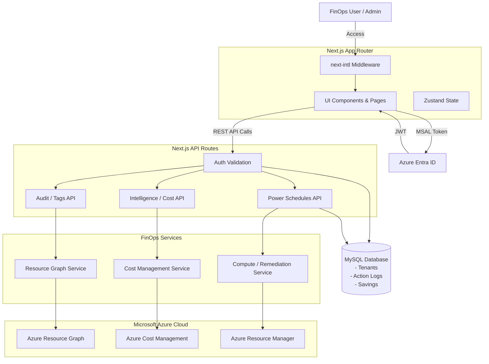

# CSCloudSolutions FinOps Platform 🚀

La Plataforma FinOps de CSCloudSolutions es una solución SaaS B2B automatizada construida sobre Next.js App Router (React) orientada a la gobernanza cloud, auditoría (Omni-Scan), y optimización financiera para entornos empresariales en Microsoft Azure.

---

## 🏗️ Architecture

El sistema opera bajo una arquitectura de 3 capas fuertemente tipada y asegurada con autenticación basada en identidades de Azure:

1. **Frontend (App Router)**: Interfaz de usuario dinámica construida con React, Tailwind CSS, y Zustand (manejo de estado). Adaptada con internacionalización (`next-intl`) y soporte de temas (Dark Mode).
2. **API Layer (Next.js Edge/Node)**: Rutas backend que orquestan de manera segura la validación de acceso (`@azure/msal-react` / `@azure/msal-node`) y exponen lógica de negocio estructurada.
3. **Services & Azure SDK**: Capa de servicios inyectados (`src/services/`) que interactúan directamente con Microsoft Azure (Resource Graph, Cost Management, Compute) y una base de datos MySQL para persistencia de datos multitenant (Logs, Historial de Ahorro, Tenants).

### Infrastructure Diagram (Mermaid)



---

## 📂 Project Directory Structure

```text
src/
├── app/
│   ├── [locale]/                 # Rutas de UI Internacionalizadas (App Router)
│   │   ├── admin/                # Configuración, Onboarding, Workbooks
│   │   ├── advisor/              # Integración de Azure Advisor
│   │   ├── cleanup/              # TTL Enforcement & Zombies
│   │   ├── governance/           # Power Schedules (VMs) y Gestión de Etiquetas
│   │   ├── intelligence/         # Facturación (Billing), Redes (Network), Rightsizing
│   │   └── overview/             # Maturity Scoring, Progreso Histórico
│   │   ├── layout.tsx            # Root Layout (Inyecta Providers y next-intl)
│   │   └── page.tsx              # Dashboard Principal
│   └── api/                      # Backend API Routes
│       ├── admin/
│       ├── advisor/
│       ├── audit/
│       ├── budgets/
│       ├── cleanup/
│       ├── consumption/
│       ├── intelligence/
│       ├── onboard/
│       ├── power/
│       ├── recommendations/
│       ├── remediation/
│       ├── subscriptions/
│       ├── tags/
│       └── tenants/
├── components/                   # Componentes React Reusables
│   ├── dashboard/                # Widgets de métricas, PowerSchedules
│   ├── layout/                   # Sidebar, Navbar, etc.
│   └── remediation/              # Modales de confirmación de acciones
├── context/                      # React Context Providers (ViewMode, etc.)
├── db/                           # Conexiones y utilidades de Base de Datos
├── lib/                          # Utilidades Generales (Ej. Script Generator)
├── services/                     # Lógica de Negocio y Consumo de Azure SDKs
└── store/                        # Estado global de Zustand (ActionLogs, etc.)
```

---

## 🔒 Authentication & Least Privilege

El sistema opera un modelo de seguridad multi-nivel estricto:

1. **User Identity**: El acceso de usuarios es manejado vía MSAL (`@azure/msal-react`). Los tokens JWT emitidos validan la identidad de la sesión en todos los llamados a la API en `src/app/api`.
2. **Service Principal (Platform Agent)**: Los Tenants hacen Onboarding ejecutando un script de PowerShell que crea un **Service Principal Least-Privilege**.
3. **Role-Based Access Control (RBAC)**:
   - `Reader`
   - `Cost Management Reader`
   - **Custom Remediation Role**: Restringido **EXCLUSIVAMENTE** a las siguientes acciones operacionales:
     - `Microsoft.Compute/virtualMachines/start/action`
     - `Microsoft.Compute/virtualMachines/deallocate/action`
     - `Microsoft.Compute/virtualMachines/restart/action`
     - `Microsoft.Resources/tags/write`
     - `Microsoft.Compute/disks/delete`
     - `Microsoft.Network/networkInterfaces/delete`
     - `Microsoft.Network/publicIPAddresses/delete`

---

## 🌐 Internacionalización (i18n)

Soportado por `next-intl`. Todo el contenido visible se gestiona dinámicamente mediante diccionarios en la carpeta `/messages`:
- `es.json` (Default)
- `en.json` (English)
- `pt-BR.json` (Português do Brasil)

Cualquier cambio de estructura de UI o adición de páginas debe registrarse en los diccionarios respectivos antes del despliegue.

---

## 📜 Development Protocol

**CRITICAL RULE: From this point forward, every time a new feature is added, an API route is modified, or a component is created, this README.md file MUST be updated to reflect the change. The Project Structure tree and the Mermaid Infrastructure diagram must be regenerated if the architecture changes.**

### The Core Loop
1. **Directivas (`/directivas/`)**: Antes de cualquier cambio, se consulta y se expande el archivo SOP (Standard Operating Procedure) correspondiente a la tarea.
2. **Ejecución**: El código debe ser generado y validado contra las reglas establecidas de Arquitectura y TypeScript (`npm run dev`, `npx tsc --noEmit`).
3. **Registro de Fallos**: Si un llamado a la API de Azure falla, la restricción debe plasmarse en el SOP para que el "Observer" de la plataforma mantenga una memoria viva del error.
4. **Documentación Automática**: Actualizar SIEMPRE el `README.md` (este documento) como fuente central y unificada de la verdad del ecosistema.
