# High-Level Design (HLD) — CSCloudSolutions FinOps Platform

**Versión:** 1.1  
**Fecha:** 2026-08-03  
**Autor:** Equipo de Arquitectura Cloud & FinOps — CSCloudSolutions  
**Estado:** Aprobado para Producción

---

## 1. Resumen Ejecutivo y Visión Estratégica

### 1.1 Propósito del Producto

**CSCloudSolutions FinOps Platform** es un SaaS empresarial multi-tenant, **Azure-only**, diseñado para proporcionar observabilidad financiera, optimización continua de costos, gobernanza automatizada y simulación de escenarios sobre la infraestructura cloud en Microsoft Azure.

La plataforma aborda la complejidad creciente del modelo de facturación cloud mediante la ingesta, normalización y análisis de telemetría de costos e inventario, permitiendo a los equipos de FinOps, Ingeniería y Finanzas tomar decisiones informadas basadas en datos unitarios y en tiempo real.

### 1.2 Alineación con el FinOps Framework

La arquitectura de CSCloudSolutions FinOps implementa de manera nativa las tres fases del ciclo de vida definido por el **FinOps Foundation Framework**:

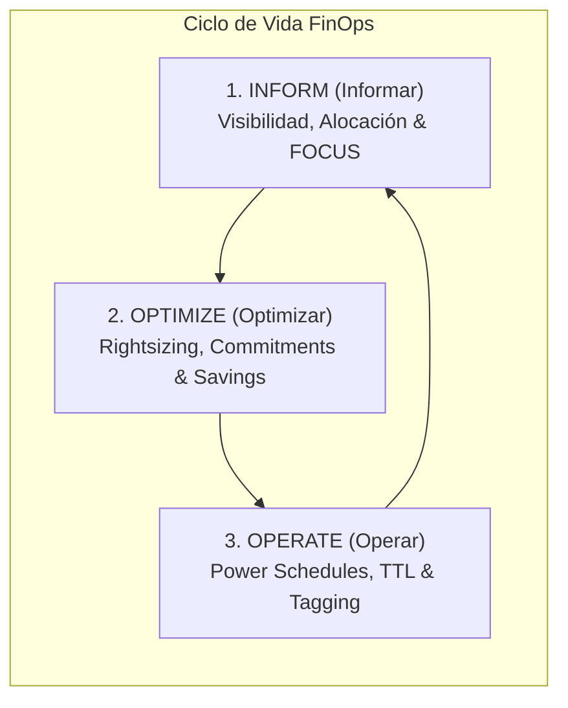

* **INFORM (Informar):** Asignación precisa de costos por Tenant, Centro de Costos, Suscripción y Tags. Telemetría de uso MTD (Month-To-Date), proyección a fin de mes, dashboards interactivos configurables y exportación estandarizada bajo el formato **FOCUS 1.0** (FinOps Open Cost and Usage Specification).
* **OPTIMIZE (Optimizar):** Identificación automatizada de recursos no utilizados o sobredimensionados (*Zombie Resources*), motor de rightsizing de Virtual Machines y App Services, recomendaciones de Azure Advisor, y gestión del ciclo de vida de Reservas e Savings Plans (RI/SP).
* **OPERATE (Operar):** Automatización de acciones de gobierno mediante apagado/encendido programado de VMs (*Power Schedules*), políticas de tiempo de vida de recursos (*TTL Policies*), cumplimiento de políticas de etiquetado (*Tag Inheritance & Enforcement*) y remediación guiada con RBAC.

### 1.3 Matriz de Tiers y Modelo de Negocio

El SaaS opera bajo un modelo de suscripción freemium/tiered con pago integrado vía **Paddle**:

| Capacidad / Dimensión | Tier Professional | Tier Business | Tier Enterprise |
|---|---|---|---|
| **Suscripciones Azure** | Hasta 2 | Hasta 3 | Ilimitadas |
| **Usuarios por Tenant** | Hasta 3 usuarios | Hasta 5 usuarios | Ilimitados |
| **Frecuencia de Sync** | 6 horas | 1 hora | 10 minutos (Real-time) |
| **Retención Histórica** | 12 meses | 36 meses | Personalizada |
| **Módulos Incluidos** | Core Dashboard, Cost MTD, Export Básico, +Anomalías Z-score, +Copilot IA básico | +Simulador What-If, +Cost Groups, +Remediación | Todo + SSO Enterprise + SLA 99.9% + Data Residency |
| **Autenticación** | Entra ID MSAL | Entra ID MSAL | Entra ID MSAL + WorkOS SAML/OIDC SSO |

---

## 2. Arquitectura Global de Sistema y Dominio

### 2.1 Diagrama de Arquitectura de Alto Nivel (C4 - System Context & Containers)

La plataforma se despliega en una arquitectura de **Stamp Regional** dentro de Microsoft Azure (región primaria `westus2`), protegida perimetralmente por **Cloudflare** para WAF, CDN y gestión de DNS.

```mermaid
graph TB
    subgraph "Perímetro Externo & CDN"
        U["Usuarios / Navegadores Web"]
        CF["Cloudflare (WAF + CDN + Dynamic Routing)"]
    end

    subgraph "Azure Regional Stamp (westus2)"
        subgraph "VNet (10.0.0.0/16)"
            subgraph "Apps Subnet (10.0.1.0/24)"
                CAE["Azure Container Apps Environment"]
                WEB["Web App Service Container (Next.js 16 Standalone)"]
                CRON["Container App Jobs (15 Cron Tasks Scheduled)"]
                MIG["Container App Job (DB Auto-Migration Runner)"]
            end

            subgraph "Private Endpoint Subnet (10.0.2.0/24)"
                PE_REDIS["Private Endpoint: Managed Redis"]
                PE_KV["Private Endpoint: Key Vault"]
                PE_STORAGE["Private Endpoint: Storage Account"]
            end

            subgraph "Database Subnet (10.0.3.0/24)"
                MYSQL[("Azure MySQL Flexible Server (B1ms, TLS 1.2)")]
            end
        end

        KV["Azure Key Vault (Secretos Infra & Tenant SPs)"]
        REDIS[("Azure Managed Redis (Balanced B3, HA)")]
        STORAGE["Azure Storage Account (Blobs, Reports, Exports)"]
        OBS["Azure Monitor / Log Analytics / App Insights"]
    end

    subgraph "APIs Nativas Azure (Tenants de Clientes)"
        ACM["Azure Cost Management API"]
        ARG["Azure Resource Graph API"]
        AAD["Azure Advisor API"]
        MSGRAPH["Microsoft Graph API (Users/Licenses/Entra)"]
        ARM["Azure Resource Manager (ARM REST API)"]
    end

    subgraph "Servicios Externos / Integraciones SaaS"
        PADDLE["Paddle Billing (Subscriptions & Webhooks)"]
        WORKOS["WorkOS (Enterprise SSO / SAML)"]
        GEMINI["Google Gemini API (Vercel AI SDK)"]
        ENTRA["Microsoft Entra ID (OIDC / OAuth 2.0)"]
    end

    U -->|"HTTPS / WSS"| CF
    CF -->|"Origin Shield / TLS"| WEB
    WEB -->|"MySQL Pool (TLS)"| MYSQL
    WEB -->|"Redis TLS (Port 6380)"| REDIS
    WEB -->|"Key Vault REST API"| KV
    WEB -->|"Blob SDK"| STORAGE
    CRON -->|"Internal Triggers"| WEB
    MIG -->|"SQL Migration Execution"| MYSQL

    WEB -->|"Cost Telemetry"| ACM
    WEB -->|"Inventory KQL"| ARG
    WEB -->|"Optimization Recs"| AAD
    WEB -->|"Identity & Licenses"| MSGRAPH
    WEB -->|"Resource Control & Actions"| ARM

    WEB -->|"Checkout & Billing"| PADDLE
    WEB -->|"SAML Auth"| WORKOS
    WEB -->|"AI Telemetry & Copilot"| GEMINI
    WEB -->|"User Auth & Tokens"| ENTRA

    WEB -.->|"Metrics & Traces"| OBS
    CRON -.->|"Job Execution Logs"| OBS
```

### 2.2 Desglose de Capas del Sistema

#### A. Capa de Presentación (Client Layer)
* **Framework UI:** React 19 / Next.js 16 (App Router) con Renderizado Servidor-Primero (RSC).
* **Internacionalización (i18n):** `next-intl` con soporte nativo y sincronizado para 3 idiomas (`es`, `en`, `pt-BR`), alcanzando 4,114 keys traducidas por idioma.
* **Componentes Interactivos:** Recharts para gráficos de tendencias/forecast, React Grid Layout para widgets editables, cmdk para Command Palette (`Cmd+K`), y Tailwind CSS 4 para diseño responsivo y accesible.

#### B. Capa de Aplicación y Backend (API & Business Logic)
* **Next.js App Router API Routes:** 238 endpoints REST integrados con validación de tipos TypeScript.
* **Services & Collectors Layer:** 26 servicios de negocio especializados (`anomalyDetectionService`, `reservationService`, `powerScheduleService`, `budgetService`, `governanceReportingService`, `remediationService`) y 29 módulos colectores agnósticos (`collectors/azure/billingService`, `resourceGraphService`, `advisorService`).
* **Protección Middleware:** Control estricto de acceso basado en roles (RBAC) y Tenants vía `requestAuth.ts` (`requireTenantAccess`, `requireTenantRole`, `requireTenantTier`, `requireSuperAdmin`).

#### C. Capa de Cómputo y Procesamiento Asíncrono (Workers & Cron Jobs)
* **Azure Container Apps:** Despliegue de la aplicación principal como un contenedor inmutable (Node.js 22 Alpine, Next.js standalone).
* **Container App Jobs:** 15 tareas programadas independientes (*cron jobs*) aisladas para ingesta de datos, precalentamiento de caché, evaluación de anomalías, backfill histórico, alertas de expiración y exportaciones estandarizadas.

#### D. Capa de Persistencia y Caché (Data & Security State)
* **Azure MySQL Flexible Server:** Persistencia relacional primaria en MySQL Flexible Server con TLSv1.2, motor InnoDB, collation `utf8mb4_unicode_ci` y pool de conexiones optimizado (`mysql2`).
* **Azure Managed Redis:** Caché de alto rendimiento (Balanced B3, HA) utilizando `ioredis` con patrón **Stale-While-Revalidate (SWR)** y locks distribuidos para deduplicación de consultas hacia Azure.
* **Azure Key Vault:** Custodia y aislamiento de secretos de infraestructura (credenciales DB/Redis/Cron) y Service Principals de los tenants de clientes (`tenant-{tenantId}-client-id` / `secret`).

---

## 3. Desglose de Capacidades FinOps

La plataforma estructura sus funciones en 4 módulos operativos principales:

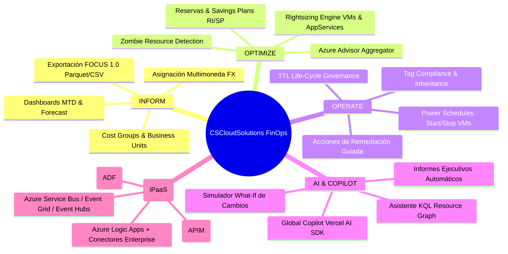

### 3.1 Módulo INFORM (Visibilidad y Asignación)
* **MTD & Daily Cost Tracking:** Cálculo exacto del gasto acumulado del mes (*Month-To-Date*), costo del día anterior (*Yesterday Cost*) y proyección matemática a cierre de mes basada en promedios ponderados y variaciones estacionales.
* **Multi-Currency & FX Engine:** Conversión dinámica entre monedas de origen de Azure (USD, EUR, BRL, ARS) con persistencia de tipos de cambio históricos en la tabla `FxRates`.
* **Cost Groups Customizables:** Agrupación lógica de recursos por unidades de negocio, aplicaciones o ambientes (Dev/Staging/Prod) sin modificar la infraestructura subyacente.
* **Estándar FOCUS 1.0:** Mapeador y exportador nativo compatible con la norma abierta FOCUS 1.0, permitiendo interoperabilidad y reporting estandarizado.

### 3.2 Módulo OPTIMIZE (Eficiencia y Ahorro)
* **Zombie Resources Scanner:** Detección automática de discos no adjuntados (*unattached Managed Disks*), IPs públicas sin asociar, Network Interfaces huérfanas, Snapshots obsoletos y Load Balancers vacíos.
* **Rightsizing Engine:** Motor analítico que cruza métricas de CPU/RAM/IOPS de ARM Monitor con costos de SKU para recomendar desescalados óptimos (*downgrades*) o cambios de familia de instancias.
* **Commitment Manager (RI / SP):** Cobertura y recomendaciones de compra/modificación de Reservas de Instancias (*Reserved Instances*) y Savings Plans con análisis de ROI y período de amortización.

### 3.3 Módulo OPERATE (Gobernanza y Automatización)
* **Power Scheduling:** Programación de apagado y encendido automático de máquinas virtuales no productivas fuera del horario laboral, calculando el ahorro estimado en USD.
* **Tag Governance & Inheritance:** Motor de verificación y heredado de etiquetas desde Resource Groups hacia Recursos hijo, con alertas de incumplimiento de política.
* **TTL Policy Enforcement:** Asignación de tiempo de vida máximo (*Time-To-Live*) a recursos temporales o de prueba, con flujo de notificación previa y eliminación automática o solicitada.
* **Remediation Actions Framework:** Sistema de acciones con aprobación (Delete, Deallocate, Downgrade, Retag) respaldado por `RemediationRequests` y registro auditables en `ActionLogs`.

### 3.4 Módulo AI & Copilot Assistant
* **Global Copilot Integrado:** Asistente conversacional basado en **Vercel AI SDK** y **Google Gemini**, capaz de interpretar consultas en lenguaje natural sobre costos y recursos ("¿Por qué subió el costo en la suscripción X este fin de semana?").
* **What-If Simulator:** Simulador de escenarios que proyecta el impacto económico de migraciones, apagados de cargas o compras de reservas antes de ejecutarlos en Azure.
* **AI Cost Analytics (Enterprise):** Vista de costo por modelo y tendencia de tokens para **Microsoft Foundry / Azure OpenAI**, priorizando tokens desde Azure Monitor (`ProcessedPromptTokens`, `GeneratedTokens`, `ProcessedInferenceTokens`) y fallback a costo agregado desde Cost Management cuando no hay desglose de tokens.
* **RBAC mínimo para AI Cost Analytics:** no introduce roles nuevos; reutiliza `Reader`, `Cost Management Reader`, `Monitoring Reader` y `Billing Reader` bajo principio de menor privilegio.

### 3.5 Módulo Integration Services (iPaaS)

* **Hub dedicado en Inteligencia:** `/intelligence/integration-services` con tabs para Logic Apps, APIM, Service Bus, Event Grid, Event Hubs y ADF.
* **Modelo operativo común:** cada tab expone metadatos transversales (suscripción, resource group, región, tags), costo acumulado/proyectado y estado de salud.
* **Logic Apps Enterprise Connectors:** separación explícita de conectores Standard vs Enterprise para priorizar impacto económico y operativo.
* **Consistencia UX FinOps/CMP:** filtros base, columnas base, orden A-Z/Z-A/costo, paginado 15/30/45/60 y columnas redimensionables.

---

## 4. Modelo Multi-Tenancy, Tiering y Gobernanza de Datos

### 4.1 Arquitectura Multi-Tenant

CSCloudSolutions FinOps utiliza un modelo de **Base de Datos Compartida con Discriminador por Tenant (`tenantId`)** y **Aislamiento Lógico Estricto**:

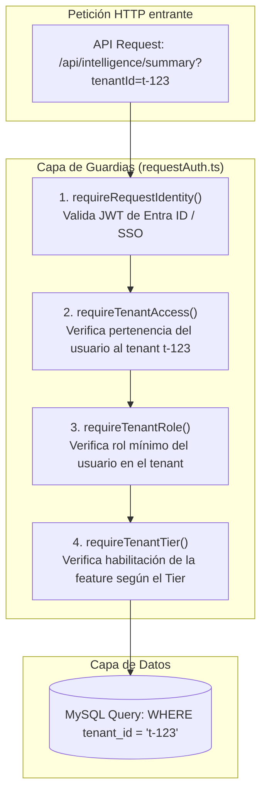

* **IDOR Prevention:** La regla de ESLint `local/no-unauth-tenant-id` evalúa en CI/CD que **toda ruta de API** que consuma `tenantId` contenga obligatoriamente un guard de `requestAuth.ts`.
* **Aislamiento de Secretos:** Cada tenant almacena sus credenciales de Service Principal de forma aislada en Azure Key Vault bajo la nomenclatura `tenant-{tenantId}-client-id` y `tenant-{tenantId}-client-secret`.

### 4.2 Patrón de Despliegue Stamp-Based y Data Residency

Para cumplir con regulaciones internacionales de residencia de datos (GDPR, LGPD, normativas bancarias), la plataforma implementa una infraestructura basada en **Stamps Regionales**:

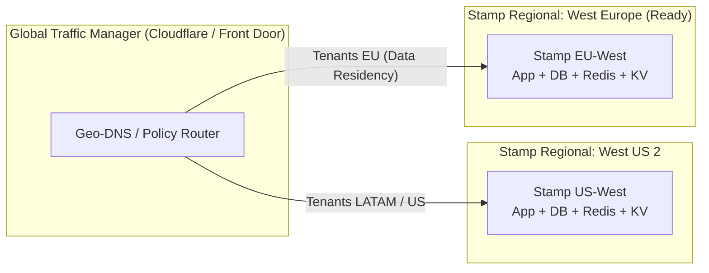

* **Multi-Stamp Ready:** La variable `var.stamps` en Terraform permite aprovisionar réplicas completas de la infraestructura en diferentes regiones de Azure.
* **Residencia Configurable:** El campo `Tenants.data_residency` rige la ubicación física de las tablas de datos del tenant y su almacenamiento de blobs asociado.

---

## 5. Modelo de Seguridad, Identidad y Cumplimiento

### 5.1 Autenticación y Autorización (RBAC)

La plataforma soporta autenticación dual transparente:
1. **Microsoft Entra ID (MSAL Browser/React):** Autenticación nativa OIDC/OAuth 2.0. El token JWT emitido por Entra ID es validado en backend contra las claves públicas de Microsoft, verificando issuer, audience y tenant ID.
2. **WorkOS Enterprise SSO:** Autenticación SAML 2.0 / OIDC dedicada para clientes Enterprise con proveedores de identidad corporativos (Okta, Ping Identity, Azure AD Enterprise).

#### Matriz de Roles dentro del Tenant

| Rol Tenant | Permisos de Lectura | Configurar Budgets/Tags | Ejecutar Remediación | Administrar Usuarios / Credentials |
|---|---|---|---|---|
| **Reader** | ✅ Sí | ❌ No | ❌ No | ❌ No |
| **Analyst** | ✅ Sí | ✅ Sí | ❌ No | ❌ No |
| **Operator** | ✅ Sí | ✅ Sí | ✅ Sí (Aprobadas) | ❌ No |
| **Admin / Owner** | ✅ Sí | ✅ Sí | ✅ Sí (Directas) | ✅ Sí |

### 5.2 Hidratación y Aislamiento de Secretos (Key Vault Architecture)

Ningún secreto sensible (passwords de DB, claves de Redis, API keys de terceros, credenciales de Service Principals) existe en código ni en variables estáticas en disco.

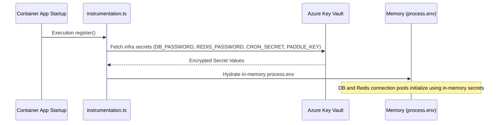

### 5.3 Headers de Seguridad y Protección Web

Configuración activa en `next.config.ts` y verificada en auditorías Checkov:
* `X-Frame-Options: DENY` (Anti-Clickjacking)
* `X-Content-Type-Options: nosniff` (Anti-MIME Sniffing)
* `Referrer-Policy: strict-origin-when-cross-origin`
* `Permissions-Policy: camera=(), microphone=(), geolocation=(), payment=(), usb=()`
* `Strict-Transport-Security: max-age=31536000; includeSubDomains; preload` (HSTS)
* **Content Security Policy (CSP):** Restricción de scripts, estilos, objetos y conexiones hacia orígenes explícitamente autorizados (Cloudflare, Paddle, Microsoft, Google Fonts).

---

## 6. Arquitectura de Integraciones Cloud (Azure Platform)

La plataforma interactúa de manera no invasiva con los tenants de los clientes mediante un **Azure Service Principal (App Registration)** configurado con los permisos mínimos necesarios (Principio de Menor Privilegio):

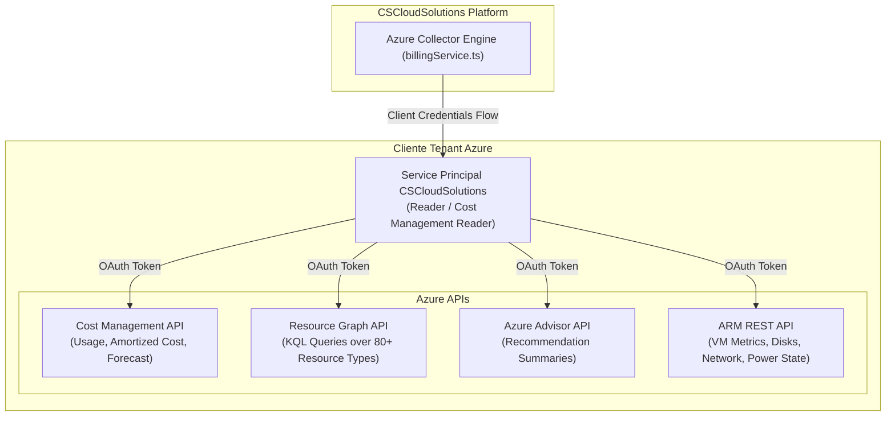

### 6.1 Roles Azure Mínimos Requeridos en Tenant de Cliente

| Alcance / Scope | Rol Azure Mínimo | Propósito |
|---|---|---|
| **Subscription / Management Group** | `Cost Management Reader` | Ingesta de datos de costos MTD, históricos y presupuestos |
| **Subscription** | `Reader` | Lectura de inventario vía Resource Graph y métricas ARM |
| **Resource Group (Opcional)** | `Desktop Virtualization Power On Off` / Custom Role | Apagado/Encendido de VMs en Power Schedules |

### 6.2 Resiliencia y Manejo de Rate Limits (429 Throttling)

El servicio `billingService.ts` implementa patrones avanzados de resiliencia frente a los límites de frecuencia de Azure Cost Management API:
* **Backoff Exponencial con Jitter:** Reintentos automáticos configurados hasta 5 niveles con retraso aleatorio.
* **Single-Flight Lock via Redis:** Deduplicación de peticiones concurrentes para el mismo tenant y ventana temporal.
* **Cache SWR:** Entrega de datos desde caché Redis mientras se revalida en segundo plano para evitar "cache stampede".

---

## 7. Modelo de Datos y Estrategia de Persistencia

### 7.1 Resumen del Esquema (84 Tablas Relacionales)

El esquema MySQL comprende 84 tablas agrupadas por dominios funcionales:

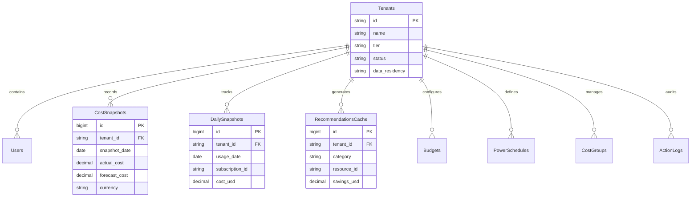

### 7.2 Estrategia de Caché de 3 Nivel con Redis

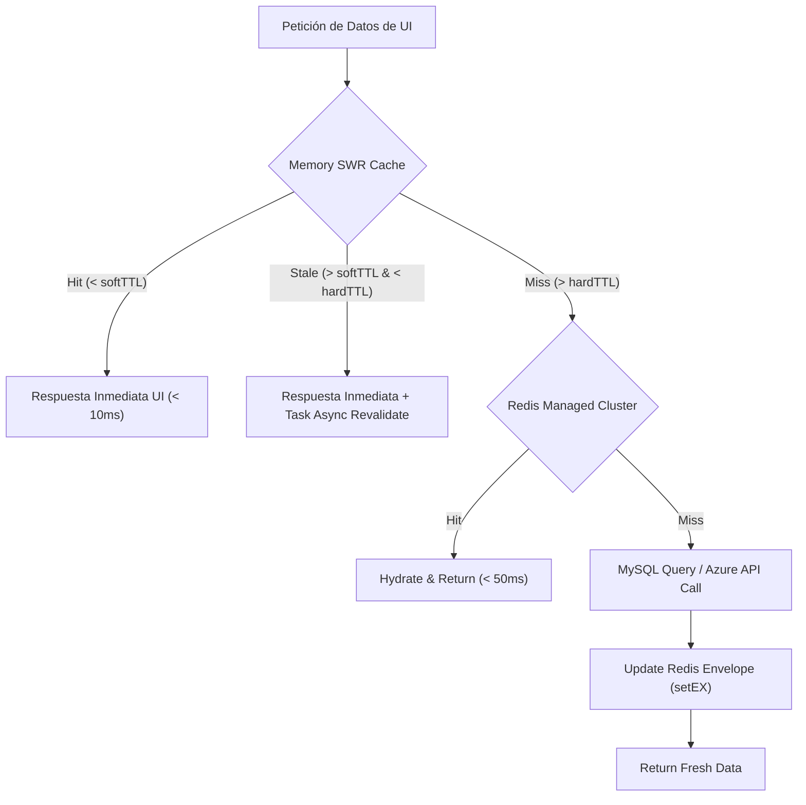

---

## 8. Flujos Operativos y Diagramas de Secuencia HLD

### 8.1 Flujo de Onboarding de Tenant Azure

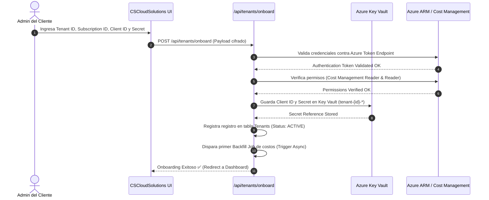

### 8.2 Flujo de Recolección y Procesamiento de Costos MTD

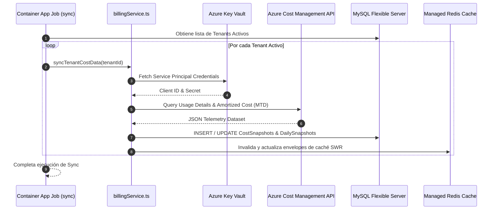

---

## 9. Operación, Alta Disponibilidad, Resiliencia y CI/CD

### 9.1 Canalización de CI/CD (GitHub Actions)

El ciclo de integración y despliegue continuo se encuentra completamente automatizado mediante GitHub Actions:

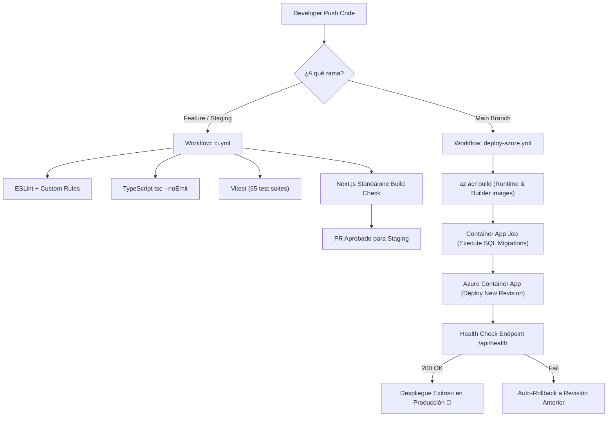

### 9.2 Resiliencia y Estrategia de Disaster Recovery (DR)

* **MySQL Flexible Server:** Automated Backups con retención configurable de 30 días, Point-In-Time Restore (PITR) y arquitectura regional con réplica de lectura opcional.
* **Stateless Application Layer:** La capa Web Container Apps es completamente desprovista de estado (*stateless*). La pérdida de una instancia de contenedor provoca el auto-healing de Azure en < 15 segundos.
* **Caché Transient:** La pérdida del cluster Redis no interrumpe el servicio; la plataforma degrada suavemente a consultas directas contra MySQL y reintenta la conexión de Redis.

---

## 10. Hoja de Ruta de Arquitectura (Roadmap HLD)

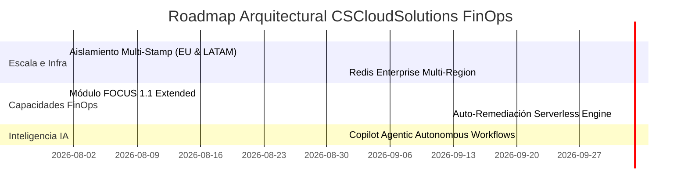

1. **Expansión Multi-Stamp (Q3 2026):** Despliegue del Stamp `westeurope` para atención regional europea con cumplimiento LGPD/GDPR estricto.
2. **Auto-Remediación Autónomamente Guiada (Q4 2026):** Evolución del motor de remediación a un modelo basado en agentes autónomos controlados por políticas de riesgo configurables por el usuario.
3. **Soporte Amortizado FOCUS 1.1 (Q3 2026):** Incorporación completa de especificaciones FOCUS 1.1 para facturación unificada de compromisos multinivel.

---

*CSCloudSolutions FinOps Platform — High-Level Design Architecture Document*  

---

## 11. Addendum 2026-08-03 — SuperAdmin Operations & Commercial Governance

### 11.1 SaaS Operations Control Plane (SuperAdmin)

Se incorpora un nuevo módulo de operaciones globales (`/superadmin/ops`) con
visión consolidada de estado de plataforma:

- Salud de componentes SaaS (API, DB, Sync, colas y alertas).
- Estado de crons críticos por frescura de ejecución y severidad.
- Cobertura de canales de notificación para tenants administrados.
- Dispatch de notificaciones operativas desde un único punto de control.

Este módulo opera bajo principio de menor privilegio con acceso exclusivo
`SUPERADMIN` y no expone datos de tenant a usuarios no autorizados.

### 11.2 Cron Reliability Layer

Se agrega una capa de observabilidad persistente para jobs programados:

- Registro de ejecución por cron (estado, duración, resumen y detalle).
- Evaluación de frescura contra expectativa de cadencia (on-time vs late).
- Señal temprana para detección de degradación operacional sin depender de logs
  efímeros del contenedor.

### 11.3 Commercial Metadata Governance

El dominio de gestión de tenants amplía metadatos comerciales por cliente:

- **Vendedor/Referido** (`sales_referrer`)
- **Comisión (%)** (`sales_commission_pct`)

Ambos campos quedan restringidos a operación de SuperAdmin y auditados
(`updated_by`, `updated_at`) para trazabilidad financiera interna.

## 12. Addendum 2026-08-22 — Dominio de Gobernanza Operativa y Ciclo de Vida del Gasto

### 12.1 Dos dominios nuevos en el mapa de capacidades

La plataforma incorpora dos dominios funcionales que cierran el ciclo entre *detectar* un desperdicio y
*eliminarlo* con control:

- **Limpieza de Nube (Cloud Waste Lifecycle).** Detección continua de recursos huérfanos, gobernanza de
  ciclo de vida por TTL y auditoría de backups sin origen. Cubre el desperdicio duro —lo que factura sin
  entregar valor— y el blando —lo que factura sin dueño identificable.
- **Gobernanza Operativa.** Automatización de energía de cómputo, prevención de costos desde el
  aprovisionamiento con Azure Policy, reporting ejecutivo de postura, resiliencia arquitectónica, ciclo de
  vida de credenciales de identidad y flujo de aprobación de cambios.

### 12.2 Principio arquitectónico: prevención antes que remediación

El dominio de Gobernanza se ordena sobre tres momentos del gasto, en orden de valor decreciente:

1. **Prevenir** (Azure Policy con efecto `Deny`): el costo indeseado nunca se aprovisiona. Es el único
   mecanismo con ahorro del 100% y esfuerzo operativo cero por recurso.
2. **Corregir automáticamente** (`Modify` / `DeployIfNotExists`, herencia de etiquetas, apagado programado):
   el costo existe pero se ajusta sin intervención humana por caso.
3. **Remediar con aprobación** (borrado, redimensionamiento, cambio de tier): exige juicio humano y por lo
   tanto pasa por el flujo de cuatro ojos.

Una política `Deny` **no revierte lo ya desplegado**: los recursos anteriores a la asignación aparecen como no
conformes hasta corregirse. Esa asimetría es la razón de que los tres momentos convivan y no se sustituyan.

### 12.3 Control de cambios de infraestructura (four-eyes)

Todo cambio irreversible sobre Azure originado en la plataforma atraviesa `RemediationApprovals`:

```
Motor de optimización ──> Petición PENDING ──> Revisión de un segundo operador
                                                      │
                                    ┌─────────────────┴─────────────────┐
                                  APPROVE                            REJECT
                                    │                                  │
                        (opcional) Snapshot previo            Motivo obligatorio
                                    │                          + notificación
                             Llamada a ARM
                                    │
                    ┌───────────────┴───────────────┐
              Succeeded                          Failed
              → APPROVED                      → FAILED
        (suma al ahorro liberado)      (no suma; traza del error)
```

La separación entre `APPROVED` y `FAILED` es deliberada a nivel de arquitectura: **el ahorro reportado al
negocio sólo incluye lo que Azure confirmó**. Una aprobación que ARM rechazó no liberó un peso, y contarla
inflaría la métrica que sostiene el caso de negocio de la plataforma.

### 12.4 Postura de seguridad e identidad

- **Ciclo de vida de credenciales de Entra ID.** Auditoría de secretos y certificados de App Registrations con
  alertas multi-umbral previas al vencimiento. La rotación es aditiva por diseño —crea sin revocar— porque
  revocar y migrar en un solo paso es la causa habitual del incidente que el módulo previene.
- **Auditoría de SIDs huérfanos.** Asignaciones RBAC cuyo principal ya no existe en el directorio. No otorgan
  acceso a nadie hoy, pero si el `objectId` se reutiliza el permiso revive sobre otro principal.
- **Score de Seguridad Financiera.** Índice ponderado de cuatro pilares (Azure Policy 40%, etiquetas 30%, RBAC
  20%, zombis 10%) con **redistribución de peso de los pilares no medibles**: la plataforma nunca afirma una
  postura que no pudo verificar.

### 12.5 Resiliencia como decisión económica

El módulo de Alta Disponibilidad presenta cada brecha con su **SLA vigente, el alcanzable y el costo del
salto**, traducidos a minutos de caída mensual. La decisión de redundancia deja de ser técnica y pasa a ser
una comparación explícita entre minutos de indisponibilidad y dólares por mes, que es la conversación que el
negocio puede sostener.

Se distingue entre lo aplicable por API (SKU de IP pública, asociación de backup) y lo que exige rediseño
—zonas, Availability Sets, geo-redundancia—: prometer un botón donde hace falta recrear un recurso erosiona la
confianza en toda la herramienta.

### 12.6 Restricción de arquitectura reafirmada

Un componente cliente **no puede importar de un servicio que toque la base de datos**, ni siquiera una función
pura alojada allí: el grafo de imports arrastra el driver de MySQL al bundle del navegador. Las funciones
compartidas entre servidor y cliente viven en los archivos de tipos o en `src/lib/`.

### 12.7 Gobernanza de Etiquetas y Hardening de Secretos de Infraestructura

- **Gobernanza de Etiquetas (Azure Tag Governance Engine).** Auditoría automatizada de políticas obligatorias (`Environment`, `Role`, `CostCenter`, `Department`), propagación de etiquetas desde Grupos de Recursos con Merge Seguro e inferencia basada en IA para autocompletar metadatos faltantes.
- **Key Vault Network Isolation.** Aislamiento perimetral completo del almacén de secretos (`cscs-finops-prod-wus2-kv`) mediante Private Endpoint (`privatelink.vaultcore.azure.net`) y directiva `default_action = Deny`, eliminando vectores de acceso público y protegiendo credenciales de tenants en tránsito y reposo.

*© 2026 CSCloudSolutions. Todos los derechos reservados. — CONFIDENCIAL*
