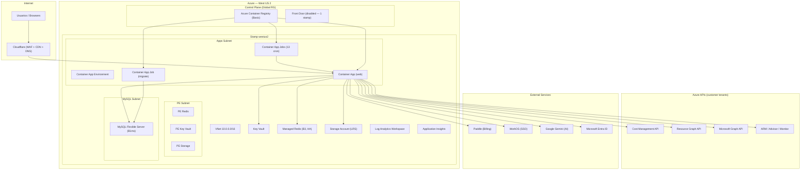
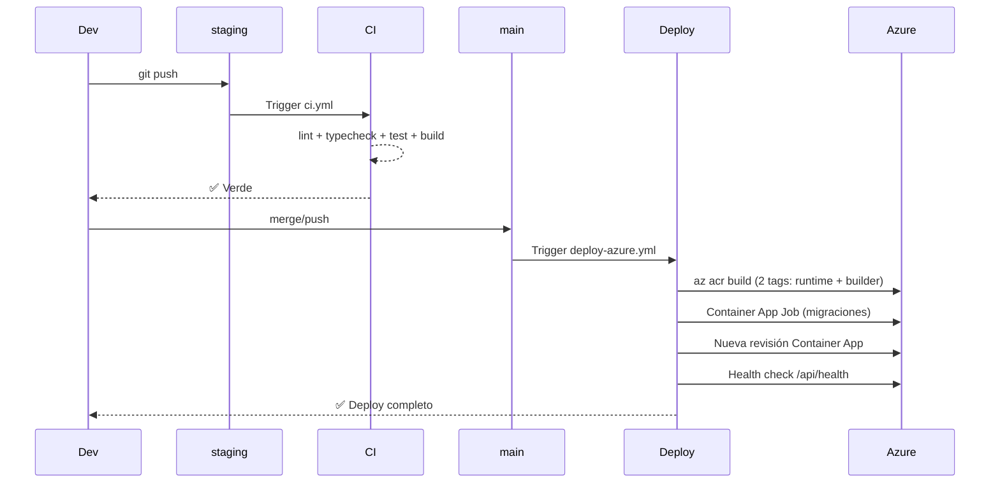
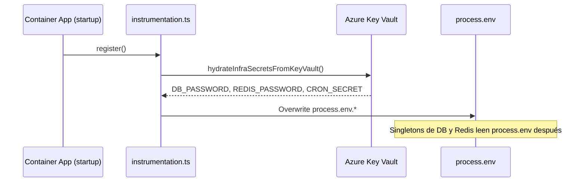
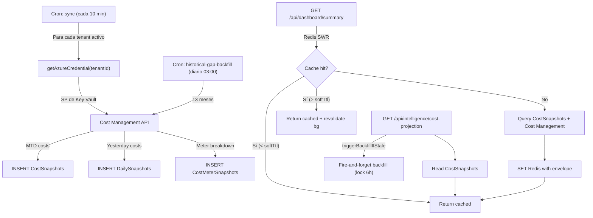

# Low-Level Design (LLD) — CSCloudSolutions FinOps Platform

**Versión:** 1.1  
**Fecha:** 2026-08-03  
**Autor:** Relevamiento automatizado sobre el codebase en `main` (commit post-PR #99)

---

## 1. Resumen Ejecutivo

CSCloudSolutions FinOps es una plataforma SaaS **Azure-only**, multi-tenant, diseñada para dar visibilidad, optimización y gobernanza del gasto en la nube de Microsoft Azure. Corre sobre **Next.js 16** (App Router, TypeScript) con backend integrado (API routes), persistencia en **MySQL Flexible Server** y caché/locks en **Azure Managed Redis (Balanced B3, HA)**.

### Métricas del codebase

| Dimensión | Valor |
|---|---|
| Líneas de código fuente (src/) | **~99,500** |
| Archivos TypeScript/TSX | **676** |
| Rutas API (route.ts) | **238** |
| Páginas de UI (page.tsx) | **127** (120 únicas bajo `[locale]/`) |
| Tablas de BD | **84** |
| Migraciones SQL | **57** |
| Tests (Vitest) | **65 archivos**, ~592 tests |
| Módulos Terraform | **18** |
| Líneas de IaC (.tf) | **~5,500** |
| Recursos de infra gestionados | **83+** |
| Variables de entorno (.env) | **72** |
| Idiomas (i18n) | **3** (es, en, pt-BR) — 4,114 strings c/u |

---

## 2. Arquitectura de Alto Nivel



### Patrón de despliegue: Stamp-based

La infra usa un patrón de **stamps** (sellos regionales). Hoy existe un único stamp (`westus2`). La key del mapa es el valor de `Tenants.data_residency`. Agregar un segundo stamp requiere:
1. Declarar la entrada en `var.stamps`
2. Habilitar Front Door (`frontdoor_enabled = true`)
3. Configurar geo-routing en `stamp_geo_routing`

---

## 3. Stack Tecnológico

### 3.1 Frontend

| Tecnología | Versión | Propósito |
|---|---|---|
| Next.js | 16.2.7 | Framework full-stack (App Router, standalone output) |
| React | 19.2.4 | UI library |
| TypeScript | ^5 | Type safety |
| Tailwind CSS | ^4 | Styling |
| next-intl | ^4.13.0 | i18n (3 idiomas) |
| Recharts | ^3.8.1 | Gráficos y visualizaciones |
| Lucide React | ^1.17.0 | Iconos |
| SWR | ^2.4.2 | Data fetching client-side |
| Zustand | ^5.0.14 | State management |
| React Grid Layout | ^2.2.3 | Dashboard widgets configurables |
| cmdk | ^1.1.1 | Command Palette |
| MSAL Browser/React | ^5 | Auth con Microsoft Entra ID |

### 3.2 Backend

| Tecnología | Versión | Propósito |
|---|---|---|
| Next.js API Routes | 16.x | 238 endpoints REST |
| mysql2 | ^3.22.4 | Pool de conexiones a MySQL |
| ioredis | ^5.11.1 | Cliente Redis (TLS-aware) |
| jose / jsonwebtoken | ^6 / ^9 | JWT validation |
| @azure/* SDKs | Varios | Cost Management, Resource Graph, ARM, Graph, Key Vault, Identity, Storage |
| AI SDK (Vercel) | ^6.0 | Abstracción multi-proveedor IA |
| decimal.js | ^10.6.0 | Aritmética de precisión para costos |
| Paddle SDK | ^1.6.4 | Billing SaaS |
| WorkOS Node | ^10.7.0 | Enterprise SSO |

### 3.3 Infraestructura

| Componente | Recurso Azure | SKU/Tier |
|---|---|---|
| Compute | Container Apps | Consumption plan |
| Base de datos | MySQL Flexible Server | B1ms |
| Cache/Locks | Managed Redis | Balanced B3, HA |
| Secretos | Key Vault | Standard |
| Blobs | Storage Account | Standard LRS |
| Observabilidad | Log Analytics + App Insights | — |
| Registry | Container Registry | Basic |
| CDN/WAF | Cloudflare (externo) | — |
| IaC | Terraform | >= 1.8, azurerm ~> 4.0 |

---

## 4. Modelo de Datos

### 4.1 Esquema: 84 tablas

El esquema se gestiona vía **migraciones SQL incrementales** en `migrations/`. El runner ([migrations.ts](file:///Users/manuelchavez/Documents/FinOpsProyect/src/modules/storage/migrations.ts)) las aplica automáticamente en `initializeDatabase()`.

**Tablas core por dominio:**

| Dominio | Tablas principales |
|---|---|
| **Tenancy** | `Tenants`, `Users`, `TenantSSO`, `TenantDelegations`, `TenantProviderTransitions` |
| **Cost Data** | `CostSnapshots`, `cost_snapshots`, `CostMeterSnapshots`, `CostCategorySnapshots`, `DailySnapshots`, `AICostSnapshots` |
| **Optimization** | `RecommendationsCache`, `SavingsHistory`, `Anomalies`, `HARecommendations`, `AppServiceRecommendations`, `SqlDbRecommendations`, `StorageRecommendations`, `VmssRecommendations` |
| **Budgets** | `Budgets`, `TenantMonthlyBudgets`, `CostCenterBudgets`, `AlertRules` |
| **Governance** | `TaggingPolicies`, `ExpiringCredentials`, `PowerSchedules`, `TtlPolicies`, `TtlDeletions`, `AllocationRules` |
| **Cost Groups** | `CostGroups`, `CostGroupResourceGroups` |
| **Billing** | `BillingTransactions`, `MarketplaceEvents`, `MACCCommitments` |
| **Auth/Security** | `AuthTokens`, `SSOSessions`, `MfaChallenges`, `LegalAcceptances`, `PublicApiKeys`, `MCPApiKeys` |
| **Support** | `SupportTickets`, `SupportTicketMessages`, `SupportTicketAttachments` |
| **Notifications** | `Notifications`, `NotificationChannels`, `NotificationLog` |
| **Platform** | `GlobalSettings`, `PlatformIncidents`, `PlatformStatusSnapshots`, `PlatformAiUsage`, `SystemAlerts`, `LoadTestRuns` |
| **Open Data** | `OpenDataServices`, `OpenDataRegions`, `OpenDataResourceTypes`, `OpenDataPricingUnits`, `OpenDataCommitmentEligibility`, `OpenDataSyncState` |
| **Onboarding** | `OnboardingProgress`, `SignupEvents`, `AcademyProgress` |
| **Data Residency** | `DataResidencyChanges` |
| **FX** | `FxRates`, `UserCurrencyPreference`, `PricingUnits` |
| **FOCUS** | `FocusLineItems`, `FocusExportSchedules` |
| **Analytics** | `BusinessMetrics`, `BusinessMetricsConfig`, `CopilotUsage` |
| **Audit** | `ActionLogs`, `AiCache`, `DataPipelineEvents`, `RemediationRequests`, `RecommendationActions` |

### 4.2 Pool de Conexiones

- **Driver:** `mysql2/promise` con pool singleton vía `globalThis` (evita múltiples pools en hot-reload de dev).
- **Connection limit:** configurable vía `DB_POOL_LIMIT` (default 10).
- **TLS:** habilitado en prod vía `DB_SSL=true` (TLSv1.2, `rejectUnauthorized: true`).
- **Collation:** `utf8mb4_unicode_ci` (Terraform; **no** `utf8mb4_0900_ai_ci` — divergencia causa `ER_FK_INCOMPATIBLE_COLUMNS`).

### 4.3 Redis

- **Driver:** `ioredis` con TLS condicional (`REDIS_TLS=true` en prod).
- **Singleton** vía `globalThis`.
- **Puerto:** 6380 (TLS) / 6379 (plain).
- **Patrones de cache:**
  - **Simple TTL:** `getWithCache(key, fetcher, ttl)` — lookup → fetch → set EX.
  - **Stale-While-Revalidate:** `getWithStaleWhileRevalidate(key, fetcher, ttl, softTtl, dynamicTtl)` — envelope `{__sw, t, data}` con soft/hard TTL y deduplicación in-flight.
  - **Invalidación:** `invalidateCache(...keys)`, `invalidateCachePattern(glob)`.

---

## 5. Seguridad y RBAC

### 5.1 Autenticación

La plataforma soporta **dos mecanismos** de autenticación:

1. **Microsoft Entra ID (MSAL):** Flujo principal. El frontend obtiene un token MSAL y lo envía como `Authorization: Bearer <token>`. El backend valida el JWT contra OpenID Connect metadata de Microsoft, verifica `tid`, `aud`, `iss`, `exp`, y extrae claims.

2. **Enterprise SSO (WorkOS):** Para tenants Enterprise con SSO configurado. Flujo OAuth/SAML vía WorkOS.

**Guard chain** (en [requestAuth.ts](file:///Users/manuelchavez/Documents/FinOpsProyect/src/lib/requestAuth.ts)):

| Guard | Qué verifica |
|---|---|
| `requireRequestIdentity` | Token válido, claims básicos, rechaza MSA consumers (`9188040d-…`) |
| `requireTenantAccess` | Identity + usuario pertenece al tenant solicitado |
| `requireTenantRole` | TenantAccess + rol mínimo (Admin/Owner) |
| `requireTenantTier` | TenantAccess + tier del tenant ≥ tier requerido |
| `requireSuperAdmin` | Identity + `system_role = SUPERADMIN` |

**Protección IDOR:** La regla ESLint `local/no-unauth-tenant-id` en CI bloquea cualquier ruta que lea `tenantId` sin pasar por un guard.
Los branches de datos demo (`isMockTenant`) se ejecutan únicamente después del guard correspondiente; los mocks no son una frontera de autorización ni pueden devolver datos a un tenant no autorizado.

### 5.2 Modelo de Tiers

```
Essential (1) < Professional (2) < Business (3) < Enterprise (4)
```

Cada tier tiene **límites de uso** y **features gated**:

| Límite | Essential | Pro | Business | Enterprise |
|---|---|---|---|---|
| Suscripciones Azure | 1 | 5 | 20 | ∞ |
| Usuarios | 1 | 5 | 20 | ∞ |
| Features | Básicas | +Anomalías, +Copilot | +Simulador, +Cost Groups, +Remediation | Todo |

### 5.3 Cron Jobs — Autenticación por `CRON_SECRET`

17 cron jobs autenticados con `Authorization: Bearer $CRON_SECRET`:

| Job | Frecuencia | Propósito |
|---|---|---|
| `sync` | cada 10 min | Sincroniza costos de Azure Cost Management con deadline cooperativo por tenant; al vencer aborta consultas, reintentos y evita escrituras o invalidaciones tardías |
| `prewarm-dashboard` | cada 10 min | Pre-cachea datos del dashboard |
| `prewarm-databases` | cada 15 min | Pre-cachea diagnósticos de BD y métricas Redis |
| `prewarm-compute` | cada 15 min | Pre-cachea workloads de cómputo |
| `anomaly-detection` | diario 04:00 | Detección de anomalías de costo |
| `historical-gap-backfill` | diario 03:00 | Backfill de datos históricos |
| `power-schedules` | cada hora | Ejecuta encendido/apagado programado |
| `cost-sync-staleness-check` | diario | Alerta sobre datos desactualizados |
| `credential-expiry-alerts` | diario | Alerta creds por vencer |
| `focus-export-daily` | diario | Genera exports FOCUS |
| `open-data` | semanal | Sincroniza datos abiertos de Azure |
| `status-snapshot` | cada 5 min | Status page snapshot |
| `subscription-expiry` | diario | Alertas de expiración |
| `support-attachments-cleanup` | diario | Limpieza de adjuntos viejos |
| `trial-expiry` | diario | Expira trials |
| `ttl-expiry-alerts` | diario | Alertas TTL |

> **Nota:** Los crons corren en **GMT-3** (`cron_timezone_offset_hours = -3`), no UTC.

### 5.4 Headers de Seguridad

Configurados en [next.config.ts](file:///Users/manuelchavez/Documents/FinOpsProyect/next.config.ts):

- `X-Frame-Options: DENY`
- `X-Content-Type-Options: nosniff`
- `Referrer-Policy: strict-origin-when-cross-origin`
- `Permissions-Policy: camera=(), microphone=(), geolocation=(), payment=(), usb=()`
- `Strict-Transport-Security: max-age=31536000; includeSubDomains; preload` (solo prod)
- **CSP** completa con `default-src 'self'`, dominios permitidos para Paddle, Microsoft, Google Fonts, Cloudflare Insights.

---

## 6. Capa de Servicios (Negocio)

### 6.1 Services (26 archivos)

Los servicios viven en `src/services/` y encapsulan lógica de dominio. Los route handlers los invocan; nunca la UI directamente.

**Top 10 por complejidad:**

| Servicio | Líneas | Dominio |
|---|---|---|
| [anomalyDetectionService](file:///Users/manuelchavez/Documents/FinOpsProyect/src/services/anomalyDetectionService.ts) | 374 | Z-score anomaly detection |
| [reservationService](file:///Users/manuelchavez/Documents/FinOpsProyect/src/services/reservationService.ts) | 348 | RI/SP management |
| [powerScheduleService](file:///Users/manuelchavez/Documents/FinOpsProyect/src/services/powerScheduleService.ts) | 321 | VM start/stop scheduling |
| [haService](file:///Users/manuelchavez/Documents/FinOpsProyect/src/services/haService.ts) | 259 | High Availability assessment |
| [budgetService](file:///Users/manuelchavez/Documents/FinOpsProyect/src/services/budgetService.ts) | 241 | Azure budgets CRUD |
| [tagInheritanceService](file:///Users/manuelchavez/Documents/FinOpsProyect/src/services/tagInheritanceService.ts) | 186 | Tag compliance + remediation |
| [governanceReportingService](file:///Users/manuelchavez/Documents/FinOpsProyect/src/services/governanceReportingService.ts) | 184 | Governance score + report |
| [remediationService](file:///Users/manuelchavez/Documents/FinOpsProyect/src/services/remediationService.ts) | 179 | Delete/deallocate/downgrade VMs |
| [costGroupDetailMetricsService](file:///Users/manuelchavez/Documents/FinOpsProyect/src/services/costGroupDetailMetricsService.ts) | 168 | Cost group analytics |
| [snapshotService](file:///Users/manuelchavez/Documents/FinOpsProyect/src/services/snapshotService.ts) | 167 | Daily cost snapshots |

### 6.2 Modules (29 archivos)

Los módulos viven en `src/modules/` organizados en tres capas:

- **`collectors/azure/`** — Integraciones con SDKs de Azure (Cost Management, Resource Graph, Advisor, Graph, Log Analytics, Container Apps, Cosmos DB, etc.)
- **`core/`** — Motores agnósticos (AI Provider, FOCUS mapper, rightsizing engine, KQL catalog)
- **`storage/`** — Persistencia (pool MySQL, migrations, region pool)

**El archivo más complejo:** [billingService.ts](file:///Users/manuelchavez/Documents/FinOpsProyect/src/modules/collectors/azure/billingService.ts) — **1,302 líneas**. Es el corazón del sistema: consulta Cost Management por Management Group y por suscripción, con fallback, reintentos con backoff exponencial, y diagnóstico de 429s.

---

## 7. Pipeline CI/CD

### 7.1 Workflows

| Workflow | Trigger | Qué hace |
|---|---|---|
| [ci.yml](file:///Users/manuelchavez/Documents/FinOpsProyect/.github/workflows/ci.yml) | Push a `staging`, PRs a `main`/`staging` | lint → typecheck → test (coverage) → build |
| [deploy-azure.yml](file:///Users/manuelchavez/Documents/FinOpsProyect/.github/workflows/deploy-azure.yml) | Push a `main` | Build ACR → migraciones (Job) → nueva revisión → health check |
| [terraform.yml](file:///Users/manuelchavez/Documents/FinOpsProyect/.github/workflows/terraform.yml) | PR que toque `infra/terraform/**` | Checkov + Infracost + `plan`. Apply manual con confirmación `APPLY-PROD` |
| [deploy.yml](file:///Users/manuelchavez/Documents/FinOpsProyect/.github/workflows/deploy.yml) | **Legacy** — solo manual | Deploy SSH al VPS. **Congelado.** |
| [restore-test.yml](file:///Users/manuelchavez/Documents/FinOpsProyect/.github/workflows/restore-test.yml) | Manual | Test de restauración MySQL |

### 7.2 Flujo de deploy



### 7.3 Docker

- **Multi-stage build** ([Dockerfile](file:///Users/manuelchavez/Documents/FinOpsProyect/Dockerfile)): `deps` → `builder` → `runner`
- **Base:** `node:22-alpine`
- **Output:** `standalone` (Next.js)
- **Sin BuildKit** (ACR Tasks no lo soporta)
- **Build args:** 8 variables `NEXT_PUBLIC_*` inyectadas en build-time
- **User:** `nextjs` (uid 1001, sin root)

---

## 8. Integraciones Externas

### 8.1 Azure (tenant del cliente)

| API | Propósito | Autenticación |
|---|---|---|
| Cost Management | Costos MTD, forecast, histórico | SP del cliente (credentials en Key Vault) |
| Resource Graph | Inventario de recursos | SP del cliente |
| Advisor | Recomendaciones de optimización | SP del cliente |
| Microsoft Graph | Usuarios, licencias, MFA, M365 | SP del cliente |
| ARM (Compute, Network, Monitor) | Rightsizing, métricas | SP del cliente |
| Entra ID | Autenticación de usuarios | MSAL (browser) |

### 8.2 Servicios Terceros

| Servicio | Propósito | Configuración |
|---|---|---|
| **Paddle** | Billing SaaS (checkout, subscriptions, webhooks) | `PADDLE_API_KEY`, `PADDLE_WEBHOOK_SECRET` en Key Vault |
| **WorkOS** | Enterprise SSO (SAML/OIDC) | `WORKOS_API_KEY`, `WORKOS_CLIENT_ID` |
| **Google Gemini** | AI reports, copilot, assessments | `GEMINI_API_KEY` |
| **Cloudflare** | CDN, WAF, DNS | Full strict SSL, dominio `finops.cscloudsolutions.com.ar` |

---

## 9. Secretos y Key Vault

### 9.1 Flujo de hidratación



### 9.2 Credenciales de tenant

Los Service Principals de cada tenant se almacenan en Key Vault como secrets con naming convention:
- `tenant-{tenantId}-client-id`
- `tenant-{tenantId}-client-secret`

El módulo [keyvault.ts](file:///Users/manuelchavez/Documents/FinOpsProyect/src/lib/keyvault.ts) implementa cache con soft/hard TTL para evitar llamadas excesivas.

---

## 10. Superficie de UI

### 10.1 Navegación principal (120 páginas)

| Sección | Páginas | Tier mínimo |
|---|---|---|
| Dashboard (raíz) | 1 | Essential |
| Intelligence | 42 | Essential → Enterprise |
| Admin | 32 | Essential → Enterprise |
| Overview | 9 | Essential → Professional |
| Governance | 7 | Essential → Enterprise |
| Legal | 5 | — (público) |
| Superadmin | 5 | SUPERADMIN |
| Cleanup | 4 | Essential → Business |
| Mobile | 4 | Essential |
| Academy | 1 | Essential |
| Demo | 1 | — |

### 10.2 Componentes destacados

| Componente | Líneas | Rol |
|---|---|---|
| [TenantProvider](file:///Users/manuelchavez/Documents/FinOpsProyect/src/components/TenantProvider.tsx) | 76,158 bytes | Context global de tenant, suscripciones, scope |
| [ZombieResourcesTable](file:///Users/manuelchavez/Documents/FinOpsProyect/src/components/ZombieResourcesTable.tsx) | 51,516 bytes | Tabla interactiva de recursos zombie |
| [AdvisorPanel](file:///Users/manuelchavez/Documents/FinOpsProyect/src/components/AdvisorPanel.tsx) | 42,830 bytes | Panel de Azure Advisor |
| [TagManager](file:///Users/manuelchavez/Documents/FinOpsProyect/src/components/TagManager.tsx) | 35,685 bytes | Gestión de tags Azure |
| [GlobalCopilot](file:///Users/manuelchavez/Documents/FinOpsProyect/src/components/GlobalCopilot.tsx) | 30,916 bytes | Copilot IA flotante |
| [Sidebar](file:///Users/manuelchavez/Documents/FinOpsProyect/src/components/Sidebar.tsx) | 30,172 bytes | Navegación lateral |
| [ClientShell](file:///Users/manuelchavez/Documents/FinOpsProyect/src/components/ClientShell.tsx) | 25,384 bytes | Shell principal client-side |
| [PricingPage](file:///Users/manuelchavez/Documents/FinOpsProyect/src/components/PricingPage.tsx) | 24,077 bytes | Pricing + checkout Paddle |
| [mockData](file:///Users/manuelchavez/Documents/FinOpsProyect/src/lib/mockData.ts) | 160,657 bytes | Datos mock por tier (demo) |

---

## 11. Infraestructura Terraform

### 11.1 Módulos (18)

```
infra/terraform/modules/
├── acr/               # Container Registry
├── budget/            # Azure Budget + Action Groups
├── containerapp/      # Container App + Environment
├── cronjobs/          # 13 Container App Jobs (cron)
├── custom_domain/     # Custom domain + Managed Certificate
├── defender/          # Microsoft Defender for Cloud
├── diagnostics/       # Diagnostic settings
├── frontdoor/         # Azure Front Door (disabled)
├── keyvault/          # Key Vault + access policies
├── monitoring/        # Action groups + metric alerts
├── mysql/             # MySQL Flexible Server
├── mysql_backup/      # Backup automation (VM + blob)
├── network/           # VNet + subnets + NSGs + DNS zones
├── private_dns/       # Private DNS zones
├── redis/             # Managed Redis (Enterprise)
├── security_policy/   # Security policies
├── stamp/             # Orquestador de un stamp completo
└── storage/           # Storage Account
```

### 11.2 Trampas conocidas de Terraform

> [!WARNING]
> Estas trampas están documentadas extensamente en [HANDOFF-FINAL-2026-07-28.md](file:///Users/manuelchavez/Documents/FinOpsProyect/HANDOFF-FINAL-2026-07-28.md).

1. **Redis HA:** `CREATE` con `high_availability=true` falla en West US 2. Crear con false, luego `UPDATE` a true.
2. **Managed Certificate bugs:** IDs desalineados entre `managedCertificates` y `certificates`. Se resuelve con `replace()`.
3. **State key:** Es `prod/terraform.tfstate` (con barra), no `prod.tfstate`.
4. **Collation MySQL:** El server usa `utf8mb4_unicode_ci`; local sin flag usa otra → FKs rompen.
5. **`AZURE_CLIENT_ID`** tiene 3 significados distintos según el contexto. Ver sección de trampas del handoff.

---

## 12. Estado Actual y Pendientes

### 12.1 ✅ Funcionando

- Deploy automático end-to-end (push a `main` → Container Apps)
- Dominio propio `finops.cscloudsolutions.com.ar` con certificado
- Autenticación MSAL + SSO
- 238 API routes con RBAC
- 4 tiers con feature gating
- Billing vía Paddle (checkout, subscriptions, webhooks)
- i18n en 3 idiomas
- 592 tests en verde
- Checkov 122/122 checks
- Key Vault para secretos de infra y tenant

### 12.2 ⚠️ Pendientes abiertos

| # | Pendiente | Severidad | Detalle |
|---|---|---|---|
| 1 | **KPIs de costo discrepantes** | Alta | `actualCost` muestra 7.62 vs 12.77 del portal. Causa: 429s de Cost Management starving la query MTD. Dirección: query única por (tenant, scope, ventana) detrás de lock Redis. |
| 2 | **Container Apps / Log Analytics tarjetas vacías** | Media | Puede ser víctima del 429 throttling. Necesita verificación en devtools post-deploy. |
| 3 | **Ahorro potencial: `Number("1,234.56") = NaN`** | Media | `extractSavings` parsea strings con separador de miles. Fix: limpiar la coma antes de `Number()`. |
| 4 | **429 del cron sync** | Media | Operaciones `yesterday(MG)` y `detailed()` concentradas a las 06:00 UTC. Solución: espaciar barrido de tenants o usar ventanas. |
| 5 | **`allowed_ip_ranges` vacío** | Baja | El FQDN de Azure es accesible directo sin Cloudflare WAF. El mecanismo existe en Terraform, solo falta cargar rangos de Cloudflare. |
| 6 | **Resource locks deshabilitados** | Baja | `resource_lock_enabled = false`. Habilitar cuando la infra estabilice. |
| 7 | **Drift de tags/workload_profile** | Cosmético | ~17 cambios permanentes en `plan`. Declarar valores explícitamente. |

### 12.3 Deuda técnica identificada

| Área | Descripción | Estado |
|---|---|---|
| `billingService.ts` (1,302 LoC) | Archivo monolítico refactorizado en submódulos por dominio (`billingTypes`, `mtdBillingService`, `forecastBillingService`, `yesterdayBillingService`, `historicalBillingService`) con patrón facade retrocompatible. | ✅ Completado (2026-07-31) |
| `TenantProvider.tsx` (76KB) | Componente god-object. Debería descomponerse. | Pendiente |
| `mockData.ts` (160KB) | Archivo masivo de mocks. Considerar archivos por dominio. | Pendiente |
| Tests | 66 archivos de test (638 pasados) con aislamiento por archivo en Vitest. | En progreso |
| SMTP | 6 variables SMTP declaradas con 0 usos — están configuradas pero no implementadas. | Pendiente |
| `PROVIDER_ARCHIVE_RETENTION_DAYS` | Variable obsoleta de proveedor eliminado removida de `.env.example`. | ✅ Completado (2026-07-31) |

---

## 13. Diagrama de Flujo de Datos — Ciclo de Costos



### 13.1 Flujo de AI Cost Analytics (Microsoft Foundry / Azure OpenAI)

- **Ruta:** `GET /api/intelligence/ai-analytics`.
- **Fuente primaria:** `AICostSnapshots` (tokens por modelo desde Azure Monitor sobre `Microsoft.CognitiveServices/accounts`).
- **Métricas soportadas:** `ProcessedPromptTokens`, `GeneratedTokens` y `ProcessedInferenceTokens`.
- **Ingesta resiliente por métrica (fix 2026-08-05):** las métricas se piden **una por una** a Azure Monitor (no en un solo batch) porque el servicio rechaza todo el batch con 400 si un `metricname` no existe para ese recurso (p.ej. `ProcessedInferenceTokens` en cuentas Azure OpenAI clásicas). Cada métrica reintenta sin el filtro `ModelDeploymentName eq '*'` para cubrir recursos Foundry que no exponen esa dimensión. Ventana = ayer completo + hoy parcial; persistencia por fecha de datapoint (UTC).
- **Fallback de costos (SQL GROUP BY fix 2026-08-05):** cuando no hay desglose de tokens, consulta `CostSnapshots` por huellas de Microsoft Foundry / Azure AI Services / OpenAI (service + meter). Query incluye todas las columnas no agregadas en el GROUP BY para cumplir con `sql_mode=only_full_group_by` de Azure MySQL — antes fallaba silenciosamente, impidiendo que **ningún dato** se retornara incluso con filas válidas en BD.
- **Precisión de costos:** los totales, agrupaciones, tendencias y costo por 1K tokens conservan `Decimal` durante la agregación; la conversión a número ocurre solo en el límite de serialización con redondeo explícito.
- **Endpoint de diagnóstico:** `GET /api/intelligence/ai-analytics/diagnostics?tenantId=…` (guard `requireTenantAccess`). Reporta estado de `AICostSnapshots`, suscripciones visibles (con truncado por tier), cuentas `Microsoft.CognitiveServices/accounts` + `kind`, definiciones de métricas disponibles, prueba real de cada métrica de token (series + suma) y filas que produciría el colector, con conclusión heurística de por qué el panel está en cero. No requiere acceso a DB de prod ni a logs del cron. Incluye paginación 15/30/45/60 items por página.
- **RBAC mínimo:** no requiere rol nuevo; usa `Reader`, `Cost Management Reader`, `Monitoring Reader`, `Billing Reader`.

---

## 14. Convenciones del Proyecto

- **Commits:** granulares, con prefijo convencional (`feat:`, `fix:`, `chore:`…) y `Co-authored-by: Copilot`.
- **Migraciones:** `YYYYMMDD-NNN-descripcion.sql`, idempotentes (`IF NOT EXISTS`).
- **i18n:** toda string visible usa `useTranslations()`, 3 idiomas siempre en paridad.
- **Mocks por tier:** cada feature incluye mocks representativos en `mockData.ts`.
- **Precision:** costos en `DECIMAL` en DB, `decimal.js` en JS.
- **Auth:** toda ruta API que lea `tenantId` del cliente DEBE pasar por un guard de `requestAuth.ts`.

---

## 15. Variables de Entorno — Resumen

De las 72 variables declaradas:
- **35** con uso activo en `src/`
- **14** son healthcheck URLs de crons (usadas externamente, 0 en código)
- **6** son SMTP (declaradas pero sin implementación)
- **17** son de infraestructura/build (Terraform, Docker, Next.js build)

Las variables críticas están en Key Vault:
- `infra-db-password`, `infra-redis-password`, `infra-cron-secret`
- `tenant-{id}-client-id`, `tenant-{id}-client-secret`
- `infra-paddle-api-key`, `infra-paddle-webhook-secret`

---

## 16. Addendum 2026-08-03 — Operaciones SuperAdmin, PAL/CPOR y comisiones

### 16.1 Centro de Operaciones SaaS (SuperAdmin)

- **Nueva UI:** `/superadmin/ops` (solo `SUPERADMIN`).
- **Nueva API:** `GET/POST /api/superadmin/ops`.
  - `GET`: resumen de salud de componentes, cron status y cobertura de canales.
  - `POST`: dispatch de notificación operativa a tenants administrados.
- **RBAC:** guard estricto `requireSuperAdmin`.

### 16.2 Observabilidad persistente de crons

- **Nueva tabla:** `SystemCronRuns` (migración `20260803-001-system-cron-runs.sql`).
- **Helper reusable:** `src/lib/cronRunTracker.ts`.
- **Instrumentación aplicada** en crons críticos (`sync`, `power-schedules`,
  `status-snapshot`, `anomaly-detection`, `credential-expiry-alerts`,
  `ttl-expiry-alerts`, `cost-sync-staleness-check`, `focus-export-daily`,
  `historical-gap-backfill`).
- Cada ejecución registra `cron_name`, `status`, `duration_ms`, `summary`,
  `details`, timestamp y contexto de error.

### 16.3 Gestión comercial por tenant (vendedor + comisión)

- **UI SuperAdmin:** `/admin/tenants` incorpora edición por fila de:
  - `sales_referrer` (vendedor/referido)
  - `sales_commission_pct` (DECIMAL, 0–100, 2 decimales)
- **API:** `PATCH /api/admin/tenants` extendido para `salesCommissionPct`.
- **DB:** migración `20260803-002-tenants-sales-commission.sql` agrega:
  - `sales_commission_pct DECIMAL(5,2)`
  - `sales_commission_updated_by VARCHAR(320)`
  - `sales_commission_updated_at DATETIME`

### 16.4 PAL/CPOR (UX de recuperación)

- El bloque de asociación PAL/CPOR en onboarding vuelve a mostrarse mientras el
  estado no sea `LINKED` (incluye `FAILED`/`DECLINED`), permitiendo reintento
  sin depender de resets manuales de estado.

## 17. Dashboard & UI Fixes (Agosto 2026 - Sprint Whiteboard)

### 17.1 AI Cost Analytics Fixes (Commits 5035ad0, 6a79b52, 1be9ba6)

- **SQL `only_full_group_by` fix:** Corregidas queries en `/api/intelligence/ai-analytics/route.ts`
  - Las columnas en SELECT ahora coinciden con las expresiones COALESCE en GROUP BY
  - Previene silent failures (0 rows returned) en MySQL 8+
- **Date format fix:** Azure SDK devuelve Date objects, no ISO strings
  - Agregada detección en `aiUsageCollector.ts`: `dateObject.toISOString().substring(0, 10)`
  - Valida formato YYYY-MM-DD antes de INSERT en AICostSnapshots

### 17.2 Dashboard Feature Fixes

#### Whiteboard - Tendencia Recomendaciones (Commit a43da23)
- Cambio de filtro: `updated_at BETWEEN` → `created_at` con `status='open'`
- Ahora muestra recomendaciones activas incluso si son viejas (no fueron tocadas)

#### Ahorro Capturado (Commit aacf5b5)
- Nueva función `getTopSavingsResources()` en `/api/intelligence/captured-savings/route.ts`
- UI muestra tabla de top 10 recursos por ahorro estimado
- Permite visibility de qué assets generan más savings

#### Fugas Financieras (Commit a02e65d)
- ZombieResourcesTable ahora siempre visible (antes solo en click)
- Simplificado UI flow

#### Grupos de Costos - Error Untagged/unknown (Commit 37e07f1)
- Problema: Forward slash en `"Untagged/Unknown"` causaba error de pattern matching en rutas dinámicas
- Solución: Renombrado a `"Untagged"` en 6 archivos
- Archivos afectados: `cost-groups/[name]/route.ts`, `cost-groups/route.ts`, whiteboard, top-expenses, scorecard, mockData

#### Centros de Costos - Editables (Commit c66f976)
- Removida condición `data?.isCustom` para mostrar botones edit/delete
- Ahora todos los cost groups pueden ser editados, no solo los custom

#### Unit Economics - Formato Moneda (Commit f1795d8)
- Cambio: `costPerUserCents` → `costPerUserDollars` (sin *100)
- Tooltip formatter usa `format()` en lugar de mostrar `¢`
- Gráfico ahora muestra $1.23 en lugar de 123¢

## 18. Addendum 2026-08-07 — Pestaña acfr y métricas de Azure Cache for Redis

### 18.1 Endpoint de Métricas API (Commit de la sesión)
- **API Route:** `GET /api/intelligence/databases/redis-metrics`
- **Métricas Consultadas:** Consultas en paralelo de las 12 métricas críticas de Azure Monitor utilizando agregación `Average`, intervalo `PT1H` (por hora) y ventana de tiempo `PT24H` (últimas 24 horas):
  - CPU Usage (`PercentProcessorTime`), Server Load (`ServerLoad`), Used Memory (`UsedMemory`), Cache Hits (`CacheHits`), Cache Misses (`CacheMisses`), Connected Clients (`ConnectedClients`), Operations Per Second (`OperationsPerSecond`), Evicted Keys (`EvictedKeys`), Expired Keys (`ExpiredKeys`), Errors (`Errors`), Total Commands Processed (`TotalCommandsProcessed`), Cache Read (`CacheRead`) y Cache Write (`CacheWrite`).
- **Mocks Enriquecidos:** Si `isMockTenant` es `true` o no hay suscripciones activas, genera series temporales de simulación realistas con patrones diarios de uso comercial (más alto entre las 9am y 6pm) e incorpora un 10% de ruido aleatorio controlado y variaciones en forma de ondas sinusoidales para cada una de las 12 métricas.

### 18.2 UI de Supervisión (Pestaña acfr)
- **Ruta de UI:** `/intelligence/bases-de-datos/acfr` (montando el componente `RedisTestBoard`)
- **Visualización:**
  - Panel superior con selectores de instancias de Redis, tarjetas ejecutivas para promedios de CPU, Memoria, Tasa de aciertos (Cache Hit Rate) y Carga de Servidor.
  - Grilla de visualización responsiva con 12 paneles de gráficas de área (`AreaChart` con gradientes de relleno lineales y bordes glassmorphic) donde se detalla la evolución de cada métrica con agregación promedio de forma explícita.
  - El gráfico 12 combina `CacheRead` (Network Read) y `CacheWrite` (Network Write) superpuestos en la misma vista de área interactiva con doble leyenda.

## 19. Addendum 2026-08-08 — Pestaña testmysql y métricas de Azure Database for MySQL

### 19.1 Endpoint de Métricas API (MySQL)
- **API Route:** `GET /api/intelligence/databases/mysql-metrics`
- **Métricas Consultadas:** Consultas en paralelo de las 8 métricas críticas de Azure Monitor utilizando agregación `Average`, intervalo `PT1H` (por hora) y ventana de tiempo `PT24H` (últimas 24 horas) para servidores flex/single:
  - CPU Usage (`cpu_percent`), Memory Usage (`memory_percent`), Active Connections (`active_connections`), Failed Connections (`connections_failed`), Storage Usage (`storage_percent`), I/O Utilization (`io_consumption_percent`), Network Ingress (`network_bytes_ingress`) y Network Egress (`network_bytes_egress`).
- **Mocks Enriquecidos:** Si `isMockTenant` es `true`, genera series temporales con variaciones de carga comercial en horas pico de negocio, incluyendo ruido dinámico aleatorio y fluctuaciones en conexiones y bytes de red.

### 19.2 UI de Supervisión (Pestaña testmysql)
- **Ruta de UI:** `/intelligence/bases-de-datos/testmysql` (montando el componente `MysqlTestBoard`)
- **Visualización:**
  - Panel superior con selectores de instancias de MySQL, tarjetas ejecutivas para promedios de CPU, RAM, Conexiones, Almacenamiento y el costo mensual acumulado real obtenido mediante `getMonthlyCostByType` y `distributeCostPerResource`.
  - Grilla de gráficos responsiva de 7 paneles interactivos con gradientes visuales y tooltips formateados de forma nativa para bytes, porcentajes y totales numéricos.

## 20. Addendum 2026-08-09 — Integridad de diagnósticos y sincronización

- **Autorización antes de mocks:** los endpoints de diagnósticos de MySQL, Redis, Cosmos DB, MongoDB, PostgreSQL, SQL y sus métricas exigen `requireTenantAccess` antes de evaluar el tenant demo.
- **Costos exactos:** la distribución de costos por recurso y las agregaciones de AI Analytics usan `decimal.js`; cada asignación se redondea explícitamente a centavos solo al formar la respuesta API.
- **Telemetría operacional:** los diagnósticos MySQL y Redis expresan campos o muestras sin medición como `null` y exponen `telemetry.available=false` con el origen `not_collected` cuando no existe telemetría. La UI muestra `No disponible`, no valores cero fabricados. Si Azure Monitor no entrega historial Redis, la API devuelve un historial vacío y el mismo estado explícito.
- **Sincronización cancelable:** el cron `sync` propaga un `AbortSignal` desde el deadline por tenant a Cost Management, Azure Monitor, Resource Graph, reintentos y concurrencia. Los guards locales impiden persistencias e invalidaciones de caché posteriores a una cancelación.

