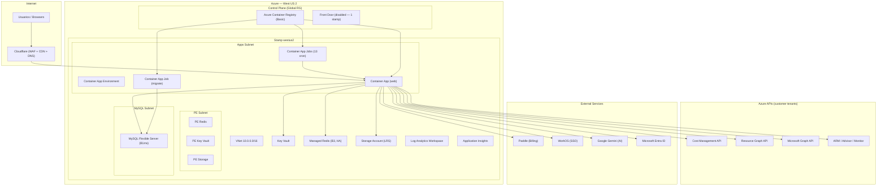
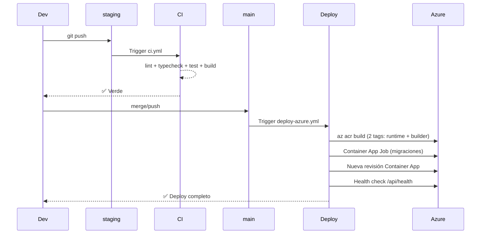
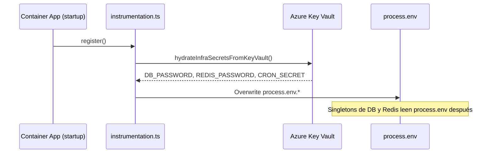
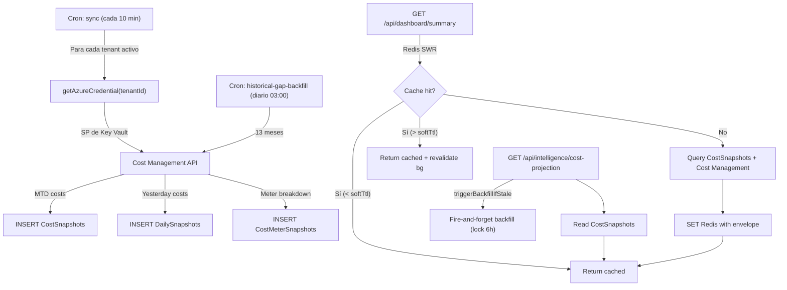

# Low-Level Design (LLD) — CSCloudSolutions FinOps Platform

**Versión:** 1.1  
**Fecha:** 2026-08-03  
**Autor:** Relevamiento automatizado sobre el codebase en `main` (commit post-PR #99)

---

## 1. Resumen Ejecutivo

CSCloudSolutions FinOps es una plataforma SaaS **Azure-only**, multi-tenant, diseñada para dar visibilidad, optimización y gobernanza del gasto en la nube de Microsoft Azure. Corre sobre **Next.js 16** (App Router, TypeScript) con backend integrado (API routes), persistencia en **MySQL Flexible Server** y caché/locks en **Azure Managed Redis (Balanced B3, HA)**.

### Métricas del codebase

| Dimensión | Valor |
|---|---|
| Líneas de código fuente (src/) | **~99,500** |
| Archivos TypeScript/TSX | **676** |
| Rutas API (route.ts) | **238** |
| Páginas de UI (page.tsx) | **127** (120 únicas bajo `[locale]/`) |
| Tablas de BD | **84** |
| Migraciones SQL | **57** |
| Tests (Vitest) | **65 archivos**, ~592 tests |
| Módulos Terraform | **18** |
| Líneas de IaC (.tf) | **~5,500** |
| Recursos de infra gestionados | **83+** |
| Variables de entorno (.env) | **72** |
| Idiomas (i18n) | **3** (es, en, pt-BR) — 4,114 strings c/u |

### Actualización relevante 2026-08-13

- Se agregó el módulo **Azure Integration Services (iPaaS)** en `intelligence/integration-services` con tabs:
  `logic-apps`, `apim`, `service-bus`, `event-grid`, `event-hubs`, `adf`.
- Backend nuevo: `GET /api/intelligence/integration-services/[service]` (tenant-scoped, mock por tier, KPIs + tabla FinOps/CMP).
- Sección específica en Logic Apps para **Conectores Enterprise**.
- Hardening de despliegue staging en migraciones:
  - `20260813-001-azure-foundry-snapshots.sql`: ajuste de prefijos de índice por límite MySQL (`ER_TOO_LONG_KEY`).
  - `20260813-001-tagging-policies-table.sql`: seed compatible con variantes de esquema legacy (`tenant_id|tenantId`, `policy_name|policyName|tag_key`, `is_required|isRequired|required`).
  - `.github/workflows/deploy-staging.yml`: diagnóstico automático de execution + replica logs ante fallo del job de migración.

---

## 2. Arquitectura de Alto Nivel



### Patrón de despliegue: Stamp-based

La infra usa un patrón de **stamps** (sellos regionales). Hoy existe un único stamp (`westus2`). La key del mapa es el valor de `Tenants.data_residency`. Agregar un segundo stamp requiere:
1. Declarar la entrada en `var.stamps`
2. Habilitar Front Door (`frontdoor_enabled = true`)
3. Configurar geo-routing en `stamp_geo_routing`

---

## 3. Stack Tecnológico

### 3.1 Frontend

| Tecnología | Versión | Propósito |
|---|---|---|
| Next.js | 16.2.7 | Framework full-stack (App Router, standalone output) |
| React | 19.2.4 | UI library |
| TypeScript | ^5 | Type safety |
| Tailwind CSS | ^4 | Styling |
| next-intl | ^4.13.0 | i18n (3 idiomas) |
| Recharts | ^3.8.1 | Gráficos y visualizaciones |
| Lucide React | ^1.17.0 | Iconos |
| SWR | ^2.4.2 | Data fetching client-side |
| Zustand | ^5.0.14 | State management |
| React Grid Layout | ^2.2.3 | Dashboard widgets configurables |
| cmdk | ^1.1.1 | Command Palette |
| MSAL Browser/React | ^5 | Auth con Microsoft Entra ID |

### 3.2 Backend

| Tecnología | Versión | Propósito |
|---|---|---|
| Next.js API Routes | 16.x | 238 endpoints REST |
| mysql2 | ^3.22.4 | Pool de conexiones a MySQL |
| ioredis | ^5.11.1 | Cliente Redis (TLS-aware) |
| jose / jsonwebtoken | ^6 / ^9 | JWT validation |
| @azure/* SDKs | Varios | Cost Management, Resource Graph, ARM, Graph, Key Vault, Identity, Storage |
| AI SDK (Vercel) | ^6.0 | Abstracción multi-proveedor IA |
| decimal.js | ^10.6.0 | Aritmética de precisión para costos |
| Paddle SDK | ^1.6.4 | Billing SaaS |
| WorkOS Node | ^10.7.0 | Enterprise SSO |

### 3.3 Infraestructura

| Componente | Recurso Azure | SKU/Tier |
|---|---|---|
| Compute | Container Apps | Consumption plan |
| Base de datos | MySQL Flexible Server | B1ms |
| Cache/Locks | Managed Redis | Balanced B3, HA |
| Secretos | Key Vault | Standard |
| Blobs | Storage Account | Standard LRS |
| Observabilidad | Log Analytics + App Insights | — |
| Registry | Container Registry | Basic |
| CDN/WAF | Cloudflare (externo) | — |
| IaC | Terraform | >= 1.8, azurerm ~> 4.0 |

---

## 4. Modelo de Datos

### 4.1 Esquema: 84 tablas

El esquema se gestiona vía **migraciones SQL incrementales** en `migrations/`. El runner ([migrations.ts](file:///Users/manuelchavez/Documents/FinOpsProyect/src/modules/storage/migrations.ts)) las aplica automáticamente en `initializeDatabase()`.

**Tablas core por dominio:**

| Dominio | Tablas principales |
|---|---|
| **Tenancy** | `Tenants`, `Users`, `TenantSSO`, `TenantDelegations`, `TenantProviderTransitions` |
| **Cost Data** | `CostSnapshots`, `cost_snapshots`, `CostMeterSnapshots`, `CostCategorySnapshots`, `DailySnapshots`, `AICostSnapshots` |
| **Optimization** | `RecommendationsCache`, `SavingsHistory`, `Anomalies`, `HARecommendations`, `AppServiceRecommendations`, `SqlDbRecommendations`, `StorageRecommendations`, `VmssRecommendations` |
| **Budgets** | `Budgets`, `TenantMonthlyBudgets`, `CostCenterBudgets`, `AlertRules` |
| **Governance** | `TaggingPolicies`, `ExpiringCredentials`, `PowerSchedules`, `TtlPolicies`, `TtlDeletions`, `AllocationRules` |
| **Cost Groups** | `CostGroups`, `CostGroupResourceGroups` |
| **Billing** | `BillingTransactions`, `MarketplaceEvents`, `MACCCommitments` |
| **Auth/Security** | `AuthTokens`, `SSOSessions`, `MfaChallenges`, `LegalAcceptances`, `PublicApiKeys`, `MCPApiKeys` |
| **Support** | `SupportTickets`, `SupportTicketMessages`, `SupportTicketAttachments` |
| **Notifications** | `Notifications`, `NotificationChannels`, `NotificationLog` |
| **Platform** | `GlobalSettings`, `PlatformIncidents`, `PlatformStatusSnapshots`, `PlatformAiUsage`, `SystemAlerts`, `LoadTestRuns` |
| **Open Data** | `OpenDataServices`, `OpenDataRegions`, `OpenDataResourceTypes`, `OpenDataPricingUnits`, `OpenDataCommitmentEligibility`, `OpenDataSyncState` |
| **Onboarding** | `OnboardingProgress`, `SignupEvents`, `AcademyProgress` |
| **Data Residency** | `DataResidencyChanges` |
| **FX** | `FxRates`, `UserCurrencyPreference`, `PricingUnits` |
| **FOCUS** | `FocusLineItems`, `FocusExportSchedules` |
| **Analytics** | `BusinessMetrics`, `BusinessMetricsConfig`, `CopilotUsage` |
| **Audit** | `ActionLogs`, `AiCache`, `DataPipelineEvents`, `RemediationRequests`, `RecommendationActions` |

### 4.2 Pool de Conexiones

- **Driver:** `mysql2/promise` con pool singleton vía `globalThis` (evita múltiples pools en hot-reload de dev).
- **Connection limit:** configurable vía `DB_POOL_LIMIT` (default 10).
- **TLS:** habilitado en prod vía `DB_SSL=true` (TLSv1.2, `rejectUnauthorized: true`).
- **Collation:** `utf8mb4_unicode_ci` (Terraform; **no** `utf8mb4_0900_ai_ci` — divergencia causa `ER_FK_INCOMPATIBLE_COLUMNS`).

### 4.3 Redis

- **Driver:** `ioredis` con TLS condicional (`REDIS_TLS=true` en prod).
- **Singleton** vía `globalThis`.
- **Puerto:** 6380 (TLS) / 6379 (plain).
- **Patrones de cache:**
  - **Simple TTL:** `getWithCache(key, fetcher, ttl)` — lookup → fetch → set EX.
  - **Stale-While-Revalidate:** `getWithStaleWhileRevalidate(key, fetcher, ttl, softTtl, dynamicTtl)` — envelope `{__sw, t, data}` con soft/hard TTL y deduplicación in-flight.
  - **Invalidación:** `invalidateCache(...keys)`, `invalidateCachePattern(glob)`.

---

## 5. Seguridad y RBAC

### 5.1 Autenticación

La plataforma soporta **dos mecanismos** de autenticación:

1. **Microsoft Entra ID (MSAL):** Flujo principal. El frontend obtiene un token MSAL y lo envía como `Authorization: Bearer <token>`. El backend valida el JWT contra OpenID Connect metadata de Microsoft, verifica `tid`, `aud`, `iss`, `exp`, y extrae claims.

2. **Enterprise SSO (WorkOS):** Para tenants Enterprise con SSO configurado. Flujo OAuth/SAML vía WorkOS.

**Guard chain** (en [requestAuth.ts](file:///Users/manuelchavez/Documents/FinOpsProyect/src/lib/requestAuth.ts)):

| Guard | Qué verifica |
|---|---|
| `requireRequestIdentity` | Token válido, claims básicos, rechaza MSA consumers (`9188040d-…`) |
| `requireTenantAccess` | Identity + usuario pertenece al tenant solicitado |
| `requireTenantRole` | TenantAccess + rol mínimo (Admin/Owner) |
| `requireTenantTier` | TenantAccess + tier del tenant ≥ tier requerido |
| `requireSuperAdmin` | Identity + `system_role = SUPERADMIN` |

**Protección IDOR:** La regla ESLint `local/no-unauth-tenant-id` en CI bloquea cualquier ruta que lea `tenantId` sin pasar por uno de los cinco guards (los cinco están en la allow-list de la regla).

**Gating de tier server-side:** `RouteTierGate`, `FeatureGuard` y el Sidebar filtran la UI, no la API. Toda ruta que sirva una feature registrada en `src/lib/routeTiers.ts` debe usar `requireTenantTier`, o un tenant de tier inferior puede pedirle los datos directo con un token válido de su propio tenant. Al 2026-08-21 lo usan 40 archivos de ruta; fue el finding **SEC-02** de `docs/security/audit-2026-08-21.md`.

**Orden de los branches demo respecto del guard — regla condicional.** El check `isMockTenant` puede ir **antes** del guard si y sólo si la rama mock devuelve exclusivamente literales sintéticos. Si esa rama consulta MySQL, Redis, Azure o cualquier estado compartido, **el guard va primero**: de lo contrario un llamador anónimo con `?tenantId=demo-x` alcanza ese estado sin autenticarse (finding **SEC-01** de `docs/security/audit-2026-08-09.md`). Al 2026-08-21 el código está repartido 76 rutas con mock primero y 70 con guard primero, y ambos órdenes son correctos donde están aplicados según ese criterio. Los mocks no son una frontera de autorización: un payload mock nunca puede contener datos de un tenant real, porque `isMockTenant` matchea las subcadenas `demo`/`mock` y ninguna de sus letras es un dígito hexadecimal válido en un GUID de Entra ID.

### 5.2 Modelo de Tiers

```
Professional (1) < Business (2) < Enterprise (3)
```

Cada tier tiene **límites de uso** y **features gated**:

| Límite | Professional | Business | Enterprise |
|---|---|---|---|
| Suscripciones Azure | 2 | 3 | ∞ |
| Usuarios | 3 | 5 | ∞ |
| Features | Básicas, +Anomalías, +Copilot | +Simulador, +Cost Groups, +Remediation | Todo |

### 5.3 Cron Jobs — Autenticación por `CRON_SECRET`

17 cron jobs autenticados con `Authorization: Bearer $CRON_SECRET`:

| Job | Frecuencia | Propósito |
|---|---|---|
| `sync` | cada 10 min | Sincroniza costos de Azure Cost Management con deadline cooperativo por tenant; al vencer aborta consultas, reintentos y evita escrituras o invalidaciones tardías |
| `prewarm-dashboard` | cada 10 min | Pre-cachea datos del dashboard |
| `prewarm-databases` | cada 15 min | Pre-cachea diagnósticos de BD y métricas Redis |
| `prewarm-compute` | cada 15 min | Pre-cachea workloads de cómputo |
| `anomaly-detection` | diario 04:00 | Detección de anomalías de costo |
| `historical-gap-backfill` | diario 03:00 | Backfill de datos históricos |
| `power-schedules` | cada hora | Ejecuta encendido/apagado programado |
| `cost-sync-staleness-check` | diario | Alerta sobre datos desactualizados |
| `credential-expiry-alerts` | diario | Alerta creds por vencer |
| `focus-export-daily` | diario | Genera exports FOCUS |
| `open-data` | semanal | Sincroniza datos abiertos de Azure |
| `status-snapshot` | cada 5 min | Status page snapshot |
| `subscription-expiry` | diario | Alertas de expiración |
| `support-attachments-cleanup` | diario | Limpieza de adjuntos viejos |
| `trial-expiry` | diario | Expira trials |
| `ttl-expiry-alerts` | diario | Alertas TTL |

> **Nota:** Los crons corren en **GMT-3** (`cron_timezone_offset_hours = -3`), no UTC.

### 5.4 Headers de Seguridad

Configurados en [next.config.ts](file:///Users/manuelchavez/Documents/FinOpsProyect/next.config.ts):

- `X-Frame-Options: DENY`
- `X-Content-Type-Options: nosniff`
- `Referrer-Policy: strict-origin-when-cross-origin`
- `Permissions-Policy: camera=(), microphone=(), geolocation=(), payment=(), usb=()`
- `Strict-Transport-Security: max-age=31536000; includeSubDomains; preload` (solo prod)
- **CSP** completa con `default-src 'self'`, dominios permitidos para Paddle, Microsoft, Google Fonts, Cloudflare Insights.

---

## 6. Capa de Servicios (Negocio)

### 6.1 Services (26 archivos)

Los servicios viven en `src/services/` y encapsulan lógica de dominio. Los route handlers los invocan; nunca la UI directamente.

**Top 10 por complejidad:**

| Servicio | Líneas | Dominio |
|---|---|---|
| [anomalyDetectionService](file:///Users/manuelchavez/Documents/FinOpsProyect/src/services/anomalyDetectionService.ts) | 374 | Z-score anomaly detection |
| [reservationService](file:///Users/manuelchavez/Documents/FinOpsProyect/src/services/reservationService.ts) | 348 | RI/SP management |
| [powerScheduleService](file:///Users/manuelchavez/Documents/FinOpsProyect/src/services/powerScheduleService.ts) | 321 | VM start/stop scheduling |
| [haService](file:///Users/manuelchavez/Documents/FinOpsProyect/src/services/haService.ts) | 259 | High Availability assessment |
| [budgetService](file:///Users/manuelchavez/Documents/FinOpsProyect/src/services/budgetService.ts) | 241 | Azure budgets CRUD |
| [tagInheritanceService](file:///Users/manuelchavez/Documents/FinOpsProyect/src/services/tagInheritanceService.ts) | 186 | Tag compliance + remediation |
| [governanceReportingService](file:///Users/manuelchavez/Documents/FinOpsProyect/src/services/governanceReportingService.ts) | 184 | Governance score + report |
| [remediationService](file:///Users/manuelchavez/Documents/FinOpsProyect/src/services/remediationService.ts) | 179 | Delete/deallocate/downgrade VMs |
| [costGroupDetailMetricsService](file:///Users/manuelchavez/Documents/FinOpsProyect/src/services/costGroupDetailMetricsService.ts) | 168 | Cost group analytics |
| [snapshotService](file:///Users/manuelchavez/Documents/FinOpsProyect/src/services/snapshotService.ts) | 167 | Daily cost snapshots |

### 6.2 Modules (29 archivos)

Los módulos viven en `src/modules/` organizados en tres capas:

- **`collectors/azure/`** — Integraciones con SDKs de Azure (Cost Management, Resource Graph, Advisor, Graph, Log Analytics, Container Apps, Cosmos DB, etc.)
- **`core/`** — Motores agnósticos (AI Provider, FOCUS mapper, rightsizing engine, KQL catalog)
- **`storage/`** — Persistencia (pool MySQL, migrations, region pool)

**El archivo más complejo:** [billingService.ts](file:///Users/manuelchavez/Documents/FinOpsProyect/src/modules/collectors/azure/billingService.ts) — **1,302 líneas**. Es el corazón del sistema: consulta Cost Management por Management Group y por suscripción, con fallback, reintentos con backoff exponencial, y diagnóstico de 429s.

---

## 7. Pipeline CI/CD

### 7.1 Workflows

| Workflow | Trigger | Qué hace |
|---|---|---|
| [ci.yml](file:///Users/manuelchavez/Documents/FinOpsProyect/.github/workflows/ci.yml) | Push a `staging`, PRs a `main`/`staging` | lint → typecheck → test (coverage) → build |
| [deploy-azure.yml](file:///Users/manuelchavez/Documents/FinOpsProyect/.github/workflows/deploy-azure.yml) | Push a `main` | Build ACR → migraciones (Job) → nueva revisión → health check |
| [terraform.yml](file:///Users/manuelchavez/Documents/FinOpsProyect/.github/workflows/terraform.yml) | PR que toque `infra/terraform/**` | Checkov + Infracost + `plan`. Apply manual con confirmación `APPLY-PROD` |
| [deploy.yml](file:///Users/manuelchavez/Documents/FinOpsProyect/.github/workflows/deploy.yml) | **Legacy** — solo manual | Deploy SSH al VPS. **Congelado.** |
| [restore-test.yml](file:///Users/manuelchavez/Documents/FinOpsProyect/.github/workflows/restore-test.yml) | Manual | Test de restauración MySQL |

### 7.2 Flujo de deploy



### 7.3 Docker

- **Multi-stage build** ([Dockerfile](file:///Users/manuelchavez/Documents/FinOpsProyect/Dockerfile)): `deps` → `builder` → `runner`
- **Base:** `node:22-alpine`
- **Output:** `standalone` (Next.js)
- **Sin BuildKit** (ACR Tasks no lo soporta)
- **Build args:** 8 variables `NEXT_PUBLIC_*` inyectadas en build-time
- **User:** `nextjs` (uid 1001, sin root)

---

## 8. Integraciones Externas

### 8.1 Azure (tenant del cliente)

| API | Propósito | Autenticación |
|---|---|---|
| Cost Management | Costos MTD, forecast, histórico | SP del cliente (credentials en Key Vault) |
| Resource Graph | Inventario de recursos | SP del cliente |
| Advisor | Recomendaciones de optimización | SP del cliente |
| Microsoft Graph | Usuarios, licencias, MFA, M365 | SP del cliente |
| ARM (Compute, Network, Monitor) | Rightsizing, métricas | SP del cliente |
| Entra ID | Autenticación de usuarios | MSAL (browser) |

### 8.2 Servicios Terceros

| Servicio | Propósito | Configuración |
|---|---|---|
| **Paddle** | Billing SaaS (checkout, subscriptions, webhooks) | `PADDLE_API_KEY`, `PADDLE_WEBHOOK_SECRET` en Key Vault |
| **WorkOS** | Enterprise SSO (SAML/OIDC) | `WORKOS_API_KEY`, `WORKOS_CLIENT_ID` |
| **Google Gemini** | AI reports, copilot, assessments | `GEMINI_API_KEY` |
| **Cloudflare** | CDN, WAF, DNS | Full strict SSL, dominio `finops.cscloudsolutions.com.ar` |

---

## 9. Secretos y Key Vault

### 9.1 Flujo de hidratación



### 9.2 Credenciales de tenant

Los Service Principals de cada tenant se almacenan en Key Vault como secrets con naming convention:
- `tenant-{tenantId}-client-id`
- `tenant-{tenantId}-client-secret`

El módulo [keyvault.ts](file:///Users/manuelchavez/Documents/FinOpsProyect/src/lib/keyvault.ts) implementa cache con soft/hard TTL para evitar llamadas excesivas.

---

## 10. Superficie de UI

### 10.1 Navegación principal (120 páginas)

| Sección | Páginas | Tier mínimo |
|---|---|---|
| Dashboard (raíz) | 1 | Professional |
| Intelligence | 42 | Professional → Enterprise |
| Admin | 32 | Professional → Enterprise |
| Overview | 9 | Professional |
| Governance | 7 | Professional → Enterprise |
| Legal | 5 | — (público) |
| Superadmin | 5 | SUPERADMIN |
| Cleanup | 4 | Professional → Business |
| Mobile | 4 | Professional |
| Academy | 1 | Professional |
| Demo | 1 | — |

### 10.2 Componentes destacados

| Componente | Líneas | Rol |
|---|---|---|
| [TenantProvider](file:///Users/manuelchavez/Documents/FinOpsProyect/src/components/TenantProvider.tsx) | 76,158 bytes | Context global de tenant, suscripciones, scope |
| [ZombieResourcesTable](file:///Users/manuelchavez/Documents/FinOpsProyect/src/components/ZombieResourcesTable.tsx) | 51,516 bytes | Tabla interactiva de recursos zombie |
| [AdvisorPanel](file:///Users/manuelchavez/Documents/FinOpsProyect/src/components/AdvisorPanel.tsx) | 42,830 bytes | Panel de Azure Advisor |
| [TagManager](file:///Users/manuelchavez/Documents/FinOpsProyect/src/components/TagManager.tsx) | 35,685 bytes | Gestión de tags Azure |
| [GlobalCopilot](file:///Users/manuelchavez/Documents/FinOpsProyect/src/components/GlobalCopilot.tsx) | 30,916 bytes | Copilot IA flotante |
| [Sidebar](file:///Users/manuelchavez/Documents/FinOpsProyect/src/components/Sidebar.tsx) | 30,172 bytes | Navegación lateral |
| [ClientShell](file:///Users/manuelchavez/Documents/FinOpsProyect/src/components/ClientShell.tsx) | 25,384 bytes | Shell principal client-side |
| [PricingPage](file:///Users/manuelchavez/Documents/FinOpsProyect/src/components/PricingPage.tsx) | 24,077 bytes | Pricing + checkout Paddle |
| [mockData](file:///Users/manuelchavez/Documents/FinOpsProyect/src/lib/mockData.ts) | 160,657 bytes | Datos mock por tier (demo) |
| [apiErrors](file:///Users/manuelchavez/Documents/FinOpsProyect/src/lib/apiErrors.ts) | — | `serverError` (respuesta 500 sin filtrar internals) + narrowing tipado de errores capturados: `errorMessage`, `errorStatus` (acotado al rango HTTP 100-599 para no propagar errnos de driver), `errorCode`. Usado en 489 bloques `catch`, en reemplazo de `catch (e: any)` |

---

## 11. Infraestructura Terraform

### 11.1 Módulos (18)

```
infra/terraform/modules/
├── acr/               # Container Registry
├── budget/            # Azure Budget + Action Groups
├── containerapp/      # Container App + Environment
├── cronjobs/          # 13 Container App Jobs (cron)
├── custom_domain/     # Custom domain + Managed Certificate
├── defender/          # Microsoft Defender for Cloud
├── diagnostics/       # Diagnostic settings
├── frontdoor/         # Azure Front Door (disabled)
├── keyvault/          # Key Vault + access policies
├── monitoring/        # Action groups + metric alerts
├── mysql/             # MySQL Flexible Server
├── mysql_backup/      # Backup automation (VM + blob)
├── network/           # VNet + subnets + NSGs + DNS zones
├── private_dns/       # Private DNS zones
├── redis/             # Managed Redis (Enterprise)
├── security_policy/   # Security policies
├── stamp/             # Orquestador de un stamp completo
└── storage/           # Storage Account
```

### 11.2 Trampas conocidas de Terraform

> [!WARNING]
> Estas trampas están documentadas extensamente en [HANDOFF-FINAL-2026-07-28.md](file:///Users/manuelchavez/Documents/FinOpsProyect/HANDOFF-FINAL-2026-07-28.md).

1. **Redis HA:** `CREATE` con `high_availability=true` falla en West US 2. Crear con false, luego `UPDATE` a true.
2. **Managed Certificate bugs:** IDs desalineados entre `managedCertificates` y `certificates`. Se resuelve con `replace()`.
3. **State key:** Es `prod/terraform.tfstate` (con barra), no `prod.tfstate`.
4. **Collation MySQL:** El server usa `utf8mb4_unicode_ci`; local sin flag usa otra → FKs rompen.
5. **`AZURE_CLIENT_ID`** tiene 3 significados distintos según el contexto. Ver sección de trampas del handoff.

---

## 12. Estado Actual y Pendientes

### 12.1 ✅ Funcionando

- Deploy automático end-to-end (push a `main` → Container Apps)
- Dominio propio `finops.cscloudsolutions.com.ar` con certificado
- Autenticación MSAL + SSO
- 238 API routes con RBAC
- 4 tiers con feature gating
- Billing vía Paddle (checkout, subscriptions, webhooks)
- i18n en 3 idiomas
- 592 tests en verde
- Checkov 122/122 checks
- Key Vault para secretos de infra y tenant

### 12.2 ⚠️ Pendientes abiertos

| # | Pendiente | Severidad | Detalle |
|---|---|---|---|
| 1 | **KPIs de costo discrepantes** | Resuelto | Whiteboard usa una única colección MTD para KPI, Top Servicios y Centros de Costos; el refresh invalida ambas capas Redis y un `$0.00` real no se sustituye por mocks. |
| 2 | **Container Apps / Log Analytics tarjetas vacías** | Media | Puede ser víctima del 429 throttling. Necesita verificación en devtools post-deploy. |
| 3 | **Ahorro potencial: `Number("1,234.56") = NaN`** | Media | `extractSavings` parsea strings con separador de miles. Fix: limpiar la coma antes de `Number()`. |
| 4 | **429 del cron sync** | Media | Operaciones `yesterday(MG)` y `detailed()` concentradas a las 06:00 UTC. Solución: espaciar barrido de tenants o usar ventanas. |
| 5 | **`allowed_ip_ranges` vacío** | Baja | El FQDN de Azure es accesible directo sin Cloudflare WAF. El mecanismo existe en Terraform, solo falta cargar rangos de Cloudflare. |
| 6 | **Resource locks deshabilitados** | Baja | `resource_lock_enabled = false`. Habilitar cuando la infra estabilice. |
| 7 | **Drift de tags/workload_profile** | Cosmético | ~17 cambios permanentes en `plan`. Declarar valores explícitamente. |

### 12.3 Deuda técnica identificada

| Área | Descripción | Estado |
|---|---|---|
| `billingService.ts` (1,302 LoC) | Archivo monolítico refactorizado en submódulos por dominio (`billingTypes`, `mtdBillingService`, `forecastBillingService`, `yesterdayBillingService`, `historicalBillingService`) con patrón facade retrocompatible. | ✅ Completado (2026-07-31) |
| `TenantProvider.tsx` (76KB) | Componente god-object. Debería descomponerse. | Pendiente |
| `mockData.ts` (160KB) | Archivo masivo de mocks. Considerar archivos por dominio. | Pendiente |
| Tests | 66 archivos de test (638 pasados) con aislamiento por archivo en Vitest. | En progreso |
| SMTP | 6 variables SMTP declaradas con 0 usos — están configuradas pero no implementadas. | Pendiente |
| `PROVIDER_ARCHIVE_RETENTION_DAYS` | Variable obsoleta de proveedor eliminado removida de `.env.example`. | ✅ Completado (2026-07-31) |

---

## 13. Diagrama de Flujo de Datos — Ciclo de Costos

### 13.0 Whiteboard / Resumen Ejecutivo

- **Ruta UI:** `/[locale]/overview/whiteboard`, renderizada por `ExecutiveSummaryBoard` sobre `react-grid-layout`.
- **API facade:** `/api/overview/whiteboard` aplica mock-first, RBAC para tenants reales y caché aislada por tenant, locale y modo `mock|live`.
- **Agregador financiero:** `/api/intelligence/whiteboard` obtiene una colección mensual única desde Azure Cost Management (`ActualCost`) y deriva de ella `summary.costMtdUSD`, Top 4 servicios y gasto por CostCenter. Si Azure no entrega filas, usa `CostSnapshots` del mes actual sin datos sintéticos.
- **Fuentes complementarias:** `CostCenterBudgets`, Resource Graph para cobertura de tags, Azure Advisor para pilares/quick wins, `/api/dashboard/summary` para zombies y carbono.
- **UX y personalización:** cinco KPI superiores y 16 tarjetas reubicables/redimensionables. Layout, visibilidad y panel lateral “Personalizar Tarjetas” se persisten por navegador; Top Servicios no incluye la categoría artificial Total y los ejes usan formatter adaptativo. El Copilot global permanece en `z-40`.
- **Pines:** widgets `whiteboard.*` registrados en `widgetRegistry`; demo persiste en `localStorage` y tenants reales en `UserDashboardPins` con RBAC.



### 13.1 Flujo de AI Cost Analytics (Microsoft Foundry / Azure OpenAI)

- **Ruta:** `GET /api/intelligence/ai-analytics`.
- **Fuente primaria:** `AICostSnapshots` (tokens por modelo desde Azure Monitor sobre `Microsoft.CognitiveServices/accounts`).
- **Métricas soportadas:** `ProcessedPromptTokens`, `GeneratedTokens` y `ProcessedInferenceTokens`.
- **Ingesta resiliente por métrica (fix 2026-08-05):** las métricas se piden **una por una** a Azure Monitor (no en un solo batch) porque el servicio rechaza todo el batch con 400 si un `metricname` no existe para ese recurso (p.ej. `ProcessedInferenceTokens` en cuentas Azure OpenAI clásicas). Cada métrica reintenta sin el filtro `ModelDeploymentName eq '*'` para cubrir recursos Foundry que no exponen esa dimensión. Ventana = ayer completo + hoy parcial; persistencia por fecha de datapoint (UTC).
- **Fallback de costos (SQL GROUP BY fix 2026-08-05):** cuando no hay desglose de tokens, consulta `CostSnapshots` por huellas de Microsoft Foundry / Azure AI Services / OpenAI (service + meter). Query incluye todas las columnas no agregadas en el GROUP BY para cumplir con `sql_mode=only_full_group_by` de Azure MySQL — antes fallaba silenciosamente, impidiendo que **ningún dato** se retornara incluso con filas válidas en BD.
- **Precisión de costos:** los totales, agrupaciones, tendencias y costo por 1K tokens conservan `Decimal` durante la agregación; la conversión a número ocurre solo en el límite de serialización con redondeo explícito.
- **Endpoint de diagnóstico:** `GET /api/intelligence/ai-analytics/diagnostics?tenantId=…` (guard `requireTenantAccess`). Reporta estado de `AICostSnapshots`, suscripciones visibles (con truncado por tier), cuentas `Microsoft.CognitiveServices/accounts` + `kind`, definiciones de métricas disponibles, prueba real de cada métrica de token (series + suma) y filas que produciría el colector, con conclusión heurística de por qué el panel está en cero. No requiere acceso a DB de prod ni a logs del cron. Incluye paginación 15/30/45/60 items por página.
- **RBAC mínimo:** no requiere rol nuevo; usa `Reader`, `Cost Management Reader`, `Monitoring Reader`, `Billing Reader`.

### 13.2 Costo actual MTD en productos Azure AI

- **Contrato canónico:** las ocho capacidades (`Foundry`, `AI Search`, `Document Intelligence`, `Speech & Language`, `Vision & Video`, `Content Safety`, `Azure ML` y `Databricks`) exponen `currentCostMtdUSD` como costo facturado acumulado del mes actual. `monthlyCostUSD` se conserva temporalmente como alias compatible para cachés y clientes anteriores.
- **Fuente:** Azure Cost Management con `timeframe: MonthToDate` y filtro exacto por `ResourceId`; si la API no está disponible se usa el snapshot MTD más reciente del mismo recurso. Un `$0.00` válido se conserva y nunca se reemplaza por precio teórico de SKU, páginas o capacidad.
- **Snapshots acumulativos:** `selectLatestAzureAiSnapshots` conserva el registro más reciente por recurso/deployment antes de agregar, evitando sumar snapshots diarios que ya contienen acumulados MTD.
- **Actualización manual:** `refresh=true` omite el caché consolidado y vuelve a consultar los collectors. Demo/mock se resuelve antes de RBAC y tenants reales nunca reciben datos sintéticos como fallback.

### 13.3 Azure AI Document Intelligence

- **Ruta UI/API:** `/[locale]/intelligence/azure-ai/document-intelligence` consume `GET /api/intelligence/azure-ai/document-intelligence?tenantId=…&days=mtd|30|90`.
- **Inventario:** `azureDocumentIntelligence.service.ts` consulta Resource Graph por `Microsoft.CognitiveServices/accounts` con kind `FormRecognizer`, `DocumentIntelligence` o `AIServices`; conserva `resourceId`, RG, región, suscripción, SKU, red pública y Private Endpoints.
- **Modelos custom:** intenta primero `/documentintelligence/models?api-version=2024-02-29-preview` y luego el endpoint estable `formrecognizer/documentModels`; la ausencia de permiso o endpoint no fabrica modelos.
- **Telemetría:** Azure Monitor consulta `ProcessedPages`, `TotalCalls`, `SuccessfulCalls`, `TrainingHours`, `ClientErrors` y `ServerErrors` por día. Si ARG devuelve vacío, el estado real permanece vacío; snapshots SQL solo se usan cuando ARG falla técnicamente.
- **Economía unitaria:** el costo canónico es Cost Management MTD por `ResourceId`. El reparto Read/Layout/Specialized/Custom/Training usa tarifas relativas únicamente para atribuir el total real, sin reemplazar `$0.00` ni modificar el total facturado.
- **Reglas:** Custom→Prebuilt, Commitment Tier sobre 50K páginas, dev S0→F0 bajo 500 páginas y cuentas huérfanas. `calculateDocIntelligencePotentialSavings` evita sumar ahorros superpuestos.
- **Seguridad:** `isMockTenant`/`mock=true` antes de `requireTenantAccess`; tenants reales nunca reciben fallback mock. Roles mínimos: Reader, Monitoring Reader y Cost Management Reader.

---

## 14. Convenciones del Proyecto

- **Commits:** granulares, con prefijo convencional (`feat:`, `fix:`, `chore:`…) y `Co-authored-by: Copilot`.
- **Migraciones:** `YYYYMMDD-NNN-descripcion.sql`, idempotentes (`IF NOT EXISTS`).
- **i18n:** toda string visible usa `useTranslations()`, 3 idiomas siempre en paridad.
- **Mocks por tier:** cada feature incluye mocks representativos en `mockData.ts`.
- **Precision:** costos en `DECIMAL` en DB, `decimal.js` en JS.
- **Auth:** toda ruta API que lea `tenantId` del cliente DEBE pasar por un guard de `requestAuth.ts`.

---

## 15. Variables de Entorno — Resumen

De las 72 variables declaradas:
- **35** con uso activo en `src/`
- **14** son healthcheck URLs de crons (usadas externamente, 0 en código)
- **6** son SMTP (declaradas pero sin implementación)
- **17** son de infraestructura/build (Terraform, Docker, Next.js build)

Las variables críticas están en Key Vault:
- `infra-db-password`, `infra-redis-password`, `infra-cron-secret`
- `tenant-{id}-client-id`, `tenant-{id}-client-secret`
- `infra-paddle-api-key`, `infra-paddle-webhook-secret`

---

## 16. Addendum 2026-08-03 — Operaciones SuperAdmin, PAL/CPOR y comisiones

### 16.1 Centro de Operaciones SaaS (SuperAdmin)

- **Nueva UI:** `/superadmin/ops` (solo `SUPERADMIN`).
- **Nueva API:** `GET/POST /api/superadmin/ops`.
  - `GET`: resumen de salud de componentes, cron status y cobertura de canales.
  - `POST`: dispatch de notificación operativa a tenants administrados.
- **RBAC:** guard estricto `requireSuperAdmin`.

### 16.2 Observabilidad persistente de crons

- **Nueva tabla:** `SystemCronRuns` (migración `20260803-001-system-cron-runs.sql`).
- **Helper reusable:** `src/lib/cronRunTracker.ts`.
- **Instrumentación aplicada** en crons críticos (`sync`, `power-schedules`,
  `status-snapshot`, `anomaly-detection`, `credential-expiry-alerts`,
  `ttl-expiry-alerts`, `cost-sync-staleness-check`, `focus-export-daily`,
  `historical-gap-backfill`).
- Cada ejecución registra `cron_name`, `status`, `duration_ms`, `summary`,
  `details`, timestamp y contexto de error.

### 16.3 Gestión comercial por tenant (vendedor + comisión)

- **UI SuperAdmin:** `/admin/tenants` incorpora edición por fila de:
  - `sales_referrer` (vendedor/referido)
  - `sales_commission_pct` (DECIMAL, 0–100, 2 decimales)
- **API:** `PATCH /api/admin/tenants` extendido para `salesCommissionPct`.
- **DB:** migración `20260803-002-tenants-sales-commission.sql` agrega:
  - `sales_commission_pct DECIMAL(5,2)`
  - `sales_commission_updated_by VARCHAR(320)`
  - `sales_commission_updated_at DATETIME`

### 16.4 PAL/CPOR (UX de recuperación)

- El bloque de asociación PAL/CPOR en onboarding vuelve a mostrarse mientras el
  estado no sea `LINKED` (incluye `FAILED`/`DECLINED`), permitiendo reintento
  sin depender de resets manuales de estado.

## 17. Dashboard & UI Fixes (Agosto 2026 - Sprint Whiteboard)

### 17.1 AI Cost Analytics Fixes (Commits 5035ad0, 6a79b52, 1be9ba6)

- **SQL `only_full_group_by` fix:** Corregidas queries en `/api/intelligence/ai-analytics/route.ts`
  - Las columnas en SELECT ahora coinciden con las expresiones COALESCE en GROUP BY
  - Previene silent failures (0 rows returned) en MySQL 8+
- **Date format fix:** Azure SDK devuelve Date objects, no ISO strings
  - Agregada detección en `aiUsageCollector.ts`: `dateObject.toISOString().substring(0, 10)`
  - Valida formato YYYY-MM-DD antes de INSERT en AICostSnapshots

### 17.2 Dashboard Feature Fixes

#### Whiteboard - Tendencia Recomendaciones (Commit a43da23)
- Cambio de filtro: `updated_at BETWEEN` → `created_at` con `status='open'`
- Ahora muestra recomendaciones activas incluso si son viejas (no fueron tocadas)

#### Ahorro Capturado (Commit aacf5b5)
- Nueva función `getTopSavingsResources()` en `/api/intelligence/captured-savings/route.ts`
- UI muestra tabla de top 10 recursos por ahorro estimado
- Permite visibility de qué assets generan más savings

#### Fugas Financieras (Commit a02e65d)
- ZombieResourcesTable ahora siempre visible (antes solo en click)
- Simplificado UI flow

#### Grupos de Costos - Error Untagged/unknown (Commit 37e07f1)
- Problema: Forward slash en `"Untagged/Unknown"` causaba error de pattern matching en rutas dinámicas
- Solución: Renombrado a `"Untagged"` en 6 archivos
- Archivos afectados: `cost-groups/[name]/route.ts`, `cost-groups/route.ts`, whiteboard, top-expenses, scorecard, mockData

#### Centros de Costos - Editables (Commit c66f976)
- Removida condición `data?.isCustom` para mostrar botones edit/delete
- Ahora todos los cost groups pueden ser editados, no solo los custom

#### Unit Economics - Formato Moneda (Commit f1795d8)
- Cambio: `costPerUserCents` → `costPerUserDollars` (sin *100)
- Tooltip formatter usa `format()` en lugar de mostrar `¢`
- Gráfico ahora muestra $1.23 en lugar de 123¢

## 18. Addendum 2026-08-07 — Pestaña acfr y métricas de Azure Cache for Redis

### 18.1 Endpoint de Métricas API (Commit de la sesión)
- **API Route:** `GET /api/intelligence/databases/redis-metrics`
- **Métricas Consultadas:** Consultas en paralelo de las 12 métricas críticas de Azure Monitor utilizando agregación `Average`, intervalo `PT1H` (por hora) y ventana de tiempo `PT24H` (últimas 24 horas):
  - CPU Usage (`PercentProcessorTime`), Server Load (`ServerLoad`), Used Memory (`UsedMemory`), Cache Hits (`CacheHits`), Cache Misses (`CacheMisses`), Connected Clients (`ConnectedClients`), Operations Per Second (`OperationsPerSecond`), Evicted Keys (`EvictedKeys`), Expired Keys (`ExpiredKeys`), Errors (`Errors`), Total Commands Processed (`TotalCommandsProcessed`), Cache Read (`CacheRead`) y Cache Write (`CacheWrite`).
- **Mocks Enriquecidos:** Si `isMockTenant` es `true` o no hay suscripciones activas, genera series temporales de simulación realistas con patrones diarios de uso comercial (más alto entre las 9am y 6pm) e incorpora un 10% de ruido aleatorio controlado y variaciones en forma de ondas sinusoidales para cada una de las 12 métricas.

### 18.2 UI de Supervisión (Pestaña acfr)
- **Ruta de UI:** `/intelligence/bases-de-datos/acfr` (montando el componente `RedisTestBoard`)
- **Visualización:**
  - Panel superior con selectores de instancias de Redis, tarjetas ejecutivas para promedios de CPU, Memoria, Tasa de aciertos (Cache Hit Rate) y Carga de Servidor.
  - Grilla de visualización responsiva con 12 paneles de gráficas de área (`AreaChart` con gradientes de relleno lineales y bordes glassmorphic) donde se detalla la evolución de cada métrica con agregación promedio de forma explícita.
  - El gráfico 12 combina `CacheRead` (Network Read) y `CacheWrite` (Network Write) superpuestos en la misma vista de área interactiva con doble leyenda.

## 19. Addendum 2026-08-08 — Pestaña mysql y métricas de Azure Database for MySQL

### 19.1 Endpoint de Métricas API (MySQL)
- **API Route:** `GET /api/intelligence/databases/mysql-metrics`
- **Métricas Consultadas:** Consultas en paralelo de las 8 métricas críticas de Azure Monitor utilizando agregación `Average`, intervalo `PT1H` (por hora) y ventana de tiempo `PT24H` (últimas 24 horas) para servidores flex/single:
  - CPU Usage (`cpu_percent`), Memory Usage (`memory_percent`), Active Connections (`active_connections`), Failed Connections (`connections_failed`), Storage Usage (`storage_percent`), I/O Utilization (`io_consumption_percent`), Network Ingress (`network_bytes_ingress`) y Network Egress (`network_bytes_egress`).
- **Mocks Enriquecidos:** Si `isMockTenant` es `true`, genera series temporales con variaciones de carga comercial en horas pico de negocio, incluyendo ruido dinámico aleatorio y fluctuaciones en conexiones y bytes de red.

### 19.2 UI de Supervisión (Pestaña mysql)
- **Ruta de UI:** `/intelligence/bases-de-datos/mysql` (montando el componente `MysqlTestBoard`)
- **Visualización:**
  - Panel superior con selectores de instancias de MySQL, tarjetas ejecutivas para promedios de CPU, RAM, Conexiones, Almacenamiento y el costo mensual acumulado real obtenido mediante `getMonthlyCostByType` y `distributeCostPerResource`.
  - Grilla de gráficos responsiva de 7 paneles interactivos con gradientes visuales y tooltips formateados de forma nativa para bytes, porcentajes y totales numéricos.

## 20. Addendum 2026-08-09 — Integridad de diagnósticos y sincronización

- **Autorización antes de mocks:** los endpoints de diagnósticos de MySQL, Redis, Cosmos DB, MongoDB, PostgreSQL, SQL y sus métricas exigen `requireTenantAccess` antes de evaluar el tenant demo.
- **Costos exactos:** la distribución de costos por recurso y las agregaciones de AI Analytics usan `decimal.js`; cada asignación se redondea explícitamente a centavos solo al formar la respuesta API.
- **Telemetría operacional:** los diagnósticos MySQL y Redis expresan campos o muestras sin medición como `null` y exponen `telemetry.available=false` con el origen `not_collected` cuando no existe telemetría. La UI muestra `No disponible`, no valores cero fabricados. Si Azure Monitor no entrega historial Redis, la API devuelve un historial vacío y el mismo estado explícito.
- **Sincronización cancelable:** el cron `sync` propaga un `AbortSignal` desde el deadline por tenant a Cost Management, Azure Monitor, Resource Graph, reintentos y concurrencia. Los guards locales impiden persistencias e invalidaciones de caché posteriores a una cancelación.

## 21. Addendum 2026-08-18 — Módulo de Redes Básicas (VNets, Private Endpoints, DNS, NSG & UDR)

### 21.1 Arquitectura y Capa de Datos
- **Service Backend:** `src/services/azureBasicNetworking.service.ts`
- **Tipado TypeScript:** `src/types/basicNetworking.types.ts` (`BasicNetworkResource`, `BasicNetworkSummary`, `BasicNetworkRemediationAction`, `BasicNetworkingResponse`).
- **Endpoint API:** `GET /api/intelligence/network/basic` (con guard `requireTenantAccess`, mock check previo e invalidación SWR / stale-while-revalidate).
- **Inventario Azure Resource Graph:**
  - Virtual Networks (`Microsoft.Network/virtualNetworks`): `addressPrefixes`, `subnets`, `virtualNetworkPeerings`.
  - Private Endpoints (`Microsoft.Network/privateEndpoints`): `customDnsConfigs`, `networkInterfaces`, `privateLinkServiceConnections`.
  - Private DNS Zones (`Microsoft.Network/privateDnsZones`): conteo de `virtualNetworkLinks`.
  - Network Security Groups (`Microsoft.Network/networkSecurityGroups`): verificación de subredes y NICs asociadas (detección de huérfanos).
  - Route Tables / UDR (`Microsoft.Network/routeTables`): verificación de subredes asociadas (detección de huérfanos).
- **Motor de Higiene y Remediación:**
  - Detección de NSGs y UDRs huérfanos con scripts de remediación en Azure CLI (`az network nsg delete`, `az network route-table delete`) y PowerShell (`Remove-AzNetworkSecurityGroup`, `Remove-AzRouteTable`).
  - Detección de VNets vacías sin subredes/dispositivos (`az network vnet delete`).
  - Optimización de Private Endpoints en entornos Dev/QA/Sandbox con baja transferencia mensual.

### 21.2 UI y Experiencia de Usuario (Frontend)
- **Componente:** `src/components/dashboard/BasicNetworkingFinopsDashboard.tsx`
- **Rutas de UI:** `/intelligence/redes/netwokbasic`, `/intelligence/redes/redes-basicas`.
- **4 Tarjetas KPI:**
  - Costo Mensual Total (MTD + Proyección a fin de mes).
  - Recursos Detectados (Desglose VNets, PEs, DNS, NSG/UDR).
  - Higiene de Red (Contador y alertas de huérfanos).
  - Private Endpoints & Zonas DNS (Total de enlaces gestionados).
- **Gráfica Donut:** Paleta estricta en tonos de azul (`#0078D4`, `#2563EB`, `#38BDF8`, `#93C5FD`, `#60A5FA`) con tooltips institucionales `#1B2A41` y Share of Wallet.
- **Tabla Estándar CMP:** Filtros superiores limpios sin selectores anómalos (`SERVICIO`, `GRUPO DE RECURSOS`, `SUSCRIPCIÓN`), ordenamiento multicriterio, paginación 15/30/45/60, columnas redimensionables (`ResizableTh`) y cajón modal de topología.
- **Iconografía:** Tabler Icons exclusivos en azul corporativo sin fondo (`bg-transparent`).
- **Internacionalización:** 100% de paridad en `messages/es.json`, `messages/en.json` y `messages/pt-BR.json`.

## 22. Addendum 2026-08-18 — Módulo de Conectividad Híbrida (ExpressRoute, Virtual WAN, VPN Gateway, Conexiones & Local Gateways)

### 22.1 Arquitectura y Capa de Datos
- **Service Backend:** `src/services/azureHybridConnectivity.service.ts`
- **Tipado TypeScript:** `src/types/hybridConnectivity.types.ts` (`HybridNetworkResource`, `HybridConnectivitySummary`, `HybridRemediationAction`, `HybridConnectivityResponse`).
- **Endpoint API:** `GET /api/intelligence/network/hybrid` (con guard `requireTenantAccess`, mock check previo e invalidación SWR).
- **Inventario Azure Resource Graph:**
  - ExpressRoute Circuits (`Microsoft.Network/expressRouteCircuits`): `sku.tier`, `sku.family` (MeteredData / UnlimitedData), `bandwidthInMbps`, `peeringLocation`.
  - Virtual WAN & Virtual Hubs (`Microsoft.Network/virtualWans`, `Microsoft.Network/virtualHubs`): escala, rutas y gateways conectados.
  - Virtual Network Gateways (`Microsoft.Network/virtualNetworkGateways`): `gatewayType` (Vpn vs ExpressRoute), SKUs (`VpnGw1-5`, `ErGw1AZ-3AZ`), activeActive, vpnType.
  - Conexiones IPSec (`Microsoft.Network/connections`): estado de conexión (`Connected`, `Connecting`, `NotConnected`), gateways vinculados.
  - Local Network Gateways (`Microsoft.Network/localNetworkGateways`): metadatos de configuración on-premises (**Costo base asignado: $0.00 USD**).
- **Motor de Higiene y Fugas FinOps:**
  - Detección de Virtual Network Gateways huérfanos sin conexiones activas ($140 - $1,750 USD/mes de costo fijo).
  - Detección de túneles caídos / desconectados (`NotConnected`).
  - Arbitraje de tarifas de ExpressRoute (conversión de circuitos `UnlimitedData` con <20 TB/mes a `MeteredData`, generando ~$1,200 USD/mes de ahorro por circuito).
  - Rightsizing de VPN Gateways sobredimensionados (`VpnGw3/4/5` con <100 Mbps throughput hacia `VpnGw2`).

### 22.2 UI y Experiencia de Usuario (Frontend)
- **Componente:** `src/components/dashboard/HybridConnectivityFinopsDashboard.tsx`
- **Rutas de UI:** `/intelligence/redes/hibridcon`, `/intelligence/redes/conectividad-hibrida`.
- **4 Tarjetas KPI Superiores:**
  - Costo Mensual Total (MTD ~$12,874.99 USD + Forecast a fin de mes).
  - Gateways & Circuitos (Recuento de VPN Gateways, Circuitos ER y Virtual Hubs).
  - Túneles Caídos / Huérfanos (Contador con badge ámbar de atención requerida).
## 23. Addendum 2026-08-18 — Módulo de Balanceo y Publicación (Application Gateway / WAF, Azure Front Door, Load Balancers & Traffic Manager)

### 23.1 Arquitectura y Capa de Datos
- **Service Backend:** `src/services/azureLoadBalancing.service.ts`
- **Tipado TypeScript:** `src/types/loadBalancing.types.ts` (`LoadBalancingResource`, `LoadBalancingSummary`, `LoadBalancingRemediationAction`, `LoadBalancingResponse`).
- **Endpoint API:** `GET /api/intelligence/network/load-balancing` y alias `GET /api/intelligence/network/loadbalancer` (con guard `requireTenantAccess`, mock check previo e invalidación SWR).
- **Inventario Azure Resource Graph:**
  - Application Gateways (`Microsoft.Network/applicationGateways`): SKUs (`Standard_v2`, `WAF_v2`), `autoscaleConfiguration` (minCapacity, maxCapacity), backendAddressPools, httpListeners, requestRoutingRules y políticas WAF.
  - Azure Front Door (`Microsoft.Cdn/profiles`, `Microsoft.Network/frontdoors`): SKUs (`Standard_AzureFrontDoor`, `Premium_AzureFrontDoor`), customDomains, securityPolicies y reglas de enrutamiento CDN global.
  - Load Balancers (`Microsoft.Network/loadBalancers`): SKUs (`Basic`, `Standard`, `Gateway`), frontendIPConfigurations, backendAddressPools, loadBalancingRules.
  - Traffic Manager (`Microsoft.Network/trafficManagerProfiles`): métodos de enrutamiento (`Priority`, `Weighted`, `Performance`), endpoints monitoreados y **calibración FinOps realista** ($0.54/millón de consultas DNS + health probes).
- **Motor de Higiene y Fugas FinOps:**
  - Detección de Load Balancers huérfanos sin máquinas virtuales ni pods asignados en su backend pool (Ahorro del 100% de la tarifa fija de reglas e IP pública).
  - Optimización de Autoscale en Application Gateways: Detección de `minCapacity > 2` en ambientes Dev/QA con bajo tráfico.
  - Arbitraje Front Door: Migración de perfiles `Premium_AzureFrontDoor` ($330/mes) a `Standard_AzureFrontDoor` ($35/mes) en entornos no productivos (Ahorro de $295 USD/mes por perfil).
  - Detección de Ingress inactivo y auditoría de listeners sin reglas de ruteo activas.

### 23.2 UI y Experiencia de Usuario (Frontend)
- **Componente:** `src/components/dashboard/LoadBalancingFinopsDashboard.tsx`
- **Rutas de UI:** `/intelligence/redes/loadbalancer`, `/intelligence/redes/balanceo-y-publicacion`.
- **4 Tarjetas KPI Superiores:**
  - Costo Mensual Total (MTD ~$12,874.99 USD + Forecast a fin de mes).
  - Balanceadores & Ingress (Conteo de Application Gateways, Front Doors, Load Balancers y Traffic Managers).
## 24. Addendum 2026-08-18 — Módulo de Acceso a Internet & Seguridad Perimetral (Public IPs, NAT Gateways, Azure Firewall & DDoS Protection)

### 24.1 Arquitectura y Capa de Datos
- **Service Backend:** `src/services/azureInternetAccess.service.ts`
- **Tipado TypeScript:** `src/types/internetAccess.types.ts` (`InternetAccessResource`, `InternetAccessSummary`, `InternetAccessRemediationAction`, `InternetAccessResponse`).
- **Endpoint API:** `GET /api/intelligence/network/internet-access` y alias `GET /api/intelligence/network/internet` (con guard `requireTenantAccess`, mock check previo e invalidación SWR).
- **Inventario Azure Resource Graph:**
  - Public IP Addresses (`Microsoft.Network/publicIPAddresses`): `properties.ipAddress`, `sku.name`, `sku.tier`, método de asignación e `ipConfiguration.id` (detección de desasociadas = huérfanas).
  - NAT Gateways (`Microsoft.Network/natGateways`): `sku.name`, subredes asociadas, IPs públicas y tiempo de inactividad (idle timeout).
  - Azure Firewalls (`Microsoft.Network/azureFirewalls`): SKUs (`Basic`, `Standard`, `Premium`), threatIntelMode, firewallPolicy y configuraciones IP.
  - DDoS Protection Plans (`Microsoft.Network/ddosProtectionPlans`): redes virtuales protegidas y análisis de cobertura de IPs públicas.
- **Motor de Higiene y Fugas FinOps:**
  - Detección de direcciones IP públicas estándar huérfanas/desasociadas (100% de desperdicio fijo acumulado).
  - Arbitraje de planes DDoS: Detección de DDoS Network Protection ($2,944/mes) en tenants con menos de 10 IPs públicas para sugerir migración a *DDoS IP Protection* ($199/IP/mes, ahorrando hasta ~$2,500 USD/mes).
  - Racionalización y eliminación de NAT Gateways sin subredes o con consumo despreciable en ambientes Dev/Sandbox ($32.85 USD/mes de tarifa fija por gateway).
  - Rightsizing de Azure Firewall: Degradar de Standard/Premium a Basic en suscripciones de pruebas ($624 - $989 USD/mes de ahorro).

### 24.2 UI y Experiencia de Usuario (Frontend)
- **Componente:** `src/components/dashboard/InternetAccessFinopsDashboard.tsx`
- **Rutas de UI:** `/intelligence/redes/internet`, `/intelligence/redes/acceso-a-internet`.
- **4 Tarjetas KPI Superiores:**
  - Costo Mensual Total (MTD ~$4,285.50 USD + Forecast a fin de mes).
  - Recursos Perimetrales (Recuento de IPs Públicas, NAT Gateways, Firewalls y Planes DDoS).
  - IPs Huérfanas / Fugas (Contador con badge de advertencia para IPs desasociadas).
  - Gasto en Seguridad Perimetral (Costo consolidado en Azure Firewall y DDoS Protection).
- **Gráfica Donut:** Paleta estricta en tonos de azul (`#0078D4`, `#2563EB`, `#0284C7`, `#38BDF8`), tooltip institucional `#1B2A41` y Share of Wallet.
- **Tabla Estándar CMP:** Filtros limpios (`SERVICIO`, `GRUPO DE RECURSOS`, `SUSCRIPCIÓN`), ordenamiento multicriterio, paginación 15/30/45/60, columnas redimensionables con `ResizableTh` y botones corporativos en fondo blanco con borde `#0054A6` e icono Tabler `IconEye`.
- **Modales con Capas Estrictas (z-50):** Drawer de Contexto Perimetral y Modal de Remediación con scripts ejecutables en Azure CLI y PowerShell.
- **Internacionalización:** 100% de paridad en `messages/es.json`, `messages/en.json` y `messages/pt-BR.json`.

---

## 25. Addendum 2026-08-21 — Workbooks, Network Watcher y refactor de Defender for Cloud

Cierra las dos sub-pestañas de Monitoreo que seguían apuntando al board genérico de costos por familia
(`workbooks`, `network-watcher`) y reescribe la de Seguridad → Defender for Cloud. El hilo común de los tres
es el mismo problema FinOps: **el recurso que Azure factura no es el que genera el gasto**, así que la vista
nativa muestra $0.00 o un conteo sin contexto.

### 25.1 Azure Monitor Workbooks (`intelligence/monitoreo/workbooks`)

- **Capa de datos:** `src/services/azureWorkbooks.service.ts` inventaría `microsoft.insights/workbooks` y
  `microsoft.insights/myworkbooks` vía Resource Graph, y **parsea `properties.serializedData`** —el JSON de la
  definición del dashboard— para extraer consultas KQL, tablas referenciadas, intervalo de auto-refresh y
  recursos objetivo. El parser recorre los `items` de forma recursiva y se queda con el intervalo más
  agresivo, que es el que domina el costo. Una definición corrupta devuelve vacío en lugar de lanzar, para no
  tumbar el inventario entero por un workbook roto.
- **Reglas de fuga:** (1) huérfanos — `sourceId` o workspaces referenciados que ya no existen; (2) auto-refresh
  ≤ 5 min sobre tablas de alto volumen; (3) dashboards zombie — sin modificar hace > 180 días **y** con
  consultas pesadas (uno viejo pero liviano no es una fuga y no debe ensuciar el tablero).
- **Corrección al modelo de costo.** La especificación original asumía escaneo de consultas a $2.30/GB. **No
  es así como factura Azure:** en Log Analytics tier *Analytics* las consultas son gratuitas e ilimitadas y los
  $2.30/GB corresponden a la **ingesta**. El escaneo por consulta solo se cobra sobre *Basic Logs*, datos
  archivados y *search jobs*, a ~$0.005/GB. El módulo usa esa tarifa (`LOG_ANALYTICS_QUERY_SCAN_USD_PER_GB`) y
  conserva la de ingesta documentada aparte. Con la tarifa incorrecta el dataset demo arrojaba $259.197/mes
  para 8 dashboards; con la real da ~$150/mes. Corolario documentado en el código: el auto-refresh de un
  Workbook **no es un job programado**, solo dispara mientras alguien tiene el dashboard abierto, así que las
  horas de visualización pesan más que el intervalo.
- **API:** `GET /api/intelligence/monitoring/workbooks`.
- **UI:** `src/components/monitoring/WorkbooksManagementPanel.tsx` — 4 KPI, donut por fuente de datos, área de
  volumen escaneado, tabla CMP con paginado 15/30/45/60 y drawer `z-50` con las consultas KQL y su volumen
  estimado por ejecución.

### 25.2 Azure Network Watcher (`intelligence/monitoreo/network-watcher`)

- **Por qué existe:** el recurso Network Watcher es gratuito, por eso Azure lo lista en $0.00 y el gasto queda
  invisible. `src/services/azureNetworkWatcher.service.ts` consolida las cuatro capacidades que sí facturan y
  las atribuye al watcher regional que las origina: Traffic Analytics ($2.30/GB procesado, ~96% del total en la
  práctica), Connection Monitor ($0.30 por prueba/mes), almacenamiento de Flow Logs y packet captures.
- **Indexación:** los recursos hijos (`flowlogs`, `connectionmonitors`, `packetcaptures`) se agrupan por watcher
  padre derivando el ID con `parentWatcherId`.
- **Reglas de fuga:** (1) Traffic Analytics a 10 min en scope no productivo — en producción puede estar
  justificado por detección temprana, así que la regla solo dispara en Dev/Test; (2) flow logs con
  `retentionPolicy.days == 0`, que es retención **infinita**, no ausencia de retención; (3) Connection Monitors
  huérfanos o con sondeo ≤ 30 s en desarrollo.
- **Ahorro honesto:** `MONITOR_FREQUENCY` se reporta con ahorro **$0.00**, no con una cifra inflada: Connection
  Monitor se factura por prueba/mes, no por sondeo. La remediación de ciclo de vida incluye las dos patas
  necesarias (retención del flow log + regla de lifecycle en el contenedor), porque el flow log solo purga lo
  que él mismo escribió. En tenants vivos el volumen procesado queda en 0 hasta cruzar con Cost Management:
  se muestra $0.00 real en vez de estimarlo (Directiva 24.1).
- **API:** `GET /api/intelligence/monitoring/network-watcher`.
- **UI:** `src/components/monitoring/NetworkWatcherPanel.tsx` — drawer `z-50` con dos pestañas (Flow Logs /
  Connection Monitors).

### 25.3 Microsoft Defender for Cloud (`intelligence/seguridad/defender-for-cloud`)

- **Qué faltaba:** Azure expone qué planes están en Standard, pero no sobre **qué recursos** se aplican. El
  board anterior mostraba un conteo suelto y etiquetaba como `Other` todo plan fuera de una lista corta.
- **Capa de datos:** `src/services/azureDefender.service.ts` cruza `Microsoft.Security/pricings` contra el
  inventario de Resource Graph. `DEFENDER_PLAN_CATALOG` mapea los 14 nombres técnicos a su denominación
  comercial y a los tipos de recurso que cubren; un plan desconocido deriva un nombre legible
  (`SomeNewPlan` → *Defender for Some New Plan*) en vez de caer a `Other`.
- **Clasificación de entorno:** prioriza el tag `Environment` sobre el nombre del grupo de recursos. **Sin
  señal explícita asume Producción**: equivocarse hacia Dev llevaría a recomendar *bajar* la seguridad de algo
  productivo.
- **Reglas:** (1) Servers Plan 2 sobre VMs no productivas; (2) Defender for Storage sobre cuentas frías de
  respaldo/logs; (3) bases de datos productivas en tier Free; más gobernanza de auto-provisioning (plan
  Standard sin recursos que proteger). CSPM y Resource Manager quedan excluidos de esa última regla porque
  cobran a nivel suscripción por diseño.
- **Riesgo ≠ ahorro:** los hallazgos de bases productivas desprotegidas se reportan con ahorro **$0.00** y
  etiqueta RIESGO, y el KPI de ahorro potencial los excluye: activar esa protección aumenta el gasto. La
  recomendación de downgrade advierte que el tier de Defender for Servers se fija **por suscripción**, y el
  comando ofrece las dos salidas reales (mover la suscripción o excluir VMs por etiqueta). Las exclusiones por
  recurso no se infieren, porque la API de pricings no las expone.
- **API:** `GET /api/intelligence/defender/details`, reescrita para delegar en el servicio (conserva la URL).
- **UI:** `src/components/security/DefenderForCloudPanel.tsx`, que reemplaza a `DefenderDetailsBoard` (borrado).
  Incluye el **fix de scrollbar horizontal visible en macOS**: los scrollbars overlay del sistema desaparecen
  al no scrollear y ocultan que la tabla continúa a la derecha.

### 25.4 Transversal a los tres módulos

- **RBAC:** las tres rutas usan `requireTenantTier(…, "Business")`, con `isMockTenant` evaluado antes del guard
  — admisible porque las tres ramas mock son literales sintéticos puros, sin I/O (ver la regla condicional en
  §5.1 y DOC-01 de `docs/security/audit-2026-08-21.md`).
- **`shellQuote`** (nuevo en `src/lib/aiRemediations.ts`) escapa los nombres de recurso interpolados en los
  comandos de remediación, cerrando el riesgo residual que dejó registrado la auditoría del 2026-08-21: un
  recurso llamado `x"; rm -rf ~; #` armaba un comando destructivo al copiarse a la terminal del operador.
- **Mocks por tier** deterministas (sin `Math.random`), para que la demo y los snapshots sean estables.
- **Tests:** 66 casos nuevos (18 Workbooks + 22 Network Watcher + 26 Defender). Los tres módulos quedan con
  **0 warnings de lint**.
- **Deuda conocida:** los paneles usan cadenas en español embebidas, igual que los seis paneles hermanos de
  Monitoreo. Es una desviación de AGENTS.md #12 que afecta al módulo completo y conviene resolver en una
  pasada única de i18n sobre los nueve paneles, no dejando tres distintos de sus hermanos.

---

## 26. Addendum 2026-08-21 — Azure Key Vault (Seguridad)

Cierra la sub-pestaña Key Vault, que apuntaba al board genérico de costos por familia.

### 26.1 Las dos caras del servicio

El módulo está construido alrededor de una distinción que la vista nativa no hace:

- **El dinero** está concentrado en **Managed HSM** (~$2.336/mes por pool dedicado — se factura por existir, con
  tráfico o sin él) y en las claves HSM de Premium ($1/clave/mes). Las transacciones son calderilla: $0.03 cada
  10.000 operaciones. En el dataset demo, de $2.354 totales, **$2.336 son un único pool HSM en una suscripción
  de desarrollo**.
- **El riesgo** está en el **throttling**. Un bucle de lectura no produce una factura alarmante, produce 429
  contra los límites duros del servicio y tumba la aplicación. Por eso el módulo reporta ambas dimensiones y
  no presenta la mitigación de polling como si fuera un gran ahorro: en el mismo dataset ahorra $6,19.

### 26.2 Capa de datos

`src/services/azureKeyVault.service.ts`:

- Inventario de `microsoft.keyvault/vaults` y `microsoft.keyvault/managedhsms` vía Resource Graph. El SKU se
  deriva del **tipo de recurso**, no del campo `sku.name`: un Managed HSM declara una familia (`Custom_B32`),
  no `premium`.
- Telemetría de Azure Monitor: `ServiceApiHit`, `ServiceApiLatency` y `ServiceApiResult`, este último leído por
  su dimensión `StatusCode` para separar 429 de 5xx.
- Cruce de consumidores por las referencias que Resource Graph **sí** expone (URIs `*.vault.azure.net`,
  resource IDs de vault en CMK, DES, linked services). Los app settings no están en Resource Graph, así que la
  cobertura es parcial y la UI lo declara.
- Private Endpoints indexados por el recurso al que apuntan.
- Reglas: (1) polling — más de 1M operaciones MTD; (2) Managed HSM en scope no productivo; (3) higiene —
  objetos vencidos o bóveda sin tráfico hace más de 45 días (`daysSinceLastTransaction === null` es el caso más
  huérfano: nunca registró una transacción).

### 26.3 RBAC mínimo real

El servicio pide **solo `Reader`**. Nunca lee el *valor* de un secreto: únicamente metadata del plano de
control y métricas. Consecuencia asumida a propósito: en tenants vivos el conteo de objetos alojados
(secretos/claves/certificados) queda en 0, porque vive en el plano de datos, y la UI lo declara como *requiere
plano de datos* en lugar de estimarlo o de solicitar permisos de más sobre una bóveda.

### 26.4 Honestidad en las recomendaciones

- `POLLING_CACHE_OPTIMIZATION` reporta el ahorro real, y el texto explica que el beneficio principal es de
  disponibilidad y latencia. Si ya hay 429 lo dice; si no, advierte sin afirmar un throttling que no ocurrió.
- `ENABLE_RBAC` va con ahorro **$0.00**: es postura, no dinero.
- El comando de baja de Managed HSM exige el **security domain ANTES** del delete, con aviso de
  irreversibilidad — sin él las claves son irrecuperables y no hay soporte de Microsoft que las restaure. Un
  test verifica el orden de los pasos.
- El comando de migración a RBAC **asigna los roles antes** de activar `enableRbacAuthorization`, porque
  activarla invalida las access policies de golpe. También verificado por orden en el test.
- El reparto de operaciones por tipo de objeto queda declarado como aproximación: `ServiceApiHit` no se
  dimensiona por tipo en Azure Monitor; la fuente exacta sería el log `AuditEvent` en Log Analytics.

### 26.5 UI

`src/components/security/KeyVaultPanel.tsx` — full-width, 4 KPI con iconos Tabler azules sin fondo, donut de
operaciones por tipo de objeto, área de llamadas API con **eje dual** para la latencia (una latencia que sube
con el volumen es el síntoma temprano del throttling, antes de los 429), filtros, tabla CMP con paginado
15/30/45/60 y scrollbar horizontal visible en macOS, y drawer `z-50` con el **desglose auditable del costo**,
la postura de seguridad de la bóveda y los consumidores ordenados por volumen.

**API:** `GET /api/intelligence/security/key-vault`. RBAC: `requireTenantTier(Business)` con `isMockTenant`
antes del guard. 34 tests; 0 warnings de lint.

---

## 27. Addendum 2026-08-21 — Entra ID y WAF (Seguridad)

Cierra las dos sub-pestañas restantes del módulo Seguridad. Con esto las seis quedan sobre paneles propios.

### 27.1 Microsoft Entra ID (`intelligence/seguridad/entra-id`)

**El problema:** Entra ID mezcla dos modelos de facturación que Azure nunca muestra juntos. Los recursos ARM
medidos (Domain Services, External ID) aparecen en Cost Management; las licencias por usuario
(P1/P2/Governance/Workload ID) **no**, porque se facturan por el acuerdo de licenciamiento. El desperdicio de
licencias suele ser el número más grande y el más invisible: en el dataset demo, $175 de fuga sobre $215
facturados, frente a $638 de costo ARM.

- **Capa de datos:** `src/services/azureEntraId.service.ts` cruza `/subscribedSkus`, `/users` y
  `/servicePrincipals` de Microsoft Graph con `Microsoft.AAD/domainServices` de Resource Graph.
- **Reutilización:** se exportan `graphToken` y `graphGetAll` de `m365UsersService` (el fetcher paginado que ya
  seguía `@odata.nextLink`) y se agregan `ENTRA_ID_GOVERNANCE` y `WORKLOAD_IDENTITIES` a `m365SkuCatalog`, que
  ya tenía P1 y P2. Nada de esto se duplicó.
- **Ruta nueva** `/api/intelligence/security/entra-id`, deliberadamente separada de la legacy
  `/api/intelligence/entra-id`: aquella sirve otra forma de respuesta y está interceptada por el monkey-patch
  de modo demo en `TenantProvider`, así que cambiarla habría roto ambas cosas.
- **Salvaguarda central:** sin `signInActivity` el estado de una identidad es **Unknown**, no Active ni
  Inactive, y la auditoría de licencias huérfanas queda deshabilitada con un aviso visible. Graph solo lo
  expone con `AuditLog.Read.All` y licencia P1; asumir "activo" ocultaría la fuga y asumir "inactivo" haría
  revocar licencias a gente que trabaja.
- **Corrección de modelo** detectada por un test: el gasto de licencias se calculaba sobre las unidades
  *asignadas*, pero Microsoft factura las *compradas*. Eso permitía que el desperdicio superara al gasto, que
  es imposible. `totalLicenseSpendUSD` ahora usa `prepaidUnits`.

### 27.2 Azure WAF (`intelligence/seguridad/waf`)

**El problema visual:** el board anterior pintaba Top Países y Top Amenazas en rojo y naranja. En un panel de
seguridad eso se lee como alarma activa, cuando lo que muestran esas barras es tráfico **ya mitigado**. Todo
pasa a la escala azul institucional.

**El problema de fondo:** las dos plataformas tienen economías distintas, y eso cambia las recomendaciones.

| Plataforma | Modelo | ¿Filtrar antes ahorra? |
|---|---|---|
| Application Gateway WAF_v2 | Instancia fija ($0.36/h) + Capacity Units | **Sí** — las CU escalan con la inspección |
| Front Door Premium | Base plana ($330/mes) + cargo por millón de solicitudes | **No** — la solicitud se paga igual se bloquee o se permita |

Por eso `calcGeoFilterSaving` devuelve 0 en Front Door y la recomendación lo declara en su propio texto, en
lugar de prometer un ahorro inexistente. Verificado por test.

- **Reglas:** (1) Detection en producción — hallazgo de **riesgo** con ahorro $0.00, no una oportunidad de
  recorte; Detection en Dev no dispara la alerta, porque ahí es donde se calibran las exclusiones. (2)
  Geo-filtro temprano. (3) Políticas huérfanas, también con ahorro $0.00: sin plano de datos no hay cómputo
  que facturar.
- **Sin telemetría no se inventan amenazas.** Cuando los logs de diagnóstico no están en un workspace
  accesible, el payload marca `telemetryUnavailable` y los contadores quedan en cero con aviso visible.
- **Higiene de datos:** el top de IPs excluye RFC1918, loopback, link-local y CGNAT — son tráfico interno o del
  propio balanceador. Los payloads de ataque se renderizan como texto plano en `<code>`, nunca interpretados.
- **Dos correcciones detectadas por los tests:** `looksProduction` no encontraba `\bprod\b` en nombres
  camelCase como `wafPolicyWebProd`, que es la convención habitual en Azure; y el disparador del geo-filtro
  exigía bloqueos > 0, lo que dejaba fuera justo a las políticas en Detection, donde la matriz CRS se ejecuta
  igual y consume las mismas Capacity Units.

### 27.3 Estado del módulo Seguridad

Las seis sub-pestañas quedan sobre paneles propios con servicio, contratos de tipos, mocks por tier y tests:
Defender for Cloud, Microsoft Sentinel, Key Vault, Entra ID, WAF y DDoS Protection. Se eliminaron los tres
boards genéricos que quedaron sin uso (`DefenderDetailsBoard`, `EntraIdLicensingBoard`, `WafDashboard`).
La deuda de i18n señalada en §25.4 ahora abarca **once** paneles (los nueve de Monitoreo más estos dos) y sigue
conviniendo resolverla en una pasada única.

---

## 28. Addendum 2026-08-21 — Unit Economics multidimensional (Analítica Avanzada)

### 28.1 El bug corregido

El eje derecho del gráfico formateaba sus ticks con `¢` mientras graficaba `costPerUserDollars`, un valor en
dólares. Un costo unitario de $0.23 se dibujaba como **"0.23¢"** cuando en realidad son 23¢: un error de
factor 100 en la métrica principal del panel. La serie además se llamaba `series_cost_per_user_cents`. Ambos
ejes van ahora en USD y el rótulo dice *"Costo por [métrica] (USD)"*.

### 28.2 Modelo de datos

`BusinessMetrics` (20260701-002) soportaba una sola métrica —DAU— en una columna fija. La migración
**20260821-001** pasa la métrica de columna a fila:

- **`TenantUnitMetrics`** — una fila por tenant/fecha/métrica, con los seis tipos (DAU, MAU, TRANSACTIONS,
  API_CALLS, AI_TOKENS, STORAGE_TB). `unit_count` es `DECIMAL(20,4)` y no `INT`: STORAGE_TB y AI_TOKENS son
  fraccionarios y alimentan un cálculo de costo (Regla Cero).
- **`TenantUnitEconomicsConfig`** — métrica primaria, meta y umbral de alerta. La meta es `DECIMAL(18,8)`
  porque el costo por token o por llamada API ronda los 0.00001 USD y con menos escala se redondearía a cero.
- **No borra `BusinessMetrics`.** El paso 3 copia su historial de DAU con `INSERT IGNORE`, de modo que
  re-ejecutar la migración no duplica ni pisa correcciones posteriores. Validada contra MySQL 8 en una base
  descartable: el backfill saltó correctamente el `NULL` y el `0`.

### 28.3 La asimetría que define el módulo

El costo unitario es **la única métrica FinOps que no se puede calcular con datos de Azure solos**: hace falta
el denominador de negocio, que vive en los sistemas del cliente. De ahí las decisiones centrales:

- `calcUnitCost` devuelve **`null`** sin denominador, nunca cero, y el gráfico deja un hueco en la línea
  (`connectNulls={false}`). Un cero se leería como eficiencia perfecta justo donde falta el dato. El resumen
  los cuenta en `daysMissingBusinessData`.
- El promedio se calcula sobre el total del período, **no** promediando promedios diarios: un día de bajo
  volumen distorsionaría el resultado.
- Sin denominador cargado, la única recomendación es cargarlo. No se simulan hallazgos sobre datos que no
  existen.

### 28.4 Corrección conceptual: elasticidad ≠ correlación

La clasificación de elasticidad usaba **correlación de Pearson**, que es invariante a la escala. Un servicio
cuyo gasto varía un 1% pero perfectamente sincronizado con el volumen da correlación 1.0 y quedaba etiquetado
como *elástico*, cuando es un costo fijo con ruido. Un test lo detectó.

Ahora se clasifica por la **razón de coeficientes de variación** —cuánto varía el gasto en términos relativos
por cada punto de variación relativa del volumen—, que es la definición económica de elasticidad. La
correlación se conserva únicamente como dato informativo en la UI, porque sigue diciendo algo útil: si el gasto
acompaña al negocio o va a contramano.

Complemento: con el volumen **cayendo**, que el costo unitario suba no se marca como crítico — es lo esperable
cuando los costos fijos se reparten entre menos unidades.

### 28.5 Ingesta automatizada

`POST /api/unit-metrics/ingest` se autentica **por API key, no por JWT de usuario**: un script de CI/CD no
puede completar un flujo OAuth interactivo. Reutiliza `verifyApiKey`/`requireScope` de `publicApiAuth` y agrega
el scope **`write:metrics`**, el único de escritura del sistema, siguiendo la convención `verbo:recurso` de
`/api/v1`.

**El tenant sale de la clave y nunca del body.** Tomarlo del body sería un IDOR directo sobre las métricas de
otro tenant. El endpoint devuelve `207` en lotes parciales, para que el cliente distinga "todo bien" de
"algunas filas quedaron afuera" sin parsear el cuerpo.

### 28.6 UI e i18n

`src/components/analytics/UnitEconomicsPanel.tsx` reemplaza a `UnitEconomics.tsx` (borrado). Full-width, 4 KPI,
gráfico de doble eje con `ReferenceLine` de meta, tabla de atribución por servicio con paginado 15/30/45/60 y
scrollbar visible en macOS, drawer `z-50` de configuración con ejemplo cURL, y modal en `z-[100]`.

**i18n preservado.** A diferencia de los 12 paneles con cadenas embebidas (§25.4, §27.3), este módulo ya usaba
`useTranslations` y no se regresó: se agregaron **77 claves nuevas a los tres diccionarios**, que quedan en
paridad con 7768 cada uno.

---

## 29. Addendum 2026-08-22 — Limpieza de Nube, Analítica Avanzada y refactor del módulo de Gobernanza

Cierra el ciclo de trabajo del 21–22 de agosto: nueve módulos entre implementaciones nuevas y refactorizaciones
profundas, más una auditoría de cumplimiento que encontró defectos de fondo en lo ya entregado.

### 29.1 Tabla de módulos

| Módulo | Ruta UI | Endpoint | Servicio | Tier |
|---|---|---|---|---|
| Auditoría de Zombis | `/cleanup/zombies` | `/api/cleanup/zombies` | `azureZombieAudit.service.ts` | — |
| Networking Zombies | `/cleanup/zombies/networking` | `/api/cleanup/zombies/networking` | `azureNetworkingZombies.service.ts` | Professional |
| TTL Enforcement | `/cleanup/ttl` | `/api/cleanup/ttl` (+ `policies`, `unlabeled`, `history`) | `azureTtlEnforcement.service.ts` | Business |
| Backups Huérfanos | `/cleanup/backup-orphans` | `/api/cleanup/backup-orphans` | `azureOrphanBackups.service.ts` | Professional |
| Gobernanza de Etiquetas | `/governance/tags` | `/api/governance/tags` (+ `inherit-rg`, `suggest`) | `azureTagGovernance.service.ts` | Professional |
| Prorrateo de Costos | `/intelligence/analitica-avanzada/prorrateo` | `/api/analytics/allocation` | `azureCostAllocation.service.ts` | — |
| Scorecard de Eficiencia | `/intelligence/scorecard` | `/api/analytics/scorecard` | `azureScorecard.service.ts` | — |
| Control de VMs | `/governance/power` | `/api/governance/power-management` | `azureVmPowerManagement.service.ts` | Business |
| Políticas (Auto-Block) | `/governance/policies` | `/api/governance/auto-block` (+ `deploy`, `remediate`) | `azureAutoBlockPolicies.service.ts` | Enterprise |
| Reporting de Gobernanza | `/governance/reporting` | `/api/governance/reporting` | `azureGovernanceReporting.service.ts` | Enterprise |
| Alta Disponibilidad | `/governance/ha` | `/api/governance/ha` | `azureHighAvailability.service.ts` | Business |
| Credenciales Entra ID | `/governance/credentials` | `/api/governance/expiring-credentials` (+ `credentials/rotate`) | `azureCredentialsExpiry.service.ts` | Business |
| Aprobaciones de Remediación | `/governance/approvals` | `/api/governance/approvals` | `azureRemediationApprovals.service.ts` | Business |

Alias de ruta creados para los paths que nombran las especificaciones, todos re-export del canónico:
`/governance/power-schedules` → `/governance/power`, `/governance/auto-block` → `/governance/policies`,
`/governance/high-availability` → `/governance/ha`, `/remediation/approvals` → `/governance/approvals`.

### 29.2 Auditoría de cumplimiento del módulo de Limpieza (commit `9c88bed`)

La revisión contra las Directivas Maestras encontró seis desvíos; **tres dejaban la feature inoperante en
tenants reales**. Detalle completo en `docs/HANDOFF-2026-08-22.md` §3.

| # | Severidad | Hallazgo |
|---|---|---|
| CLN-01 | **Crítico** | Tres paneles no integraban MSAL: ni el GET del fetcher SWR ni ninguna de sus 12 mutaciones enviaban `Authorization: Bearer`. `requestAuth` sólo lee ese header —no hay cookie de sesión de respaldo—, así que devolvían **401 en todo tenant real** y funcionaban únicamente en demo. |
| CLN-02 | Alto | La acción `REMEDIATE` devolvía `success: true` sin borrar nada ni registrar el pedido: el usuario veía "remediado" y el recurso seguía facturando. |
| CLN-03 | Alto | Payload de remediación incompleto: faltaba `domain` (obligatorio y fail-closed → 400 seguro) y los campos que `deleteResource` necesita para las ramas con SDK tipado. |
| CLN-04 | Medio | Cuatro mutaciones ignoraban `res.ok` tras un `mutate(..., false)` optimista: un 401/403/500 dejaba la tabla mostrando un estado que el servidor nunca guardó (reaparición de OPS-01). |
| CLN-05 | Medio | Dos rutas registradas en `routeTiers.ts` usaban sólo `requireTenantAccess`; `RouteTierGate` es client-side (clase SEC-02). |
| CLN-06 | Bajo | Faltaban los órdenes Z-A y ascendente por ahorro (Directiva 19). El `onChange={(e: any) => ...}` de los selects ocultaba el desajuste de tipos. |

El mismo defecto de auth apareció en las tres mutaciones del panel de Gobernanza de Etiquetas (`2bbc501`).

### 29.3 Datos fabricados eliminados

Tres módulos presentaban cifras inventadas como si fueran reales. Se reemplazaron por consultas vivas y, ante
la ausencia de datos, por un estado vacío legítimo:

- **`/api/governance/policies/compliance-overview`** (eliminada) estimaba los recursos no conformes con
  `Math.floor(total * 0.25)` sobre el inventario de ARG. Un tenant **sin una sola política asignada** veía
  "75% de cumplimiento". Además caía al dataset demo en tres puntos del camino live y las iniciativas eran
  siempre mock. Reemplazada por `/api/governance/auto-block`, que lee `policyresources` (policystates de
  Policy Insights) y con cero evaluaciones muestra 0/0.
- **Aprobaciones de Remediación**: aprobar sólo cambiaba el estado en MySQL. El historial decía "Aprobado" y
  el recurso seguía facturando. Ahora la aprobación llama a ARM y, si Azure la rechaza, la fila queda en
  `Failed` con la respuesta literal — no en `Approved`.
- **Acción `REMEDIATE` de Limpieza** (CLN-02, arriba).

### 29.4 Decisiones de modelado con justificación

Se documentan porque en cada caso la alternativa evidente era incorrecta:

- **Ahorro off-hours (Control de VMs).** El enunciado fijaba la ventana "L-V 19:00→07:00 + fin de semana
  completo" en **118 h/semana**. Son **108**: cuatro noches L-J × 12 h = 48, más viernes 19:00 → lunes 07:00 =
  60. Las 118 duplican el viernes por la noche y la madrugada del lunes. El complemento cierra:
  168 − 108 = 60 h encendida = 5 días × 12 h. Además el cálculo **no usa constante**: recorre la semana
  derivando la ventana real de cada VM, porque depende de qué días tienen apagado y cuáles encendido.
- **Cumplimiento de política.** `Exempt` y `Unknown` no cuentan ni como conformes ni como infracciones:
  sumarlos al lado no conforme inventaría infracciones que Azure no reporta. Un efecto desconocido se muestra
  como `Audit`, no como `Deny` — mostrar Deny haría creer que está bloqueando algo.
- **Score de Seguridad Financiera.** Un pilar sin datos no puntúa 0 ni 100: se marca no medible y su peso se
  redistribuye entre los medibles. En 0 castigaría al tenant por una falta de permisos del Service Principal;
  en 100 subiría el score justamente por no tener información. Sin ningún pilar medible el score es **0**.
- **SLA de alta disponibilidad.** La SKU Basic se modela con SLA **0**, no 99,9: Microsoft no publica SLA para
  esa SKU. Un backup deja el SLA igual —mejora el RPO, no la disponibilidad— en vez de inflar la mejora
  prometida. Todo SLA se muestra traducido a minutos de caída mensual.
- **Rotación de secretos.** Crea un secreto nuevo **sin revocar el anterior**: revocar en el mismo paso
  cortaría el servicio a todo lo que aún usa el viejo, que es el incidente que el módulo previene. El
  `secretText` viaja una sola vez y no se persiste ni se loguea; en `ActionLogs` queda el `keyId`.
- **Scorecard.** Promedio **ponderado por gasto**: un equipo de $5 con score perfecto no debe compensar a uno
  de $5.000 con score malo. Un equipo sin gasto ni recursos no compite en el ranking — sin esa regla, un centro
  de costo vacío se llevaba los 20 puntos del pilar presupuestario y quedaba por encima de equipos reales.
- **Exenciones (HA y Zombis).** No cuentan en los KPIs: si contaran, el tablero nunca podría bajar a cero.
  Siguen visibles bajo su filtro y la justificación queda registrada con el usuario que la firmó.

### 29.5 Flujo de aprobación de cuatro ojos

`/api/governance/approvals` implementa el control que faltaba sobre los cambios de infraestructura:

1. **Separación de roles.** El solicitante no puede aprobar su propio pedido (403). Los motores automáticos
   (`advisor-bot`, `rightsizing-engine`) nunca coinciden con un email de operador, así que la regla sólo
   bloquea el auto-aprobado real.
2. **Snapshot previo.** Opcional antes de borrar un disco. Si el snapshot falla, **el borrado no se ejecuta**:
   el operador pidió explícitamente la red de contención.
3. **Doble resolución imposible.** El `UPDATE` lleva `AND status = 'Pending'`; dos aprobadores simultáneos
   ejecutan la acción una sola vez.
4. **Aprobación masiva acotada.** "Aprobar todo lo seguro" excluye acciones destructivas y las que reinician
   servicio: borrar un disco o redimensionar una VM productiva exige una decisión consciente.
5. **Rechazo con motivo obligatorio**, notificado al solicitante.
6. **Traza real de ARM** persistida en `arm_execution_result_json`, con el estado `Failed` que faltaba en el
   enum.

### 29.6 Cambios de esquema

| Migración | Contenido |
|---|---|
| `20260821-003-zombie-exemptions-tag-cache.sql` | `ZombieExemptions`, `LocalResourceTagsCache` |
| `20260821-001-tenant-unit-metrics.sql` | `TenantUnitMetrics`, `TenantUnitEconomicsConfig` |
| `20260821-002-allocation-rules-strategy.sql` | Extiende `AllocationRules` |
| `20260822-001-governance-ha-credentials-approvals.sql` | `HaExemptions`, `CredentialAlertRules`; extiende `RemediationRequests` con `resource_type`, `resource_group`, `subscription_id`, `action_payload_json`, `rejection_reason`, `arm_execution_result_json`, `backup_snapshot_id` y el estado `Failed` en el enum |

Las cuatro se validaron aplicándolas **dos veces** contra un MySQL 8 real en bases scratch.

### 29.7 Deuda registrada

- **Regla Cero parcial.** Los servicios de limpieza agregan costos con `number` + `.toFixed(2)` en vez de
  `decimal.js`. Es el patrón de 45 de los 57 servicios `azure*.service.ts`; sobre sumas de valores ya
  redondeados a dos decimales el error queda varios órdenes de magnitud por debajo del centavo. Deuda
  transversal, no bloqueo de estos módulos. Los servicios nuevos de gobernanza y analítica **sí** usan Decimal.
- **i18n.** Los paneles de limpieza y gobernanza nuevos tienen las cadenas visibles embebidas en español, sin
  `useTranslations` (desvío de AGENTS.md #12). Es la misma deuda ya medida sobre los demás paneles y sigue
  pendiente de una pasada dedicada. La paridad de claves de los tres diccionarios se mantiene.
- **Bug de bundling detectado por el build.** `HighAvailabilityPanel` importaba `downtimeMinutesPerMonth` del
  servicio, y ese servicio importa el pool de MySQL: arrastraba `mysql2` al bundle del cliente. La función es
  matemática pura y se movió al archivo de tipos. Vale como recordatorio: **un componente cliente no puede
  importar de un servicio que toque la base de datos**, ni siquiera una función pura que viva ahí.
