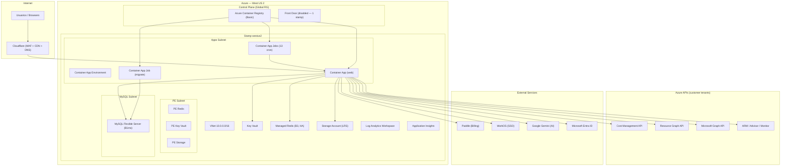
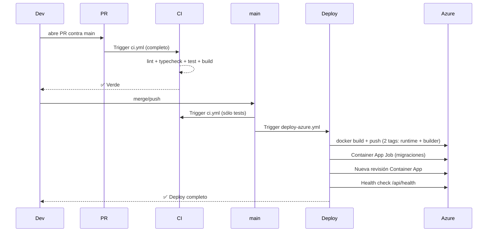
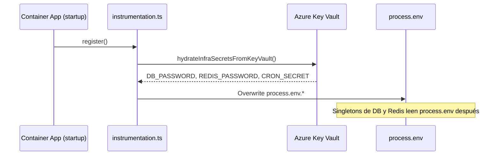
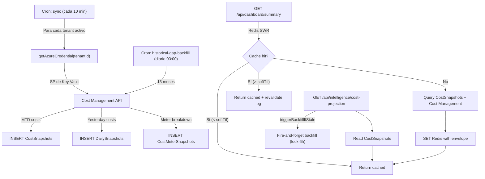

# Low-Level Design (LLD) — CSCloudSolutions FinOps Platform

**Versión:** 1.1  
**Fecha:** 2026-08-03  
**Autor:** Relevamiento automatizado sobre el codebase en `main` (commit post-PR #99)

---

## 1. Resumen Ejecutivo

CSCloudSolutions FinOps es una plataforma SaaS **Azure-only**, multi-tenant, diseñada para dar visibilidad, optimización y gobernanza del gasto en la nube de Microsoft Azure. Corre sobre **Next.js 16** (App Router, TypeScript) con backend integrado (API routes), persistencia en **MySQL Flexible Server** y caché/locks en **Azure Managed Redis (Balanced B3, HA)**.

### Métricas del codebase

| Dimensión | Valor |
|---|---|
| Líneas de código fuente (src/) | **~99,500** |
| Archivos TypeScript/TSX | **676** |
| Rutas API (route.ts) | **238** |
| Páginas de UI (page.tsx) | **127** (120 únicas bajo `[locale]/`) |
| Tablas de BD | **84** |
| Migraciones SQL | **57** |
| Tests (Vitest) | **65 archivos**, ~592 tests |
| Módulos Terraform | **18** |
| Líneas de IaC (.tf) | **~5,500** |
| Recursos de infra gestionados | **83+** |
| Variables de entorno (.env) | **72** |
| Idiomas (i18n) | **3** (es, en, pt-BR) — 4,114 strings c/u |

### Actualización relevante 2026-08-13

- Se agregó el módulo **Azure Integration Services (iPaaS)** en `intelligence/integration-services` con tabs:
  `logic-apps`, `apim`, `service-bus`, `event-grid`, `event-hubs`, `adf`.
- Backend nuevo: `GET /api/intelligence/integration-services/[service]` (tenant-scoped, mock por tier, KPIs + tabla FinOps/CMP).
- Sección específica en Logic Apps para **Conectores Enterprise**.
- Hardening de despliegue staging en migraciones:
  - `20260813-001-azure-foundry-snapshots.sql`: ajuste de prefijos de índice por límite MySQL (`ER_TOO_LONG_KEY`).
  - `20260813-001-tagging-policies-table.sql`: seed compatible con variantes de esquema legacy (`tenant_id|tenantId`, `policy_name|policyName|tag_key`, `is_required|isRequired|required`).
  - `.github/workflows/deploy-staging.yml`: diagnóstico automático de execution + replica logs ante fallo del job de migración.

---

## 2. Arquitectura de Alto Nivel



### Patrón de despliegue: Stamp-based

La infra usa un patrón de **stamps** (sellos regionales). Hoy existe un único stamp (`westus2`). La key del mapa es el valor de `Tenants.data_residency`. Agregar un segundo stamp requiere:
1. Declarar la entrada en `var.stamps`
2. Habilitar Front Door (`frontdoor_enabled = true`)
3. Configurar geo-routing en `stamp_geo_routing`

---

## 3. Stack Tecnológico

### 3.1 Frontend

| Tecnología | Versión | Propósito |
|---|---|---|
| Next.js | 16.2.7 | Framework full-stack (App Router, standalone output) |
| React | 19.2.4 | UI library |
| TypeScript | ^5 | Type safety |
| Tailwind CSS | ^4 | Styling |
| next-intl | ^4.13.0 | i18n (3 idiomas) |
| Recharts | ^3.8.1 | Gráficos y visualizaciones |
| Lucide React | ^1.17.0 | Iconos |
| SWR | ^2.4.2 | Data fetching client-side |
| Zustand | ^5.0.14 | State management |
| React Grid Layout | ^2.2.3 | Dashboard widgets configurables |
| cmdk | ^1.1.1 | Command Palette |
| MSAL Browser/React | ^5 | Auth con Microsoft Entra ID |

### 3.2 Backend

| Tecnología | Versión | Propósito |
|---|---|---|
| Next.js API Routes | 16.x | 238 endpoints REST |
| mysql2 | ^3.22.4 | Pool de conexiones a MySQL |
| ioredis | ^5.11.1 | Cliente Redis (TLS-aware) |
| jose / jsonwebtoken | ^6 / ^9 | JWT validation |
| @azure/* SDKs | Varios | Cost Management, Resource Graph, ARM, Graph, Key Vault, Identity, Storage |
| AI SDK (Vercel) | ^6.0 | Abstracción multi-proveedor IA |
| decimal.js | ^10.6.0 | Aritmética de precisión para costos |
| Paddle SDK | ^1.6.4 | Billing SaaS |
| WorkOS Node | ^10.7.0 | Enterprise SSO |

### 3.3 Infraestructura

| Componente | Recurso Azure | SKU/Tier |
|---|---|---|
| Compute | Container Apps | Consumption plan |
| Base de datos | MySQL Flexible Server | B1ms |
| Cache/Locks | Managed Redis | Balanced B3, HA |
| Secretos | Key Vault | Standard |
| Blobs | Storage Account | Standard LRS |
| Observabilidad | Log Analytics + App Insights | — |
| Registry | Container Registry | Basic |
| CDN/WAF | Cloudflare (externo) | — |
| IaC | Terraform | >= 1.8, azurerm ~> 4.0 |

---

## 4. Modelo de Datos

### 4.1 Esquema: 84 tablas

El esquema se gestiona vía **migraciones SQL incrementales** en `migrations/`. El runner ([migrations.ts](file:///Users/manuelchavez/Documents/FinOpsProyect/src/modules/storage/migrations.ts)) las aplica automáticamente en `initializeDatabase()`.

**Tablas core por dominio:**

| Dominio | Tablas principales |
|---|---|
| **Tenancy** | `Tenants`, `TenantSubscriptions`, `TenantCommercialDeals`, `TenantGlobalSettings`, `Users`, `TenantSSO`, `TenantDelegations`, `TenantProviderTransitions` |
| **Cost Data** | `CostSnapshots`, `cost_snapshots`, `CostMeterSnapshots`, `CostCategorySnapshots`, `DailySnapshots`, `AICostSnapshots` |
| **Optimization** | `RecommendationsCache`, `SavingsHistory`, `Anomalies`, `HARecommendations`, `AppServiceRecommendations`, `SqlDbRecommendations`, `StorageRecommendations`, `VmssRecommendations` |
| **Budgets** | `Budgets`, `TenantMonthlyBudgets`, `CostCenterBudgets`, `AlertRules` |
| **Governance** | `TaggingPolicies`, `ExpiringCredentials`, `PowerSchedules`, `TtlPolicies`, `TtlDeletions`, `AllocationRules` |
| **Cost Groups** | `CostGroups`, `CostGroupResourceGroups` |
| **Billing & Reports** | `ExecutiveReportJobs`, `ExecutiveReportHistory`, `TenantMarkupSettings`, `MarkupOverrideRules`, `TenantFocusSchedule`, `BillingTransactions`, `MarketplaceEvents`, `MACCCommitments` |
| **Auth/Security** | `AuthTokens`, `SSOSessions`, `MfaChallenges`, `LegalAcceptances`, `PublicApiKeys`, `MCPApiKeys`, `TenantPublicApiKeys`, `TenantMcpApiKeys` |
| **Support** | `SupportTickets`, `SupportTicketMessages`, `SupportTicketAttachments` |
| **Notifications** | `Notifications`, `TenantNotifications`, `NotificationChannels`, `NotificationLog` |
| **Platform & Operations** | `GlobalSettings`, `PlatformGlobalAiConfig`, `SaaSCronJobs`, `SaaSComponentHealth`, `TenantPartnerCenterAssociations`, `TenantM365CopilotSettings`, `PlatformIncidents`, `PlatformStatusSnapshots`, `PlatformAiUsage`, `SystemAlerts`, `LoadTestRuns`, `SaaSLoadTestHistory` |
| **Open Data** | `OpenDataServices`, `OpenDataRegions`, `OpenDataResourceTypes`, `OpenDataPricingUnits`, `OpenDataCommitmentEligibility`, `OpenDataSyncState`, `BillingPricingUnitsCatalog` |
| **Onboarding** | `OnboardingProgress`, `SignupEvents`, `AcademyProgress` |
| **Data Residency** | `DataResidencyChanges` |
| **FX** | `FxRates`, `UserCurrencyPreference`, `PricingUnits` |
| **FOCUS** | `FocusLineItems`, `FocusExportSchedules` |
| **Analytics** | `BusinessMetrics`, `BusinessMetricsConfig`, `CopilotUsage`, `TenantAiSettings`, `TenantIntegrations` |
| **Audit** | `AuditTrailLogs`, `ActionLogs`, `AiCache`, `DataPipelineEvents`, `RemediationRequests`, `RecommendationActions` |

### 4.2 Pool de Conexiones

- **Driver:** `mysql2/promise` con pool singleton vía `globalThis` (evita múltiples pools en hot-reload de dev).
- **Connection limit:** configurable vía `DB_POOL_LIMIT` (default 10).
- **TLS:** habilitado en prod vía `DB_SSL=true` (TLSv1.2, `rejectUnauthorized: true`).
- **Collation:** `utf8mb4_unicode_ci` (Terraform; **no** `utf8mb4_0900_ai_ci` — divergencia causa `ER_FK_INCOMPATIBLE_COLUMNS`).

### 4.3 Redis

- **Driver:** `ioredis` con TLS condicional (`REDIS_TLS=true` en prod).
- **Singleton** vía `globalThis`.
- **Puerto:** 6380 (TLS) / 6379 (plain).
- **Patrones de cache:**
  - **Simple TTL:** `getWithCache(key, fetcher, ttl)` — lookup → fetch → set EX.
  - **Stale-While-Revalidate:** `getWithStaleWhileRevalidate(key, fetcher, ttl, softTtl, dynamicTtl)` — envelope `{__sw, t, data}` con soft/hard TTL y deduplicación in-flight.
  - **Invalidación:** `invalidateCache(...keys)`, `invalidateCachePattern(glob)`.

---

## 5. Seguridad y RBAC

### 5.1 Autenticación

La plataforma soporta **dos mecanismos** de autenticación:

1. **Microsoft Entra ID (MSAL):** Flujo principal. El frontend obtiene un token MSAL y lo envía como `Authorization: Bearer <token>`. El backend valida el JWT contra OpenID Connect metadata de Microsoft, verifica `tid`, `aud`, `iss`, `exp`, y extrae claims.

2. **Enterprise SSO (WorkOS):** Para tenants Enterprise con SSO configurado. Flujo OAuth/SAML vía WorkOS.

**Guard chain** (en [requestAuth.ts](file:///Users/manuelchavez/Documents/FinOpsProyect/src/lib/requestAuth.ts)):

| Guard | Qué verifica |
|---|---|
| `requireRequestIdentity` | Token válido, claims básicos, rechaza MSA consumers (`9188040d-…`) |
| `requireTenantAccess` | Identity + usuario pertenece al tenant solicitado |
| `requireTenantRole` | TenantAccess + rol mínimo (Admin/Owner) |
| `requireTenantTier` | TenantAccess + tier del tenant ≥ tier requerido |
| `requireSuperAdmin` | Identity + `system_role = SUPERADMIN` |

**Protección IDOR:** La regla ESLint `local/no-unauth-tenant-id` en CI bloquea cualquier ruta que lea `tenantId` sin pasar por uno de los cinco guards (los cinco están en la allow-list de la regla).

**Gating de tier server-side:** `RouteTierGate`, `FeatureGuard` y el Sidebar filtran la UI, no la API. Toda ruta que sirva una feature registrada en `src/lib/routeTiers.ts` debe usar `requireTenantTier`, o un tenant de tier inferior puede pedirle los datos directo con un token válido de su propio tenant. Al 2026-08-21 lo usan 40 archivos de ruta; fue el finding **SEC-02** de `docs/security/audit-2026-08-21.md`.

**Orden de los branches demo respecto del guard — regla condicional.** El check `isMockTenant` puede ir **antes** del guard si y sólo si la rama mock devuelve exclusivamente literales sintéticos. Si esa rama consulta MySQL, Redis, Azure o cualquier estado compartido, **el guard va primero**: de lo contrario un llamador anónimo con `?tenantId=demo-x` alcanza ese estado sin autenticarse (finding **SEC-01** de `docs/security/audit-2026-08-09.md`). Al 2026-08-21 el código está repartido 76 rutas con mock primero y 70 con guard primero, y ambos órdenes son correctos donde están aplicados según ese criterio. Los mocks no son una frontera de autorización: un payload mock nunca puede contener datos de un tenant real, porque `isMockTenant` matchea las subcadenas `demo`/`mock` y ninguna de sus letras es un dígito hexadecimal válido en un GUID de Entra ID.

### 5.2 Modelo de Tiers y Control de Cuotas

```
Professional (1) < Business (2) < Enterprise (3)
```

Cada tier tiene **límites de uso contractuales** y **features gated**:

| Límite / Dimensión | Professional | Business | Enterprise |
|---|---|---|---|
| **Suscripciones Azure Vinculadas** | Hasta 2 suscripciones | Hasta 3 suscripciones | Ilimitadas / Personalizado |
| **Usuarios por Tenant** | Hasta 3 usuarios | Hasta 5 usuarios | Ilimitados |
| **Retención de Reportes Ejecutivos** | 90 días | 180 días | 365 días |
| **Frecuencia de Sync** | 6 horas | 1 hora | 10 minutos (Real-time) |
| **Features Exclusivas** | Básicas, +Anomalías, +Copilot IA | +Simulador What-If, +Cost Groups, +Remediación | Todo + SSO Enterprise + SLA 99.9% + Data Residency |

**Motor de Enforzamiento de Cuotas (`tierLimitsGuard.ts` & `useTenantPlanLimits.ts`):**
- Control reactivo antes del aprovisionamiento de nuevas suscripciones cloud (`canAddSubscription`).
- Despliegue de modal dinámico (`UpgradeModal.tsx`) con pasarela Paddle para tenants B2B.

### 5.3 Cron Jobs — Autenticación por `CRON_SECRET` y Arquitectura `async_poll`

Procesos periódicos autenticados con `Authorization: Bearer $CRON_SECRET`:

| Job | Frecuencia (GMT-3) | Propósito | Contrato |
|---|---|---|---|
| `sync` | diario 03:00 (06:00 UTC) | Sincroniza costos de Azure Cost Management con deadline cooperativo por tenant | `async_poll = true` |
| `prewarm-daily` | diario 04:00 (07:00 UTC) | Pre-cálculo y calentamiento exhaustivo de caché Redis (TTL 26h): KQL 30+ reglas, Zombies, Whiteboard, MTD/Históricos, Inventario, Tags, Madurez, Scorecard | `async_poll = true` |
| `historical-gap-backfill` | diario 00:00 (03:00 UTC) | Backfill y reconciliación de datos históricos faltantes (upsert-only) | `async_poll = true` |
| `prewarm-dashboard` | cada 10 min | Pre-cachea datos del dashboard general | Sincrónico (300s) |
| `prewarm-databases` | cada 15 min | Pre-cachea diagnósticos y métricas de los 12 motores de bases de datos (SQL, Cosmos, Postgres, MySQL, Mongo, Redis) | `async_poll = true` |
| `prewarm-compute` | cada 15 min | Pre-cachea workloads de cómputo (VMs, WebApps, Functions, VMSS, ARO) | `async_poll = true` |
| `prewarm-mysql-finops` | cada 20 min | Pre-cachea cockpit dedicado de Azure MySQL | Sincrónico (300s) |
| `prewarm-cosmos-finops` | cada 20 min | Pre-cachea cockpit dedicado de Cosmos DB | Sincrónico (300s) |
| `prewarm-mongo-finops` | cada 20 min | Pre-cachea cockpit dedicado de MongoDB | Sincrónico (300s) |
| `prewarm-sql-finops` | cada 20 min | Pre-cachea cockpit dedicado de Azure SQL / Managed Instance | Sincrónico (300s) |
| `prewarm-postgres-finops` | cada 20 min | Pre-cachea cockpit dedicado de PostgreSQL | Sincrónico (300s) |
| `prewarm-storage-finops` | cada 20 min | Pre-cachea cockpits dedicados de Almacenamiento | Sincrónico (300s) |
| `prewarm-security-finops` | cada 20 min | Pre-cachea módulo de Seguridad (Defender + service-cost) | Sincrónico (300s) |
| `anomaly-detection` | cada 5 min | Detección de anomalías de costo (Z-Score) | Sincrónico (300s) |
| `power-schedules` | cada 2 min | Ejecuta encendido/apagado programado de VMs | Sincrónico (120s) |
| `cost-sync-staleness-check` | diario 05:00 (08:00 UTC) | Alerta si el sync diario no dejó datos frescos | Sincrónico (default) |
| `credential-expiry-alerts` | diario 04:00 (07:00 UTC) | Alerta App Registrations por vencer | Sincrónico (default) |
| `focus-export-daily` | diario 04:00 (07:00 UTC) | Genera exports FOCUS 1.1 diarios automáticos | Sincrónico (1800s) |
| `open-data` | semanal (lunes 01:00) | Sincroniza datos abiertos de Azure FinOps Toolkit | Sincrónico (1800s) |
| `status-snapshot` | cada 5 min | Status page snapshot (uptime 30d) | Sincrónico (`auth_mode = query`) |
| `subscription-expiry` | diario 03:30 (06:30 UTC) | Alertas y corte de suscripciones canceladas vencidas | Sincrónico (default) |
| `support-attachments-cleanup` | diario 02:00 (05:00 UTC) | Limpieza de adjuntos de soporte > 60 días | Sincrónico (default) |
| `storage-retention-cleanup` | diario 04:00 (07:00 UTC) | Purga blobs de reportes ejecutivos según tier | Sincrónico (default) |
| `trial-expiry` | diario 22:00 (01:00 UTC +1) | Expira trials vencidos | Sincrónico (default) |
| `ttl-expiry-alerts` | diario 06:00 (09:00 UTC) | Alertas preventivas TTL antes de borrado | Sincrónico (default) |

> **Nota:** Los crons corren en **GMT-3** (`cron_timezone_offset_hours = -3`), no UTC. Los jobs pesados utilizan el protocolo `async_poll` con polling cada 15s (`?status=1`) y locks en Redis para evitar el timeout de 240s del Ingress de Azure Container Apps.

### 5.4 SuperAdmin Session Impersonation Engine

Motor de delegación de sesiones para auditoría y soporte SuperAdmin:
- **Intercambio Seguro:** Cookie HTTP-only cifrada `saas_impersonation_session` con validez máxima de 4 horas (`maxAge: 14400`).
- **Banner Flotante Global:** Componente renderizado en `z-[90]` que informa de manera nítida la identidad del tenant impersonado y el email del SuperAdmin ejecutor, con botón de retorno seguro a `/superadmin/tenants`.
- **Trazabilidad Inmutable:** Registro automático en `AuditTrailLogs` con `isImpersonated: true` y `executedBySuperAdmin`.

### 5.5 Headers de Seguridad

Configurados en [next.config.ts](file:///Users/manuelchavez/Documents/FinOpsProyect/next.config.ts):

- `X-Frame-Options: DENY`
- `X-Content-Type-Options: nosniff`
- `Referrer-Policy: strict-origin-when-cross-origin`
- `Permissions-Policy: camera=(), microphone=(), geolocation=(), payment=(), usb=()`
- `Strict-Transport-Security: max-age=31536000; includeSubDomains; preload` (solo prod)
- **CSP** completa con `default-src 'self'`, dominios permitidos para Paddle, Microsoft, Google Fonts, Cloudflare Insights.

---

## 6. Capa de Servicios (Negocio)

### 6.1 Services (26 archivos)

Los servicios viven en `src/services/` y encapsulan lógica de dominio. Los route handlers los invocan; nunca la UI directamente.

**Top 10 por complejidad:**

| Servicio | Líneas | Dominio |
|---|---|---|
| [anomalyDetectionService](file:///Users/manuelchavez/Documents/FinOpsProyect/src/services/anomalyDetectionService.ts) | 374 | Z-score anomaly detection |
| [reservationService](file:///Users/manuelchavez/Documents/FinOpsProyect/src/services/reservationService.ts) | 348 | RI/SP management |
| [powerScheduleService](file:///Users/manuelchavez/Documents/FinOpsProyect/src/services/powerScheduleService.ts) | 321 | VM start/stop scheduling |
| [haService](file:///Users/manuelchavez/Documents/FinOpsProyect/src/services/haService.ts) | 259 | High Availability assessment |
| [budgetService](file:///Users/manuelchavez/Documents/FinOpsProyect/src/services/budgetService.ts) | 241 | Azure budgets CRUD |
| [tagInheritanceService](file:///Users/manuelchavez/Documents/FinOpsProyect/src/services/tagInheritanceService.ts) | 186 | Tag compliance + remediation |
| [governanceReportingService](file:///Users/manuelchavez/Documents/FinOpsProyect/src/services/governanceReportingService.ts) | 184 | Governance score + report |
| [remediationService](file:///Users/manuelchavez/Documents/FinOpsProyect/src/services/remediationService.ts) | 179 | Delete/deallocate/downgrade VMs |
| [costGroupDetailMetricsService](file:///Users/manuelchavez/Documents/FinOpsProyect/src/services/costGroupDetailMetricsService.ts) | 168 | Cost group analytics |
| [snapshotService](file:///Users/manuelchavez/Documents/FinOpsProyect/src/services/snapshotService.ts) | 167 | Daily cost snapshots |

### 6.2 Modules (29 archivos)

Los módulos viven en `src/modules/` organizados en tres capas:

- **`collectors/azure/`** — Integraciones con SDKs de Azure (Cost Management, Resource Graph, Advisor, Graph, Log Analytics, Container Apps, Cosmos DB, etc.)
- **`core/`** — Motores agnósticos (AI Provider, FOCUS mapper, rightsizing engine, KQL catalog)
- **`storage/`** — Persistencia (pool MySQL, migrations, region pool)

**El archivo más complejo:** [billingService.ts](file:///Users/manuelchavez/Documents/FinOpsProyect/src/modules/collectors/azure/billingService.ts) — **1,302 líneas**. Es el corazón del sistema: consulta Cost Management por Management Group y por suscripción, con fallback, reintentos con backoff exponencial, y diagnóstico de 429s.

---

## 7. Pipeline CI/CD

### 7.1 Workflows

Son tres, y son los únicos: `ls .github/workflows/` devuelve `ci.yml`,
`deploy-azure.yml` y `terraform.yml`.

| Workflow | Trigger | Qué hace |
|---|---|---|
| [ci.yml](file:///Users/manuelchavez/Documents/FinOpsProyect/.github/workflows/ci.yml) | Push a `main` y PRs a `main` | En PR: lint → typecheck → test → build. En push a `main`: **sólo** el job de tests, porque el `next build` de la imagen ya hace los otros tres |
| [deploy-azure.yml](file:///Users/manuelchavez/Documents/FinOpsProyect/.github/workflows/deploy-azure.yml) | Push a `main` | `docker build` + push en el runner → migraciones (Container App Job) → nueva revisión → cron jobs → health check |
| [terraform.yml](file:///Users/manuelchavez/Documents/FinOpsProyect/.github/workflows/terraform.yml) | PR que toque `infra/terraform/**` | Checkov + Infracost + `plan`. Apply manual con confirmación `APPLY-PROD` |

Los dos que faltan respecto de versiones anteriores de este documento se
borraron, no se congelaron: `deploy.yml` y `restore-test.yml` se fueron en
`0fe7f17` con el resto del VPS retirado, y `deploy-staging.yml` en `78a6d1f`.
No hay rama `staging` ni workflow que la dispare.

### 7.2 Flujo de deploy



### 7.3 Docker

- **Multi-stage build** ([Dockerfile](file:///Users/manuelchavez/Documents/FinOpsProyect/Dockerfile)): `deps` → `builder` → `runner`
- **Base:** `node:22-alpine`
- **Output:** `standalone` (Next.js)
- **Sin BuildKit** (ACR Tasks no lo soporta)
- **Build args:** 8 variables `NEXT_PUBLIC_*` inyectadas en build-time
- **User:** `nextjs` (uid 1001, sin root)

---

## 8. Integraciones Externas

### 8.1 Azure (tenant del cliente)

| API | Propósito | Autenticación |
|---|---|---|
| Cost Management | Costos MTD, forecast, histórico | SP del cliente (credentials en Key Vault) |
| Resource Graph | Inventario de recursos | SP del cliente |
| Advisor | Recomendaciones de optimización | SP del cliente |
| Microsoft Graph | Usuarios, licencias, MFA, M365 | SP del cliente |
| ARM (Compute, Network, Monitor) | Rightsizing, métricas | SP del cliente |
| Entra ID | Autenticación de usuarios | MSAL (browser) |

### 8.2 Servicios Terceros

| Servicio | Propósito | Configuración |
|---|---|---|
| **Paddle** | Billing SaaS (checkout, subscriptions, webhooks) | `PADDLE_API_KEY`, `PADDLE_WEBHOOK_SECRET` en Key Vault |
| **WorkOS** | Enterprise SSO (SAML/OIDC) | `WORKOS_API_KEY`, `WORKOS_CLIENT_ID` |
| **Google Gemini** | AI reports, copilot, assessments | `GEMINI_API_KEY` |
| **Cloudflare** | CDN, WAF, DNS | Full strict SSL, dominio `finops.cscloudsolutions.com.ar` |

---

## 9. Secretos y Key Vault

### 9.1 Flujo de hidratación



### 9.2 Credenciales de tenant

Los Service Principals de cada tenant se almacenan en Key Vault como secrets con naming convention:
- `tenant-{tenantId}-client-id`
- `tenant-{tenantId}-client-secret`

El módulo [keyvault.ts](file:///Users/manuelchavez/Documents/FinOpsProyect/src/lib/keyvault.ts) implementa cache con soft/hard TTL para evitar llamadas excesivas.

---

## 10. Superficie de UI

### 10.1 Navegación principal (120 páginas)

| Sección | Páginas | Tier mínimo |
|---|---|---|
| Dashboard (raíz) | 1 | Professional |
| Intelligence | 42 | Professional → Enterprise |
| Admin | 32 | Professional → Enterprise |
| Overview | 9 | Professional |
| Governance | 7 | Professional → Enterprise |
| Legal | 5 | — (público) |
| Superadmin | 5 | SUPERADMIN |
| Cleanup | 4 | Professional → Business |
| Mobile | 4 | Professional |
| Academy | 1 | Professional |
| Demo | 1 | — |

### 10.2 Componentes destacados

| Componente | Líneas | Rol |
|---|---|---|
| [TenantProvider](file:///Users/manuelchavez/Documents/FinOpsProyect/src/components/TenantProvider.tsx) | 76,158 bytes | Context global de tenant, suscripciones, scope |
| [ZombieResourcesTable](file:///Users/manuelchavez/Documents/FinOpsProyect/src/components/ZombieResourcesTable.tsx) | 51,516 bytes | Tabla interactiva de recursos zombie |
| [AdvisorPanel](file:///Users/manuelchavez/Documents/FinOpsProyect/src/components/AdvisorPanel.tsx) | 42,830 bytes | Panel de Azure Advisor |
| [TagManager](file:///Users/manuelchavez/Documents/FinOpsProyect/src/components/TagManager.tsx) | 35,685 bytes | Gestión de tags Azure |
| [GlobalCopilot](file:///Users/manuelchavez/Documents/FinOpsProyect/src/components/GlobalCopilot.tsx) | 30,916 bytes | Copilot IA flotante |
| [Sidebar](file:///Users/manuelchavez/Documents/FinOpsProyect/src/components/Sidebar.tsx) | 30,172 bytes | Navegación lateral |
| [ClientShell](file:///Users/manuelchavez/Documents/FinOpsProyect/src/components/ClientShell.tsx) | 25,384 bytes | Shell principal client-side |
| [PricingPage](file:///Users/manuelchavez/Documents/FinOpsProyect/src/components/PricingPage.tsx) | 24,077 bytes | Pricing + checkout Paddle |
| [mockData](file:///Users/manuelchavez/Documents/FinOpsProyect/src/lib/mockData.ts) | 160,657 bytes | Datos mock por tier (demo) |
| [apiErrors](file:///Users/manuelchavez/Documents/FinOpsProyect/src/lib/apiErrors.ts) | — | `serverError` (respuesta 500 sin filtrar internals) + narrowing tipado de errores capturados: `errorMessage`, `errorStatus` (acotado al rango HTTP 100-599 para no propagar errnos de driver), `errorCode`. Usado en 489 bloques `catch`, en reemplazo de `catch (e: any)` |

---

## 11. Infraestructura Terraform

### 11.1 Módulos (18)

```
infra/terraform/modules/
├── acr/               # Container Registry
├── budget/            # Azure Budget + Action Groups
├── containerapp/      # Container App + Environment
├── cronjobs/          # 13 Container App Jobs (cron)
├── custom_domain/     # Custom domain + Managed Certificate
├── defender/          # Microsoft Defender for Cloud
├── diagnostics/       # Diagnostic settings
├── frontdoor/         # Azure Front Door (disabled)
├── keyvault/          # Key Vault + access policies
├── monitoring/        # Action groups + metric alerts
├── mysql/             # MySQL Flexible Server
├── mysql_backup/      # Backup automation (VM + blob)
├── network/           # VNet + subnets + NSGs + DNS zones
├── private_dns/       # Private DNS zones
├── redis/             # Managed Redis (Enterprise)
├── security_policy/   # Security policies
├── stamp/             # Orquestador de un stamp completo
└── storage/           # Storage Account
```

### 11.2 Trampas conocidas de Terraform

> [!WARNING]
> Estas trampas están documentadas extensamente en [HANDOFF-FINAL-2026-07-28.md](file:///Users/manuelchavez/Documents/FinOpsProyect/HANDOFF-FINAL-2026-07-28.md).

1. **Redis HA:** `CREATE` con `high_availability=true` falla en West US 2. Crear con false, luego `UPDATE` a true.
2. **Managed Certificate bugs:** IDs desalineados entre `managedCertificates` y `certificates`. Se resuelve con `replace()`.
3. **State key:** Es `prod/terraform.tfstate` (con barra), no `prod.tfstate`.
4. **Collation MySQL:** El server usa `utf8mb4_unicode_ci`; local sin flag usa otra → FKs rompen.
5. **`AZURE_CLIENT_ID`** tiene 3 significados distintos según el contexto. Ver sección de trampas del handoff.

---

## 12. Estado Actual y Pendientes

### 12.1 ✅ Funcionando

- Deploy automático end-to-end (push a `main` → Container Apps)
- Dominio propio `finops.cscloudsolutions.com.ar` con certificado
- Autenticación MSAL + SSO
- 238 API routes con RBAC
- 4 tiers con feature gating
- Billing vía Paddle (checkout, subscriptions, webhooks)
- i18n en 3 idiomas
- 592 tests en verde
- Checkov 122/122 checks
- Key Vault para secretos de infra y tenant

### 12.2 ⚠️ Pendientes abiertos

| # | Pendiente | Severidad | Detalle |
|---|---|---|---|
| 1 | **KPIs de costo discrepantes** | Resuelto | Whiteboard usa una única colección MTD para KPI, Top Servicios y Centros de Costos; el refresh invalida ambas capas Redis y un `$0.00` real no se sustituye por mocks. |
| 2 | **Container Apps / Log Analytics tarjetas vacías** | Media | Puede ser víctima del 429 throttling. Necesita verificación en devtools post-deploy. |
| 3 | **Ahorro potencial: `Number("1,234.56") = NaN`** | Media | `extractSavings` parsea strings con separador de miles. Fix: limpiar la coma antes de `Number()`. |
| 4 | **429 del cron sync** | Media | Operaciones `yesterday(MG)` y `detailed()` concentradas a las 06:00 UTC. Solución: espaciar barrido de tenants o usar ventanas. |
| 5 | **`allowed_ip_ranges` vacío** | Baja | El FQDN de Azure es accesible directo sin Cloudflare WAF. El mecanismo existe en Terraform, solo falta cargar rangos de Cloudflare. |
| 6 | **Resource locks deshabilitados** | Baja | `resource_lock_enabled = false`. Habilitar cuando la infra estabilice. |
| 7 | **Drift de tags/workload_profile** | Cosmético | ~17 cambios permanentes en `plan`. Declarar valores explícitamente. |

### 12.3 Deuda técnica identificada

| Área | Descripción | Estado |
|---|---|---|
| `billingService.ts` (1,302 LoC) | Archivo monolítico refactorizado en submódulos por dominio (`billingTypes`, `mtdBillingService`, `forecastBillingService`, `yesterdayBillingService`, `historicalBillingService`) con patrón facade retrocompatible. | ✅ Completado (2026-07-31) |
| `TenantProvider.tsx` (76KB) | Componente god-object. Debería descomponerse. | Pendiente |
| `mockData.ts` (160KB) | Archivo masivo de mocks. Considerar archivos por dominio. | Pendiente |
| Tests | 66 archivos de test (638 pasados) con aislamiento por archivo en Vitest. | En progreso |
| SMTP | 6 variables SMTP declaradas con 0 usos — están configuradas pero no implementadas. | Pendiente |
| `PROVIDER_ARCHIVE_RETENTION_DAYS` | Variable obsoleta de proveedor eliminado removida de `.env.example`. | ✅ Completado (2026-07-31) |

---

## 13. Diagrama de Flujo de Datos — Ciclo de Costos

### 12.9 Azure Advisor (`/governance/advisor`)

- **UI:** `AdvisorPanel` (5 pestañas de pilar + tabla CMP + modal resolutivo). **API:** `GET /api/advisor`
  (SWR Redis `advisor:v4:*`, 30 min, `bust=1` invalida), `POST|DELETE /api/advisor/suppress`.
- **Servicio:** `getAdvisorExecutiveData` → `collectAdvisorData` (REST `2023-01-01`, paginada) +
  `deduplicateAndProcessRecommendations`.
- **Identidad del tenant:** `tenantName` es el nombre comercial resuelto desde
  `TenantGlobalSettings.organization_display_name` con fallback a `Tenants.company_name`; el GUID de Entra
  ID viaja aparte en `tenantGuid` y sólo se muestra como micro-badge con copiado. Nunca se publica el GUID
  como nombre.
- **Normalización i18n:** `advisorI18n.ts` es la única fuente. `category` e `impact` llegan de Azure siempre
  en inglés (el `Accept-Language` no los localiza), así que se traducen con `translateAdvisorCategory` /
  `translateAdvisorImpact` en el servidor y viajan como `categoryDisplayName` / `impactDisplayName`.
- **Deduplicación:** clave `categoría + recommendationTypeId + recurso` (`dedupKey`). El id crudo de Advisor
  cambia por suscripción y consulta, por lo que no sirve como identidad. En duplicados exactos gana el
  `lastUpdated` más reciente; las reservas agrupan además por suscripción.
- **Recurso afectado:** se parsea el ARM Resource ID de `resourceMetadata.resourceId` (precedencia sobre
  `impactedValue`, que trae el nombre corto) con `extractResourceDisplayName` → `resource: ParsedArmResource`
  (`rawId`, `subscriptionId`, `resourceGroup`, `resourceType`, `resourceName`). Sin valores inventados: si
  Advisor no expone grupo, el campo va vacío.
- **Acción sugerida:** `generateAdvisorRemediationAction` sintetiza la remediación concreta por tipo de
  recurso y `extendedProperties` (RIGHTSIZE / DELETE_ZOMBIE / ENABLE_HA / PURGE_STORAGE /
  PURCHASE_RESERVATION / APPLY_AHUB / UPDATE_TAGS / REVIEW). Es determinista a propósito —corre sobre cientos
  de recomendaciones por carga y el payload de Advisor ya trae SKU destino, CPU y ahorro—; sólo emite
  `UPDATE_TAGS` cuando la regla es de etiquetado.
- **Posposición (snooze) y Descarte Permanente:** persiste en `RecommendationActions` (`status='suppressed'`,
  `expires_at` con fecha para 30/90 días o `NULL` para descarte permanente, `user_email`, unique `tenant_id + recommendation_id`);
  se guarda la `dedupKey` como `recommendation_id` para que sobreviva al cambio de id crudo de Azure.
  `getAdvisorExecutiveData` reactiva las expiradas (`expires_at <= NOW()`) y excluye las vigentes de todas las vistas activas
  de Optimización y del cálculo del **Índice de Optimización (COIN)** (clasificándolas como *snoozed* o *dismissed* sin sumar al ahorro potencial pendiente).
  Requiere rol **Admin/Owner** del tenant. La UI aplica actualización optimista (quita la fila y descuenta los KPIs del pilar)
  revirtiendo si el POST falla.
- **Alcance Azure vs. Plataforma:** Las supresiones efectuadas en el Portal de Azure son detectadas y sincronizadas hacia la
  plataforma vía la REST API de suppressions de Azure. Las supresiones/descartes ejecutados desde la plataforma se gobiernan
  localmente en el tenant (principio de menor privilegio para no exigir permisos de escritura en Azure), por lo que en el Portal
  de Azure la recomendación podría continuar visible mientras que en la plataforma FinOps queda formalmente suprimida, auditada y fuera de los cálculos.

### 13.0 Whiteboard / Resumen Ejecutivo

- **Ruta UI:** `/[locale]/overview/whiteboard`, renderizada por `ExecutiveSummaryBoard` sobre `react-grid-layout`.
- **API facade:** `/api/overview/whiteboard` aplica mock-first, RBAC para tenants reales y caché aislada por tenant, locale y modo `mock|live`.
- **Agregador financiero:** `/api/intelligence/whiteboard` obtiene una colección mensual única desde Azure Cost Management (`ActualCost`) y deriva de ella `summary.costMtdUSD`, Top 4 servicios y gasto por CostCenter. Si Azure no entrega filas, usa `CostSnapshots` del mes actual sin datos sintéticos.
- **Fuentes complementarias:** `CostCenterBudgets`, Resource Graph para cobertura de tags, `getAdvisorExecutiveData` para pilares, Advisor Score y quick wins, `/api/dashboard/summary` para zombies y carbono.
- **Advisor (pilares, score y quick wins):** se consume `getAdvisorExecutiveData` —la misma fuente que `/governance/advisor`— y no `collectAdvisorData` crudo: viene deduplicada por recurso+regla (las variantes de término 1y/3y de una reserva colapsan en una) y se filtran las recomendaciones no activas (`postponed`/`dismissed`), de modo que los conteos coincidan con Azure Advisor. El `summary.advisorScore` es la media ponderada por consumo de la Advisor Score API. Cada quick win trae su comando CLI/PowerShell resuelto en servidor por `buildAdvisorRemediationCommand` sobre el `resourceId` real (el widget sólo tiene un generador de fallback).
- **Enriquecimiento server-to-server:** el self-fetch a `/api/dashboard/summary` (zombies, ahorro potencial, carbono) forwardea el `Authorization` o `X-Cron-Auth` de la request entrante; ese endpoint no acepta `x-forwarded-request` como credencial y sin forward devolvía 401 con KPIs en 0.
- **UX y personalización:** cinco KPI superiores y 16 tarjetas reubicables/redimensionables. Layout, visibilidad y panel lateral “Personalizar Tarjetas” se persisten por navegador; Top Servicios no incluye la categoría artificial Total y los ejes usan formatter adaptativo. El Copilot global permanece en `z-40`.
- **Pines:** widgets `whiteboard.*` registrados en `widgetRegistry`; demo persiste en `localStorage` y tenants reales en `UserDashboardPins` con RBAC.



### 13.1 Flujo de AI Cost Analytics (Microsoft Foundry / Azure OpenAI)

- **Ruta:** `GET /api/intelligence/ai-analytics`.
- **Fuente primaria:** `AICostSnapshots` (tokens por modelo desde Azure Monitor sobre `Microsoft.CognitiveServices/accounts`).
- **Métricas soportadas:** `ProcessedPromptTokens`, `GeneratedTokens` y `ProcessedInferenceTokens`.
- **Ingesta resiliente por métrica (fix 2026-08-05):** las métricas se piden **una por una** a Azure Monitor (no en un solo batch) porque el servicio rechaza todo el batch con 400 si un `metricname` no existe para ese recurso (p.ej. `ProcessedInferenceTokens` en cuentas Azure OpenAI clásicas). Cada métrica reintenta sin el filtro `ModelDeploymentName eq '*'` para cubrir recursos Foundry que no exponen esa dimensión. Ventana = ayer completo + hoy parcial; persistencia por fecha de datapoint (UTC).
- **Fallback de costos (SQL GROUP BY fix 2026-08-05):** cuando no hay desglose de tokens, consulta `CostSnapshots` por huellas de Microsoft Foundry / Azure AI Services / OpenAI (service + meter). Query incluye todas las columnas no agregadas en el GROUP BY para cumplir con `sql_mode=only_full_group_by` de Azure MySQL — antes fallaba silenciosamente, impidiendo que **ningún dato** se retornara incluso con filas válidas en BD.
- **Precisión de costos:** los totales, agrupaciones, tendencias y costo por 1K tokens conservan `Decimal` durante la agregación; la conversión a número ocurre solo en el límite de serialización con redondeo explícito.
- **Endpoint de diagnóstico:** `GET /api/intelligence/ai-analytics/diagnostics?tenantId=…` (guard `requireTenantAccess`). Reporta estado de `AICostSnapshots`, suscripciones visibles (con truncado por tier), cuentas `Microsoft.CognitiveServices/accounts` + `kind`, definiciones de métricas disponibles, prueba real de cada métrica de token (series + suma) y filas que produciría el colector, con conclusión heurística de por qué el panel está en cero. No requiere acceso a DB de prod ni a logs del cron. Incluye paginación 15/30/45/60 items por página.
- **RBAC mínimo:** no requiere rol nuevo; usa `Reader`, `Cost Management Reader`, `Monitoring Reader`, `Billing Reader`.

### 13.2 Costo actual MTD en productos Azure AI

- **Contrato canónico:** las ocho capacidades (`Foundry`, `AI Search`, `Document Intelligence`, `Speech & Language`, `Vision & Video`, `Content Safety`, `Azure ML` y `Databricks`) exponen `currentCostMtdUSD` como costo facturado acumulado del mes actual. `monthlyCostUSD` se conserva temporalmente como alias compatible para cachés y clientes anteriores.
- **Fuente:** Azure Cost Management con `timeframe: MonthToDate` y filtro exacto por `ResourceId`; si la API no está disponible se usa el snapshot MTD más reciente del mismo recurso. Un `$0.00` válido se conserva y nunca se reemplaza por precio teórico de SKU, páginas o capacidad.
- **Snapshots acumulativos:** `selectLatestAzureAiSnapshots` conserva el registro más reciente por recurso/deployment antes de agregar, evitando sumar snapshots diarios que ya contienen acumulados MTD.
- **Actualización manual:** `refresh=true` omite el caché consolidado y vuelve a consultar los collectors. Demo/mock se resuelve antes de RBAC y tenants reales nunca reciben datos sintéticos como fallback.

### 13.3 Azure AI Document Intelligence

- **Ruta UI/API:** `/[locale]/intelligence/azure-ai/document-intelligence` consume `GET /api/intelligence/azure-ai/document-intelligence?tenantId=…&days=mtd|30|90`.
- **Inventario:** `azureDocumentIntelligence.service.ts` consulta Resource Graph por `Microsoft.CognitiveServices/accounts` con kind `FormRecognizer`, `DocumentIntelligence` o `AIServices`; conserva `resourceId`, RG, región, suscripción, SKU, red pública y Private Endpoints.
- **Modelos custom:** intenta primero `/documentintelligence/models?api-version=2024-02-29-preview` y luego el endpoint estable `formrecognizer/documentModels`; la ausencia de permiso o endpoint no fabrica modelos.
- **Telemetría:** Azure Monitor consulta `ProcessedPages`, `TotalCalls`, `SuccessfulCalls`, `TrainingHours`, `ClientErrors` y `ServerErrors` por día. Si ARG devuelve vacío, el estado real permanece vacío; snapshots SQL solo se usan cuando ARG falla técnicamente.
- **Economía unitaria:** el costo canónico es Cost Management MTD por `ResourceId`. El reparto Read/Layout/Specialized/Custom/Training usa tarifas relativas únicamente para atribuir el total real, sin reemplazar `$0.00` ni modificar el total facturado.
- **Reglas:** Custom→Prebuilt, Commitment Tier sobre 50K páginas, dev S0→F0 bajo 500 páginas y cuentas huérfanas. `calculateDocIntelligencePotentialSavings` evita sumar ahorros superpuestos.
- **Seguridad:** `isMockTenant`/`mock=true` antes de `requireTenantAccess`; tenants reales nunca reciben fallback mock. Roles mínimos: Reader, Monitoring Reader y Cost Management Reader.

---

## 14. Convenciones del Proyecto

- **Commits:** granulares, con prefijo convencional (`feat:`, `fix:`, `chore:`…) y `Co-authored-by: Copilot`.
- **Migraciones:** `YYYYMMDD-NNN-descripcion.sql`, idempotentes (`IF NOT EXISTS`).
- **i18n:** toda string visible usa `useTranslations()`, 3 idiomas siempre en paridad.
- **Mocks por tier:** cada feature incluye mocks representativos en `mockData.ts`.
- **Precision:** costos en `DECIMAL` en DB, `decimal.js` en JS.
- **Auth:** toda ruta API que lea `tenantId` del cliente DEBE pasar por un guard de `requestAuth.ts`.

---

## 15. Variables de Entorno — Resumen

De las 72 variables declaradas:
- **35** con uso activo en `src/`
- **14** son healthcheck URLs de crons (usadas externamente, 0 en código)
- **6** son SMTP (declaradas pero sin implementación)
- **17** son de infraestructura/build (Terraform, Docker, Next.js build)

Las variables críticas están en Key Vault:
- `infra-db-password`, `infra-redis-password`, `infra-cron-secret`
- `tenant-{id}-client-id`, `tenant-{id}-client-secret`
- `infra-paddle-api-key`, `infra-paddle-webhook-secret`

---

## 16. Addendum 2026-08-03 — Operaciones SuperAdmin, PAL/CPOR y comisiones

### 16.1 Centro de Operaciones SaaS (SuperAdmin)

- **Nueva UI:** `/superadmin/ops` (solo `SUPERADMIN`).
- **Nueva API:** `GET/POST /api/superadmin/ops`.
  - `GET`: resumen de salud de componentes, cron status y cobertura de canales.
  - `POST`: dispatch de notificación operativa a tenants administrados.
- **RBAC:** guard estricto `requireSuperAdmin`.

### 16.2 Observabilidad persistente de crons

- **Nueva tabla:** `SystemCronRuns` (migración `20260803-001-system-cron-runs.sql`).
- **Helper reusable:** `src/lib/cronRunTracker.ts`.
- **Instrumentación aplicada** en crons críticos (`sync`, `power-schedules`,
  `status-snapshot`, `anomaly-detection`, `credential-expiry-alerts`,
  `ttl-expiry-alerts`, `cost-sync-staleness-check`, `focus-export-daily`,
  `historical-gap-backfill`).
- Cada ejecución registra `cron_name`, `status`, `duration_ms`, `summary`,
  `details`, timestamp y contexto de error.

### 16.3 Gestión comercial por tenant (vendedor + comisión)

- **UI SuperAdmin:** `/admin/tenants` incorpora edición por fila de:
  - `sales_referrer` (vendedor/referido)
  - `sales_commission_pct` (DECIMAL, 0–100, 2 decimales)
- **API:** `PATCH /api/admin/tenants` extendido para `salesCommissionPct`.
- **DB:** migración `20260803-002-tenants-sales-commission.sql` agrega:
  - `sales_commission_pct DECIMAL(5,2)`
  - `sales_commission_updated_by VARCHAR(320)`
  - `sales_commission_updated_at DATETIME`

### 16.4 PAL/CPOR (UX de recuperación)

- El bloque de asociación PAL/CPOR en onboarding vuelve a mostrarse mientras el
  estado no sea `LINKED` (incluye `FAILED`/`DECLINED`), permitiendo reintento
  sin depender de resets manuales de estado.

## 17. Dashboard & UI Fixes (Agosto 2026 - Sprint Whiteboard)

### 17.1 AI Cost Analytics Fixes (Commits 5035ad0, 6a79b52, 1be9ba6)

- **SQL `only_full_group_by` fix:** Corregidas queries en `/api/intelligence/ai-analytics/route.ts`
  - Las columnas en SELECT ahora coinciden con las expresiones COALESCE en GROUP BY
  - Previene silent failures (0 rows returned) en MySQL 8+
- **Date format fix:** Azure SDK devuelve Date objects, no ISO strings
  - Agregada detección en `aiUsageCollector.ts`: `dateObject.toISOString().substring(0, 10)`
  - Valida formato YYYY-MM-DD antes de INSERT en AICostSnapshots

### 17.2 Dashboard Feature Fixes

#### Whiteboard - Tendencia Recomendaciones (Commit a43da23)
- Cambio de filtro: `updated_at BETWEEN` → `created_at` con `status='open'`
- Ahora muestra recomendaciones activas incluso si son viejas (no fueron tocadas)

#### Ahorro Capturado (Commit aacf5b5)
- Nueva función `getTopSavingsResources()` en `/api/intelligence/captured-savings/route.ts`
- UI muestra tabla de top 10 recursos por ahorro estimado
- Permite visibility de qué assets generan más savings

#### Fugas Financieras (Commit a02e65d)
- ZombieResourcesTable ahora siempre visible (antes solo en click)
- Simplificado UI flow

#### Grupos de Costos - Error Untagged/unknown (Commit 37e07f1)
- Problema: Forward slash en `"Untagged/Unknown"` causaba error de pattern matching en rutas dinámicas
- Solución: Renombrado a `"Untagged"` en 6 archivos
- Archivos afectados: `cost-groups/[name]/route.ts`, `cost-groups/route.ts`, whiteboard, top-expenses, scorecard, mockData

#### Centros de Costos - Editables (Commit c66f976)
- Removida condición `data?.isCustom` para mostrar botones edit/delete
- Ahora todos los cost groups pueden ser editados, no solo los custom

#### Unit Economics - Formato Moneda (Commit f1795d8)
- Cambio: `costPerUserCents` → `costPerUserDollars` (sin *100)
- Tooltip formatter usa `format()` en lugar de mostrar `¢`
- Gráfico ahora muestra $1.23 en lugar de 123¢

## 18. Addendum 2026-08-07 — Pestaña acfr y métricas de Azure Cache for Redis

### 18.1 Endpoint de Métricas API (Commit de la sesión)
- **API Route:** `GET /api/intelligence/databases/redis-metrics`
- **Métricas Consultadas:** Consultas en paralelo de las 12 métricas críticas de Azure Monitor utilizando agregación `Average`, intervalo `PT1H` (por hora) y ventana de tiempo `PT24H` (últimas 24 horas):
  - CPU Usage (`PercentProcessorTime`), Server Load (`ServerLoad`), Used Memory (`UsedMemory`), Cache Hits (`CacheHits`), Cache Misses (`CacheMisses`), Connected Clients (`ConnectedClients`), Operations Per Second (`OperationsPerSecond`), Evicted Keys (`EvictedKeys`), Expired Keys (`ExpiredKeys`), Errors (`Errors`), Total Commands Processed (`TotalCommandsProcessed`), Cache Read (`CacheRead`) y Cache Write (`CacheWrite`).
- **Mocks Enriquecidos:** Si `isMockTenant` es `true` o no hay suscripciones activas, genera series temporales de simulación realistas con patrones diarios de uso comercial (más alto entre las 9am y 6pm) e incorpora un 10% de ruido aleatorio controlado y variaciones en forma de ondas sinusoidales para cada una de las 12 métricas.

### 18.2 UI de Supervisión (Pestaña acfr)
- **Ruta de UI:** `/intelligence/bases-de-datos/acfr` (montando el componente `RedisCacheFinopsBoard`)
- **Visualización:**
  - Panel superior con selectores de instancias de Redis, tarjetas ejecutivas para promedios de CPU, Memoria, Tasa de aciertos (Cache Hit Rate) y Carga de Servidor.
  - Grilla de visualización responsiva con 12 paneles de gráficas de área (`AreaChart` con gradientes de relleno lineales y bordes glassmorphic) donde se detalla la evolución de cada métrica con agregación promedio de forma explícita.
  - El gráfico 12 combina `CacheRead` (Network Read) y `CacheWrite` (Network Write) superpuestos en la misma vista de área interactiva con doble leyenda.

## 19. Addendum 2026-08-08 — Pestaña mysql y métricas de Azure Database for MySQL

### 19.1 Endpoint de Métricas API (MySQL)
- **API Route:** `GET /api/intelligence/databases/mysql-metrics`
- **Métricas Consultadas:** Consultas en paralelo de las 8 métricas críticas de Azure Monitor utilizando agregación `Average`, intervalo `PT1H` (por hora) y ventana de tiempo `PT24H` (últimas 24 horas) para servidores flex/single:
  - CPU Usage (`cpu_percent`), Memory Usage (`memory_percent`), Active Connections (`active_connections`), Failed Connections (`connections_failed`), Storage Usage (`storage_percent`), I/O Utilization (`io_consumption_percent`), Network Ingress (`network_bytes_ingress`) y Network Egress (`network_bytes_egress`).
- **Mocks Enriquecidos:** Si `isMockTenant` es `true`, genera series temporales con variaciones de carga comercial en horas pico de negocio, incluyendo ruido dinámico aleatorio y fluctuaciones en conexiones y bytes de red.

### 19.2 UI de Supervisión (Pestaña mysql)
- **Ruta de UI:** `/intelligence/bases-de-datos/mysql` (montando el componente `AzureMySqlFinopsBoard`)
- **Visualización:**
  - Panel superior con selectores de instancias de MySQL, tarjetas ejecutivas para promedios de CPU, RAM, Conexiones, Almacenamiento y el costo mensual acumulado real obtenido mediante `getMonthlyCostByType` y `distributeCostPerResource`.
  - Grilla de gráficos responsiva de 7 paneles interactivos con gradientes visuales y tooltips formateados de forma nativa para bytes, porcentajes y totales numéricos.

## 20. Addendum 2026-08-09 — Integridad de diagnósticos y sincronización

- **Autorización antes de mocks:** los endpoints de diagnósticos de MySQL, Redis, Cosmos DB, MongoDB, PostgreSQL, SQL y sus métricas exigen `requireTenantAccess` antes de evaluar el tenant demo.
- **Costos exactos:** la distribución de costos por recurso y las agregaciones de AI Analytics usan `decimal.js`; cada asignación se redondea explícitamente a centavos solo al formar la respuesta API.
- **Telemetría operacional:** los diagnósticos MySQL y Redis expresan campos o muestras sin medición como `null` y exponen `telemetry.available=false` con el origen `not_collected` cuando no existe telemetría. La UI muestra `No disponible`, no valores cero fabricados. Si Azure Monitor no entrega historial Redis, la API devuelve un historial vacío y el mismo estado explícito.
- **Sincronización cancelable:** el cron `sync` propaga un `AbortSignal` desde el deadline por tenant a Cost Management, Azure Monitor, Resource Graph, reintentos y concurrencia. Los guards locales impiden persistencias e invalidaciones de caché posteriores a una cancelación.

## 21. Addendum 2026-08-18 — Módulo de Redes Básicas (VNets, Private Endpoints, DNS, NSG & UDR)

### 21.1 Arquitectura y Capa de Datos
- **Service Backend:** `src/services/azureBasicNetworking.service.ts`
- **Tipado TypeScript:** `src/types/basicNetworking.types.ts` (`BasicNetworkResource`, `BasicNetworkSummary`, `BasicNetworkRemediationAction`, `BasicNetworkingResponse`).
- **Endpoint API:** `GET /api/intelligence/network/basic` (con guard `requireTenantAccess`, mock check previo e invalidación SWR / stale-while-revalidate).
- **Inventario Azure Resource Graph:**
  - Virtual Networks (`Microsoft.Network/virtualNetworks`): `addressPrefixes`, `subnets`, `virtualNetworkPeerings`.
  - Private Endpoints (`Microsoft.Network/privateEndpoints`): `customDnsConfigs`, `networkInterfaces`, `privateLinkServiceConnections`.
  - Private DNS Zones (`Microsoft.Network/privateDnsZones`): conteo de `virtualNetworkLinks`.
  - Network Security Groups (`Microsoft.Network/networkSecurityGroups`): verificación de subredes y NICs asociadas (detección de huérfanos).
  - Route Tables / UDR (`Microsoft.Network/routeTables`): verificación de subredes asociadas (detección de huérfanos).
- **Motor de Higiene y Remediación:**
  - Detección de NSGs y UDRs huérfanos con scripts de remediación en Azure CLI (`az network nsg delete`, `az network route-table delete`) y PowerShell (`Remove-AzNetworkSecurityGroup`, `Remove-AzRouteTable`).
  - Detección de VNets vacías sin subredes/dispositivos (`az network vnet delete`).
  - Optimización de Private Endpoints en entornos Dev/QA/Sandbox con baja transferencia mensual.

### 21.2 UI y Experiencia de Usuario (Frontend)
- **Componente:** `src/components/dashboard/BasicNetworkingFinopsDashboard.tsx`
- **Rutas de UI:** `/intelligence/redes/netwokbasic`, `/intelligence/redes/redes-basicas`.
- **4 Tarjetas KPI:**
  - Costo Mensual Total (MTD + Proyección a fin de mes).
  - Recursos Detectados (Desglose VNets, PEs, DNS, NSG/UDR).
  - Higiene de Red (Contador y alertas de huérfanos).
  - Private Endpoints & Zonas DNS (Total de enlaces gestionados).
- **Gráfica Donut:** Paleta estricta en tonos de azul (`#0078D4`, `#2563EB`, `#38BDF8`, `#93C5FD`, `#60A5FA`) con tooltips institucionales `#1B2A41` y Share of Wallet.
- **Tabla Estándar CMP:** Filtros superiores limpios sin selectores anómalos (`SERVICIO`, `GRUPO DE RECURSOS`, `SUSCRIPCIÓN`), ordenamiento multicriterio, paginación 15/30/45/60, columnas redimensionables (`ResizableTh`) y cajón modal de topología.
- **Iconografía:** Tabler Icons exclusivos en azul corporativo sin fondo (`bg-transparent`).
- **Internacionalización:** 100% de paridad en `messages/es.json`, `messages/en.json` y `messages/pt-BR.json`.

## 22. Addendum 2026-08-18 — Módulo de Conectividad Híbrida (ExpressRoute, Virtual WAN, VPN Gateway, Conexiones & Local Gateways)

### 22.1 Arquitectura y Capa de Datos
- **Service Backend:** `src/services/azureHybridConnectivity.service.ts`
- **Tipado TypeScript:** `src/types/hybridConnectivity.types.ts` (`HybridNetworkResource`, `HybridConnectivitySummary`, `HybridRemediationAction`, `HybridConnectivityResponse`).
- **Endpoint API:** `GET /api/intelligence/network/hybrid` (con guard `requireTenantAccess`, mock check previo e invalidación SWR).
- **Inventario Azure Resource Graph:**
  - ExpressRoute Circuits (`Microsoft.Network/expressRouteCircuits`): `sku.tier`, `sku.family` (MeteredData / UnlimitedData), `bandwidthInMbps`, `peeringLocation`.
  - Virtual WAN & Virtual Hubs (`Microsoft.Network/virtualWans`, `Microsoft.Network/virtualHubs`): escala, rutas y gateways conectados.
  - Virtual Network Gateways (`Microsoft.Network/virtualNetworkGateways`): `gatewayType` (Vpn vs ExpressRoute), SKUs (`VpnGw1-5`, `ErGw1AZ-3AZ`), activeActive, vpnType.
  - Conexiones IPSec (`Microsoft.Network/connections`): estado de conexión (`Connected`, `Connecting`, `NotConnected`), gateways vinculados.
  - Local Network Gateways (`Microsoft.Network/localNetworkGateways`): metadatos de configuración on-premises (**Costo base asignado: $0.00 USD**).
- **Motor de Higiene y Fugas FinOps:**
  - Detección de Virtual Network Gateways huérfanos sin conexiones activas ($140 - $1,750 USD/mes de costo fijo).
  - Detección de túneles caídos / desconectados (`NotConnected`).
  - Arbitraje de tarifas de ExpressRoute (conversión de circuitos `UnlimitedData` con <20 TB/mes a `MeteredData`, generando ~$1,200 USD/mes de ahorro por circuito).
  - Rightsizing de VPN Gateways sobredimensionados (`VpnGw3/4/5` con <100 Mbps throughput hacia `VpnGw2`).

### 22.2 UI y Experiencia de Usuario (Frontend)
- **Componente:** `src/components/dashboard/HybridConnectivityFinopsDashboard.tsx`
- **Rutas de UI:** `/intelligence/redes/hibridcon`, `/intelligence/redes/conectividad-hibrida`.
- **4 Tarjetas KPI Superiores:**
  - Costo Mensual Total (MTD ~$12,874.99 USD + Forecast a fin de mes).
  - Gateways & Circuitos (Recuento de VPN Gateways, Circuitos ER y Virtual Hubs).
  - Túneles Caídos / Huérfanos (Contador con badge ámbar de atención requerida).
## 23. Addendum 2026-08-18 — Módulo de Balanceo y Publicación (Application Gateway / WAF, Azure Front Door, Load Balancers & Traffic Manager)

### 23.1 Arquitectura y Capa de Datos
- **Service Backend:** `src/services/azureLoadBalancing.service.ts`
- **Tipado TypeScript:** `src/types/loadBalancing.types.ts` (`LoadBalancingResource`, `LoadBalancingSummary`, `LoadBalancingRemediationAction`, `LoadBalancingResponse`).
- **Endpoint API:** `GET /api/intelligence/network/load-balancing` y alias `GET /api/intelligence/network/loadbalancer` (con guard `requireTenantAccess`, mock check previo e invalidación SWR).
- **Inventario Azure Resource Graph:**
  - Application Gateways (`Microsoft.Network/applicationGateways`): SKUs (`Standard_v2`, `WAF_v2`), `autoscaleConfiguration` (minCapacity, maxCapacity), backendAddressPools, httpListeners, requestRoutingRules y políticas WAF.
  - Azure Front Door (`Microsoft.Cdn/profiles`, `Microsoft.Network/frontdoors`): SKUs (`Standard_AzureFrontDoor`, `Premium_AzureFrontDoor`), customDomains, securityPolicies y reglas de enrutamiento CDN global.
  - Load Balancers (`Microsoft.Network/loadBalancers`): SKUs (`Basic`, `Standard`, `Gateway`), frontendIPConfigurations, backendAddressPools, loadBalancingRules.
  - Traffic Manager (`Microsoft.Network/trafficManagerProfiles`): métodos de enrutamiento (`Priority`, `Weighted`, `Performance`), endpoints monitoreados y **calibración FinOps realista** ($0.54/millón de consultas DNS + health probes).
- **Motor de Higiene y Fugas FinOps:**
  - Detección de Load Balancers huérfanos sin máquinas virtuales ni pods asignados en su backend pool (Ahorro del 100% de la tarifa fija de reglas e IP pública).
  - Optimización de Autoscale en Application Gateways: Detección de `minCapacity > 2` en ambientes Dev/QA con bajo tráfico.
  - Arbitraje Front Door: Migración de perfiles `Premium_AzureFrontDoor` ($330/mes) a `Standard_AzureFrontDoor` ($35/mes) en entornos no productivos (Ahorro de $295 USD/mes por perfil).
  - Detección de Ingress inactivo y auditoría de listeners sin reglas de ruteo activas.

### 23.2 UI y Experiencia de Usuario (Frontend)
- **Componente:** `src/components/dashboard/LoadBalancingFinopsDashboard.tsx`
- **Rutas de UI:** `/intelligence/redes/loadbalancer`, `/intelligence/redes/balanceo-y-publicacion`.
- **4 Tarjetas KPI Superiores:**
  - Costo Mensual Total (MTD ~$12,874.99 USD + Forecast a fin de mes).
  - Balanceadores & Ingress (Conteo de Application Gateways, Front Doors, Load Balancers y Traffic Managers).
## 24. Addendum 2026-08-18 — Módulo de Acceso a Internet & Seguridad Perimetral (Public IPs, NAT Gateways, Azure Firewall & DDoS Protection)

### 24.1 Arquitectura y Capa de Datos
- **Service Backend:** `src/services/azureInternetAccess.service.ts`
- **Tipado TypeScript:** `src/types/internetAccess.types.ts` (`InternetAccessResource`, `InternetAccessSummary`, `InternetAccessRemediationAction`, `InternetAccessResponse`).
- **Endpoint API:** `GET /api/intelligence/network/internet-access` y alias `GET /api/intelligence/network/internet` (con guard `requireTenantAccess`, mock check previo e invalidación SWR).
- **Inventario Azure Resource Graph:**
  - Public IP Addresses (`Microsoft.Network/publicIPAddresses`): `properties.ipAddress`, `sku.name`, `sku.tier`, método de asignación e `ipConfiguration.id` (detección de desasociadas = huérfanas).
  - NAT Gateways (`Microsoft.Network/natGateways`): `sku.name`, subredes asociadas, IPs públicas y tiempo de inactividad (idle timeout).
  - Azure Firewalls (`Microsoft.Network/azureFirewalls`): SKUs (`Basic`, `Standard`, `Premium`), threatIntelMode, firewallPolicy y configuraciones IP.
  - DDoS Protection Plans (`Microsoft.Network/ddosProtectionPlans`): redes virtuales protegidas y análisis de cobertura de IPs públicas.
- **Motor de Higiene y Fugas FinOps:**
  - Detección de direcciones IP públicas estándar huérfanas/desasociadas (100% de desperdicio fijo acumulado).
  - Arbitraje de planes DDoS: Detección de DDoS Network Protection ($2,944/mes) en tenants con menos de 10 IPs públicas para sugerir migración a *DDoS IP Protection* ($199/IP/mes, ahorrando hasta ~$2,500 USD/mes).
  - Racionalización y eliminación de NAT Gateways sin subredes o con consumo despreciable en ambientes Dev/Sandbox ($32.85 USD/mes de tarifa fija por gateway).
  - Rightsizing de Azure Firewall: Degradar de Standard/Premium a Basic en suscripciones de pruebas ($624 - $989 USD/mes de ahorro).

### 24.2 UI y Experiencia de Usuario (Frontend)
- **Componente:** `src/components/dashboard/InternetAccessFinopsDashboard.tsx`
- **Rutas de UI:** `/intelligence/redes/internet`, `/intelligence/redes/acceso-a-internet`.
- **4 Tarjetas KPI Superiores:**
  - Costo Mensual Total (MTD ~$4,285.50 USD + Forecast a fin de mes).
  - Recursos Perimetrales (Recuento de IPs Públicas, NAT Gateways, Firewalls y Planes DDoS).
  - IPs Huérfanas / Fugas (Contador con badge de advertencia para IPs desasociadas).
  - Gasto en Seguridad Perimetral (Costo consolidado en Azure Firewall y DDoS Protection).
- **Gráfica Donut:** Paleta estricta en tonos de azul (`#0078D4`, `#2563EB`, `#0284C7`, `#38BDF8`), tooltip institucional `#1B2A41` y Share of Wallet.
- **Tabla Estándar CMP:** Filtros limpios (`SERVICIO`, `GRUPO DE RECURSOS`, `SUSCRIPCIÓN`), ordenamiento multicriterio, paginación 15/30/45/60, columnas redimensionables con `ResizableTh` y botones corporativos en fondo blanco con borde `#0054A6` e icono Tabler `IconEye`.
- **Modales con Capas Estrictas (z-50):** Drawer de Contexto Perimetral y Modal de Remediación con scripts ejecutables en Azure CLI y PowerShell.
- **Internacionalización:** 100% de paridad en `messages/es.json`, `messages/en.json` y `messages/pt-BR.json`.

---

## 25. Addendum 2026-08-21 — Workbooks, Network Watcher y refactor de Defender for Cloud

Cierra las dos sub-pestañas de Monitoreo que seguían apuntando al board genérico de costos por familia
(`workbooks`, `network-watcher`) y reescribe la de Seguridad → Defender for Cloud. El hilo común de los tres
es el mismo problema FinOps: **el recurso que Azure factura no es el que genera el gasto**, así que la vista
nativa muestra $0.00 o un conteo sin contexto.

### 25.1 Azure Monitor Workbooks (`intelligence/monitoreo/workbooks`)

- **Capa de datos:** `src/services/azureWorkbooks.service.ts` inventaría `microsoft.insights/workbooks` y
  `microsoft.insights/myworkbooks` vía Resource Graph, y **parsea `properties.serializedData`** —el JSON de la
  definición del dashboard— para extraer consultas KQL, tablas referenciadas, intervalo de auto-refresh y
  recursos objetivo. El parser recorre los `items` de forma recursiva y se queda con el intervalo más
  agresivo, que es el que domina el costo. Una definición corrupta devuelve vacío en lugar de lanzar, para no
  tumbar el inventario entero por un workbook roto.
- **Reglas de fuga:** (1) huérfanos — `sourceId` o workspaces referenciados que ya no existen; (2) auto-refresh
  ≤ 5 min sobre tablas de alto volumen; (3) dashboards zombie — sin modificar hace > 180 días **y** con
  consultas pesadas (uno viejo pero liviano no es una fuga y no debe ensuciar el tablero).
- **Corrección al modelo de costo.** La especificación original asumía escaneo de consultas a $2.30/GB. **No
  es así como factura Azure:** en Log Analytics tier *Analytics* las consultas son gratuitas e ilimitadas y los
  $2.30/GB corresponden a la **ingesta**. El escaneo por consulta solo se cobra sobre *Basic Logs*, datos
  archivados y *search jobs*, a ~$0.005/GB. El módulo usa esa tarifa (`LOG_ANALYTICS_QUERY_SCAN_USD_PER_GB`) y
  conserva la de ingesta documentada aparte. Con la tarifa incorrecta el dataset demo arrojaba $259.197/mes
  para 8 dashboards; con la real da ~$150/mes. Corolario documentado en el código: el auto-refresh de un
  Workbook **no es un job programado**, solo dispara mientras alguien tiene el dashboard abierto, así que las
  horas de visualización pesan más que el intervalo.
- **API:** `GET /api/intelligence/monitoring/workbooks`.
- **UI:** `src/components/monitoring/WorkbooksManagementPanel.tsx` — 4 KPI, donut por fuente de datos, área de
  volumen escaneado, tabla CMP con paginado 15/30/45/60 y drawer `z-50` con las consultas KQL y su volumen
  estimado por ejecución.

### 25.2 Azure Network Watcher (`intelligence/monitoreo/network-watcher`)

- **Por qué existe:** el recurso Network Watcher es gratuito, por eso Azure lo lista en $0.00 y el gasto queda
  invisible. `src/services/azureNetworkWatcher.service.ts` consolida las cuatro capacidades que sí facturan y
  las atribuye al watcher regional que las origina: Traffic Analytics ($2.30/GB procesado, ~96% del total en la
  práctica), Connection Monitor ($0.30 por prueba/mes), almacenamiento de Flow Logs y packet captures.
- **Indexación:** los recursos hijos (`flowlogs`, `connectionmonitors`, `packetcaptures`) se agrupan por watcher
  padre derivando el ID con `parentWatcherId`.
- **Reglas de fuga:** (1) Traffic Analytics a 10 min en scope no productivo — en producción puede estar
  justificado por detección temprana, así que la regla solo dispara en Dev/Test; (2) flow logs con
  `retentionPolicy.days == 0`, que es retención **infinita**, no ausencia de retención; (3) Connection Monitors
  huérfanos o con sondeo ≤ 30 s en desarrollo.
- **Ahorro honesto:** `MONITOR_FREQUENCY` se reporta con ahorro **$0.00**, no con una cifra inflada: Connection
  Monitor se factura por prueba/mes, no por sondeo. La remediación de ciclo de vida incluye las dos patas
  necesarias (retención del flow log + regla de lifecycle en el contenedor), porque el flow log solo purga lo
  que él mismo escribió. En tenants vivos el volumen procesado queda en 0 hasta cruzar con Cost Management:
  se muestra $0.00 real en vez de estimarlo (Directiva 24.1).
- **API:** `GET /api/intelligence/monitoring/network-watcher`.
- **UI:** `src/components/monitoring/NetworkWatcherPanel.tsx` — drawer `z-50` con dos pestañas (Flow Logs /
  Connection Monitors).

### 25.3 Microsoft Defender for Cloud (`intelligence/seguridad/defender-for-cloud`)

- **Qué faltaba:** Azure expone qué planes están en Standard, pero no sobre **qué recursos** se aplican. El
  board anterior mostraba un conteo suelto y etiquetaba como `Other` todo plan fuera de una lista corta.
- **Capa de datos:** `src/services/azureDefender.service.ts` cruza `Microsoft.Security/pricings` contra el
  inventario de Resource Graph. `DEFENDER_PLAN_CATALOG` mapea los 14 nombres técnicos a su denominación
  comercial y a los tipos de recurso que cubren; un plan desconocido deriva un nombre legible
  (`SomeNewPlan` → *Defender for Some New Plan*) en vez de caer a `Other`.
- **Clasificación de entorno:** prioriza el tag `Environment` sobre el nombre del grupo de recursos. **Sin
  señal explícita asume Producción**: equivocarse hacia Dev llevaría a recomendar *bajar* la seguridad de algo
  productivo.
- **Reglas:** (1) Servers Plan 2 sobre VMs no productivas; (2) Defender for Storage sobre cuentas frías de
  respaldo/logs; (3) bases de datos productivas en tier Free; más gobernanza de auto-provisioning (plan
  Standard sin recursos que proteger). CSPM y Resource Manager quedan excluidos de esa última regla porque
  cobran a nivel suscripción por diseño.
- **Riesgo ≠ ahorro:** los hallazgos de bases productivas desprotegidas se reportan con ahorro **$0.00** y
  etiqueta RIESGO, y el KPI de ahorro potencial los excluye: activar esa protección aumenta el gasto. La
  recomendación de downgrade advierte que el tier de Defender for Servers se fija **por suscripción**, y el
  comando ofrece las dos salidas reales (mover la suscripción o excluir VMs por etiqueta). Las exclusiones por
  recurso no se infieren, porque la API de pricings no las expone.
- **API:** `GET /api/intelligence/defender/details`, reescrita para delegar en el servicio (conserva la URL).
- **UI:** `src/components/security/DefenderForCloudPanel.tsx`, que reemplaza a `DefenderDetailsBoard` (borrado).
  Incluye el **fix de scrollbar horizontal visible en macOS**: los scrollbars overlay del sistema desaparecen
  al no scrollear y ocultan que la tabla continúa a la derecha.

### 25.4 Transversal a los tres módulos

- **RBAC:** las tres rutas usan `requireTenantTier(…, "Business")`, con `isMockTenant` evaluado antes del guard
  — admisible porque las tres ramas mock son literales sintéticos puros, sin I/O (ver la regla condicional en
  §5.1 y DOC-01 de `docs/security/audit-2026-08-21.md`).
- **`shellQuote`** (nuevo en `src/lib/aiRemediations.ts`) escapa los nombres de recurso interpolados en los
  comandos de remediación, cerrando el riesgo residual que dejó registrado la auditoría del 2026-08-21: un
  recurso llamado `x"; rm -rf ~; #` armaba un comando destructivo al copiarse a la terminal del operador.
- **Mocks por tier** deterministas (sin `Math.random`), para que la demo y los snapshots sean estables.
- **Tests:** 66 casos nuevos (18 Workbooks + 22 Network Watcher + 26 Defender). Los tres módulos quedan con
  **0 warnings de lint**.
- **Deuda conocida:** los paneles usan cadenas en español embebidas, igual que los seis paneles hermanos de
  Monitoreo. Es una desviación de AGENTS.md #12 que afecta al módulo completo y conviene resolver en una
  pasada única de i18n sobre los nueve paneles, no dejando tres distintos de sus hermanos.

---

## 26. Addendum 2026-08-21 — Azure Key Vault (Seguridad)

Cierra la sub-pestaña Key Vault, que apuntaba al board genérico de costos por familia.

### 26.1 Las dos caras del servicio

El módulo está construido alrededor de una distinción que la vista nativa no hace:

- **El dinero** está concentrado en **Managed HSM** (~$2.336/mes por pool dedicado — se factura por existir, con
  tráfico o sin él) y en las claves HSM de Premium ($1/clave/mes). Las transacciones son calderilla: $0.03 cada
  10.000 operaciones. En el dataset demo, de $2.354 totales, **$2.336 son un único pool HSM en una suscripción
  de desarrollo**.
- **El riesgo** está en el **throttling**. Un bucle de lectura no produce una factura alarmante, produce 429
  contra los límites duros del servicio y tumba la aplicación. Por eso el módulo reporta ambas dimensiones y
  no presenta la mitigación de polling como si fuera un gran ahorro: en el mismo dataset ahorra $6,19.

### 26.2 Capa de datos

`src/services/azureKeyVault.service.ts`:

- Inventario de `microsoft.keyvault/vaults` y `microsoft.keyvault/managedhsms` vía Resource Graph. El SKU se
  deriva del **tipo de recurso**, no del campo `sku.name`: un Managed HSM declara una familia (`Custom_B32`),
  no `premium`.
- Telemetría de Azure Monitor: `ServiceApiHit`, `ServiceApiLatency` y `ServiceApiResult`, este último leído por
  su dimensión `StatusCode` para separar 429 de 5xx.
- Cruce de consumidores por las referencias que Resource Graph **sí** expone (URIs `*.vault.azure.net`,
  resource IDs de vault en CMK, DES, linked services). Los app settings no están en Resource Graph, así que la
  cobertura es parcial y la UI lo declara.
- Private Endpoints indexados por el recurso al que apuntan.
- Reglas: (1) polling — más de 1M operaciones MTD; (2) Managed HSM en scope no productivo; (3) higiene —
  objetos vencidos o bóveda sin tráfico hace más de 45 días (`daysSinceLastTransaction === null` es el caso más
  huérfano: nunca registró una transacción).

### 26.3 RBAC mínimo real

El servicio pide **solo `Reader`**. Nunca lee el *valor* de un secreto: únicamente metadata del plano de
control y métricas. Consecuencia asumida a propósito: en tenants vivos el conteo de objetos alojados
(secretos/claves/certificados) queda en 0, porque vive en el plano de datos, y la UI lo declara como *requiere
plano de datos* en lugar de estimarlo o de solicitar permisos de más sobre una bóveda.

### 26.4 Honestidad en las recomendaciones

- `POLLING_CACHE_OPTIMIZATION` reporta el ahorro real, y el texto explica que el beneficio principal es de
  disponibilidad y latencia. Si ya hay 429 lo dice; si no, advierte sin afirmar un throttling que no ocurrió.
- `ENABLE_RBAC` va con ahorro **$0.00**: es postura, no dinero.
- El comando de baja de Managed HSM exige el **security domain ANTES** del delete, con aviso de
  irreversibilidad — sin él las claves son irrecuperables y no hay soporte de Microsoft que las restaure. Un
  test verifica el orden de los pasos.
- El comando de migración a RBAC **asigna los roles antes** de activar `enableRbacAuthorization`, porque
  activarla invalida las access policies de golpe. También verificado por orden en el test.
- El reparto de operaciones por tipo de objeto queda declarado como aproximación: `ServiceApiHit` no se
  dimensiona por tipo en Azure Monitor; la fuente exacta sería el log `AuditEvent` en Log Analytics.

### 26.5 UI

`src/components/security/KeyVaultPanel.tsx` — full-width, 4 KPI con iconos Tabler azules sin fondo, donut de
operaciones por tipo de objeto, área de llamadas API con **eje dual** para la latencia (una latencia que sube
con el volumen es el síntoma temprano del throttling, antes de los 429), filtros, tabla CMP con paginado
15/30/45/60 y scrollbar horizontal visible en macOS, y drawer `z-50` con el **desglose auditable del costo**,
la postura de seguridad de la bóveda y los consumidores ordenados por volumen.

**API:** `GET /api/intelligence/security/key-vault`. RBAC: `requireTenantTier(Business)` con `isMockTenant`
antes del guard. 34 tests; 0 warnings de lint.

---

## 27. Addendum 2026-08-21 — Entra ID y WAF (Seguridad)

Cierra las dos sub-pestañas restantes del módulo Seguridad. Con esto las seis quedan sobre paneles propios.

### 27.1 Microsoft Entra ID (`intelligence/seguridad/entra-id`)

**El problema:** Entra ID mezcla dos modelos de facturación que Azure nunca muestra juntos. Los recursos ARM
medidos (Domain Services, External ID) aparecen en Cost Management; las licencias por usuario
(P1/P2/Governance/Workload ID) **no**, porque se facturan por el acuerdo de licenciamiento. El desperdicio de
licencias suele ser el número más grande y el más invisible: en el dataset demo, $175 de fuga sobre $215
facturados, frente a $638 de costo ARM.

- **Capa de datos:** `src/services/azureEntraId.service.ts` cruza `/subscribedSkus`, `/users` y
  `/servicePrincipals` de Microsoft Graph con `Microsoft.AAD/domainServices` de Resource Graph.
- **Reutilización:** se exportan `graphToken` y `graphGetAll` de `m365UsersService` (el fetcher paginado que ya
  seguía `@odata.nextLink`) y se agregan `ENTRA_ID_GOVERNANCE` y `WORKLOAD_IDENTITIES` a `m365SkuCatalog`, que
  ya tenía P1 y P2. Nada de esto se duplicó.
- **Ruta nueva** `/api/intelligence/security/entra-id`, deliberadamente separada de la legacy
  `/api/intelligence/entra-id`: aquella sirve otra forma de respuesta y está interceptada por el monkey-patch
  de modo demo en `TenantProvider`, así que cambiarla habría roto ambas cosas.
- **Salvaguarda central:** sin `signInActivity` el estado de una identidad es **Unknown**, no Active ni
  Inactive, y la auditoría de licencias huérfanas queda deshabilitada con un aviso visible. Graph solo lo
  expone con `AuditLog.Read.All` y licencia P1; asumir "activo" ocultaría la fuga y asumir "inactivo" haría
  revocar licencias a gente que trabaja.
- **Corrección de modelo** detectada por un test: el gasto de licencias se calculaba sobre las unidades
  *asignadas*, pero Microsoft factura las *compradas*. Eso permitía que el desperdicio superara al gasto, que
  es imposible. `totalLicenseSpendUSD` ahora usa `prepaidUnits`.

### 27.2 Azure WAF (`intelligence/seguridad/waf`)

**El problema visual:** el board anterior pintaba Top Países y Top Amenazas en rojo y naranja. En un panel de
seguridad eso se lee como alarma activa, cuando lo que muestran esas barras es tráfico **ya mitigado**. Todo
pasa a la escala azul institucional.

**El problema de fondo:** las dos plataformas tienen economías distintas, y eso cambia las recomendaciones.

| Plataforma | Modelo | ¿Filtrar antes ahorra? |
|---|---|---|
| Application Gateway WAF_v2 | Instancia fija ($0.36/h) + Capacity Units | **Sí** — las CU escalan con la inspección |
| Front Door Premium | Base plana ($330/mes) + cargo por millón de solicitudes | **No** — la solicitud se paga igual se bloquee o se permita |

Por eso `calcGeoFilterSaving` devuelve 0 en Front Door y la recomendación lo declara en su propio texto, en
lugar de prometer un ahorro inexistente. Verificado por test.

- **Reglas:** (1) Detection en producción — hallazgo de **riesgo** con ahorro $0.00, no una oportunidad de
  recorte; Detection en Dev no dispara la alerta, porque ahí es donde se calibran las exclusiones. (2)
  Geo-filtro temprano. (3) Políticas huérfanas, también con ahorro $0.00: sin plano de datos no hay cómputo
  que facturar.
- **Sin telemetría no se inventan amenazas.** Cuando los logs de diagnóstico no están en un workspace
  accesible, el payload marca `telemetryUnavailable` y los contadores quedan en cero con aviso visible.
- **Higiene de datos:** el top de IPs excluye RFC1918, loopback, link-local y CGNAT — son tráfico interno o del
  propio balanceador. Los payloads de ataque se renderizan como texto plano en `<code>`, nunca interpretados.
- **Dos correcciones detectadas por los tests:** `looksProduction` no encontraba `\bprod\b` en nombres
  camelCase como `wafPolicyWebProd`, que es la convención habitual en Azure; y el disparador del geo-filtro
  exigía bloqueos > 0, lo que dejaba fuera justo a las políticas en Detection, donde la matriz CRS se ejecuta
  igual y consume las mismas Capacity Units.

### 27.3 Estado del módulo Seguridad

Las seis sub-pestañas quedan sobre paneles propios con servicio, contratos de tipos, mocks por tier y tests:
Defender for Cloud, Microsoft Sentinel, Key Vault, Entra ID, WAF y DDoS Protection. Se eliminaron los tres
boards genéricos que quedaron sin uso (`DefenderDetailsBoard`, `EntraIdLicensingBoard`, `WafDashboard`).
La deuda de i18n señalada en §25.4 ahora abarca **once** paneles (los nueve de Monitoreo más estos dos) y sigue
conviniendo resolverla en una pasada única.

---

## 28. Addendum 2026-08-21 — Unit Economics multidimensional (Analítica Avanzada)

### 28.1 El bug corregido

El eje derecho del gráfico formateaba sus ticks con `¢` mientras graficaba `costPerUserDollars`, un valor en
dólares. Un costo unitario de $0.23 se dibujaba como **"0.23¢"** cuando en realidad son 23¢: un error de
factor 100 en la métrica principal del panel. La serie además se llamaba `series_cost_per_user_cents`. Ambos
ejes van ahora en USD y el rótulo dice *"Costo por [métrica] (USD)"*.

### 28.2 Modelo de datos

`BusinessMetrics` (20260701-002) soportaba una sola métrica —DAU— en una columna fija. La migración
**20260821-001** pasa la métrica de columna a fila:

- **`TenantUnitMetrics`** — una fila por tenant/fecha/métrica, con los seis tipos (DAU, MAU, TRANSACTIONS,
  API_CALLS, AI_TOKENS, STORAGE_TB). `unit_count` es `DECIMAL(20,4)` y no `INT`: STORAGE_TB y AI_TOKENS son
  fraccionarios y alimentan un cálculo de costo (Regla Cero).
- **`TenantUnitEconomicsConfig`** — métrica primaria, meta y umbral de alerta. La meta es `DECIMAL(18,8)`
  porque el costo por token o por llamada API ronda los 0.00001 USD y con menos escala se redondearía a cero.
- **No borra `BusinessMetrics`.** El paso 3 copia su historial de DAU con `INSERT IGNORE`, de modo que
  re-ejecutar la migración no duplica ni pisa correcciones posteriores. Validada contra MySQL 8 en una base
  descartable: el backfill saltó correctamente el `NULL` y el `0`.

### 28.3 La asimetría que define el módulo

El costo unitario es **la única métrica FinOps que no se puede calcular con datos de Azure solos**: hace falta
el denominador de negocio, que vive en los sistemas del cliente. De ahí las decisiones centrales:

- `calcUnitCost` devuelve **`null`** sin denominador, nunca cero, y el gráfico deja un hueco en la línea
  (`connectNulls={false}`). Un cero se leería como eficiencia perfecta justo donde falta el dato. El resumen
  los cuenta en `daysMissingBusinessData`.
- El promedio se calcula sobre el total del período, **no** promediando promedios diarios: un día de bajo
  volumen distorsionaría el resultado.
- Sin denominador cargado, la única recomendación es cargarlo. No se simulan hallazgos sobre datos que no
  existen.

### 28.4 Corrección conceptual: elasticidad ≠ correlación

La clasificación de elasticidad usaba **correlación de Pearson**, que es invariante a la escala. Un servicio
cuyo gasto varía un 1% pero perfectamente sincronizado con el volumen da correlación 1.0 y quedaba etiquetado
como *elástico*, cuando es un costo fijo con ruido. Un test lo detectó.

Ahora se clasifica por la **razón de coeficientes de variación** —cuánto varía el gasto en términos relativos
por cada punto de variación relativa del volumen—, que es la definición económica de elasticidad. La
correlación se conserva únicamente como dato informativo en la UI, porque sigue diciendo algo útil: si el gasto
acompaña al negocio o va a contramano.

Complemento: con el volumen **cayendo**, que el costo unitario suba no se marca como crítico — es lo esperable
cuando los costos fijos se reparten entre menos unidades.

### 28.5 Ingesta automatizada

`POST /api/unit-metrics/ingest` se autentica **por API key, no por JWT de usuario**: un script de CI/CD no
puede completar un flujo OAuth interactivo. Reutiliza `verifyApiKey`/`requireScope` de `publicApiAuth` y agrega
el scope **`write:metrics`**, el único de escritura del sistema, siguiendo la convención `verbo:recurso` de
`/api/v1`.

**El tenant sale de la clave y nunca del body.** Tomarlo del body sería un IDOR directo sobre las métricas de
otro tenant. El endpoint devuelve `207` en lotes parciales, para que el cliente distinga "todo bien" de
"algunas filas quedaron afuera" sin parsear el cuerpo.

### 28.6 UI e i18n

`src/components/analytics/UnitEconomicsPanel.tsx` reemplaza a `UnitEconomics.tsx` (borrado). Full-width, 4 KPI,
gráfico de doble eje con `ReferenceLine` de meta, tabla de atribución por servicio con paginado 15/30/45/60 y
scrollbar visible en macOS, drawer `z-50` de configuración con ejemplo cURL, y modal en `z-[100]`.

**i18n preservado.** A diferencia de los 12 paneles con cadenas embebidas (§25.4, §27.3), este módulo ya usaba
`useTranslations` y no se regresó: se agregaron **77 claves nuevas a los tres diccionarios**, que quedan en
paridad con 7768 cada uno.

---

## 29. Addendum 2026-08-22 — Limpieza de Nube, Analítica Avanzada y refactor del módulo de Gobernanza

Cierra el ciclo de trabajo del 21–22 de agosto: nueve módulos entre implementaciones nuevas y refactorizaciones
profundas, más una auditoría de cumplimiento que encontró defectos de fondo en lo ya entregado.

### 29.1 Tabla de módulos

| Módulo | Ruta UI | Endpoint | Servicio | Tier |
|---|---|---|---|---|
| Auditoría de Zombis | `/cleanup/zombies` | `/api/cleanup/zombies` | `azureZombieAudit.service.ts` | — |
| Networking Zombies | `/cleanup/zombies/networking` | `/api/cleanup/zombies/networking` | `azureNetworkingZombies.service.ts` | Professional |
| TTL Enforcement | `/cleanup/ttl` | `/api/cleanup/ttl` (+ `policies`, `unlabeled`, `history`) | `azureTtlEnforcement.service.ts` | Business |
| Backups Huérfanos | `/cleanup/backup-orphans` | `/api/cleanup/backup-orphans` | `azureOrphanBackups.service.ts` | Professional |
| Gobernanza de Etiquetas | `/governance/tags` | `/api/governance/tags` (+ `inherit-rg`, `suggest`) | `azureTagGovernance.service.ts` | Professional |
| Prorrateo de Costos | `/intelligence/analitica-avanzada/prorrateo` | `/api/analytics/allocation` | `azureCostAllocation.service.ts` | — |
| Scorecard de Eficiencia | `/intelligence/scorecard` | `/api/analytics/scorecard` | `azureScorecard.service.ts` | — |
| Control de VMs | `/governance/power` | `/api/governance/power-management` | `azureVmPowerManagement.service.ts` | Business |
| Políticas (Auto-Block) | `/governance/policies` | `/api/governance/auto-block` (+ `deploy`, `remediate`) | `azureAutoBlockPolicies.service.ts` | Enterprise |
| Reporting de Gobernanza | `/governance/reporting` | `/api/governance/reporting` | `azureGovernanceReporting.service.ts` | Enterprise |
| Alta Disponibilidad | `/governance/ha` | `/api/governance/ha` | `azureHighAvailability.service.ts` | Business |
| Credenciales Entra ID | `/governance/credentials` | `/api/governance/expiring-credentials` (+ `credentials/rotate`) | `azureCredentialsExpiry.service.ts` | Business |
| Aprobaciones de Remediación | `/governance/approvals` | `/api/governance/approvals` | `azureRemediationApprovals.service.ts` | Business |

Alias de ruta creados para los paths que nombran las especificaciones, todos re-export del canónico:
`/governance/power-schedules` → `/governance/power`, `/governance/auto-block` → `/governance/policies`,
`/governance/high-availability` → `/governance/ha`, `/remediation/approvals` → `/governance/approvals`.

### 29.2 Auditoría de cumplimiento del módulo de Limpieza (commit `9c88bed`)

La revisión contra las Directivas Maestras encontró seis desvíos; **tres dejaban la feature inoperante en
tenants reales**. Detalle completo en `docs/HANDOFF-2026-08-22.md` §3.

| # | Severidad | Hallazgo |
|---|---|---|
| CLN-01 | **Crítico** | Tres paneles no integraban MSAL: ni el GET del fetcher SWR ni ninguna de sus 12 mutaciones enviaban `Authorization: Bearer`. `requestAuth` sólo lee ese header —no hay cookie de sesión de respaldo—, así que devolvían **401 en todo tenant real** y funcionaban únicamente en demo. |
| CLN-02 | Alto | La acción `REMEDIATE` devolvía `success: true` sin borrar nada ni registrar el pedido: el usuario veía "remediado" y el recurso seguía facturando. |
| CLN-03 | Alto | Payload de remediación incompleto: faltaba `domain` (obligatorio y fail-closed → 400 seguro) y los campos que `deleteResource` necesita para las ramas con SDK tipado. |
| CLN-04 | Medio | Cuatro mutaciones ignoraban `res.ok` tras un `mutate(..., false)` optimista: un 401/403/500 dejaba la tabla mostrando un estado que el servidor nunca guardó (reaparición de OPS-01). |
| CLN-05 | Medio | Dos rutas registradas en `routeTiers.ts` usaban sólo `requireTenantAccess`; `RouteTierGate` es client-side (clase SEC-02). |
| CLN-06 | Bajo | Faltaban los órdenes Z-A y ascendente por ahorro (Directiva 19). El `onChange={(e: any) => ...}` de los selects ocultaba el desajuste de tipos. |

El mismo defecto de auth apareció en las tres mutaciones del panel de Gobernanza de Etiquetas (`2bbc501`).

### 29.3 Datos fabricados eliminados

Tres módulos presentaban cifras inventadas como si fueran reales. Se reemplazaron por consultas vivas y, ante
la ausencia de datos, por un estado vacío legítimo:

- **`/api/governance/policies/compliance-overview`** (eliminada) estimaba los recursos no conformes con
  `Math.floor(total * 0.25)` sobre el inventario de ARG. Un tenant **sin una sola política asignada** veía
  "75% de cumplimiento". Además caía al dataset demo en tres puntos del camino live y las iniciativas eran
  siempre mock. Reemplazada por `/api/governance/auto-block`, que lee `policyresources` (policystates de
  Policy Insights) y con cero evaluaciones muestra 0/0.
- **Aprobaciones de Remediación**: aprobar sólo cambiaba el estado en MySQL. El historial decía "Aprobado" y
  el recurso seguía facturando. Ahora la aprobación llama a ARM y, si Azure la rechaza, la fila queda en
  `Failed` con la respuesta literal — no en `Approved`.
- **Acción `REMEDIATE` de Limpieza** (CLN-02, arriba).

### 29.4 Decisiones de modelado con justificación

Se documentan porque en cada caso la alternativa evidente era incorrecta:

- **Ahorro off-hours (Control de VMs).** El enunciado fijaba la ventana "L-V 19:00→07:00 + fin de semana
  completo" en **118 h/semana**. Son **108**: cuatro noches L-J × 12 h = 48, más viernes 19:00 → lunes 07:00 =
  60. Las 118 duplican el viernes por la noche y la madrugada del lunes. El complemento cierra:
  168 − 108 = 60 h encendida = 5 días × 12 h. Además el cálculo **no usa constante**: recorre la semana
  derivando la ventana real de cada VM, porque depende de qué días tienen apagado y cuáles encendido.
- **Cumplimiento de política.** `Exempt` y `Unknown` no cuentan ni como conformes ni como infracciones:
  sumarlos al lado no conforme inventaría infracciones que Azure no reporta. Un efecto desconocido se muestra
  como `Audit`, no como `Deny` — mostrar Deny haría creer que está bloqueando algo.
- **Score de Seguridad Financiera.** Un pilar sin datos no puntúa 0 ni 100: se marca no medible y su peso se
  redistribuye entre los medibles. En 0 castigaría al tenant por una falta de permisos del Service Principal;
  en 100 subiría el score justamente por no tener información. Sin ningún pilar medible el score es **0**.
- **SLA de alta disponibilidad.** La SKU Basic se modela con SLA **0**, no 99,9: Microsoft no publica SLA para
  esa SKU. Un backup deja el SLA igual —mejora el RPO, no la disponibilidad— en vez de inflar la mejora
  prometida. Todo SLA se muestra traducido a minutos de caída mensual.
- **Rotación de secretos.** Crea un secreto nuevo **sin revocar el anterior**: revocar en el mismo paso
  cortaría el servicio a todo lo que aún usa el viejo, que es el incidente que el módulo previene. El
  `secretText` viaja una sola vez y no se persiste ni se loguea; en `ActionLogs` queda el `keyId`.
- **Scorecard.** Promedio **ponderado por gasto**: un equipo de $5 con score perfecto no debe compensar a uno
  de $5.000 con score malo. Un equipo sin gasto ni recursos no compite en el ranking — sin esa regla, un centro
  de costo vacío se llevaba los 20 puntos del pilar presupuestario y quedaba por encima de equipos reales.
- **Exenciones (HA y Zombis).** No cuentan en los KPIs: si contaran, el tablero nunca podría bajar a cero.
  Siguen visibles bajo su filtro y la justificación queda registrada con el usuario que la firmó.

### 29.5 Flujo de aprobación de cuatro ojos

`/api/governance/approvals` implementa el control que faltaba sobre los cambios de infraestructura:

1. **Separación de roles.** El solicitante no puede aprobar su propio pedido (403). Los motores automáticos
   (`advisor-bot`, `rightsizing-engine`) nunca coinciden con un email de operador, así que la regla sólo
   bloquea el auto-aprobado real.
2. **Snapshot previo.** Opcional antes de borrar un disco. Si el snapshot falla, **el borrado no se ejecuta**:
   el operador pidió explícitamente la red de contención.
3. **Doble resolución imposible.** El `UPDATE` lleva `AND status = 'Pending'`; dos aprobadores simultáneos
   ejecutan la acción una sola vez.
4. **Aprobación masiva acotada.** "Aprobar todo lo seguro" excluye acciones destructivas y las que reinician
   servicio: borrar un disco o redimensionar una VM productiva exige una decisión consciente.
5. **Rechazo con motivo obligatorio**, notificado al solicitante.
6. **Traza real de ARM** persistida en `arm_execution_result_json`, con el estado `Failed` que faltaba en el
   enum.

### 29.6 Cambios de esquema

| Migración | Contenido |
|---|---|
| `20260821-003-zombie-exemptions-tag-cache.sql` | `ZombieExemptions`, `LocalResourceTagsCache` |
| `20260821-001-tenant-unit-metrics.sql` | `TenantUnitMetrics`, `TenantUnitEconomicsConfig` |
| `20260821-002-allocation-rules-strategy.sql` | Extiende `AllocationRules` |
| `20260822-001-governance-ha-credentials-approvals.sql` | `HaExemptions`, `CredentialAlertRules`; extiende `RemediationRequests` con `resource_type`, `resource_group`, `subscription_id`, `action_payload_json`, `rejection_reason`, `arm_execution_result_json`, `backup_snapshot_id` y el estado `Failed` en el enum |

Las cuatro se validaron aplicándolas **dos veces** contra un MySQL 8 real en bases scratch.

### 29.7 Deuda registrada

- **Regla Cero parcial.** Los servicios de limpieza agregan costos con `number` + `.toFixed(2)` en vez de
  `decimal.js`. Es el patrón de 45 de los 57 servicios `azure*.service.ts`; sobre sumas de valores ya
  redondeados a dos decimales el error queda varios órdenes de magnitud por debajo del centavo. Deuda
  transversal, no bloqueo de estos módulos. Los servicios nuevos de gobernanza y analítica **sí** usan Decimal.
- **i18n.** Los paneles de limpieza y gobernanza nuevos tienen las cadenas visibles embebidas en español, sin
  `useTranslations` (desvío de AGENTS.md #12). Es la misma deuda ya medida sobre los demás paneles y sigue
  pendiente de una pasada dedicada. La paridad de claves de los tres diccionarios se mantiene.
- **Bug de bundling detectado por el build.** `HighAvailabilityPanel` importaba `downtimeMinutesPerMonth` del
  servicio, y ese servicio importa el pool de MySQL: arrastraba `mysql2` al bundle del cliente. La función es
  matemática pura y se movió al archivo de tipos. Vale como recordatorio: **un componente cliente no puede
  importar de un servicio que toque la base de datos**, ni siquiera una función pura que viva ahí.

---

## 30. Addendum 2026-08-22 — Inventario de infraestructura y postura de red del Key Vault

Pasada de documentación contra el estado real de Azure. No toca código de aplicación.

### 30.1 Inventario verificado (suscripción `CSCS-LandingZone`, `ec03e8ce`)

| Tipo | Nombre | Resource Group | Región | Nota |
|---|---|---|---|---|
| Key Vault | `cscs-finops-prod-wus2-kv` | `cscs-finops-prod-westus2-rg` | westus2 | RBAC + purge protection; acceso público habilitado |
| Key Vault | `cscs-finops-stg-wus2-kv` | `cscs-finops-stg-westus2-rg` | westus2 | ídem |
| Key Vault | `cscs-finops-prod-us-kv` | — | eastus2 | Soft-deleted 2026-07-28, purga automática 2026-08-27. Sin referencias en el repo |
| Storage | `cscsfinopsprodwestus2sa` | `cscs-finops-prod-westus2-rg` | westus2 | ZRS, 755 MiB — db-backups, adjuntos, logos, avatares |
| Storage | `cscsfinopsmgmtqak5xmsa` | `cscs-finops-mgmt-eastus2-rg` | eastus2 | LRS, 65 MiB — `tfstate` |
| Storage | `cscsfinopsstgwestus2sa` | `cscs-finops-stg-westus2-rg` | westus2 | ZRS, **0,02 MiB y 0 transacciones** — contenedores creados pero sin uso |

La suscripción `CSCloudSolution-Production` (`0beb7800`, tenant `8b41364f`) quedó dada de baja: su service
principal no autentica y no aloja recursos del SaaS. Se eliminaron sus referencias del repo. El tenant
`8b41364f` **sigue vigente** como master tenant de la aplicación y es un objeto distinto de la suscripción.

### 30.2 Key Vault — por qué cerrar el acceso público no es un cambio de una variable

`modules/keyvault/main.tf` ya deriva `public_network_access_enabled` de `private_endpoint_enabled`, y el stamp
de prod tiene `keyvault_create = true`, así que el atributo está bajo control de Terraform. Del lado de la app
no falta nada: el Container App Environment está inyectado en la VNet, la subnet de private endpoints existe y
la zona `privatelink.vaultcore.azure.net` está enlazada.

El bloqueo está en el pipeline. Terraform gestiona `azurerm_key_vault_secret.cron` y `.mysql_password`, y cada
`plan` los refresca contra el **plano de datos** del vault. El apply y el drift de los lunes corren en
`runs-on: ubuntu-latest`, sin ruta a `10.50.0.0/16`: al cerrar el acceso público ambos empiezan a fallar.

La opción de runner self-hosted dentro de la VNet queda **descartada** porque el repositorio es público y
`terraform.yml` dispara en `pull_request` sobre `infra/terraform/**`: un PR desde un fork ejecutaría código
arbitrario en una máquina dentro de la VNet de producción, con la identidad que tiene `Key Vault Secrets
Officer`. (El repo es público por una razón operativa, no de diseño: se agotaron los minutos gratuitos de
Actions para repos privados.)

### 30.3 Solución implementada — firewall con apertura efímera

El vault queda en `network_acls.default_action = "Deny"` con `bypass = "AzureServices"`, la app entra por
private endpoint, y el workflow de Terraform se agrega a la allowlist sólo por lo que dura el plan/apply:

| Pieza | Ubicación |
|---|---|
| Bloque `network_acls` dinámico y `public_network_access_enabled` desacoplado del PE | `modules/keyvault/main.tf` |
| `lifecycle.ignore_changes = [network_acls[0].ip_rules]` | `modules/keyvault/main.tf` |
| Output `key_vault_names` que el workflow consume | `environments/*/outputs.tf` |
| Pasos "Abrir/Cerrar el Key Vault" en `plan-apply` y `drift` | `.github/workflows/terraform.yml` |

El `ignore_changes` es la pieza crítica: sin él, el propio `terraform apply` vería la IP que el workflow acaba
de agregar como drift y la quitaría **mientras la está usando**. El cierre corre con `if: always()` para que
un plan fallido no deje IPs muertas en la allowlist.

**Falta el `terraform apply` manual**, que es la única acción que toca Azure, y actualizar el secret
`TF_VARS_PROD` (el tfvars está gitignoreado). Procedimiento en `infra/docs/keyvault-network-hardening.md`.

### 30.4 Dos bloqueos pre-existentes destapados al validar

- **`terraform validate` estaba roto.** azurerm 4.x volvió obligatorio `worker_id` en
  `azurerm_automation_hybrid_runbook_worker`, y la configuración no lo declaraba: el workflow de Terraform
  viene fallando desde el **2026-08-17**. Como el id es ForceNew y el worker de prod está vivo
  (`ec15b7be-…`, registrado el 2026-08-01), se resolvió con `random_uuid` + `ignore_changes`: satisface al
  proveedor sin recrear el worker, y un stamp nuevo sí genera el suyo.
- **`environments/staging/` no validaba — RESUELTO, pero con una advertencia grande.** Ver §30.5.

### 30.5 `environments/staging/` — reparado, pero NO aplicar

La configuración de staging no pasaba `terraform validate` desde que se creó. Ahora sí. Lo que se corrigió:

| Problema | Corrección |
|---|---|
| `module "stamp"` pasaba `stamp_identifier`, `acr_login_server`, `acr_admin_enabled` | Renombrados a `data_region` y `registry_server`; agregados `acr_id`, `tenant_id`, `alert_email` |
| `module "cron_jobs"` suelto, con 19 argumentos inexistentes | **Eliminado.** El módulo `stamp` ya instancia `cronjobs` internamente, y el state lo confirma: tiene `module.stamp["us"].module.cronjobs` con 14 jobs y ningún `module.cron_jobs` |
| `cron_jobs` no llegaba al stamp | Se pasa. Sin esto el módulo recibía el default vacío y querría destruir los 14 jobs |
| `outputs.tf` usaba outputs inexistentes (`keyvault_id`, `mysql_hostname`, `web_app_id`, `container_app_env_id`, `redis_hostname`) | Reescrito contra los outputs reales del módulo, reproduciendo el conjunto y la forma que el state ya guarda |
| Siete outputs duplicados entre `main.tf` y `outputs.tf` | Eliminados los de `main.tf` |
| `staging.tfvars.example`: `environment = "staging"` | → `"stg"`. Con "staging" el nombre del vault da 27 caracteres y el módulo lo rechaza; los recursos reales son `cscs-finops-stg-*` |
| `acr_resource_group_name` apuntaba al RG del stamp | → `cscs-finops-prod-global-rg`, que es donde vive el ACR |
| `keyvault_create = false` contra `cscs-finops-prod-kv` (no existe) | → `true`. Staging tiene vault propio, `cscs-finops-stg-wus2-kv` |
| `log_retention_days = 7` | → `30`. Log Analytics sólo acepta 30-730; con 7 el apply falla |
| `key_vault_secret_ids` con placeholders `YOUR_SUB` | Comentados, como en el ejemplo de prod |

Nota de contexto: **la configuración que produjo `staging/terraform.tfstate` no está en git**. El state
(serial 24, 2026-08-06) tiene la estructura de `environments/staging/` —incluido su `data.azurerm_container_registry`,
que prod nunca tuvo— pero el archivo commiteado en `9043fed` ya era inválido contra el módulo de ese mismo día.
O sea que el apply se hizo desde una copia local que nunca se commiteó.

El primer plan tras reparar la configuración daba **31 destrucciones**. Ver §30.7: la causa era compartida con
prod y ya está resuelta. El plan actual de staging es de 8 altas, 52 cambios y 1 baja.

### 30.7 El apply reemplazaba el Container App Environment — en prod y en staging

Un `terraform plan -refresh=false` contra el state **de producción** daba **33 altas, 17 cambios y 22 bajas**,
entre ellas el Container App Environment, la app web, el job de migraciones, los 14 cron jobs y el certificado
del dominio propio. Aplicar Terraform se llevaba puesta la producción entera.

Causa raíz única, con efecto cascada:

```
- infrastructure_resource_group_name = "ME_cscs-finops-prod-westus2-cae_..." -> null # forces replacement
```

Azure genera solo ese resource group y lo devuelve en el state; la configuración no lo declara, y desde
azurerm 4.x el proveedor lee la ausencia como un cambio `ForceNew`. Al reemplazarse el CAE cambia su id, y
todo lo que lo referencia se reemplaza detrás. Se resolvió con `ignore_changes` sobre ese atributo en
`modules/stamp/main.tf`.

**No lo introdujo el trabajo de esta sesión**: un plan sobre el código pre-sesión (`e6287ee`) con sólo el fix
de `worker_id` aplicado da exactamente los mismos 22 destroys. El trabajo de Key Vault suma una alta (el
private endpoint) y un cambio (`network_acls: Allow → Deny`), cero bajas.

También se eliminó `azurerm_automation_hybrid_runbook_worker` del módulo `mysql_backup`. Nunca llegó al state,
y el worker real (`ec15b7be-…`, vivo desde el 2026-08-01) lo registró la extensión `HybridWorkerExtension`.
Reponerlo con un uuid nuevo habría creado un **segundo** worker sobre la misma VM, porque `ignore_changes` no
aplica en la creación.

Plan resultante y qué significa cada baja que queda:

Plan **autoritativo**, medido en CI (run 32578968157, `workflow_dispatch` sin confirmar) — que es el que vale,
porque usa el secret `TF_VARS_PROD` y no el `terraform.tfvars` local, y los dos difieren:

```
Plan: 9 to add, 26 to change, 2 to destroy
```

| Baja | Por qué es esperable |
|---|---|
| `mysql_backup[0].azurerm_automation_runbook.worker` | Se reemplaza por un cambio deliberado de `runbook_type` a `PowerShell72` que estaba en código sin aplicar. Es un script |
| `keyvault.azurerm_role_assignment.deployer_secrets_officer[0]` | El `principal_id` pasa de `1926fcd6-…`, que **ya no resuelve en el directorio**, a `27b3df0a-…` = `cscs-finops-terraform`, el SP de OIDC. Es limpiar una concesión colgada |

**El Container App Environment figura como `will be updated in-place`, no como reemplazo.** Ésa es la
confirmación de que el `ignore_changes` funciona en CI, no sólo localmente.

Lección de método: el plan local dio `12 / 18 / 3` y el de CI `9 / 26 / 2`. El `terraform.tfvars` de la
máquina **no es** lo que usa el pipeline. Cualquier número que no salga de un run de CI es orientativo.

Las altas de prod son el private endpoint del vault, tres cron jobs que están en el tfvars y no desplegados
(`prewarm-compute`, `prewarm-databases`, `prewarm-mysql-finops`) con sus alertas, el contenedor
`finops-cost-exports` y dos recursos del módulo de backup.

### 30.6 Documentación corregida

- `infra/docs/deployment-guide.md` — nombres de rollback inexistentes (`rg-cscs-finops-prod-us-core`).
- `infra/docs/migracion-desde-vps.md` — nombres de jobs, y banner de runbook ya ejecutado (corte 2026-07-28).
- `infra/docs/pendientes-de-app.md` — región East US 2 → West US 2; nuevo pendiente #8 (red del vault).
- `infra/pipelines/` — eliminado: plantillas superadas por los workflows vivos.
- Marca (AGENTS.md #18) — "CS Cloud FinOps" / "CS Cloud Solutions" en cuatro archivos, incluido el aviso a
  clientes de `docs/aviso-cambio-subencargado-2026.md`.

### 30.8 Azure Bastion: alta no pedida de ~USD 140/mes, evitada

El primer plan de CI creaba cinco recursos de Azure Bastion (`bastion_host`, subnet, NSG, asociación y public
IP). El módulo `mysql_backup` los declaraba **sin condición**, comentados como "para RDP puntual de
mantenimiento". En SKU Basic son ~USD 140/mes contra un `monthly_budget_amount` de 250 para el stamp.

Verificado que era alta neta y no reconciliación: `az resource show` devuelve 404 y una consulta de Resource
Graph sobre `microsoft.network/bastionHosts` da 0 registros en toda la suscripción. El state sí tiene entradas
huérfanas en `bastion[0]` —de un apply que las registró sin que llegaran a existir— que el refresh resuelve en
404 y descarta solas.

Los cinco recursos pasan a `count = var.bastion_enabled ? 1 : 0` con default `false`, y el output tolera la
ausencia. Para una ventana de mantenimiento: poner en `true`, aplicar, usar, y volver a `false`. Alternativa
sin costo fijo: JIT VM access de Defender for Cloud.

Efecto en el plan: de **14 altas a 9**.

### 30.9 Convergencia y Hardening de Key Vault Aplicado en Producción (2026-08-22)

En los runs de CI `32581916076` y `32583410832` (`terraform.yml` sobre `staging`) se ejecutó el apply definitivo en Azure:

1. **Aislamiento de Red del Key Vault:**
   - Creado el Private Endpoint `cscs-finops-prod-wus2-kv-pe` en la subnet `snet-pe` con registro en la zona DNS privada `privatelink.vaultcore.azure.net`.
   - Modificado el firewall del Key Vault a `default_action = "Deny"`.
   - El pipeline de GitHub Actions abre y cierra temporalmente la IP efímera del runner con step seguro `if: always()`.
2. **Prewarm CronJobs y Alertas de Monitoreo:**
   - Desplegados los 3 jobs (`prewarm-compute`, `prewarm-databases`, `prewarm-mysql-finops`) y sus correspondientes alertas de métricas en Azure Monitor.
3. **Resolución de Bloqueos de Estado:**
   - `mysql_backup_vault_enabled = false` establecido en el secret `TF_VARS_PROD`, destruyendo el Data Protection Vault vacío sin impacto operativo.
   - Importado declarativamente el runbook `Orchestrator-Start-Backup-Stop` al state de Terraform en `environments/prod/main.tf`.
4. **Despliegue y Validación:**
   - Rama `staging` mergeada a `main` y desplegada exitosamente mediante workflow `deploy-azure.yml` (run `32584346409`).
   - Producción 100% saludable: `https://finops.cscloudsolutions.com.ar/api/health` → `200 OK`.

### 30.10 Cierre de la Decisión B — los runbooks de backup sí corren sobre PowerShell 7.2 (2026-08-22)

El plan de prod arrastraba `runbook_type: "PowerShell" -> "PowerShell72"` sobre los dos runbooks de
`aa-mysql-backups`, con `# forces replacement`. Como el atributo es ForceNew, los runbooks se destruían y se
recreaban en **cada apply**, y la duda de fondo era funcional: el módulo declara
`azurerm_automation_powershell72_module` para `Az.Accounts`, `Az.Compute` y `Az.Automation`, así que si Azure
guardaba el runbook como PowerShell 5.1 esos módulos no le servirían y el sistema de backups estaría
silenciosamente roto.

**Verificación contra ARM** (`api-version=2023-11-01`, resource group
`cscs-finops-prod-westus2-backup-rg`):

| Runbook | Origen | `runbookType` en Azure | `runbook_type` en el state |
|---|---|---|---|
| `Backup-MySQL-Smart` | Creado por Terraform | `PowerShell72` (Published) | `PowerShell` |
| `Orchestrator-Start-Backup-Stop` | Importado (`import` block) | `PowerShell72` (Published) | `PowerShell` |

El desfase es idéntico en los dos, o sea que **no lo causa el `import` ni Azure: es la lectura del provider
azurerm 4.81**. El runtime real es 7.2, los módulos PS 7.2 son los correctos y los backups nunca corrieron
sobre 5.1. La hipótesis funcional queda descartada y el loop era ruido de plan.

Resuelto con `ignore_changes = [runbook_type]` en los dos recursos de `modules/mysql_backup/main.tf`, la
misma clase de deriva perpetua que `infrastructure_resource_group_name` (§30.7) y `workload_profile_name`:
atributos que Azure o el provider rellenan y la configuración no puede reproducir. `content` **no** diverge
— en el plan dirigido `runbook_type` es el único atributo que cambia, así que no hace falta ignorarlo y un
cambio real de script sigue aplicándose.

Contrapartida documentada en el código: mientras el ignore esté puesto, cambiar `runbook_type` en la
configuración no tiene efecto. Migrar el tipo de verdad exige quitar el ignore o recrear el runbook aparte.

**Deriva adicional encontrada en el camino.** `azurerm_resource_group_template_deployment.logic_app_alerts`
figuraba como `will be updated in-place` en todos los planes y volvía a ejecutar el template ARM en cada
apply. El diff era sólo de mayúsculas: ARM normaliza el tipo del parámetro y del output y devuelve
`"String"`, mientras la configuración escribía `"string"`. Corregido en `parameters.connectionId` y
`outputs.triggerUrl`; los `"string"` restantes pertenecen al schema del trigger HTTP del workflow, que ARM no
normaliza. Los tipos de ARM son case-insensitive: no hay cambio de comportamiento.

**Hardening del Key Vault — verificado, no pendiente.** El handoff tenía dos secciones en contradicción (una
lo daba por aplicado, otra por pendiente). Manda la primera:

```
az keyvault show --name cscs-finops-prod-wus2-kv
  → networkAcls.defaultAction = Deny · ipRules = [] · bypass = AzureServices · RBAC habilitado
az network private-endpoint list
  → cscs-finops-prod-wus2-kv-pe (Approved) → cscs-finops-prod-wus2-kv
```

**Estado del plan de prod tras las dos correcciones.** Plan local: `1 to add, 0 to change, 1 to destroy`, y
el único ítem es `keyvault.azurerm_role_assignment.deployer_secrets_officer`, que usa
`data.azurerm_client_config.current.object_id`: local resuelve al usuario interactivo y en CI al SP
`cscs-finops-terraform` (`27b3df0a-…`), que es justo lo que hay en el state. Es artefacto del plan local — la
lección de método del §30.5 aplicada al revés. Falta confirmar con un dispatch de `terraform.yml`
(`environment: prod`, `confirm` vacío) que en CI el plan queda sin cambios.

## 31. Addendum 2026-08-22 — Mesa de ayuda y control de acceso

### 31.1 Soporte: SLA, asignación y notas internas

El módulo tenía tickets, mensajes y adjuntos desde la migración
`20260706-001`, pero le faltaba todo lo que hace operable una mesa de ayuda: SLA de
primera respuesta, dueño del ticket y un canal interno para el equipo.

**Decisión de esquema: no se renombraron los ENUM.** La base guarda `question` /
`urgent` / `waiting_customer`; el contrato del dominio
(`src/types/supportTickets.types.ts`) usa `CONSULTA` / `CRITICAL` /
`WAITING_USER`. La traducción vive en `src/services/supportTickets.service.ts`,
igual que `mapCredential` en el módulo de Credenciales. Renombrar los ENUM habría
implicado reescribir datos de producción y romper el cron de notificaciones y las
rutas existentes, sin ganancia funcional. `CONEXION_TENANT` no tiene valor propio
en MySQL: se guarda como `technical` y se distingue por `related_module`.

Migración `20260822-001-support-sla-assignment.sql`:

| Tabla | Columnas nuevas |
|---|---|
| `SupportTickets` | `sla_deadline`, `first_responded_at`, `resolved_at`, `assigned_admin_email`, `related_module` + índices `idx_support_assigned` y `idx_support_sla` |
| `SupportTicketMessages` | `is_internal_note`, y `'system'` agregado al ENUM de `author_role` |
| `SupportTicketAttachments` | `message_id` (+ índice), para colgar el adjunto de su mensaje |

Con backfill: deadline a 4 h de la creación, `first_responded_at` derivado del
primer mensaje de soporte de cada ticket y `resolved_at` para los ya cerrados. Sin
ese backfill el KPI "en riesgo de SLA" arrancaría contando todo el histórico como
sin responder.

**Reglas del SLA** (`supportTickets.service.ts`, 22 tests):

- `calcSlaRemainingMinutes` tiene piso en 0: un SLA vencido no devuelve negativos,
  la UI muestra "Vencido".
- `isSlaBreachRisk` sólo aplica a tickets **sin primera respuesta** y en estado
  OPEN o IN_PROGRESS. Un ticket esperando al cliente no está en riesgo aunque el
  reloj corra: el pendiente no es del equipo.
- El deadline se deriva de `created_at` + horas del tier cuando la columna está en
  NULL, así que un cambio de tier se refleja sin reescribir filas.
- `avgResolutionTimeHours` promedia **sólo** tickets resueltos. Incluir los
  abiertos daría una métrica que baja cuando entra trabajo nuevo.

**Notas internas — dónde está la garantía.** `stripInternalNotes` se aplica en la
ruta, no en el componente: si el llamador no es del equipo, la nota no sale del
proceso. Un usuario de tenant que manda `isInternalNote: true` crea un mensaje
público. Una nota interna tampoco mueve el estado del ticket ni sella
`first_responded_at`, porque el cliente no vio nada.

`PATCH /api/admin/support/tickets` asigna o libera y/o cambia `priority`.
`assignedAdminEmail: "me"` asigna a quien hace el pedido: el cliente no puede
asignar por email arbitrario. Los dos campos son independientes (body puede
traer uno, otro o ambos); `priority` se normaliza contra
`SUPPORT_TICKET_PRIORITIES` (`"critical"` se mapea a `"urgent"`) y rechaza
valores fuera del set con 400. Editable desde la cola global y desde
`TicketConversationDrawer` en modo agente.

### 31.2 Soporte: las dos vistas

`/support` (usuario) y `/superadmin/support` (cola global) reescritas: full-width,
Tabler exclusivamente (se eliminó `lucide-react` de ambas), scrollbar horizontal
forzado para macOS, columnas redimensionables con visibilidad persistida
(`table_columns_config_user_tickets_${tenantId}` y
`table_columns_config_global_tickets`) y paginado 15/30/45/60.

**Un solo drawer de conversación** (`TicketConversationDrawer`, `mode="user" |
"agent"`) sirve a las dos vistas en vez de duplicar el hilo. El modo agente agrega
selector de estado, asignación y toggle de nota interna; el modo es UX, la
seguridad está en el backend.

Los contadores de las pills de estado se calculan globales, no sobre el resultado
filtrado: contándolos sobre el filtro, al elegir "Abierto" todas las demás pills
mostrarían 0.

La vista previa de imágenes baja el blob con el Bearer y arma una object URL. Un
`` daría 401: la etiqueta no manda
headers.

### 31.3 Usuarios y Permisos: se extendió `Users`, no se creó `TenantUsers`

`Users` es la tabla que consultan `requireTenantAccess`, `requireTenantRole` y
`hasSystemRole`. Un padrón paralelo de identidades habría que mantenerlo
sincronizado a mano, y cualquier deriva entre los dos sería un agujero de RBAC.
Migración `20260822-002-tenant-users-access-control.sql`: `account_status`,
`entra_mfa_registered` + `entra_mfa_checked_at`, `last_login_at`, `invited_by`,
`allowed_modules` e índice `(tenant_id, account_status)`.

**La columna de 2FA se llama `entra_mfa_registered` y no reutiliza `mfa_enabled`.** Esa ya existía
desde `20260728-003` y mide otra cosa: que el usuario enroló TOTP **en esta plataforma**
(`src/lib/mfa.ts`, `/api/mfa/status`). Son dos hechos independientes — alguien puede tener 2FA en
Entra ID y no en la plataforma, o al revés. Colapsarlos habría mostrado el estado equivocado en el
panel, y como `mfa_enabled` tiene `DEFAULT 0`, cada usuario habría aparecido como "Pendiente" en vez
de "Sin dato".

**El puente módulos ↔ RoleTag es el núcleo del módulo.** El drawer muestra seis
módulos del SaaS (`SaaSModuleKey`), pero lo que filtra el Sidebar y
`RouteTierGate` son los `RoleTag` de `src/lib/pageRoleTags.ts`. Guardar sólo
`allowed_modules` habría dejado cada casilla como una promesa de acceso que ningún
gate cumple, así que **toda escritura de módulos escribe también `permissions`**:

| Módulo | RoleTag que otorga |
|---|---|
| `VISIBILITY` | `FinOps` |
| `FINOPS_ANALYTICS` | `FinOps`, `ProductOwner` |
| `CLOUD_CLEANUP` | `CloudAdmin` |
| `GOVERNANCE` | `CloudAdmin`, `Security` |
| `SECURITY` | `Security` |
| `ADMINISTRATION` | **ninguno** |

`ADMINISTRATION` no otorga tag a propósito: `Platform` no es asignable (ver
`ASSIGNABLE_PERMISSIONS`) y es implícito para Admin/Owner. Si lo otorgara, un
Reader se autoconcedería la administración del SaaS marcando una casilla.

La lectura hace el camino inverso: si `allowed_modules` está en NULL (usuario
anterior a la migración), los módulos se derivan de `permissions`, que es lo que
está gateando de verdad. Mostrar todo apagado mentiría sobre lo que ese usuario ve.

**Corrección de un desajuste real:** el rol en base es `Colaborador`, no
`Contributor`. `roleToDb("CONTRIBUTOR")` devuelve `"Colaborador"` porque es lo que
ofrece el `<select>` desde el día uno; escribir la otra ortografía habría creado
filas que el dropdown no puede mostrar.

### 31.4 Entra ID: autocompletado, grupos y 2FA

- `GET /api/admin/users/search-entra` — `$search` de Graph con
  `ConsistencyLevel: eventual` (sin ese header `$search` sobre `/users` no
  funciona) y comillas escapadas antes de interpolar, porque un `"` sin escapar
  rompe la sintaxis del filtro. Debounce de 350 ms en el cliente. El OID se
  completa solo y queda read-only con tilde de validación: se eliminó la entrada
  manual de GUIDs. RBAC `Owner|Admin` — leer el directorio del cliente no es algo
  que habilite la simple pertenencia al tenant.
- `GET/POST /api/admin/users/sync-group` — busca grupos de seguridad
  (`securityEnabled`, para no traer los grupos de Teams) y aprovisiona sus
  miembros. El rol **Owner está prohibido por esta vía**: la transferencia de
  propiedad es individual. El límite de usuarios del tier se respeta igual que en
  el alta manual, para que la sincronización no sea una puerta para saltearlo, y
  el `system_role` nunca se toca: nadie se promueve a SUPERADMIN por pertenecer a
  un grupo. Los miembros sin OID o sin email (grupos anidados, service principals)
  se omiten y se reportan como `skipped`.
- **2FA** desde `reports/authenticationMethods/userRegistrationDetails`, cacheado
  en `Users.entra_mfa_registered` y refrescado bajo pedido (`?refreshMfa=true`) porque el
  reporte pagina sobre todo el directorio y no vale pagarlo en cada carga de la
  tabla. `entra_mfa_registered = NULL` significa **"Entra ID no contestó"**, no "sin 2FA":
  el KPI se calcula sólo sobre los usuarios con dato conocido y declara cuántos
  quedaron sin dato. Meterlos en el denominador convertiría una falta de permisos
  de Graph en un supuesto incumplimiento de 2FA.

### 31.5 Componente compartido de columnas

`useColumnConfig` y `ColumnMenu` estaban duplicados literalmente en 11 paneles
(`src/components/governance/*`, `src/components/cleanup/*`). Se extrajeron a
`src/components/TableColumns.tsx` junto con `SCROLL_X` (las clases que fuerzan la
visibilidad del scrollbar en macOS) y `CELL`, y las tres tablas nuevas los usan de
ahí. Los 11 paneles existentes siguen con su copia local: migrarlos es un cambio
de blast radius grande que no pedía este trabajo y se puede hacer de a uno.

## 32. Addendum 2026-08-22 — Las cuatro pestañas restantes de Usuarios y Accesos

### 32.1 El permiso que faltaba para rotar secretos

La rotación de secretos de App Registrations es la **única capacidad de la
plataforma que escribe en Entra ID**, y el script de onboarding no pedía ningún
permiso de escritura. El resultado era una feature que no podía funcionar en
ningún tenant: Graph devolvía `403` y el módulo de Credenciales se veía completo
porque **listar alcanza con `Directory.Read.All`**.

`generateOnboardingScript` ahora asigna `Application.ReadWrite.OwnedBy` cuando el
tier tiene la feature (`hasAccess(tier, 'Business')`), con el mismo patrón que
`AuditLog.Read.All`: lookup del app role por `Value` contra el SP de Graph, nunca
un GUID hardcodeado.

**Se pide `OwnedBy` y no `Application.ReadWrite.All` a propósito.** `All`
habilitaría reescribir cualquier app del directorio del cliente, incluidas las
que no son de la plataforma. La contrapartida es que `OwnedBy` **sólo alcanza a
las apps de las que el SP es owner**, y eso el script no lo puede hacer solo: los
tiers Business+ imprimen una nota final con la ruta exacta del portal. Sin ese
paso el permiso queda otorgado y la rotación sigue dando 403, que es justo el caso
confuso que se quiere evitar.

### 32.2 Seguridad (2FA): bitácora, FIDO2 y regeneración

El TOTP y los códigos de recuperación ya existían (`Users.mfa_*`, `src/lib/mfa.ts`,
`mfaCrypto.ts` con AES-GCM y bcrypt). Faltaba la trazabilidad y el segundo factor
por llave física. Migración `20260822-003`: `AuthAuditLogs`,
`UserWebAuthnCredentials` y el challenge WebAuthn en la fila del usuario.

**`recordAuthEvent` nunca lanza.** Perder una línea de bitácora es malo; dejar a
alguien afuera de su cuenta porque falló el INSERT de auditoría es peor.

FIDO2 con `@simplewebauthn/server`, agregado como dependencia en vez de
implementarlo a mano: parsear attestation, CBOR y claves COSE es exactamente donde
viven los bugs de seguridad, y una implementación a medias es peor que ninguna.
Decisiones del flujo:

- `rpID` y `origin` salen de env, **no de los headers del request**. `Host` y
  `Origin` los controla el cliente, y derivarlos de ahí anularía la protección
  anti-phishing que es la razón de existir de FIDO2.
- El challenge vive en la fila del usuario con TTL de 5 min y se **consume
  siempre**, haya verificado o no: dejarlo vivo tras un fallo permitiría
  reintentar con otra respuesta.
- `excludeCredentials` evita registrar dos veces la misma llave en el navegador,
  en vez de que el UNIQUE de la tabla lo rechace recién al guardar.
- El DELETE filtra por tenant y email: nadie borra la llave de otro con un id ajeno.
- Deshabilitar 2FA también borra las llaves: dejarlas registradas mostraría la
  cuenta como protegida por un factor que ya no se exige.

Regenerar códigos exige un TOTP válido y tiene rate limit de 5/hora: emitir un
paquete nuevo equivale a crear llaves maestras de la cuenta, así que una sesión
secuestrada no debería poder hacerlo sin el segundo factor.

**Colisión de columna encontrada y corregida.** La migración de Usuarios
(`20260822-002`) declaraba `mfa_enabled`, que **ya existía** desde `20260728-003`
para el TOTP de la plataforma. El runner tolera `ER_DUP_FIELDNAME`, así que el
ALTER se habría salteado en silencio y la columna habría quedado con su semántica
original — y como tiene `DEFAULT 0`, el panel de Usuarios habría mostrado
**"Pendiente" para todos** en vez de "Sin dato", midiendo el TOTP de la plataforma
creyendo medir el directorio. La columna del directorio pasa a
`entra_mfa_registered`, con el porqué escrito en la migración.

### 32.3 SSO SAML: la prueba consulta la realidad, no la simula

Migración `20260822-004` sobre el `TenantSSO` existente: `idp_provider`,
`is_domain_verified`, `jit_provisioning_enabled`, `default_role_for_new_users` y
el resultado de la última prueba.

Dos defaults elegidos: **JIT apagado** (aprovisionar automáticamente a cualquiera
que autentique contra el IdP del cliente es una decisión explícita, no un
default heredado) y **rol JIT = Reader** con `toJitRole` fallando cerrado a Reader.
Si el default fuera Admin, habilitar JIT le daría administración del tenant a todo
el directorio del cliente.

`POST /api/admin/sso/test` **no simula un login**: consulta el estado real de la
conexión en WorkOS (`active` / `draft`), su tipo de IdP y los dominios asociados.
Un test que devolviera atributos SAML inventados sería un mock disfrazado de
diagnóstico. La UI dice explícitamente que la verificación de extremo a extremo
sólo ocurre en un inicio de sesión real, porque WorkOS no expone un perfil de
muestra sin login.

El PUT gana validación server-side que antes no existía: dominio normalizado
(pegar la URL completa es el error típico), prefijos `org_` y `conn_` para atrapar
el copiado cruzado de IDs, y el rechazo de habilitar SSO sin las tres piezas — eso
dejaría a los usuarios del dominio sin poder entrar por ningún camino.

### 32.4 Onboarding de Clientes: refactor en el lugar

Refactor, no reescritura: el panel tiene features de superadmin (referente de
venta, comisión, partner link, tier por tenant) que una reescritura habría perdido.

Los tres endpoints necesarios ya existían y se reusan: `/api/admin/tenants`,
`/api/admin/onboarding` y `/api/admin/check-sp-roles`. **No se creó
`ClientEnvironments`**: el directorio de entornos ES la lista de `Tenants`
proyectada al contrato del módulo, y un padrón paralelo del mismo hecho mostraría
un inventario falso en cuanto los dos derivaran.

Lo que define el comportamiento es el orden de precedencia del estado: **un secreto
vencido gana sobre "faltan permisos"**. Con la credencial muerta no se pueden ni
consultar los roles, así que reportar permisos faltantes mandaría a revisar RBAC
cuando el problema es la credencial.

`normalizeVerification` separa las suscripciones inalcanzables (`status: 'ERROR'`)
de las que tienen roles faltantes: no saber es distinto de saber que falta, y
mezclarlos haría que un problema de red se lea como un problema de RBAC. Una
suscripción inalcanzable además impide afirmar que todo está bien.

### 32.5 Onboarding Lighthouse: dos fuentes, y la diferencia importa

El panel era un stub de 26 líneas. El backend ya tenía el generador de plantilla
ARM con los GUID reales de los roles integrados y la tabla `TenantDelegations`.

Faltaba la lectura de la realidad. La ruta consulta `ManagedServicesResources` en
Resource Graph y **combina** el resultado con el registro propio, marcando el
origen de cada fila:

| `origin` | Qué significa |
|---|---|
| `arg` | La delegación existe en Azure. |
| `db` | La plataforma emitió una plantilla y el cliente no la desplegó. |

Mantener la distinción es el punto: mezclarlas haría que un template descargado y
nunca aplicado se lea como acceso vigente. Cuando ambas fuentes coinciden en
(tenant, suscripción), gana ARG — Azure dice lo que hay, la base dice lo que se
pidió.

Si Resource Graph no responde, `fetchArgDelegations` devuelve el error y **no un
array vacío**: la vista cae al registro propio con un aviso explícito. "Cero
delegaciones" y "no pude preguntar" llevan a decisiones distintas.

Otras reglas: sólo `Succeeded` cuenta como delegación activa (dar por activa una
fallida mostraría acceso inexistente); un `roleDefinitionId` con GUID desconocido
se muestra abreviado en vez de descartarse (ocultarlo daría una lista de permisos
incompleta); el porcentaje de sincronización con cero delegaciones es 0% y no 100%;
y la plantilla no se sube a ningún host, porque lleva los `principalId` del MSP.

### 32.6 Endurecimiento de `/api/admin/config/users`: mock antes que RBAC, y fallback de esquema

Los cuatro handlers de esta ruta (`GET`/`POST`/`PUT`/`DELETE`) reordenaron el
check `isMockTenant`: ahora corre antes de `requireTenantAccess`/
`requireSuperAdmin` e `initializeDatabase()`, no después. Es seguro hacerlo así
porque la rama mock (`getMockDataForRoute('users', …)`) devuelve un array
literal — ningún `pool.query`, fetch a Azure ni Redis de por medio —, que es
exactamente la condición de la Directiva 24: *mock primero sólo si el mock no
toca nada real*. Antes del reorder, un tenant demo pagaba el roundtrip de RBAC
y DB para recibir de todos modos datos sintéticos.

La segunda mitad del fix es un fallback de esquema alrededor de la consulta a
`Users`. `20260822-002` (§31.3) agregó `allowed_modules`, `account_status`,
`entra_mfa_registered`, `last_login_at` e `invited_by`; esa migración corre en
un Container App Job separado antes de que la nueva revisión reciba tráfico,
pero si un tenant le pega a una réplica que todavía no la vio — o a una base de
staging desactualizada —, el `SELECT` con las columnas nuevas rompe con
`ER_BAD_FIELD_ERROR` para **todos** los usuarios de ese tenant, no sólo para
uno. El catch reintenta con la forma vieja de la consulta (sin esas cinco
columnas, sin el `ORDER BY FIELD(role, …)`, sólo `ORDER BY display_name`) en
vez de devolver 500.

**El catch no filtra por código de error.** No verifica
`err.code === 'ER_BAD_FIELD_ERROR'`: cualquier fallo de la consulta ancha — un
timeout, una conexión caída — cae también en la consulta reducida en vez de
propagarse. Es degradación silenciosa a propósito (un panel de Usuarios con
menos columnas es mejor que un 500), pero un error real de conectividad se ve
idéntico a un esquema desactualizado. El mismo patrón de catch-sin-código se
repite en el lookup de tier (`SELECT tier FROM Tenants`, ~línea 109), con
default `'Professional'`.

### 32.7 Tabla de Usuarios: el `table-fixed` que desbordaba columnas

`UsersPanel` usaba `table-fixed`, que reparte el ancho de las columnas según la
primera fila y no vuelve a medir contra el contenido real. Con `ResizableTh`
guardando anchos por columna en `localStorage` (Directiva 19) pero sin
`truncate` ni `whitespace-nowrap` en las celdas, un email largo o un OID de
Entra ID desbordaba su celda y se dibujaba encima de la columna siguiente en
vez de recortarse.

El fix cambia a layout natural con `border-collapse` y reemplaza el
`minWidth={100}` genérico de `ResizableTh` por un mínimo específico por
columna (`COLUMN_MIN_WIDTHS`: nombre 220, email 250, OID 140, rol 160, scope
160, 2FA 130, último login 140, acciones 200), y agrega `max-w-[…] truncate`
en nombre/email y `whitespace-nowrap` en el resto. Cada celda recorta ahora su
propio desborde en vez de invadir la de al lado — el resize manual y la
persistencia en `localStorage` de la Directiva 19 siguen intactos, sólo
cambió el piso de cada columna.

## 33. Configuración Global — pestaña General

`ConfigGeneralPanel` (`?tab=general` de `/admin/config`) pasa de una pantalla
mayormente decorativa a una operable. Los cuatro bloques ya existían; lo que
faltaba era que dos de ellos hicieran algo.

### 33.1 Por qué no se crearon `TenantGlobalSettings` ni `TenantIntegrations`

La especificación pedía dos tablas nuevas. Se extendió `Tenants` en su lugar
(migración `20260822-005`) porque **`webhook_url` y `logo_stored_name` ya viven
ahí**: mover el webhook a `TenantIntegrations.proactiveAlertsWebhookUrl` habría
obligado a reescribir `/api/admin/config/webhook` y `/api/admin/tenants/logo` y
a migrar datos, y en el intervalo habría dos filas afirmando cuál es el webhook
del tenant — el padrón paralelo que §32.4 rechaza.

El precedente que decide es la configuración de IA: `ai_provider`,
`ai_endpoint` y `ai_api_key` (cifrada) ya son columnas de `Tenants`, y ITSM es
estructuralmente lo mismo — proveedor + URL + credencial cifrada. Además la
relación es 1:1, así que una tabla aparte sólo agrega un JOIN.

Columnas nuevas: `theme_preference`, `itsm_system`, `itsm_base_url`,
`itsm_user_email`, `itsm_api_key_encrypted`, `itsm_project_key`.

### 33.2 ITSM: de maqueta a integración real

El bloque era teatro: los `<input>` eran no controlados y "Guardar Credenciales"
sólo disparaba un `toast.success`. Nada se persistía y no había endpoint que
recibiera nada.

Ahora `PUT /api/admin/config/general` guarda la configuración y
`POST /api/admin/config/integrations/test-itsm` la prueba. Decisiones:

- **El secreto se cifra con `secretCrypto` (AES-256-GCM), el mismo mecanismo que
  `ai_api_key`** — no se agregó criptografía nueva.
- **El secreto nunca vuelve al cliente.** La API expone `isItsmConfigured`, un
  booleano, y nada más. Correlato: un `apiKey` vacío en el PUT **conserva** el
  guardado en vez de borrarlo, porque el usuario que edita sólo la URL manda ese
  campo vacío necesariamente.
- **La prueba consulta el endpoint de identidad** (Jira `/rest/api/3/myself`,
  ADO `_apis/connectionData`, ServiceNow `sys_user`) y devuelve *quién* quedó
  autenticado, siguiendo el criterio de §32.3: un test que sólo dijera "OK" no
  distingue una credencial válida de un login HTML que responde 200. Se prueba
  lo **guardado**, no lo que viene en el body: validar un secreto suelto
  certificaría credenciales distintas de las que después usa el Action Center.
- **401/403 y 404 se reportan distinto** — credencial rechazada vs. URL base
  equivocada. Mezclarlos manda a rotar un token que estaba bien.

### 33.3 SSRF: el guard que faltaba para hosts del cliente

`assertSafeWebhookUrl` no sirve para ITSM: su allow-list es Slack/Teams/Logic
Apps, y la URL de Jira es un dominio del cliente. Pero la URL la elige un admin
del tenant y **el request lo hace nuestro servidor con credenciales**, así que
sin guard apuntarla a `169.254.169.254` convertía "probar conexión" en una
lectura del metadata endpoint de Azure.

Se extrajo `assertPublicHttpsUrl(url, label)` de `webhookSecurity.ts` con lo que
ya estaba ahí — HTTPS, prohibición de IP literal, resolución DNS con rechazo de
rangos privados — y `assertSafeWebhookUrl` ahora lo usa y le suma su allow-list.
Una sola definición de "URL segura para llamar desde el servidor", en vez de
dos que derivan.

### 33.4 Power BI: el token era `btoa(tenantId)`

El panel mostraba
`/api/intelligence/export/powerbi?tenantId=…&token=btoa(tenantId)`. Ese token es
falso: el endpoint valida `?token=` contra el **client_secret del Service
Principal**, así que la URL que el admin copiaba devolvía 403 — y hacerla
funcionar habría significado mostrar el client_secret de Azure en un campo
copiable.

La pestaña ahora emite un API key dedicado vía `/api/admin/mcp-keys`
(`MCPApiKeys`: sha256, prefijo `mcp_`, revocable) y apunta a
`/api/exports/powerbi-feed`, que ya autentica contra esa tabla. El key se
muestra **una sola vez** y viaja en el header `Authorization`, no en la URL:
un token en la query string queda en logs de proxy e historial.

### 33.5 La purga de tenant borraba su propia auditoría

`teardownTenant` hacía `DELETE FROM ActionLogs WHERE tenant_id = ?`, y peor:
`ActionLogs` y `AuthAuditLogs` tenían FK a `Tenants` con **`ON DELETE CASCADE`**,
así que quitar el `DELETE` no alcanzaba — borrar la fila del tenant se llevaba
igual toda la bitácora. La baja del entorno era justo el evento que quedaba sin
rastro.

`20260822-006` dropea las dos FK (verificadas contra `information_schema`: ambas
`*_ibfk_1`) y repone el índice por `tenant_id` que la FK mantenía implícito. Las
filas quedan huérfanas a propósito: el hecho auditado ocurrió cuando el tenant
existía. El resto de las tablas conserva `CASCADE` — los datos operativos sí
deben irse. `teardownTenant` además sella un `TENANT_PURGE` con el email del
superadmin antes de borrar.

### 33.6 UI

Un solo fetch a `/api/admin/config/general` en el componente padre baja por
props; antes cada sub-bloque llamaba a `useTenant()` y hacía su propio request,
y un cambio de tenant disparaba tres cargas desacopladas. Además: `max-w-4xl
mx-auto` → `w-full max-w-full` (Directiva 24.2), iconos lucide → Tabler
(Directiva 24.3), `InfoTooltip` en título, secciones y campos sensibles
(Directiva 22), botonera corporativa de fondo blanco con borde igual al texto
(Directiva 21) y el gate `inProgress === 'none' && (accounts.length > 0 ||
isDemo)` que faltaba, contra el 401 a los 11 ms.

El cambio de tema es optimista y **revierte si el PUT falla**: dejar el tema
aplicado tras un guardado fallido mostraría una preferencia que la próxima carga
contradice.

---

## 34. Addendum 2026-09-01 — Comunicaciones globales, ciclo de vida de tenants, etiquetas de costo y capacidad cobrable

Sesión larga. Se agrupan acá seis mejoras del backlog y tres bugs encontrados en
el camino, dos de ellos con impacto en facturación.

### 34.1 Bug: las cancelaciones fallaban en silencio (prerrequisito de MEJ-12)

`Tenants.subscription_status` quedó como `ENUM('TRIAL','ACTIVE','EXPIRED')` en
toda base cuya tabla sea anterior al bootstrap del 2026-06-28. Ese bootstrap
declara el enum completo, pero es `CREATE TABLE IF NOT EXISTS`: sobre una tabla
preexistente **corrió, se registró como aplicado en `SchemaMigrations`, y no
modificó nada**. `src/modules/storage/schema.sql` —baseline de referencia, que
no se ejecuta— arrastraba el mismo error.

Con `STRICT_TRANS_TABLES`, `UPDATE ... SET subscription_status='CANCELED'` aborta
con error 1265 y **el tenant queda ACTIVE**: quien cancelaba conservaba el
acceso y ninguna baja quedaba registrada. Afectaba 5 rutas. `EXPIRED` sí era
válido, así que el cron de vencimiento funcionaba y el hueco pasó desapercibido.

`20260901-004` lo arregla con `MODIFY COLUMN`, que sí actúa sobre tablas
existentes. Es el patrón a usar siempre que haya que corregir una columna ya
creada: `CREATE TABLE IF NOT EXISTS` nunca repara un esquema divergente.

### 34.2 MEJ-12 — Ciclo de vida de tenants

Había **17 `UPDATE Tenants SET subscription_status = ...`** repartidos entre
webhooks, crons, rutas de admin y servicios; ninguno registraba cuándo ni por
qué. Estampar fechas en los 17 serían 17 oportunidades de olvidarse una, así que
se creó el punto único `recordTenantLifecycleTransition`
(`src/services/tenantLifecycle.service.ts`): el registro es *consecuencia* de
cambiar el estado, no un paso aparte.

- Estado + fecha + evento **en una transacción**: si el UPDATE entrara y el
  INSERT no, quedaría un cambio sin registro, justo lo que el historial impide.
- **Idempotente ante reentregas**: descarta sólo si el tenant ya está en el
  estado destino Y el último evento es del mismo tipo, para no suprimir un ciclo
  real (baja → alta → baja).
- **Un tenant inexistente se ignora sin lanzar**: un webhook puede traer una
  suscripción de otro entorno que comparte cuenta de facturación; con 500 el
  proveedor reintentaría para siempre. Un fallo real de base sí propaga.
- `EXPIRED` también estampa `canceled_at` (motivo `contract_expired`): para el
  churn, un contrato vencido es una baja y sin fecha no entra en ninguna cohorte.

**Columnas Y tabla de eventos** (`20260901-005`) no es redundancia: las columnas
son el estado actual que el panel filtra; `TenantLifecycleEvents` es la historia.
Un tenant que se va y vuelve tiene una sola `activated_at` pero varios períodos,
y las cohortes necesitan los períodos. Es la decisión **opuesta** a la de MEJ-11
(`displayStatus` derivado) y por el motivo opuesto: allá el valor se recalcula
con una comparación de fechas y materializarlo exigiría un cron; acá el dato es
un hecho con su momento, irrecuperable después.

El backfill estampa `activated_at = created_at` sólo a los vigentes. Es una
aproximación —fecha del registro, no del onboarding efectivo— y queda
documentada en la migración para que nadie lea esas fechas como exactas.

### 34.3 MEJ-11 — Comunicaciones globales

`SystemAnnouncements` + `UserAnnouncementDismissals` (`20260901-001`), banner y
popup montados en `ClientShell`, panel SuperAdmin en `/superadmin/announcements`.

`status` guarda 3 valores (`draft`/`published`/`cancelled`); "Programado",
"Activo" y "Finalizado" se **derivan** de las fechas contra `NOW()` en cada
lectura. Materializarlos habría exigido un cron que los mantenga sincronizados
sin ganar nada: la consulta "¿está activo?" es la misma cuenta.

**Bug de zona horaria (encontrado en pruebas).** El filtro de vigencia usaba
`starts_at <= NOW() AND ends_at >= NOW()` en SQL. `starts_at`/`ends_at` guardan
el `datetime-local` **naive** que tipeó el SuperAdmin (hora local, sin offset),
pero `NOW()` de MySQL corre en el reloj del **contenedor** (UTC por default en
Docker): comparar un valor naive-local contra un NOW() en UTC daba 3 horas de
diferencia y un anuncio recién creado aparecía "ya vencido". Se movió el filtro a
JS con `new Date()`, que es el mismo criterio que ya usaba `computeDisplayStatus`
—estaban comparando con dos relojes distintos para la misma pregunta.

**i18n del contenido** (`20260901-002`): `title`/`message` son el idioma base y
`translations` es una columna JSON con las traducciones. Son **opcionales a
propósito**: un aviso de caída a las 3am tiene que poder publicarse en un solo
idioma. `resolveAnnouncementContent` cae al base cuando falta la traducción, y
también cuando existe pero quedó a medias —un cuerpo en blanco es peor que el
texto entero en otro idioma. `pt-BR` acepta una traducción guardada como `pt`.

El alcance específico usa `GET /api/superadmin/tenants` (ya existía). Se excluyen
sólo los `CANCELED`: un `TRIAL` o `PAST_DUE` sigue entrando, y a un `PAST_DUE` es
justamente a quien se le quiere avisar.

### 34.4 MEJ-30 pasos 2 y 3 — Etiquetas en el pipeline de costos

El documento de la mejora atribuía el bloqueo al límite de 2 agrupaciones de la
Query API. El límite existe, pero el obstáculo real era de **grano**:
`CostSnapshots.allocation_tag_hash` está en la clave única desde julio para
admitir filas particionadas por etiqueta, pero **ningún consumidor lo filtra**
(verificado: la columna no aparece en un solo `WHERE` de `src/`). Poblarlo habría
hecho que toda consulta que suma `CostSnapshots` contara doble, en silencio.

**Paso 2** — `CostTagSnapshots` (`20260901-003`): el desglose por etiqueta es un
cuarto corte del mismo dinero, así que va a su propia tabla, igual que
`CostMeterSnapshots` y `CostCategorySnapshots` (el sync ya lo dice: *"Mismo
costo, dos desgloses … a su propia tabla para no duplicar sumas"*). La consulta
agrupa por `[TagKey, ResourceGroupName]` — 2 dimensiones, dentro del límite;
`ServiceName` se sacrifica porque ese corte ya lo cubre `CostSnapshots`. Las
claves se acotan a las que alguna regla usa (tope `MAX_TAG_KEYS_PER_RUN = 5`) y
el fetch se saltea entero para tenants con export.

**Paso 3** — `src/lib/costTagCoverage.ts`: una fila con `Tags` en NULL es
ambigua (¿recurso sin etiquetar, o fila que nunca las trajo?). La señal que los
separa ya existía sin columna nueva: **sólo el ingestor de exports escribe
`ResourceId`/`Tags`**, el sync deja ambos en NULL. El umbral es "no queda nada
sin procedencia" y no un porcentaje: cualquier costo sin procedencia es costo
invisible al predicado exacto, o sea una sub-cuenta silenciosa.

Con dato exacto, `/api/cost-groups` **se saltea la llamada a Resource Graph** y
`tagMatchIsApproximate` queda en `false`. Las tres fuentes quedan ordenadas de
exacta a aproximada: `Tags` del export → `CostTagSnapshots` → resolución por RG.

### 34.5 MEJ-15 fase 2 — Capacidad cobrable

El plan original proponía `additional_tenant_slots = additional_tenant_slots + 1`
sobre `transaction.completed`. **Eso acumula para siempre**: los add-ons son
mensuales y ese evento dispara en cada renovación. Se implementó al revés — se
**fija** la capacidad desde la cantidad vigente en los ítems de la suscripción,
sobre `subscription.created` / `subscription.updated`. Resuelve de una sola vez
la reentrega (fijar dos veces el mismo número da lo mismo), la baja parcial y la
cancelación (el ítem desaparece, la cantidad queda en 0). No hace falta manejar
refunds aparte.

`purchased_subscription_slots` (`20260901-006`) es columna nueva y no se reusó
`max_allowed_subscriptions` porque ésa guarda un tope **absoluto**: comprar 2
slots en Professional (2+2=4) y luego subir a Business dejaría ese 4 por debajo
de lo que ya corresponde. Guardando lo comprado aparte, el tope es
`incluidas + compradas` y sobrevive a cualquier cambio de tier.

`POST /api/billing/addons/capacity` hace `PATCH /subscriptions/{id}`, **no un
checkout**: el overlay abre una compra nueva y el add-on tiene que ser ítem de la
suscripción existente o el webhook nunca lo vería. Ese PATCH **reemplaza la lista
entera de ítems**, así que se leen y conservan los del plan — mandar sólo el
add-on borraría la suscripción del cliente. El precio se resuelve desde el tier
del tenant en la base (cobrar el de Business a un Professional sería facturar
mal) y el filtrado de ítems es por add-on, no por price ID puntual: un tenant que
cambió de plan arrastra el precio del tier anterior y quedarían dos ítems del
mismo add-on cobrándose los dos.

### 34.6 Bug: el medidor de suscripciones informaba 0 a todos

`getTenantTierLimitStatus` contaba con
`SELECT COUNT(DISTINCT subscription_id) FROM TenantSubscriptions`, pero esa tabla
es el registro de **facturación** y no tiene columna `subscription_id`. La
consulta tiraba "Unknown column", los dos `catch` se la tragaban y el contador
quedaba en 0 **para todos los tenants, siempre** — mientras `azure.ts` sí
truncaba de verdad la lista al tope del plan. El cliente veía 2 de sus 10
suscripciones y un medidor que decía que no había usado ninguna.

`src/lib/subscriptionQuota.ts` unifica el conteo (delegaciones + costos, misma
fuente que el truncado) y el tope efectivo, y hace que
`max_allowed_subscriptions` —que existía y no leía nadie— por fin cuente.

### 34.7 MEJ-04 y MEJ-02

`computeWasteMetrics` separa `detectedWasteUSD` (el mismo número que
`totalSavings`, con su nombre honesto) de `zombieMonthlyWasteUSD` (sólo hallazgos
de costo, sin gobernanza). El Whiteboard alimentaba **dos KPI distintos con el
mismo campo**. El fallback histórico usa `??` y no `||`: un desperdicio de $0 es
un dato válido y con `||` caería al valor viejo, mostrando desperdicio fantasma
justo después de una limpieza completa. El snapshot escribe `null` (no `0`)
cuando el dato falta, porque ese bloque corre también con respuestas cacheadas
previas al cambio y un 0 presente rompería el `??` del lector.

`useChartTheme()` expone `animate`, calculado una vez al montar: Recharts anima
sobre `requestAnimationFrame`, que el navegador pausa en pestañas ocultas, y una
gráfica montada oculta queda congelada en el frame 0. Aplicado a los 6
componentes que tenían `isAnimationActive={false}` hardcodeado —que perdían la
animación *siempre*, incluso con la pestaña visible.

### 34.8 Baja del VPS

La plataforma corre en Azure Container Apps desde el 2026-07-27
(`deploy-azure.yml`, push a `main`). Se eliminaron los restos operativos que
todavía apuntaban al VPS y podían inducir a error: `deploy.yml` (deploy por SSH),
`restore-test.yml`, `docs/runbook-restore-mysql.md` (el más riesgoso: quien lo
siguiera restauraría al lugar equivocado), `scripts/backup-db.sh`,
`docker-compose.yml` y dos planes de infraestructura superados. Se conservan a
propósito el aviso de subencargado (documento legal que **existe** para notificar
esa migración), `infra/docs/migracion-desde-vps.md` y los comentarios de
Terraform que explican el porqué del diseño.

---

## 35. Addendum 2026-09-03 — Cierre del lazo del desvío, la fuga del modo demo y la preparación del Marketplace

Tres frentes, unidos por un mismo hallazgo: **lo que no está tipado ni
verificado se degrada en silencio.**

### 35.1 MEJ-33 — Del desvío detectado al desvío atendido

Nace de un comentario público de una analista FinOps: *"si no hay alguien
responsable de actuar sobre el desvío, el dashboard termina mostrando un problema
que nadie toma"*. Al auditar, la crítica resultó literalmente cierta y con
**cuatro** huecos, no tres.

**El cuarto explica a los otros.** `/api/intelligence/anomalies` devolvía
`id: i + 1` —un índice sintético, no el de la base— y `status: 'Open'` **fijo**.
El estado guardado ya se descartaba al LEER, y el cliente ni siquiera tenía con
qué referenciar la anomalía. Por eso nadie notó que el `updateStatus` del
dashboard sólo tocaba el `useState`: nunca hubo un estado real que mostrar. El
upsert de `persistAndNotifyAnomalies` sí lo preservaba correctamente.

**Paso 1 — el estado persiste** (`20260902-001`). `PATCH` con
`status_changed_by`/`status_changed_at`. El tenant va **en el `WHERE`** del
UPDATE, no sólo en la validación de acceso: sin eso, conocer el número de id
alcanzaría para editar la anomalía de otro cliente. La UI actualiza optimista y
**revierte si el servidor rechaza** — dejar el estado aplicado tras un guardado
fallido sería el mismo bug otra vez.

Vocabulario unificado al de la base (`New`, `Investigating`, `Resolved`,
`False Positive`) y no al de la UI (`Open`/`Postponed`/`Dismissed`/`Completed`):
`Investigating` significa "alguien lo tomó", que es el punto de la mejora,
mientras que `Postponed` es lo contrario; y `False Positive` es feedback sobre el
Z-Score que un `Dismissed` genérico no distingue.

**Paso 2 — asignación derivada de la gobernanza** (`20260902-002`).
`anomalyOwnerResolver` resuelve en orden de MÁS a MENOS explícito, y el primero
que responde gana:

| Orden | Vía | Por qué ahí |
|---|---|---|
| 1 | `cost_group_membership` | Alguien asignó ese RG a mano: decisión humana deliberada |
| 2 | `cost_group_pattern` | Regla por patrón de nombre |
| 3 | `cost_group_tag` | El RG lleva la etiqueta del grupo (usa `CostSnapshots.Tags`, que puebla MEJ-30) |
| 4 | `owner_tag` | Etiqueta `Owner` del recurso; no exige ser usuario de la plataforma |

**La plataforma no inventa dueños.** Sin resolución devuelve `null` y el desvío
se muestra como "Sin asignar". Asignárselo a quien no corresponde es peor que no
asignarlo: esa persona aprende a ignorar las alertas y se pierde el canal entero.
En cambio "sin asignar" es accionable — es la lista de lo que al cliente le falta
etiquetar.

**Sólo se mira el contribuyente principal.** Si el RG que causó el pico no tiene
dueño resoluble, el desvío queda sin asignar aunque el segundo lo tenga:
atribuirlo al dueño de un contribuyente menor es decirle "tu recurso causó esto"
cuando mayormente no fue así. Se guarda además `assigned_via`: una asignación que
el usuario no puede explicar es una que va a ignorar.

**Paso 3 — la notificación tiene destinatario** (`20260903-001`).
`Notifications` sólo tenía `tenant_id`: todo aviso le llegaba a TODOS, que
operativamente es que no le llega a nadie.

`user_email` con **NULL = difusión** a propósito: las filas existentes quedan
visibles para todos sin backfill, un aviso de plataforma es legítimamente para
todos, y **una anomalía sin dueño queda como difusión, no oculta**.

El riesgo estaba en la LECTURA — filtrar mal muestra el aviso de otra persona. El
predicado `(user_email IS NULL OR user_email = ?)` se define **una vez** y lo
usan el conteo y el listado: si divergieran, el badge mostraría un número que no
se corresponde con la lista. Sin identidad cae a sólo difusión. Se corrigió
también el camino legacy (`?sinceId=`), que filtraba **sólo por tenant**.

### 35.2 MEJ-03 — El modo demo podía filtrar a un tenant real

**El hallazgo de seguridad de datos de la sesión.** El parche a `window.fetch` de
`TenantProvider` se instala **sincrónicamente durante el render**, pero sólo se
desinstala en un `useEffect` — y React corre los efectos de los hijos ANTES que
los del padre. Al pasar de un tenant demo a uno real:

1. El render evalúa la condición como falsa y **no restaura nada**.
2. Los hijos disparan sus fetches contra el parche todavía instalado.
3. Recién después el efecto del padre restaura el `fetch` real.

En esa ventana **un tenant real recibía cifras inventadas**. En un producto de
gestión de costos es el peor error posible: el cliente decide sobre plata que no
existe, y no queda rastro porque los números se ven normales. El interceptor
además decidía sólo por URL, sin revalidar el tenant.

Se agregó una guarda que consulta `window.__finopsDemoActive` en cada llamada;
la bandera se escribe en cada render, así que se apaga en el mismo render del
cambio sin esperar al efecto.

**Inventario de las 107 intercepciones:** 3 muertas, 79 redundantes (la ruta ya
trae su mock), 25 necesarias. Se eliminaron dos muertas de riesgo cero. **Las 79
no se borran en bloque**: "redundante" es una heurística y no garantiza que la
forma coincida — de hecho la de `cost-by-category` era "redundante" y era
justamente la que rompía.

**Contratos tipados.** `getMockDataForRoute` devolvía `any`, así que un cambio de
contrato dejaba el mock con la forma vieja sin que nada fallara. El mapa
`MockContracts` ata la clave al tipo de la ruta viva y el payload lleva
`satisfies`. Verificado quitando `totalCost`: el build rompe.

**El primer contrato tipado encontró la causa del `[DecimalError] Invalid
argument: undefined`** que dejaba en blanco
`/intelligence/consumo-y-presupuesto/por-categoria`:

1. En demo, el interceptor atrapa `/api/intelligence/cost-by-category`.
2. Servía `categories: [{category, cost, percent}]`.
3. El componente lee `format(c.totalCost)` — que no existía.
4. `new Decimal(undefined)` lanza y se lleva el árbol de React.

El mock correcto ya existía (`getMockCategoryOverview`, tipado como
`CategoryOverview`) pero **nunca corría**: el interceptor le ganaba.

**Trampa documentada al extender el mapa:** no alcanza con que el nombre del tipo
coincida. `scorecard` y `anomalies` alimentan `/api/intelligence/*` mientras sus
paneles homónimos consumen `/api/analytics/*` — otra feature, otro contrato.
Atarlos habría fijado el contrato equivocado con la bendición del typecheck. El
procedimiento correcto: primero qué ruta sirve la clave, después qué componente
pide esa URL exacta, y recién entonces el tipo.

### 35.3 Guarda en `CurrencyProvider`

`format()` hacía `new Decimal(amountUSD)` sin validar. Como corre en render, un
solo campo faltante tumbaba el árbol de React. El guard va en el proveedor y no
en el llamador porque **todos pasan por ahí**: hay más de 200 `format(...)` en la
UI. Un importe ausente se muestra como 0 y se loguea en desarrollo, para que el
dato faltante igual se note y se arregle en el origen en vez de quedar tapado.

### 35.4 Preparación del Azure Marketplace

**La integración ya estaba construida.** `src/lib/marketplace/azure.ts` implementa
`resolveSubscription`, `activateSubscription`, `patchOperation` y el token del
Fulfillment API — más `verifyWebhookJwt`, que las guías genéricas suelen omitir y
sin el cual cualquiera puede POSTear al webhook y cambiarle el plan a un tenant.
**No se creó un `marketplaceFulfillment.service.ts`**: habría duplicado ese
código y, siguiendo el ejemplo genérico al pie de la letra, habría dejado el
webhook sin autenticación.

**El bug que bloqueaba todo:** `azure.ts` leía
`AZURE_MARKETPLACE_AAD_CLIENT_SECRET` mientras Key Vault
(`azure-marketplace-aad-app-secret`), `infraSecrets.ts` y `.env.example` usan
`AZURE_MARKETPLACE_AAD_APP_SECRET`. El vault inyectaba un nombre y el código leía
otro: el token fallaba siempre con "not configured" y resolve/activate estaban
muertos.

**Estado real de producción (verificado):** la única variable de Marketplace
presente en el Container App es `AZURE_MARKETPLACE_OFFER_ID`. Faltan las tres
credenciales, y las dos que no son secreto no están mapeadas en `infraSecrets`
ni en el Container App — no llegan por ningún camino.

`20260903-002` agrega `marketplace_offer_id`, `marketplace_status`,
`marketplace_purchaser_email` y `marketplace_purchaser_tenant_id`, más el índice
por `marketplace_subscription_id` (el webhook busca el tenant por ese campo en
cada evento). **`marketplace_status` va separado de `subscription_status`**: el
primero es lo que dice Microsoft, el segundo es el estado comercial nuestro que
también mueven Paddle y SuperAdmin. Unificarlos haría que una suspensión de Azure
pisara el motivo real de una baja de otro canal.

Las URLs para Partner Center están en `docs/marketplace-publicacion-checklist.md`
y **no son las de las guías genéricas**: las rutas reales son
`/es/marketplace/azure/landing` y `/api/webhooks/marketplace/azure`.

---

## 36. Addendum 2026-09-04 — Acceso delegado, cola de Cost Management y el tope de plan visible

Cinco frentes de una misma sesión. El hilo común: **una función que se comporta
bien en aislamiento puede estar mintiendo en el sistema.**

### 36.1 MEJ-34 — Azure Lighthouse de punta a punta

La delegación se creaba, se registraba, la suscripción aparecía en la lista, y
después **todas** las consultas se autenticaban con el modelo viejo. Lighthouse
no servía para nada.

**La raíz.** `getAzureCredential()` arma
`new ClientSecretCredential(cleanTid, clientId, clientSecret)` donde `cleanTid`
es el tenant **del cliente**. Con Lighthouse el token tiene que emitirse contra
el **nuestro**, porque nuestro SP no existe en el directorio del cliente.

**Esquema** (migración `20260904-001-tenant-access-model.sql`):

| Tabla | Columna | Tipo | Nota |
|---|---|---|---|
| `Tenants` | `access_model` | `VARCHAR(32) NOT NULL DEFAULT 'app_registration'` | Índice `idx_tenants_access_model`. VARCHAR y no ENUM, mismo criterio que `20260728-002`: un ENUM obliga a un ALTER por cada modelo nuevo (managed identity, workload identity federation). |
| `TenantDelegations` | `verified_at` | `DATETIME NULL` | Última confirmación contra Resource Graph. |
| `TenantDelegations` | `verification_error` | `TEXT NULL` | Motivo del último fallo. |

**`src/lib/lighthouseAccess.ts`** — módulo nuevo:

```ts
export type AccessModel = "app_registration" | "lighthouse";
export function getManagingTenantId(): string | null;
export async function getAccessModel(tenantId: string): Promise<AccessModel>;
export async function getLighthouseCredential(): Promise<ClientSecretCredential>;
export function esTenantLighthouseConocido(tenantId: string): boolean;
export function clearLighthouseCredentialCache(): void;
export function olvidarTenantsLighthouse(): void;
```

Decisiones de diseño que el tipo no muestra:

- **`getAccessModel()` es fail-safe hacia el modelo viejo.** Ante error de base
  —o ante `ER_BAD_FIELD_ERROR`, o sea migración sin aplicar— devuelve
  `app_registration`. Un tenant mal marcado como `lighthouse` se queda sin
  datos, porque su credencial propia deja de consultarse.
- **La ramificación en `getAzureCredential()` va ANTES del lookup de
  credenciales del cliente.** Al revés no serviría: un tenant Lighthouse no
  tiene credenciales propias guardadas y el lookup fallaría antes de llegar a la
  rama.
- **La credencial se cachea 30 minutos.** Es una sola para todos los tenants
  delegados y `getAzureCredential()` se llama 226 veces desde 159 archivos. El objeto de
  `@azure/identity` cachea el token adentro, pero sólo si es el MISMO objeto.
- **`esTenantLighthouseConocido()` responde desde memoria** porque
  `isMgScopeKnownUnusable()` de `billingHelpers` es **síncrona** y la llaman los
  cuatro servicios de billing. El registro se llena solo en
  `getAzureCredential()`, por donde pasa toda consulta de costo. Arrancar vacío
  no rompe nada: un tenant no visto probaría el scope de MG, fallaría con
  `ManagementGroupNotFound` y caería en el fallback por suscripción, que es a
  donde queríamos llegar. Esto sólo le ahorra el intento.

**El scope de management group nunca sirve con Lighthouse.** No por un permiso
que se pueda arreglar: la delegación es por suscripción y el MG del cliente no
nos fue delegado. El mecanismo ya existía —`isMgScopeKnownUnusable()`, con TTL de
6 h— así que se lo **alimenta** en vez de duplicarlo.

**Cuatro bugs del generador de plantillas**, los cuatro silenciosos:

1. **`principalId` inventado.** `buildArmTemplate()` rellenaba
   `00000000-0000-0000-0000-00000000000${i+1}` cuando no venía en el body, y no
   venía **nunca**: ninguno de los dos paneles lo manda. Lo grave es que no
   falla — Lighthouse no verifica que el principal exista al desplegar, así que
   la plantilla entraba en verde y no otorgaba acceso a nadie. Ahora sale de
   `AZURE_LIGHTHOUSE_PRINCIPAL_ID` y sin eso la ruta devuelve **503**.
2. **`managedByTenantId` era el del request.** `buildArmTemplate(tenantId, ...)`
   recibía el `tenantId` del query string, o sea el tenant que hace la llamada.
   Un cliente generaba una plantilla que delegaba hacia **su propio** tenant. Y
   como Azure no permite delegar una suscripción al directorio al que ya
   pertenece, el síntoma era un `InvalidRegistrationDefinitionCreateRequest` sin
   explicación. Ahora sale de `getManagingTenantId()`.
3. **La asignación no era idempotente.** `name: [guid(subscription().id,
   deployment().name)]` incluía el nombre del despliegue, así que cada
   re-despliegue creaba una asignación nueva en vez de actualizar la existente.
4. **Autocompletado con datos inventados.** "Sugerir con IA" rellenaba
   `Owner: "CloudOps@company.com"` y `CostCenter: "Core-Infrastructure"` —
   valores que no existen en ninguna política de ningún cliente, listos para
   aplicarse sobre recursos reales de Azure con un click.

**`src/services/lighthouseVerification.service.ts`** — módulo **sólo servidor**:

```ts
export async function verificarDelegacion(tenantId: string): Promise<{
    activa: boolean; suscripciones: string[]; roles: string[]; error?: string;
}>;
```

> **Por qué vive aparte de `azureLighthouse.service.ts`.** Ese módulo lo importa
> `LighthousePanel`, que es un componente **cliente** (usa `azureRoleNamesFor` y
> `syncPercentage`). Al agregarle `pool` —que arrastra `migrations.ts`, que
> importa `fs`— el build de producción se rompió con
> `Module not found: Can't resolve 'fs'`. **`tsc --noEmit` no lo ve**: para
> TypeScript el import es válido; el límite servidor/cliente lo impone el bundler
> y aparece recién al construir.

**Los dos tenants de una fila de Resource Graph no son intercambiables.** La
consulta se hace desde nuestro directorio, así que `regDef.managedByTenantId` es
el **nuestro** y el `tenantId` de la fila es el del **cliente**.
`mapArgDelegation()` usaba el primero para la columna "Tenant gestionado", y el
nombre salía de `managedByTenantName` con fallback a `definitionName`
("CSCloudSolutions FinOps Delegation"). Las tres cosas mostraban al administrador
donde iba el cliente. El KQL ahora proyecta los dos por separado.

**Varias suscripciones por cliente.** La plantilla es un
`subscriptionDeploymentTemplate` con `name: [guid(subscription().id)]`: el mismo
JSON delega cualquier suscripción donde se lo despliegue. El descubrimiento ya lo
soportaba —`listAccessibleSubscriptions()` le pega a `GET /subscriptions` con
nuestra credencial y ese endpoint devuelve las delegadas— pero la verificación
matcheaba contra `TenantDelegations`, o sea contra la única suscripción escrita al
generar. Con cinco delegadas confirmaba una. Ahora matchea por tenant delegante.

**Endpoints:**

| Método | Ruta | RBAC | Notas |
|---|---|---|---|
| `POST` | `/api/onboard/lighthouse` | `Admin`/`Owner` + tier Enterprise | Emite la plantilla. 503 sin `PRINCIPAL_ID`, 400 si el tenant administrado es el nuestro. |
| `POST` | `/api/onboard/lighthouse/verify` | `Admin`/`Owner` + tier Enterprise | Consulta ARG. Único lugar que enciende `access_model`. |
| `DELETE` | `/api/onboard/lighthouse/[id]` | **`Owner`** | Baja del registro, no de la delegación. Acotado por `tenant_id` además del `id`. |

`DELETE` devuelve `seguiaActivaEnAzure` y `modeloRevertido`. Un tenant que se
queda sin ninguna delegación vuelve a `app_registration`: si no, quedaría en modo
Lighthouse con la credencial apuntando a nuestro directorio y cero suscripciones
delegadas detrás, o sea sin ninguna vía a Azure. Es el **único** apagado
automático del modelo, y es deliberado — es una acción explícita del usuario, no
un fallo de verificación.

**`src/lib/lighthouseTier.ts`** — el gate:

```ts
export const LIGHTHOUSE_REQUIRED_TIER = "Enterprise";
export function tierPuedeUsarLighthouse(tier: string | null | undefined): boolean;
export const LIGHTHOUSE_TIER_ERROR: string;
```

> `routeTiers` ya declaraba `/admin/onboarding/lighthouse` como Enterprise, pero
> ese gate no se aplicaba: el panel es hoy una pestaña de `/admin/access`.
> `RouteTierGate` resuelve el tier por `usePathname()` —que ahí devuelve
> `/admin/access`— y `AdminHubGate` filtra pestañas por permisos y rol, **no por
> tier**. `SsoPanel` está en la misma situación y no se corrigió.

### 36.2 Cola global para Cost Management

`withRetry()` de `billingHelpers` hacía backoff exponencial por llamada, pero sin
nada global: cada llamador esperaba su propio rato y volvía a disparar. En la
media hora del barrido del 2026-09-03, ARG registró **5** respuestas 429 y Cost
Management **314**, con pico de 122 en un tramo de cinco minutos. La diferencia no
son las cuotas: es que ARG tenía cola y Cost Management no.

**`src/lib/apiThrottle.ts`** — el limitador genérico:

```ts
export function crearLimitadorGlobal(
    cfg: OpcionesLimitador,
    es429: (err: unknown) => boolean,
    retryAfterMs: (err: unknown) => number | null,
): Limitador;
```

`argConcurrency.ts` queda en 92 líneas (de 131) y su comportamiento no cambia.
El estado es **por instancia**: las cuotas son independientes y compartir el
`pausedUntil` haría que un 429 de uno frenara al otro. `withRetry()` conserva
nombre y firma, incluido el `baseDelayMs` por llamada, así que las **28 llamadas
en 8 archivos** ganan la cola sin tocarlas.

**Tres bugs que aparecieron escribiendo los tests, los tres reales:**

1. **La pausa se fijaba tarde.** Estaba en el `catch`, o sea después de que el
   rechazo llamara a `siguiente()` y arrancara la próxima consulta. Por cada 429
   se colaba una consulta más, justo cuando el servicio pide que paremos. Ahora
   se fija al **detectar** el 429, antes de soltar el turno.
2. **Se medía con `Date.now()`.** Es el reloj equivocado para medir transcurrido:
   un ajuste de NTP hacia atrás dejaría `pausadoHasta` en el futuro y la cola
   frenada hasta que el reloj lo alcance. Lo destapó `billingServiceScope.test.ts`,
   que congela `Date` pero no `setTimeout`: la resta daba 0 para siempre y
   `siguiente()` se reprogramaba en un bucle infinito. Va sobre
   `performance.now()`.
3. **Un `fn` que lanza sincrónicamente filtraba el turno.** `fn().then(...)` no
   llega a existir, nadie decrementa `activos`, y a los `maxConcurrent` errores
   la cola se traba entera: el proceso no vuelve a consultar costos hasta un
   reinicio. Heredado de la implementación de ARG.

### 36.3 El disparo manual de sincronización

Tres bugs encadenados en `/api/admin/config/account-status/sync-now`:

- **Self-fetch contra el dominio público.** El origin salía de
  `NEXT_PUBLIC_APP_URL || request.nextUrl.origin`, y esa variable no está
  definida en ningún entorno, así que siempre caía en el dominio público. El
  proceso se pegaba un fetch a sí mismo: sale por el proxy a Internet y vuelve a
  entrar por la misma IP. Hairpin NAT — falla al instante con el `fetch failed`
  crudo de undici. `admin/load-test/run` ya lo había resuelto y lo documentó,
  pero sin nada que lo fijara. Ahora las dos usan `http://127.0.0.1:${PORT}`.
- **`.catch` solo no alcanza.** `fetch` únicamente rechaza por fallos de
  **transporte**. Con un 401 —`CRON_SECRET` desalineado— resolvía normal, nadie
  miraba el status, y el tenant quedaba en `syncing` para siempre. Ahora chequea
  `res.ok`.
- **`/api/cron/sync` ignoraba el `tenantId`.** `sync-now` lo mandaba desde
  siempre y `handleRequest` nunca lo leía: `runSyncCore()` barría todos los
  tenants. Las claves de Redis de una corrida por tenant van **sufijadas**, y no
  es cosmético: el job de Terraform hace polling de `?status=1` hasta ver
  `done: true`, y compartiendo clave un disparo manual le habría hecho dar por
  terminado un barrido en curso.

**Y el resultado se escribía donde nadie lo lee.** `updateTenantHealth()`
escribía en `tenant_health`; el panel de Cuentas Cloud y el health check de
`/api/status` leen `Tenants.sync_status` y `last_error_message` — que es, textual,
lo que la migración `20260728-002` llama *"el estado denormalizado del último
sync"*. Esa denormalización nunca se había cableado. El efecto real: un tenant sin
credenciales fallaba con `"Azure client credentials are not configured"`, el
barrido lo anotaba prolijamente en una tabla que no muestra ninguna pantalla, y en
`Tenants` sobrevivía el `syncing` optimista del disparo manual. Para siempre.
`last_sync_at` sólo avanza cuando el sync sale bien: de ahí sale la antigüedad que
decide si la ingesta está atrasada.

### 36.4 Una sola definición de "etiquetas FinOps obligatorias"

Había **tres** vocabularios y ninguno coincidía:

| Fuente | Exigía |
|---|---|
| `GLOBAL_MANDATORY_TAGS` (auditoría de governance/tags) | Environment, Role, CostCenter, Department |
| `kqlCatalog.taggingNonCompliance` (financial-leaks) | CostCenter, **Owner**, Environment |
| El modal de remediación | CostCenter, Environment, **Owner** |

Un recurso con las cuatro de la política pero sin `Owner` —que no es obligatoria
en ninguna— salía "100% Compliant" en una pantalla y "Sin Etiquetas FinOps" en la
otra **al mismo tiempo**. Y remediarlo desde el modal no lo arreglaba: escribía
justamente las tres que no eran.

`src/lib/tagConfig.ts` pasa a ser la única fuente, con
`TAG_SUGGESTED_VALUES` —que estaba hardcodeado en el JSX de la tarjeta de
políticas— y `kqlFaltanEtiquetasObligatorias()`, que además **normaliza a
minúsculas**: el acceso dinámico de Resource Graph distingue mayúsculas y las
etiquetas de Azure no, así que `environment=prod` daba `isnull(tags.Environment)`
y salía como incumplidor. Usa `isempty` y no `isnull`, porque una etiqueta
presente con valor vacío no cumple nada.

**El botón que faltaba** era una condición: el catálogo tiene **dos** claves que
muestran el badge "Sin Etiquetas FinOps" (`taggingNonCompliance` y
`completelyUntaggedResources`) y el gate miraba sólo la primera. Un recurso sin
ninguna etiqueta salía con Delete y Eximir como únicas acciones — el único
problema del tablero con arreglo real era justo el único sin botón para
arreglarlo.

### 36.5 El tope de plan, visible

`getSubscriptionRollup()` usa `getAllSubscriptionsForTenant()`, que **no** trunca;
los cockpits usan `getSubscriptionsForTenant()`, que sí, con
`[...subList].sort().slice(0, limit)` sobre el GUID. Un Professional con 4
suscripciones veía las 4 con la misma apariencia mientras dos no alimentaban un
solo dato.

`marcarFueraDelPlan()` replica el criterio **exacto**, porque marcar por un orden
distinto al real sería peor que no marcar: señalaría como monitoreadas a las que
no lo están. Las desvinculadas no cuentan —ya salieron del universo antes del
truncado— y `totalActiveSubscriptionsCount` descuenta ambas categorías.

```ts
// src/types/tenantAccountStatus.types.ts
isUnlinked?: boolean;
isOverPlanLimit?: boolean;
```

### 36.6 Infraestructura: dos empates permanentes con Azure

Ambos bloqueaban **todos** los applies del stamp, no sólo el módulo de backup.

- **`azurerm_automation_schedule.daily`.** `daily-backup` es diario, así que Azure
  adelanta `startTime` a la próxima ocurrencia. Terraform lo veía como drift y
  trataba de devolverlo al valor de la config, que Azure rechaza por estar en el
  pasado. Azure adelanta, Terraform retrocede, Azure rechaza. `start_time` pasa a
  `ignore_changes`: sólo importa al crear.
- **`azurerm_automation_runbook`.** El provider guarda `runbook_type` como
  `"PowerShell"` mientras Azure tiene `"PowerShell72"`, y `ignore_changes` evita
  que un atributo **dispare** un update pero no que su valor **viaje** dentro de
  uno. Como el provider nunca lee `content` de vuelta, siempre hay un update
  pendiente. **Reimportar no lo arregla** (verificado: el state vuelve a quedar en
  `"PowerShell"`, es la lectura del provider y no el import) y recrear el runbook
  tampoco, además de cortar los backups. `content` pasa a `ignore_changes`: el
  heredoc sigue versionado y revisable, pero deja de publicarse solo.

---

## 37. Addendum 2026-09-05 — Los jobs que terminaban bien y figuraban fallidos

Punto de partida: ~300 ejecuciones de cron en rojo, con alertas constantes.
**Ninguna era un problema del trabajo.** Tres modos de falla distintos, más una
pared de escalamiento que ya se había manifestado sin que nadie la leyera como
tal.

### 37.1 El techo de ~240s del ingress, y por qué el flag solo no alcanza

`anomaly-detection` fallaba con `{"status":504,"ms":240088,"body":"stream
timeout"}` — el techo del ingress de Container Apps, **no configurable**.
`prewarm-mysql-finops`, lo mismo: 14 fallas en 24 h.

La solución ya existía en el repo (`sync`, `prewarm-dashboard`): el contrato
`async_poll`. Lo que **no** existía es su implementación en esas dos rutas.

> **Poner `async_poll = true` sin portar el contrato rompe el job.** El runner
> sondea `?status=1` esperando un `done`; una ruta que no lo implementa nunca lo
> devuelve, y el job muere por timeout de sondeo en vez de por el ingress. Se
> verificó antes de tocar el flag — la ruta de `anomaly-detection` no
> respondía a `?status=1`.

Las tres piezas del contrato, que van juntas:

```ts
const STATUS_KEY = "cron:<job>:status:v1";
const LOCK_KEY   = "cron:<job>:lock:v1";

// 1. Polling
if (request.nextUrl.searchParams.get("status") === "1") {
    return NextResponse.json(await readStatus() ?? { done: false, ok: null, status: "idle" });
}
// 2. Lock (NX): el job dispara antes de que termine el barrido anterior
const lockAcquired = await redis.set(LOCK_KEY, String(Date.now()), "EX", TTL, "NX");
if (!lockAcquired) return NextResponse.json({ status: "already_running", ... }, { status: 200 });
// 3. Fire-and-forget + 202
await writeStatus({ startedAt, finishedAt: null, done: false, ok: null });
launchSweep(startedAt);
return NextResponse.json({ statusPollUrl: "...?status=1", startedAt }, { status: 202 });
```

El lock **no es defensivo**: `anomaly-detection` dispara cada 5 min y
`prewarm-mysql-finops` cada 20, y sus barridos pueden pasarse. Dos barridos
concurrentes duplicarían la carga sobre Cost Management, que es exactamente lo
que los hace lentos.

**El `timeout_seconds` tiene que dejar margen.** El runner sondea hasta
`timeout - 30s`: con los 300 que tenían, habría cortado a los **270**, apenas
por encima del mismo techo de 240 que se está evitando, y las corridas lentas
habrían seguido en rojo. De ahí los 900, alineados con el TTL del lock.

### 37.2 Falla parcial reportada como falla total

`prewarm-dashboard` terminaba así, cada 10 minutos:

```json
{"done":true,"ok":false,"tenantsTotal":5,"tenantsOk":4,"tenantsFailed":1}
```

Cuatro tenants bien, uno mal configurado —sin credenciales guardadas— y la
ejecución entera en rojo. 100 de 200.

**La aplicación ya distinguía los dos casos.** `recordCronRun` registra
`status: "warning"` ante fallas parciales. Ese matiz se perdía en
`process.exit(status.ok ? 0 : 1)`, que es lo único que Azure mira, porque `ok`
se calcula como `okCount === results.length`.

```js
var parcial = typeof status.tenantsOk === 'number' && status.tenantsOk > 0 &&
              typeof status.tenantsTotal === 'number' && status.tenantsOk < status.tenantsTotal;
salir(status.ok || parcial ? 0 : 1);
```

Si al menos un tenant terminó, el barrido funcionó: sale 0 y loguea `207` con el
detalle. Si no terminó ninguno, sigue siendo falla legítima. Los jobs que no
reportan esos contadores no cambian de comportamiento.

**El costo real no era el ruido, era la señal**: una alerta legítima se perdía
entre cien falsas.

### 37.3 La carrera entre el log y la salida del proceso

Los jobs **más rápidos** hacían su trabajo, lo logueaban con `200`, y quedaban
`Failed`. Verificado sobre una ejecución concreta:

```
cron-power-schedules-29809970-zr2v2
  arranque:  08:50:00
  log:       08:50:21   {"status":200,"ms":107,"body":"...evaluated:1,failed:0"}
  estado:    Failed
  endTime:   None
```

Los cuatro afectados —`power-schedules` 107 ms, `status-snapshot` 130 ms,
`prewarm-databases`, `prewarm-compute`— son precisamente los rápidos, y esa es
la pista. `process.exit()` es inmediato: no espera a que stdout drene ni a que el
runtime registre el código de salida. En los jobs lentos el pipe ya drenó para
cuando se llama; en los de 100 ms, no.

```js
const salir = (code) => {
  process.exitCode = code;
  const t = setTimeout(() => process.exit(code), 3000);
  if (t.unref) t.unref();
};
```

Dos detalles que no son opcionales:

- **El guard de 3 s** existe porque `fetch` (undici) mantiene sockets
  keep-alive vivos. Sin él, `process.exitCode` solo dejaría al proceso esperando
  a que expiren.
- **El `unref`** existe porque si no, el propio timer del guard mantiene vivo el
  loop de eventos — y anula el arreglo entero.

Cada runner (`local.runner` y `local.runner_async`) lleva su copia del helper:
son heredocs distintos, con scope JS separado.

### 37.4 El backfill histórico: la pared de escalamiento, ya visible

`historical-gap-backfill` fallaba **todos los días** con `poll timeout sin done`
a los ~3576 s — el presupuesto completo de sondeo. En tres días de logs no había
una sola corrida completa: **los huecos históricos no se estaban rellenando.**

No era configuración. El barrido recorría todos los tenants activos sin ningún
límite de tiempo; subir el timeout habría corrido la pared, no removido.

```ts
const PRESUPUESTO_MS = Number(process.env.CRON_BACKFILL_BUDGET_MS || 45 * 60 * 1000);
const orden = rotateDaily(tenants, new Date());
for (const tenant of orden) {
    if (Date.now() - arranque > PRESUPUESTO_MS) { tenantsPendientes.push(tenant.id); continue; }
    ...
}
```

Cortar antes **no pierde trabajo**: el progreso se persiste día a día (ver el
comentario de `backfillMissingDaysOneByOne`), así que lo recuperado queda y la
próxima corrida sigue. Los 45 min contra los 59.6 del sondeo dejan margen para
que el barrido **reporte** cuánto alcanzó, en vez de que lo mate el runner sin
dejar rastro.

> **La rotación no es un extra.** Sin ella el presupuesto sería *peor* que no
> tenerlo: los mismos tenants se procesarían siempre primero y los últimos no se
> rellenarían nunca. `rotateDaily` se movió de `api/cron/sync/route.ts` a
> `lib/rotacionDiaria.ts`: importar una ruta desde otra arrastra su árbol de
> dependencias entero, y es el mismo anti-patrón que SEC-02 anotó el día
> anterior. La ruta de `sync` la reexporta para no tocar sus llamadores.

### 37.5 El techo aritmético del barrido de costos

```
CRON_SYNC_TENANT_TIMEOUT_MS (10 min) × N tenants ≤ replicaTimeout (60 min)
                                                 →  N ≤ 6
```

A partir del séptimo tenant el barrido **no termina**. No degrada: se corta. Y
no queda margen para subir el techo por tenant, porque los dos límites se comen
mutuamente.

`prewarm-dashboard` ya vive el mismo problema por otra vía: tarda entre 5 y 11
minutos para 5 tenants, en un schedule de cada 10. El lock impide que se
solapen, pero significa que la mayoría de las invocaciones encuentran una
corrida en curso — la carga sobre Cost Management es **continua**, no cada 10
minutos. Eso explica por qué la cola global de `apiThrottle` bajó los 429 a la
mitad y no más: la contención no viene sólo del barrido nocturno.

La salida de fondo no es un ajuste de parámetros: es un job por tenant
(paralelismo real, cada uno con su propio techo) o una cola de trabajo con
workers.

---

## 38. Addendum 2026-09-07 — Programa de afiliados, prosa fuera del payload y el TTL que devolvía al camino sincrónico

### 38.1 Esquema: tres tablas nuevas (87 tablas)

`migrations/20260907-001-affiliates-program.sql`

```sql
Affiliates            id VARCHAR(36) PK, name, email, referral_code,
                      commission_pct DECIMAL(5,2) DEFAULT 20.00,
                      status ENUM('ACTIVE','SUSPENDED','PENDING'),
                      payout_method, payout_reference, notes
                      UNIQUE uq_affiliate_email (email)
                      UNIQUE uq_affiliate_code  (referral_code)

AffiliateReferrals    affiliate_id → Affiliates(id)
                      tenant_id    → Tenants(tenant_id)
                      UNIQUE uq_referral_tenant (tenant_id)   ← primer toque gana

AffiliateCommissions  affiliate_id, tenant_id, paddle_transaction_id,
                      base_amount DECIMAL(12,4), currency VARCHAR(3),
                      commission_pct DECIMAL(5,2), commission_amount DECIMAL(12,4),
                      status ENUM('PENDING','APPROVED','PAID','REVERSED','CANCELLED'),
                      billed_at, paid_at
                      UNIQUE uq_commission_transaction (paddle_transaction_id)
```

Tres decisiones de esquema con su motivo:

- **`uq_commission_transaction` es lo que impide pagar dos veces.** Paddle
  reintenta la entrega ante cualquier respuesta que no sea 2xx. Con `INSERT
  IGNORE` contra este índice, la reentrega no hace nada; sin él, un chequeo
  previo en la aplicación es una condición de carrera entre dos entregas
  concurrentes.
- **Los montos no se llaman `_usd`.** Paddle cobra en la moneda del comprador y
  `BillingTransactions` ya guarda `amount` + `currency`. Nombrar la columna en
  dólares arrastraría el error a cada reporte.
- **`commission_pct` se copia en cada fila.** Es una foto del acuerdo vigente al
  devengar: renegociar el porcentaje no reescribe el histórico liquidado.

> **`COLLATE=utf8mb4_unicode_ci` va explícito.** El default de la base es
> `utf8mb4_0900_ai_ci` pero `Tenants.tenant_id` es `utf8mb4_unicode_ci`, y MySQL
> exige collation idéntica a los dos lados de una FK. Sin el `COLLATE` el
> `CREATE TABLE` muere con `ER_FK_INCOMPATIBLE_COLUMNS`. Es la convención del
> resto del directorio (47 apariciones) y omitirla es un error silencioso hasta
> que se corre la migración.
>
> Corolario operativo: **el DDL de MySQL no es transaccional.** Un archivo que
> falla en la segunda tabla deja la primera creada, y el `CREATE TABLE IF NOT
> EXISTS` del reintento la saltea con la definición equivocada. La recuperación
> es `ALTER TABLE ... CONVERT TO CHARACTER SET ... COLLATE ...`, no borrarla.

### 38.2 `src/services/affiliates.service.ts`

```ts
type Ejecutor = Pool | PoolConnection;   // la atribución corre dentro de la
                                         // transacción del onboarding

normalizarCodigo(raw: unknown): string | null
calcularComision(base: unknown, pct: unknown): string
buscarAfiliadoPorCodigo(ejecutor, codigo): Promise<AfiliadoResuelto | null>
atribuirReferido(ejecutor, tenantId, codigoRaw, emailActual?): Promise<ResultadoAtribucion>
devengarComision({tenantId, transactionId, subscriptionId, baseAmount, currency, billedAt})
revertirComision(transactionId): Promise<{revertidas: number}>

// SuperAdmin
listarAfiliados(): Promise<AfiliadoConMetricas[]>
listarComisiones({affiliateId?, status?, limite?}): Promise<ComisionItem[]>
crearAfiliado({name, email, referralCode, commissionPct?, ...}): Promise<{id}>
actualizarEstadoComisiones(ids: number[], estado: EstadoComision)
```

**`calcularComision` opera con `Decimal`, y `pct` llega como string.** mysql2
devuelve las columnas `DECIMAL` como texto (`commission_pct` es `"20.00"`, no
`20`). Un `parseFloat(pct) / 100 * total` es doble error: precisión binaria
aplicada sobre un valor que ya venía en decimal exacto.

```ts
new Decimal(String(base)).times(String(pct)).dividedBy(100)
  .toDecimalPlaces(4, Decimal.ROUND_HALF_UP).toFixed(4)
```

**El guard de auto-referido consulta dos fuentes y las dos hacen falta.**
`emailActual` es el de la identidad que MSAL ya verificó en `/api/onboard` y es
la única que sirve en el primer alta: en ese momento la fila de `Users` todavía
no está insertada, que es justo el caso del afiliado dándose de alta a sí mismo.
La consulta a `Users` cubre a quien ya es miembro y se atribuye la cuenta más
tarde.

`listarAfiliados` agrega con **subconsultas, no con JOIN + GROUP BY**: un
afiliado con N referidos y M comisiones daría producto cartesiano y los montos
saldrían multiplicados por la cantidad de referidos.

### 38.3 Endpoints

| Método | Ruta | Auth | Notas |
|---|---|---|---|
| `GET` | `/api/superadmin/affiliates` | `requireSuperAdmin` | afiliados con métricas agregadas |
| `GET` | `/api/superadmin/affiliates?view=commissions` | `requireSuperAdmin` | `&affiliateId=`, `&status=`, `&limit=` |
| `POST` | `/api/superadmin/affiliates` | `requireSuperAdmin` | `{action:"create"\|"setStatus"}` |

Sin variante `?mock=true` y sin acceso tenant-scoped: son datos financieros de
terceros y altas que habilitan a cobrar. Un `ER_DUP_ENTRY` se traduce a **409**
con mensaje de operador, no a 500.

`actualizarEstadoComisiones` filtra `AND status <> 'PAID'` en el SQL además de
en la UI: corregir una comisión ya liquidada es una operación contable, no un
click.

### 38.4 Extensión del webhook de Paddle, sin tocar la verificación

`src/app/api/webhooks/paddle/route.ts` **se extiende**; no se reemplaza. La ruta
ya verifica HMAC-SHA256 sobre `${ts}:${rawBody}` con `timingSafeEqual` y una
ventana de replay de 5 min. Un handler nuevo que empiece con `await
request.json()` elimina eso y deja un endpoint donde cualquiera acuña comisiones
con un POST.

```
transaction.completed  → INSERT BillingTransactions
                       → devengarComision(...)        (best-effort, idempotente)
transaction.refunded   → revertirComision(txnId)      (evento NUEVO)
```

El devengo va **después** del registro de la transacción y es best-effort: si
falla, el cobro del cliente ya quedó asentado y el webhook debe responder 200.
Se loguea como error porque significa una comisión devengada sin acreditar.

`revertirComision` sólo toca `PENDING`/`APPROVED`. Una comisión ya pagada no se
deshace con un `UPDATE`: se descuenta de la liquidación siguiente, y eso es una
decisión humana.

> **Bug preexistente corregido de paso.**
> `BillingTransactions.paddle_transaction_id` es UNIQUE, así que una reentrega
> del mismo `transaction.completed` chocaba, el error se propagaba y el handler
> devolvía **500** — con lo cual Paddle reintentaba en loop un evento que ya
> estaba procesado. Un `ER_DUP_ENTRY` ahora se registra y responde 200.

### 38.5 `AffiliateTracker`: `window.location.search`, no `useSearchParams()`

```tsx
useEffect(() => {
  const crudo = new URLSearchParams(window.location.search).get("ref")
             ?? new URLSearchParams(window.location.search).get("via");
  if (!/^[a-z0-9][a-z0-9_-]{0,63}$/.test(codigo)) return;   // mismo alfabeto
  document.cookie = `affiliate_ref=...; max-age=${60*60*24*60}; SameSite=Lax`;
}, []);
```

`useSearchParams()` obliga a envolver el componente en `<Suspense>` y, montado
en el layout raíz, **saca del prerender estático a todas las rutas que cuelgan
de él**. Acá el valor se necesita una sola vez, en el montaje, que es cuando el
visitante aterriza desde el link — y en ese momento `location.search` ya lo
tiene.

La cookie no es `httpOnly` porque la escribe el browser. El valor es una pista
de atribución, no una credencial: lo que impide el auto-referido está en
`atribuirReferido`, contra el mail verificado. Y un afiliado puede conseguir que
le firmen con su código simplemente compartiendo el link, así que endurecer la
cookie no cerraría nada que no esté abierto por diseño.

El link que reparte el panel apunta a **`/signup?ref=`**, sin prefijo de
idioma: `src/app/signup/page.tsx` resuelve el locale del visitante y redirige a
`/{locale}/signup` **preservando el query string**, así que un solo link sirve
para cualquier audiencia. (Apuntaba a `/pricing`, que no existe: daba 404. El
`redirect()` de Next sí conserva los search params — verificado en el navegador,
no asumido.)

La atribución se ejecuta en `/api/onboard`, **después** del upsert de `Users` y
dentro de su transacción. Esa ruta se llama en cada `LOGIN_SUCCESS` de MSAL, no
sólo al contratar; `uq_referral_tenant` hace que repetirla sea inocua.

### 38.6 `cost-by-category`: el TTL duro devolvía al camino sincrónico

```
antes:  ttl 1800, soft 600
ahora:  ttl 86400, soft 600, dynamicTtl: degradado → 300
```

`getWithStaleWhileRevalidate` protege mientras **existe** una entrada. Vencido el
TTL duro cae en su rama `// Cache miss: fetch sincrónico y guardar`, y
`getRealCategoryOverview` en frío supera los 100 s del CDN porque
`getResourceCostsById` recorre las suscripciones con `mapWithConcurrency(entries,
1, ...)` y 300 ms entre cada una — una función escrita para páginas de 20-50
filas, llamada acá con el inventario entero del tenant.

Resultado: `524`, el servidor terminaba igual, llenaba Redis, y la pantalla
andaba bien 30 minutos hasta el vencimiento siguiente.

Dos hipótesis descartadas con datos: Redis es Azure Managed Redis (`Balanced_B3`,
HA) y **persiste** entre deploys; y `prewarm-daily` **sí** incluye
`cost_by_category?days=30`. Lo que no cerraba era la cadencia: un prewarm diario
contra un TTL de 30 min.

`ttlPorCalidad` se exporta desde la ruta para poder testearlo: devuelve 300 s
cuando `data.empty` o `diagnostics.source !== "live-cost-management"`.

> No se tocó la concurrencia de `getResourceCostsById`: la comparten 12 callers y
> es el freno que evita los 429 de Cost Management. Con el TTL corregido, ese
> costo cae siempre en la revalidación en background, donde tardar dos minutos
> no bloquea a nadie.

### 38.7 Prosa fuera de los payloads de `intelligence/`

Cuatro payloads dejan de transportar texto para humanos. En todos el
discriminador ya viajaba:

| Payload | Campos eliminados | La UI resuelve |
|---|---|---|
| `ServiceConsumptionSummary` | `recommendation`, `remediationActionLabel`, `anomalyDetail` | `rc_rec_<key>` / `rc_act_<key>` desde `remediationActionKey` |
| `FinOpsCategoryDetail` | `recommendation`, `remediationActionLabel` | `cc_rec_<key>` / `cc_act_<key>` |
| `CategoryOptimizationOpportunity` | `title`, `description`, `actionLabel` | los tres salían del mismo `actionKey` |
| `RateOptimizationAction` | `title`, `description`, `ctaLabel` | `rateAction_<type>_{title,desc,cta}` + `params` |

`ServiceResourceDetail.remediationSuggested` → `remediationSuggestedKey`;
`CategoryResourceDetail.optimizationAction` → `optimizationActionKey`.
`anomalyDetail` era prosa en español que ningún componente leía: eliminado.

`SkuEfficiencyDetail.suggestedAction` pasa de string a
`{key:'arm', sku} | {key:'ahub'} | null`.

**Números dentro de los mensajes ICU.** Un `{arg}` plano NO aplica
`Intl.NumberFormat` — imprime el valor crudo. Verificado contra next-intl:

```
es: {from}                → 38.5      ← sin formatear
es: {from, number, ::.00} → 38,50
es: {cores, number}       → 12.400    en: 12,400
```

Hace falta el skeleton. `Intl` agrupa desde 5 dígitos: `1200` se escribe sin
separador en todo idioma.

### 38.8 `SkuEfficiencyDetail`: la ficha del SKU vs la flota

```ts
// antes
const cores = v.item.cores * v.count;     // v.count = instancias del SKU
// 2 × Standard_D2ds_v6 → la columna "Cores" decía 4, y "RAM (GiB)" 16
```

El parser estaba bien (`vmSizeToCores("Standard_D2ds_v6") === 2`,
`vmSizeToMemoryGB(...) === 8`). El agregado se colaba en columnas rotuladas como
si fueran la especificación del SKU. Ahora `cores`/`ramGiB` son de **una**
instancia, se agrega `instances`, y `costPerCore`/`costPerGiB` siguen dividiendo
por `skuFleetCores`/`skuFleetRamGiB` — que es la única lectura correcta de un
ratio de costo unitario.

### 38.9 Edición y baja de afiliados

```ts
actualizarAfiliado(id, datos): Promise<{actualizado: boolean}>
eliminarAfiliado(id): Promise<ResultadoBaja>

type ResultadoBaja =
  | { eliminado: true; referidosDesvinculados: number }
  | { eliminado: false; motivo: "no-existe" }
  | { eliminado: false; motivo: "tiene-historial"; comisiones: number; pagadas: number }
```

`actualizarAfiliado` arma el `SET` sólo con los campos presentes en `datos` y
aplica las mismas validaciones que el alta. Cambiar `commission_pct` **no**
reescribe el histórico: cada fila de `AffiliateCommissions` guarda su propia
foto del porcentaje al devengar.

**`eliminarAfiliado` se niega si hay comisiones de cualquier estado**, y
responde 409 con el conteo. Las FK son `ON DELETE CASCADE`, así que un `DELETE`
liso se lleva `AffiliateCommissions` entero — incluidas las `PAID`. La
alternativa es `status = 'SUSPENDED'`, que corta el devengo porque la consulta
de `devengarComision` filtra por `a.status = 'ACTIVE'`, y conserva todo.

> El script de verificación **comprueba el CASCADE de verdad**, no asume que la
> negativa alcanza: borra un afiliado con una comisión y afirma que la comisión
> desapareció. Si mañana alguien cambia la FK a `RESTRICT` o `SET NULL`, ese
> assert falla y obliga a revisar la regla en el servicio.

Con referidos pero sin comisiones sí se borra; la cuenta de referidos que quedan
sin atribuir se devuelve para que la UI la muestre antes de confirmar.

### 38.10 Verificación

- `scripts/verificar-afiliados.mjs` — contra MySQL real, prueba lo que los mocks
  no pueden porque depende de que los índices existan: atribución de primer
  toque, devengo idempotente ante reentrega, y que una comisión ya pagada no la
  revierta el webhook. Se limpia a sí mismo.
- `__tests__/unit/afiliadosComisiones.test.ts` — cálculo con `Decimal`, el
  `pct` como string de mysql2, y las cuatro ramas del guard.
- `__tests__/unit/costByCategoryTtl.test.ts` — Redis falso en memoria; fija que
  el miss **es sincrónico**, que es el motivo por el que el TTL duro va largo.
- `__tests__/components/FinOpsRemediationModal.test.tsx` — renderiza el modal
  contra `messages/en.json` real y afirma sobre el código que el usuario copia:
  comentarios en inglés, comandos intactos.
- `__tests__/unit/consumoPresupuestoClavesDinamicas.test.ts` y
  `skuDetailFichaPorSku.test.ts` — las claves construidas en runtime, que
  `i18nKeyIntegrity` no puede ver.
