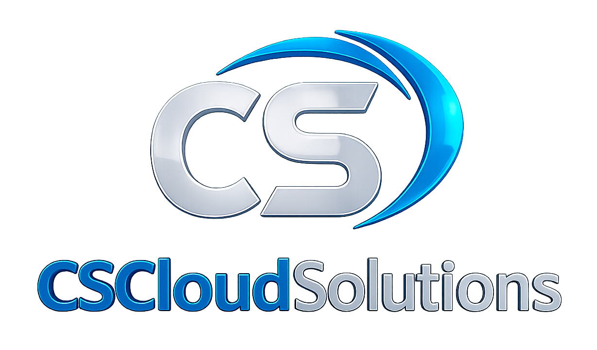

<div class="cover">

<h1 class="cover-title">Manual de SuperAdmin</h1>
<p class="cover-sub">FinOps SaaS · CSCloudSolutions</p>
<p class="cover-meta">Versão 2.0 · Julho 2026</p>
<p class="cover-copyright">© 2026 CSCloudSolutions. Todos os direitos reservados.</p>
</div>

# 📘 Manual de SuperAdmin — FinOps SaaS (CSCloudSolutions)

**Versão:** 2.0 (detalhada)
**Idioma:** Português Brasileiro
**Última atualização:** Julho 2026
**Público:** exclusivo para a equipe interna da CSCloudSolutions (SuperAdmin). Inclui todo o conteúdo do Manual do Usuário mais os fluxos de administração da plataforma (alta de tenants, onboarding de clientes, rastreamento comercial).

---

## Como usar este manual

Cada seção explica **o que é** a funcionalidade, **quem** pode usá-la (papel e tier de assinatura), e o **fluxo de uso passo a passo** — botões concretos, rotas de URL, campos de formulário e o resultado esperado. Se você é usuário não técnico, pode ir direto à seção que precisa: cada uma é independente.

---

## 📑 Índice

1. [Primeiros Passos](#1-primeiros-passos)
2. [Papéis e Permissões](#2-papéis-e-permissões)
3. [Navegação Principal](#3-navegação-principal)
4. [Seção Visibilidade](#4-seção-visibilidade)
5. [Seção Inteligência Financeira](#5-seção-inteligência-financeira)
6. [Seção Limpeza de Nuvem](#6-seção-limpeza-de-nuvem)
7. [Seção Governança](#7-seção-governança)
8. [Seção Administração](#8-seção-administração)
9. [FinOps Copilot (assistente de IA)](#9-finops-copilot-assistente-de-ia)
10. [Segurança da Conta (MFA)](#10-segurança-da-conta-mfa)
11. [Funcionalidades Avançadas e Integrações](#11-funcionalidades-avançadas-e-integrações)
12. [Melhores Práticas](#12-melhores-práticas)
---

## 1. Primeiros Passos

### 1.1. Acesso e login

A plataforma é um SaaS B2B. A autenticação é integrada ao **Microsoft Entra ID** (Azure Active Directory):

1. Acesse a URL da plataforma.
2. Clique em **"Entrar com Microsoft"**.
3. Autentique-se com sua conta corporativa. A plataforma reconhece automaticamente seu tenant do Azure e sua identidade.
4. **Modo Demo:** se quiser testar a plataforma sem conectar seu ambiente real, escolha um dos perfis comerciais pré-configurados na tela principal — eles vêm com dados e métricas simuladas realistas, para você explorar cada módulo sem risco. Há quatro tenants de demo (um por tier).

### 1.2. O assistente de onboarding (primeira vez)

Se você é administrador e é a primeira vez que sua organização usa a plataforma, ao fazer login o **Assistente de Configuração** (`/onboarding`) abre automaticamente — um wizard linear de 5 passos com barra de progresso:

| Passo | O que você faz | Resultado |
|---|---|---|
| **1. Boas-vindas e dados da empresa** | Confirma nome da empresa, provedor de nuvem principal (Azure), moeda de exibição (USD/EUR/GBP) e fuso horário | Suas preferências iniciais são salvas |
| **2. Conectar assinatura do Azure** | Cola **Client ID**, **Client Secret** e **Azure Tenant ID** do Service Principal (gerado com o script PowerShell fornecido pela CSCloudSolutions) e clica em **"Validar"** | O sistema verifica em tempo real se o Service Principal tem os papéis mínimos necessários; se faltar algum, mostra em vermelho qual é |
| **3. Executar a primeira sincronização de dados** | Clica em **"Executar Sincronização"** | Traz seu primeiro conjunto de dados de custos do Azure (pode levar até 60 segundos) |
| **4. Criar seu primeiro orçamento** | Preenche nome, limite mensal ($) e limite de alerta (%) | Seu primeiro orçamento ativo é criado |
| **5. Configurar notificações** | Clica em **"Configurar"** (abre `/admin/notifications` em nova aba) | Adiciona pelo menos um canal (email, Slack ou Teams) para receber alertas |

Você pode **pular (skip)** qualquer passo e voltar depois — o wizard continua aparecendo até você completar ou pular os 5. O progresso (%) é calculado como `(completos + pulados) / 5 × 100`. Se preferir o formulário de configuração avançada em vez do wizard, `/admin/onboarding` continua disponível em paralelo.

### 1.3. Onboarding de um novo cliente (fluxo SuperAdmin)

Se você é SuperAdmin da CSCloudSolutions dando alta a um tenant novo:

1. **Registrar o Tenant:** vá em `/admin/tenants` → **Gestão de Tenants** → digite o Entra ID do tenant do cliente, o nome comercial e o Tier inicial.
2. **Gerar credenciais:** depois de criado no banco, vá em `/admin/onboarding` → **Onboarding de Clientes**. Ali aparecem os campos **Client ID** e **Client Secret** para colar as credenciais do Service Principal geradas pelo script PowerShell que você compartilhou com o cliente.
3. **Etiquetar origem comercial e comissão (opcional):** no painel expandido de cada tenant no Diretório de Ambientes, preencha **"Origem comercial / Indicado por"** e **"Comissão (%)"** para cálculo interno de comissões — visível apenas para SuperAdmin.
4. **Associação de partner (PAL / CPOR):** após carregar credenciais, o bloco de aprovar/recusar fica visível até o status **vinculado (LINKED)**. Se ficou em `FAILED` ou `DECLINED`, você pode tentar novamente sem reset manual.

**Papéis do Azure que o script atribui, por tier contratado:**

| Tier | Papéis built-in | Papel personalizado |
|---|---|---|
| Essential | Reader, Cost Management Reader, Monitoring Reader, Billing Reader | — |
| Professional | Essential + Tag Contributor | — |
| Business | Professional + Tag Contributor | Start/Stop/Restart/Deallocate de VM + tags |
| Enterprise | Business + Tag Contributor | Business + excluir disco/snapshot/NIC/IP pública/NSG |

> ⚠️ **Os 4 papéis do Essential são o mínimo absoluto** para que a página Consumo Real mostre dados. Se faltar `Cost Management Reader` ou `Billing Reader`, o Azure retorna 0 linhas silenciosamente.

> ⚠️ **Assinaturas EA/MCA** (Enterprise Agreement / Microsoft Customer Agreement) exigem que o Billing Admin do cliente atribua também `Enrollment Reader` ou `Billing Account Reader` ao Service Principal no escopo da billing account — o script não pode fazer isso automaticamente, precisa ser coordenado com o cliente.

**Verificar se as permissões foram atribuídas corretamente**, depois que o cliente executar o script:

- **Opção rápida (recomendada):** `GET /api/admin/check-sp-roles?tenantId=<tenant-id>` — retorna quantas assinaturas têm todos os papéis necessários ✅, quais estão incompletas ⚠️ e quais não têm nenhum papel ❌, com o detalhe do que falta em cada uma.
- **Opção manual:** no Azure Portal → Assinatura → **Access control (IAM)** → **Role assignments** → filtre pelo App Registration `CSCloudSolutions-FinOps-Agent` e confirme que aparecem os papéis do tier contratado.

**Troubleshooting — "Consumo Real não mostra dados":**

| Mensagem de erro | Causa | Solução |
|---|---|---|
| `NO_COST_PERMISSION` | Falta `Cost Management Reader` | Atribuir o papel ao SP nessa assinatura |
| `NO_SUBSCRIPTION_ACCESS` | Falta `Reader` | Atribuir `Reader` ou reexecutar o script |
| `SUBSCRIPTION_INACTIVE` | A assinatura não tem consumo nem no mês atual nem nos últimos 30 dias | Verificar se é a assinatura correta |
| `NO_SUBSCRIPTIONS` | O SP não vê nenhuma assinatura | Atribuir `Reader` em pelo menos uma |
| `NO_CONSUMPTION` | Tudo OK mas sem consumo no ciclo atual | Aguardar o fechamento do ciclo ou verificar outra assinatura |

---

## 2. Papéis e Permissões

A plataforma separa **dois conceitos independentes**, que se combinam mas não se substituem:

### 2.1. Papel (o que você PODE FAZER)

| Papel | Capacidade |
|---|---|
| **SuperAdmin** | Administração total da CSCloudSolutions: criar tenants, configurar gateways de pagamento. Papel interno, não para clientes. |
| **Owner** | Dono do tenant. Acesso completo, incluindo mudança de plano e faturamento. |
| **Admin** | Visibilidade financeira completa, mudanças de configuração, ações corretivas (desligar VMs, excluir recursos). |
| **Colaborador** | Vê inteligência financeira e visibilidade; pode sugerir mudanças mas não administra faturamento nem usuários. |
| **Reader** | Somente leitura em painéis e relatórios. Não aplica mudanças nem vê configuração sensível. |

### 2.2. Permissões de domínio (quais páginas você VÊ)

Além do papel, cada usuário pode ter uma ou mais **permissões de domínio** atribuídas, que determinam quais seções do menu lateral ele vê — independente do papel:

| Permissão | Para quem serve | O que habilita ver |
|---|---|---|
| **FinOps** | Analista FinOps | Páginas de custos e recomendações |
| **CloudAdmin** | Administrador de nuvem | Páginas de execução/escrita sobre infraestrutura |
| **Security** | Auditor de segurança | Auditoria de conformidade, credenciais, governança |
| **ProductOwner** | Líder de projeto/produto | Visibilidade por Centro de Custos ou aplicação |

**Como se combinam:** um usuário com papel **Reader** e permissão **FinOps** pode *ver* as páginas de FinOps, mas não pode modificar nem excluir nada nelas — o papel continua controlando as ações. O filtro por permissões é opcional: se um usuário não tiver nenhuma permissão atribuída, ele vê tudo que seu papel e tier permitem (comportamento padrão, sem restrição de domínio). Os papéis **Admin/Owner** sempre veem tudo que seu tier permite, independente das permissões atribuídas. O **Dashboard** (`/`) e o **Suporte** (`/support`) estão sempre visíveis para todos.

**Como atribuir permissões:** vá em `/admin/users` → selecione o usuário → ative/desative os toggles de permissão na tabela, ou atribua ao criar um usuário novo manualmente. (Nota: usuários importados em massa do Entra ID ficam sem permissões atribuídas por padrão — atribua depois pela tabela principal.)

> ⚠️ As permissões de domínio **não** habilitam ações de escrita no backend — isso continua sendo controlado exclusivamente pelo papel. Um usuário com permissão `CloudAdmin` mas papel `Reader` pode *ver* essas páginas, mas qualquer ação de escrita retornará erro 403 se o papel não autorizar.

---

## 3. Navegação Principal

O menu lateral esquerdo agrupa tudo em 5 pilares (seções recolhíveis — a seção da página ativa se expande automaticamente):

- **Visibilidade** — painéis, academia, maturidade FinOps
- **Inteligência Financeira** — billing, orçamentos, otimização
- **Limpeza de Nuvem** — recursos zumbis, TTL
- **Governança** — tags, políticas, aprovações
- **Administração** — usuários, configuração, faturamento, API

Uma **busca** no topo do menu lateral permite encontrar páginas por nome ou conteúdo sem navegar manualmente pelas categorias.

### 3.1. Botão "Histórico" — evolução temporal de qualquer métrica

No Dashboard, Descontos por Compromisso, Rightsizing, Anomalias, Orçamentos e Alta Disponibilidade você vai encontrar um botão **Histórico** no canto superior direito. Ao abri-lo:

1. Escolhe um intervalo de datas (até **1 ano atrás**).
2. Vê a evolução diária das métricas daquela página como **gráfico de linhas** e **tabela**.

A plataforma salva automaticamente uma foto diária de cada página (retenção de ~13 meses) — você não precisa ativar nada, já está rodando em segundo plano.

### 3.2. Seu perfil

Clique no seu **avatar** (círculo com sua inicial, canto superior direito) para abrir:

- **Nome completo** — editável com o ícone de lápis.
- **Email e papel** dentro do tenant (somente leitura).
- **Moeda de exibição** — seletor de moeda.
- **Aparência** — Claro / Escuro / Automático (segue o tema do sistema operacional).
- **Sair.**

---

## 4. Seção Visibilidade

### 4.1. Dashboard (White Board)

Seu painel executivo de entrada. Resume Economia Potencial Total, Recursos Zumbis detectados e classificação de Governança de relance.

**Como usar:**
1. Selecione o período no topo (mês atual, últimos 3/12 meses).
2. Filtre por assinatura se tiver várias conectadas.
3. Fixe/desafixe cartões conforme o que quer sempre à mão (ícone de pin em cada cartão).
4. Qualquer cartão bloqueado pelo seu tier atual aparece com desfoque — clique para ver um modal de upgrade com o detalhe do que ele desbloqueia.

### 4.2. Gastos e Projeção (`/intelligence/cost-projection`, tier Professional+)

Combina duas ferramentas em uma página:

- **Histograma de custos:** distribuição diária do gasto, com seletor de intervalo desde o último mês até **13 meses atrás** (tudo que o Azure Cost Management permite consultar), em cache no Redis para resposta instantânea.
- **Projeção de Gastos:** calcule quanto você vai gastar no futuro.
  1. O sistema usa a média mensal dos últimos 12 meses como base.
  2. Você insere um **% de crescimento anual esperado** (valores negativos permitidos para simular um cenário de otimização/economia).
  3. Escolhe o horizonte: 3, 6, 12 ou 24 meses.
  4. O resultado mostra: média base, taxa mensal equivalente e total projetado, com um gráfico de linha real vs. projetado.

Há um cartão resumo disso no Dashboard com o link **"Ver detalhe completo"**.

### 4.3. Azure Advisor

Sincronização direta com as recomendações nativas da Microsoft, classificadas em Custo, Segurança e Excelência Operacional. As recomendações são exibidas no idioma que você tem ativo na plataforma (não no idioma original do Azure).

**Como usar:** filtre por categoria, revise o impacto potencial de economia de cada recomendação, e aplique-a diretamente pela plataforma ou feche com uma justificativa se não se aplicar ao seu caso.

### 4.4. Maturidade FinOps

Avaliação interativa que posiciona sua organização em Crawl / Walk / Run em 5 pilares (visibilidade, otimização, governança, inteligência, operações). Responda o questionário para obter uma pontuação por pilar mais um roteiro de melhoria personalizado.

### 4.5. Academia FinOps

Centro de aprendizagem interativa sobre FinOps e otimização do Azure — cursos estruturados, vídeos, glossário e recursos para download.

> ⚠️ **Gate obrigatório:** usuários novos devem completar a Academia antes de acessar o resto da plataforma (com um aviso explicando o motivo). O progresso é registrado **por usuário**, não por organização — cada pessoa nova do tenant precisa completar, e uma vez completado não pode ser refeito. Visível para todos os papéis exceto SuperAdmin.

### 4.6-4.10. Progresso Histórico, TOP Gastos, Recursos, Green FinOps, Economia Capturada, Vazamentos Financeiros (Professional/Business+)

- **Progresso Histórico:** gráficos de tendência mensal, marcos de economia alcançados, comparativas mês a mês e ano a ano. Você pode adicionar anotações manuais explicando uma mudança (ex.: "migração para reservas").
- **TOP Gastos:** ranking de suas maiores fontes de gasto por serviço, assinatura ou grupo de recursos, com drilldown até o nível de recurso individual.
- **Recursos** (Business+): inventário completo — filtro e busca avançados, marcação em massa, exportação.
- **Green FinOps** (Professional+): estimativa de pegada de carbono por serviço, comparação das regiões mais eficientes, recomendações de sustentabilidade.
- **Economia Capturada** (Professional+): rastreamento de economias reais já conseguidas via RIs, Savings Plans e Hybrid Benefit, com cálculo de ROI.
- **Vazamentos Financeiros** (Professional+): identifica dinheiro mal gasto (recursos abandonados, sobre-dimensionamento, redundância desnecessária) com um calendário de remediação.

---

## 5. Seção Inteligência Financeira

### 5.1. Consumo Real (`/intelligence/billing`, Essential+)

O painel de faturamento detalhado, em tempo real, direto do Azure.

**Como usar:**
1. Filtre por período, assinatura e grupo de recursos.
2. Dê zoom em um serviço específico para ver seu detalhamento.
3. Baixe a fatura ou exporte os dados para Excel pelo botão correspondente.
4. Crie alertas de limite direto da mesma página (leva ao formulário de Alertas Self-Service com o contexto pré-carregado).

### 5.2. Orçamentos (`/intelligence/budgets`, Essential+)

1. **Criar orçamento:** nome, período (mensal/trimestral/anual), limite em $.
2. **Limite de alerta:** defina em qual % do orçamento você quer ser notificado (ex.: 75%).
3. O sistema acompanha automaticamente — você vê consumo real vs. orçamento em tempo real, com histórico de períodos anteriores.

### 5.3. Cost Groups (`/intelligence/cost-groups`, Business+)

Agrupamento personalizado de custos de acordo com sua própria lógica de negócio (por projeto, linha de negócio, aplicação ou ambiente).

1. Crie um grupo com regras de nomenclatura (quais recursos entram, por padrão de nome ou tag).
2. Atribua recursos manualmente se precisar ajustar.
3. Clicar em um grupo abre um modal com abas: **Custos**, **Ações**, **Recursos**, **Governança** — cada uma com o detalhe correspondente àquele grupo.
4. Compare grupos entre si a partir da visualização em lista.

### 5.4. Reservas Ativas — Descontos por Compromisso (`/intelligence/commitments`, Enterprise+)

Além da cobertura e utilização global, a tabela **Reservas Ativas** replica o blade *Reservations* do Azure: Nome, Status, Expiração, Escopo, Tipo, Produto, Região, Renovação, Quantidade, e utilização do último dia e dos últimos 7 dias.

- Clique no botão de **Renovação** → modal para **ativar/desativar a renovação automática** daquela reserva. A mudança se aplica diretamente no Azure — requer papel Admin/Owner do tenant **e** permissões `Reservations Contributor/Owner` no Azure.
- Clique em qualquer **porcentagem de utilização** → modal com detalhe de último dia / 7 dias / 30 dias e tendência diária.

### 5.5. Savings Plan vs Reserva (`/intelligence/commitment-simulator`, Professional+)

Simule ambas as opções de compra com seus números reais e compare a economia em 1 e 3 anos antes de se comprometer.

### 5.6. Simulador What-If (`/intelligence/simulator`, tier Enterprise para salvar/comparar)

Simule o impacto de escalar computação/armazenamento, variar tráfego de rede, ou ativar o Azure Hybrid Benefit sobre seu custo atual — **antes de aplicar a mudança real**.

**Fluxo completo:**
1. Mova os sliders: escala de computação, escala de armazenamento, % de aumento de tráfego de rede, ativar/desativar AHB.
2. Clique em **"Executar Simulação"** — veja o detalhamento: custo base, custo projetado, delta e % de mudança.
3. **Salvar o cenário:** clique em **"Salvar atual"** → dê um nome e notas opcionais. O cenário fica congelado com esses números (não é recalculado depois, mesmo que seu custo base real mude com o tempo — assim você pode comparar cenários salvos em momentos diferentes de forma consistente).
4. Repita 2-3 vezes com sliders diferentes para ter vários cenários salvos.
5. **Comparar:** marque de 2 a 4 cenários com os checkboxes → clique em **"Comparar"** → abre um modal lado a lado com cada cenário como cartão, marcando qual é a linha de base.
6. **Exportar:** escolha o formato (CSV, PDF ou Markdown) junto aos botões de download — pode exportar um cenário individual, todos os salvos, ou a comparação completa com o delta de cada um contra a base.
7. **Excluir:** ícone de lixeira em cada linha (apenas o criador do cenário ou um Admin/Owner podem excluir).

> O mix de custo assumido é Azure-first: 60% do custo é computação, 25% armazenamento, 15% rede; AHB ativado aplica um desconto fixo de 18% sobre o total.

### 5.7-5.29. Demais módulos de Inteligência Financeira

| Módulo | Tier | Para que serve e como usar |
|---|---|---|
| **Orçamento por Centro de Custos** | Enterprise | Define centros de custo, atribui recursos (manual ou em massa), e o sistema rateia o gasto automaticamente para gerar chargeback interno por departamento. |
| **Análise de Rede** | Business | Custo de largura de banda, gateways, load balancers e IPs públicos; identifica picos de transferência e IPs ociosas para desativar. |
| **Hybrid Benefit (AHB)** | Business | Mostra quais VMs poderiam usar licenças com Software Assurance e quanto você economizaria ativando; rastreamento do que já usa. |
| **Controle AKS** | Enterprise | Nós ativos, utilização real vs. sobre-provisionamento, custo por pod, recomendações de auto-scaling. |
| **AKS Chargeback** | Enterprise | Atribui namespaces a equipes e o sistema calcula quanto cada equipe gasta no cluster, para faturamento interno. |
| **Container Apps** | Business | Controle de custos de Azure Container Apps: custo mensal por app, ambiente, CPU/memória e réplicas. Detecta oportunidades de *scale-to-zero* (apps com réplica mínima ≥ 1 que poderiam ser desligadas sem tráfego) e estima a economia potencial. Também disponível como card no White Board. |
| **Log Analytics** | Business | Controle de custos de Log Analytics Workspaces: custo mensal, retenção e ingestão estimada por workspace. Detecta ingestão massiva desnecessária (workspaces sem limite diário), retenção excessiva e oportunidades de *Commitment Tier*, com economia potencial estimada. Também disponível como card no White Board. |
| **Unit Economics** | Enterprise | Define sua própria métrica unitária (custo por transação, por usuário, por MB processado) e o sistema calcula o custo unitário automaticamente sobre seus dados do Azure. |
| **Usuários e Licenças** (fusão com "Licenças") | Professional | 3 abas: **Dashboard** (KPIs M365/Entra ID), **Atividade de Usuários** (tabela filtrável), **Otimização de Licenças** (recursos sem Hybrid Benefit via Resource Graph + métricas por SKU via Microsoft Graph). |
| **Ingestão CSV** | Business | Carrega um CSV com faturamento de terceiros no padrão FOCUS para analisar junto com seus dados do Azure. |
| **Alertas Self-Service** | Business/Professional | Cria regras de alerta de orçamento ou anomalia você mesmo, sem pedir nada ao suporte — condição + canal de notificação. |
| **Scorecard** | Business | Pontuação 0-100 da sua saúde financeira com indicadores individuais (economia, cobertura de reserva, eficiência); você pode definir metas. |
| **Saúde do Tenant** | Business | Estado geral — problemas detectados, consistência de faturamento, cobertura de reservas, conformidade de políticas. |
| **Rightsizing** (+ verticais VMSS/App Service/SQL/Storage) | Enterprise | Analisa 30 dias de uso real e recomenda o SKU ideal; mostra economia estimada antes de aprovar a mudança. Verticais dedicadas em `/intelligence/rightsizing/{vmss,appservice,sqldb,storage}`. |
| **Eficiência de Storage** | Business | Simula a economia de mover blobs entre os tiers Hot/Cool/Archive antes de aplicar. |
| **Compute $/Core** | Professional | Detalhamento de custo por núcleo vCPU para comparar famílias de VM entre si. |
| **Detecção de Anomalias** | Enterprise | Identifica automaticamente picos ou quedas anormais de gasto e permite criar alertas ajustando a sensibilidade. |
| **Índice de Otimização (COIN)** | Enterprise | Pontuação composta 0-100, comparável com benchmarks da indústria. |
| **Eficiência de Compute** | Enterprise | Utilização real de CPU/memória/disco por VM, com recomendação de redimensionamento e economia calculada. |
| **Otimização de Tarifas** | Enterprise | Compara suas tarifas atuais com benchmarks de mercado para preparar uma negociação com a Microsoft. |
| **Custo Zero** | Todos | Quais recursos são gratuitos na sua assinatura (free tier, créditos) para maximizar seu uso. |
| **Rateio (Allocation)** | Enterprise | Regras de distribuição de custos compartilhados entre múltiplas áreas (por uso real, proporcional ou fixo). |
| **MACC Tracking** | Enterprise | Rastreamento do compromisso mínimo anual (EA/MCA) — consumido vs. comprometido, com projeção de cumprimento. |
| **AI Cost Analytics** | Enterprise | Custo por modelo de IA e consumo de tokens no Azure OpenAI, com recomendações de otimização de chamadas. |

---

## 6. Seção Limpeza de Nuvem

### 6.1. Recursos Zumbis (`/cleanup/zombies`, Essential+; remediação Business+)

Detecta recursos órfãos que geram gasto desnecessário: discos não conectados, IPs públicos sem uso, App Service Plans vazios, VMs desconectadas há 30+ dias.

**Fluxo de uso:**
1. Lista com filtro por tipo de recurso.
2. Revise o último uso registrado de cada recurso.
3. Opcional: tire um snapshot do recurso antes de mexer em qualquer coisa (caso precise recuperá-lo depois).
4. **Excluir** — requer papel Business+ e permissões do Azure para exclusão (veja a tabela de papéis do script na seção 1.3).
5. Você pode criar uma **política de auto-limpeza** para que recursos zumbis de certo tipo sejam marcados ou excluídos automaticamente no futuro.

### 6.2. Networking Zombies (`/cleanup/zombies/networking`, Essential+; remediação Business+)

Igual ao anterior mas focado em recursos de rede: Load Balancers vazios, NSGs sem associação, Public IPs órfãs, gateways VPN sem conexões ativas.

### 6.3. Expirações TTL (Business+)

Controle de ambientes efêmeros (sandboxes, ambientes de teste) com data de expiração.

1. Crie uma política TTL: qual tipo de recurso, quantos dias de vida.
2. Marque os recursos afetados com a data de expiração (manual ou automaticamente por regra).
3. O sistema alerta antes da exclusão automática.
4. Consulte o histórico do que foi excluído e quando.

---

## 7. Seção Governança

### 7.1. Conformidade de Tags (`/governance/tags`, Essential+; remediação Business+)

1. Defina as tags obrigatórias da sua organização (ex.: `CostCenter`, `Owner`, `Environment`).
2. O sistema audita toda a sua infraestrutura e mostra quais recursos não as têm.
3. Com **auto-tagging** (Business+) você pode aplicar tags faltantes automaticamente conforme regras.
4. Gere relatórios de conformidade para mostrar à auditoria interna.

### 7.2. Relatório de Governança (`/governance/reporting`, Enterprise+)

Painel executivo unificado: status geral de conformidade, achados de segurança e tagging, recomendações priorizadas e evolução histórica. (Esta página funde o que antes era uma página separada de "Estado de Governança" como uma seção adicional dentro do mesmo relatório.)

### 7.3. Horários de Desligamento — Power Schedules (`/governance/power`, Business+)

Rotinas automáticas de ligar/desligar VMs fora do horário produtivo.

**Dois modos:**
- **Data pontual (single):** executa a ação (ligar/desligar/reiniciar) **uma única vez** na data e hora exatas.
- **Recorrente (range):** define um intervalo horário **"De–Até"** e os dias da semana (ex.: Seg-Sex 08:00-20:00). O sistema cria automaticamente um horário de ligar na hora "De" e um de desligar na hora "Até", com os mesmos dias.

**Detalhes operacionais importantes:**
- O fuso horário é detectado automaticamente pelo seu navegador ao abrir o formulário — você pode mudar manualmente se precisar de outro fuso.
- O sistema verifica horários pendentes a cada **2 minutos**, além de uma verificação imediata ao salvar. A ação sobre a VM pode levar de 20 a 40 segundos adicionais para confirmar contra o Azure.

### 7.4. Alta Disponibilidade (`/governance/ha`, Business+)

Detecta VMs em produção sem Availability Zone ou Availability Set atribuído — risco de ponto único de falha.

### 7.5. Credenciais por Expirar (`/governance/credentials`, Business+)

Alerta proativo de App Registrations / Service Principals cujos segredos ou certificados vencem em 30/60/90 dias. Cada credencial mostra o status: **Vencida**, **Próxima do vencimento** (≤30 dias) ou **Habilitada**.

**Como criar um alerta:**
1. Botão **"Criar alerta de vencimento"**.
2. Defina quantos dias de antecedência quer o aviso (1-365).
3. Escolha o canal: email, Slack ou Teams (via webhook).
4. O sistema avalia diariamente e envia **no máximo uma notificação por dia** enquanto houver credenciais dentro do limite (incluindo as já vencidas).

Essas regras também podem ser gerenciadas em **Alertas Self-Service**, no tipo "Vencimento de credenciais".

### 7.6. Políticas Auto-Block (Enterprise+)

Políticas automáticas que bloqueiam ações antes que aconteçam: criar VMs acima de certo tamanho, criar recursos sem tag obrigatória, ultrapassar um gasto diário máximo por assinatura, ou criar recursos fora de um horário permitido.

### 7.7. Aprovações (Business+)

Fluxo de aprovação para mudanças de infraestrutura: um usuário solicita a mudança, um especialista revisa e aprova/rejeita com comentários, e tudo fica auditado (quem aprovou o quê e quando).

---

## 8. Seção Administração

### 8.1. Suporte (`/support`, todos os planos a partir do Essential)

Qualquer usuário do tenant pode abrir tickets para a CSCloudSolutions e acompanhar a conversa dentro da plataforma.

**Como criar um ticket:**
1. Preencha assunto, categoria (Técnico / Faturamento / Dúvida / Pedido de feature), prioridade e mensagem inicial.
2. Você pode anexar capturas de tela ou arquivos (`jpg`, `jpeg`, `png`, `txt`, `json`; máx. 5 MB por arquivo, 10 por ticket) — mantidos por 60 dias e depois excluídos automaticamente.
3. As respostas da equipe de suporte aparecem marcadas com 🛟 no tópico. Você pode responder enquanto estiver aberto, e fechar/reabrir você mesmo.
4. **Acesso rápido:** o ícone de boia junto ao seu usuário no cabeçalho abre o Suporte de qualquer página. Quando seu ticket é respondido, você vê uma notificação no sino 🔔.

**Cotas por plano:**

| Plano | Tickets/mês | SLA de primeira resposta |
|---|---|---|
| Essential | 5 | 48 h |
| Professional | 20 | 24 h |
| Business | Ilimitados | 8 h |
| Enterprise | Ilimitados | 4 h |

### 8.2. Usuários e Permissões (`/admin/users`)

Veja a seção 2 para o detalhe de papel vs. permissões. Daqui você adiciona usuários, edita seu papel, ativa/desativa suas permissões de domínio, ou os desativa por completo.

### 8.3. Configuração (`/admin/config`)

Administração geral do perfil do tenant: nome, logo, idioma padrão para novos usuários, fuso horário para relatórios, ciclo de faturamento.

### 8.4. Faturamento — Mudança de Plano (`/admin/billing`, Essential+, papel Owner)

1. Escolha o novo plano (Essential / Professional / Business / Enterprise).
2. Escolha frequência (mensal/anual) e modo de rateio.
3. O sistema mostra um **resumo prévio** com o valor real calculado pelo gateway de pagamento antes de confirmar: *"Você será cobrado $X agora"* (upgrade) ou *"Você receberá um crédito de $X"* (downgrade), o novo total recorrente e a data da próxima cobrança.
4. A mudança **só se aplica** ao clicar em **Confirmar mudança** — até esse momento você pode cancelar sem custo.

### 8.5. Configuração de Notificações (`/admin/notifications`, Professional+)

Três canais suportados: **Slack**, **Microsoft Teams**, **Email (SMTP)**.

**Configurar Slack:**
1. Acesse `https://api.slack.com/apps` → crie ou selecione um app → **Incoming Webhooks**.
2. **"Add New Webhook to Workspace"** → escolha o canal de destino.
3. Copie a URL do webhook (começa com `https://hooks.slack.com/services/...`).
4. Na plataforma: **Notificações** → **Adicionar canal** → **Slack** → cole a URL → salvar.

**Configurar Microsoft Teams:**
1. No canal do Teams → **⋯** → **Connectors** → procure "Incoming Webhook".
2. Configure o webhook e dê um nome.
3. Copie a URL gerada.
4. Na plataforma: **Notificações** → **Adicionar canal** → **Microsoft Teams** → cole a URL → salvar.

**Configurar Email:**
- Usa SMTP. Se sua organização não especificar um servidor próprio, é usada a configuração SMTP padrão da plataforma.
- Você pode definir múltiplos destinatários e, opcionalmente, sobrescrever host/porta/usuário/senha SMTP por canal.

**Filtro de severidade:** cada canal pode filtrar o que recebe — `info`, `warning`, `error`, ou combinações (ex.: `warning,error` para não receber informativos).

**Testar o canal:** botão de teste em cada canal configurado — envia uma notificação de teste antes de você depender dele em produção.

**Disponibilidade por tier:** Professional permite 2+ canais; Enterprise permite canais ilimitados + overrides de SMTP por canal.

**Se as notificações não chegam**, verifique nesta ordem: canal habilitado (`enabled = true`) → filtro de severidade corresponde ao nível do alerta → você testou o canal pela interface → há pelo menos um canal configurado para o tenant. O log de envios (com erros) está disponível para diagnóstico.

### 8.6. Relatório Executivo (Business+)

Geração automatizada de relatórios periódicos de alto nível, pensados para apresentar à diretoria — resumo executivo para download.

### 8.7. Operações SaaS (SuperAdmin) (`/superadmin/ops`)

Centro global de operações para monitorar o SaaS:

1. Visualiza status geral da plataforma e alertas não reconhecidos.
2. Revisa saúde dos componentes e execução dos crons (última execução, idade, resumo e estado).
3. Verifica cobertura de canais de notificação por tenant SuperAdmin.
4. Pode disparar notificações operacionais para canais configurados quando houver degradação.

### 8.8-8.18. Demais módulos de Administração

| Módulo | Tier | Uso |
|---|---|---|
| **Onboarding de Clientes** | Admin | Veja a seção 1.3 — alta de tenants e credenciais do Service Principal. |
| **Gestão de Tenants (Comercial)** | SuperAdmin | `/admin/tenants`: provisão manual, tier/status, vendedor/indicador e comissão (%) por tenant. |
| **Operações SaaS** | SuperAdmin | `/superadmin/ops`: saúde de componentes + estado dos crons + envio de notificações operacionais. |
| **Azure Lighthouse Onboarding** | Enterprise | Geração de template ARM para delegação cross-tenant, em `/admin/onboarding/lighthouse`. |
| **Configuração de IA** | Professional | Habilitar/desabilitar funções de IA, escolher modelo, ajustar sensibilidade de detecções e quais dados são compartilhados. |
| **Invoicing Report** | Enterprise | Export em JSON/CSV/PBIT stub com detalhe por billing profile, invoice section e customer, em `/admin/report`. |
| **Workbooks** | Enterprise | Relatórios personalizados: layout próprio, gráficos, tabelas de dados, exportáveis para PDF e compartilháveis por link. |
| **Auditoria** | Professional | Log completo de quem mudou o quê e quando, filtrável por usuário/ação/data, exportável para conformidade. |
| **MCP API Keys** | Enterprise | Chaves de API para integrações tipo MCP — gerar, rotacionar e revogar. |
| **API Pública** | Enterprise | REST API documentada (OpenAPI/Swagger), com limites de taxa e monitoramento de uso. |
| **Power BI Templates** | Enterprise | Templates `.pbit` para download, pré-conectados aos seus dados do SaaS. |
| **FOCUS 1.1 Export** | Professional | Exportação dos seus dados no formato padrão FOCUS, programável para geração diária automática. |
| **SSO SAML** | Enterprise | Configure seu Identity Provider, mapeie atributos (papéis, emails), teste e ative para toda a organização. |
| **Partner Markup (CSP)** | Enterprise | Margens configuráveis por serviço para partners CSP, aplicadas automaticamente no faturamento. |
| **M365 Copilot** | Enterprise | Configuração do tenant + chat assistido sobre seus próprios dados FinOps, em `/admin/copilot-m365`. |

---

## 9. FinOps Copilot (assistente de IA)

Ícone flutuante no canto inferior da tela, disponível em Professional+.

- **Consciência de contexto automática:** o Copilot lê o conteúdo da página em que você está — não é preciso dizer em qual módulo você está. Ao abri-lo, sem digitar nada, ele gera um **relatório executivo** do que está sendo exibido: contexto do módulo, principais achados, oportunidades de economia priorizadas por impacto, riscos e um plano de ação de 7 dias.
- **Perguntas direcionadas:** além do relatório automático, você pode perguntar diretamente. Ex.: em Orçamentos: *"Resuma o estado atual dos nossos orçamentos"*.
- **Ações corretivas:** com sua autorização prévia, ele pode guiá-lo na exclusão de recursos zumbis ou na aplicação de tags faltantes por meio de scripts automatizados — nunca executa nada sem sua confirmação.

---

## 10. Segurança da Conta (MFA)

Autenticação de dois fatores baseada em TOTP (Google Authenticator, Microsoft Authenticator, Authy, etc.), opcional por usuário, exigida apenas para **operações sensíveis** (excluir um tenant, cancelar assinatura, mudar configuração de faturamento).

**Como ativar:**
1. Vá ao seu perfil → **Configurações de Segurança** → **"Habilitar 2FA"**.
2. O sistema mostra um código QR — escaneie com seu app de autenticação.
3. Digite o código de 6 dígitos exibido pelo app para confirmar.
4. Você recebe **10 códigos de recuperação** — baixe e guarde em um lugar seguro. São exibidos apenas uma vez.

**Quando é solicitado:** ao tentar uma operação marcada como sensível, aparece um modal pedindo seu código de 6 dígitos (ou um código de recuperação se você perdeu o acesso ao autenticador). Cada código de recuperação é de uso único; se você usar os 10, precisa desabilitar e reabilitar o 2FA para gerar um novo conjunto.

**Se você perder o acesso ao autenticador:** use qualquer um dos seus 10 códigos de recuperação para entrar e reconfigurar o 2FA do zero. Se também perdeu os códigos de recuperação, um Admin pode forçar a desativação do seu MFA (fica registrado no log de auditoria).

---

## 11. Funcionalidades Avançadas e Integrações

Esta seção é para usuários técnicos (Cloud Admin, DevOps) que precisam integrar a plataforma com outras ferramentas ou configurar acessos avançados.

### 11.1. SSO SAML (`/admin/sso`, Enterprise, via WorkOS)

Permite que usuários de um cliente Enterprise façam login com seu próprio Identity Provider (Okta, Auth0, AD FS) em vez de — ou além de — Microsoft Entra ID.

**Configuração por cliente:**
1. Vá em **Admin → SSO SAML** (visível apenas no tier Enterprise).
2. Obtenha o `workos_org_id` e `workos_connection_id` no painel da WorkOS (a CSCloudSolutions cria a Organization/Connection lá se não existirem).
3. Preencha o formulário: **Domain** (ex.: `acme.com`), **WorkOS Organization ID**, **WorkOS Connection ID** → ative o toggle **Enable SSO** → salve.
4. Botão **"Gerar Admin Portal"** → abre um link da WorkOS em nova aba; o admin de TI do cliente recebe um email para configurar seu próprio IdP.
5. (Opcional) Botão **"Testar SSO"** → redireciona ao IdP para validar que o login funciona antes de anunciá-lo aos usuários finais.

**Como o usuário final faz login:** na tela de login, escolhe "Login com SSO" em vez de "Entrar com Microsoft" → o sistema o redireciona ao seu próprio IdP → após autenticar, retorna automaticamente ao dashboard.

> ⚠️ Apenas **uma conexão de IdP por tenant** é suportada pelo design atual. O SSO convive com o login da Microsoft Entra ID (MSAL) sem substituí-lo — os dois métodos funcionam simultaneamente, então você não perde o acesso existente ao ativar o SSO. A sessão SSO dura 12 horas.

**Erros comuns:** "SSO not configured" (faltam credenciais da plataforma), "SSO not enabled for this tenant" (o toggle está desligado), "Missing workos_connection_id" (o portal ainda não foi gerado, ou o cliente ainda não configurou seu IdP).

### 11.2. Auditoria — uso avançado (`/admin/audit`, Professional+)

Além do log filtrável (por email, tipo de ação, status e intervalo de datas, 10 linhas por página), você tem 4 formatos de exportação: **CSV (página atual)**, **CSV completo filtrado (streaming)**, **JSON**, **NDJSON**.

**Casos de uso típicos:**
- **Auditoria de conformidade (SOC2):** exporte o intervalo trimestral completo com o botão de exportação filtrada.
- **Investigar um incidente:** filtre pelo email do usuário suspeito + status `FAILURE`.
- **Monitoramento operacional:** filtre por tipo de ação `DELETE` + intervalo de datas recente para ver o que foi excluído.

> ⚠️ A exportação completa tem um limite de **100.000 linhas** — para conjuntos de dados maiores, reduza o intervalo de datas e exporte em partes. A retenção de logs é indefinida por enquanto (ainda não há purga automática).

### 11.3. API REST Pública v1 (`/admin/api-keys`, Enterprise)

Acesso programático somente leitura aos seus dados (custos, orçamentos, recomendações, anomalias) para conectar ferramentas de BI ou scripts próprios.

**Como gerar e usar:**
1. **Admin → API Pública** → gere uma nova chave, escolhendo apenas os **escopos** que precisa (`read:cost`, `read:resources`, `read:budgets`, `read:recommendations`, `read:anomalies`) — peça o mínimo necessário, por exemplo `read:cost` se for apenas para alimentar um painel de BI.
2. Autentique cada requisição com o header `X-API-Key: pak_live_xxx` (ou `Authorization: Bearer pak_live_xxx`).
3. Exemplos de endpoints: `GET /cost/summary?from=...&to=...&groupBy=service`, `GET /cost/timeseries?granularity=daily|monthly`, `GET /resources?type=...&limit=100`, `GET /budgets`, `GET /recommendations`, `GET /anomalies?severity=low|medium|high`.
4. Documentação interativa (Swagger) disponível em `/api/v1/docs`.

> ⚠️ Limite padrão: **60 requisições/minuto** por chave (headers `X-RateLimit-*` mostram quanto resta; ao esgotar, erro 429). Se precisar de mais para um job em lote, solicite em Admin → API Pública ou pelo suporte (até 1000 req/min). Valores monetários sempre trafegam como **strings** (ex.: `"1234.56"`), não como números — trate como texto para não perder precisão.

### 11.4. Exportação de Faturas Showback/Chargeback em PDF (`/admin/report`, Business+)

Gere e envie por email faturas de showback/chargeback para cada cliente ou centro de custo interno.

- **Baixar uma fatura individual:** no relatório de faturamento, escolha o cliente/centro e o período → o PDF é baixado diretamente.
- **Baixar todas de uma vez:** mesmo fluxo sem escolher um cliente específico → baixa um ZIP com todas as faturas do período.
- **Enviar por email:** preencha o email e nome do destinatário → é enviado automaticamente com o PDF anexado via Microsoft 365 (requer que a CSCloudSolutions tenha configurado o envio de email para seu tenant — se não estiver disponível, você verá um erro claro pedindo para contatar o suporte).

Todo envio e download fica registrado no log de auditoria.

### 11.5. FOCUS 1.1 Export — uso avançado

Além do download manual em `/admin/focus-export` (veja seção 8.7), você pode automatizar a extração com uma MCP API Key própria (gerada em `/admin/mcp-keys`):

```
curl -H "Authorization: Bearer mcp_xxx" \
  ".../api/exports/focus?tenantId=...&format=ndjson"
```

Formatos disponíveis: CSV, JSON, NDJSON. Limite de **500.000 linhas** por exportação (padrão 100.000). Útil para alimentar automaticamente ferramentas FinOps externas (Power BI, CloudHealth, etc.) sem intervenção manual.

### 11.6. Página de Status

Página pública (sem login) onde você e seus usuários podem consultar a qualquer momento se a plataforma está operacional: `/es/status` (ou `/en/status`, `/status`). Mostra o status de API, banco de dados, sincronização com o Azure, provedor de IA e faturamento, além de um histórico de incidentes. Útil para compartilhar com sua equipe se algo parecer não estar funcionando — antes de abrir um ticket, verifique se já há um incidente reportado ali.

### 11.7. Faturamento com Paddle — detalhe técnico

A mudança de plano (veja seção 8.4) tem 3 modos possíveis de rateio ao fazer upgrade/downgrade:

- **Rateio imediato:** a diferença é cobrada ou creditada agora mesmo.
- **Rateio no próximo ciclo:** a mudança de preço completa é cobrada apenas na próxima renovação.
- **Sem cobrança imediata:** a mudança de plano se aplica sem gerar nenhuma cobrança até o próximo ciclo.

Em `/admin/billing` você também acessa o **portal de gestão de pagamento** (atualizar cartão) e o **histórico de faturas** para download.

### 11.8. Teste gratuito de 7 dias (autoatendimento)

Se você se cadastrou sozinho pela página de preços (sem passar pelo onboarding de um SuperAdmin), sua conta começa com um **teste de 7 dias** no plano que você escolheu. Você verá um banner de status do teste no topo da plataforma:

- 🔵 Azul: 5 dias ou mais restantes.
- 🟡 Amarelo: entre 3 e 4 dias restantes.
- 🔴 Vermelho: 2 dias ou menos — este não pode ser dispensado.

Você pode fazer upgrade para um plano pago a qualquer momento em **Faturamento** — o teste se converte imediatamente em assinatura ativa. Se o teste expirar sem upgrade, a conta passa para modo de acesso limitado até você ativar um plano pago.

---

## 12. Melhores Práticas

- **Revisão semanal:** acesse o **Dashboard** e **Recursos Zumbis** pelo menos uma vez por semana para capturar vazamentos financeiros antes que se acumulem.
- **Automatize cedo:** ative **Horários de Desligamento** nos seus ambientes de Desenvolvimento/Teste como primeira medida — é comum ver economias de 60% em horas de computação ociosas sem nenhuma outra mudança.
- **Exija conformidade de tags:** sem tags consistentes, o módulo de chargeback/showback não consegue distribuir a fatura mensal de forma justa entre equipes — é a base de tudo o resto.
- **Use o Simulador What-If antes de se comprometer:** antes de comprar uma Reserva ou Savings Plan, simule o cenário e salve-o — isso dá um número concreto para justificar a decisão perante o financeiro.
- **Configure pelo menos um canal de notificação desde o primeiro dia** (Slack/Teams se sua equipe já vive lá, ou email se preferir simplicidade) — alertas de orçamento não servem de nada se ninguém os vê a tempo.

---

## Suporte e Contato

Para qualquer assistência adicional, abra um ticket em **Suporte** (`/support`) dentro da plataforma, ou escreva para **soporte@cscloudsolutions.com.ar**.

---

**Manual de SuperAdmin — FinOps SaaS**
**Versão 2.0 | Português Brasileiro | Julho 2026**
